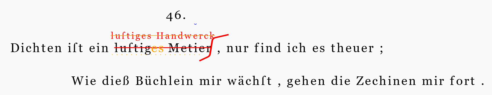

# 46-H5



Base text:

```txt
46.
Dichten iſt ein luſtig Metier , nur find ich es theuer ;
Wie dieß Büchlein mir wächſt , gehen die Zechinen mir fort .
```

Operations:

```txt
1×1: [r_char-offsets="1:x=14tw 5:y=1th 28:x=1tw 62:x=5.5tw,y=1th"]
5×31: [comment=Schlegel]
21×13="luſtiges Handwerck" [r_fore-color=red r_hints="horizontal-stroke snake-right" accepted-source-of=N7 *log:="Replace \"luſtig Metier\" with \"luſtiges Handwerck\"" r_t-position=n r_font-size=18 r_h-offset-x=@2:1.6tw *version^:=AS3]
136×1: [note=⏑ r_hints=note-interlinear-above r_fore-color=blue reason=metrical *log:="Add \"⏑\" above \"e\" of \"Handwerck\"" *version^:=AS4 r_h-offset-y=-0.2th]
122×18="luſtig Metier" [r_fore-color=orange r_hints=horizontal-stroke accepted-source-of=A1 *log:="Replace \"luſtiges Handwerck\" with \"luſtig Metier\"" r_t-value=""]
145×1+]"es" [r_fore-color=orange r_t-position=e accepted-source-of=A1 *log:="Add \"es\" to \"lustig\"" r_t-displaced-span=26x1]
@20×15: [r_hints=line-bottom-dotted r_fore-color=orange reason=revert *version^:=AS5 *log:="Underline \"lustiges Metier\""]
```

Edits:

(1) Replace "luſtig Metier" with "luſtiges Handwerck". This replacement operation correctly replaces the text, and renders added text on top of the replaced one (text position=north).

(2) A _breve_ sign is added on top of the "e" of "Handwerck". This is just a visual annotation, with no changes in text. Note that the operation refers to 136, which is the ID of that character.

(3) Now the text must be reverted, by replacing "luſtiges Handwerck" (122x18) with "luſtig Metier". Textually, it's just a replacement, which happens to restore a previous text. Visually, it's a horizontal stroke on the newly added text; later, the revisor added a dotted line below the original text to mean it had to be restored back. So, the restored text is NOT written again; rather, the revisor adds a horizontal stroke to delete the previous addition and a dotted underline to restore the original text. So, in the same way, visually we do NOT want to render the original text again. Yet, this is what normally happens with any operation adding text (replace or insert): the new text gets rendered. To avoid this, we use the text value feature with an empty value, meaning that the text to render for this addition is not the default (=the added text) but rather that specified, which here is nothing. So, nothing will be rendered for the replace, except for its hint, the horizontal stroke.

(4) Nonetheless, a change in inflection does occur after restoring: "es" is added to "lustig", whence "lustiges". Note that we are targeting the NEW added text, the "g" of "lustig Metier" (145). Even if the new text happens to be equal to the original one, its characters are NOT the same as the original ones. Any newly added character gets its own new numeric ID. This is compliant with the general tenet that nodes and links can only be added to the chain structure; once added, they stay there forever, just like signs on paper do, even if later modified by further signs, like a stroke on them. So, each added character is assigned a new unique numeric ID, which is progressively increased. This is why we target character ID 145, and not 26. Character 26 (the "g" of the original "lustig") is still _visually_ there; but it's no longer part of the alteration text generated by the previous operation. Should you use 26, you would get an error telling you that the node (=character) is not found, right because it is NOT present in the text (although it still remains in the visual representation).

>Always _check the textual output_ besides the visual rendition when dealing with complex transforms where text and visuals diverge. This will show you the text resulting from the operation, whatever its diplomatic appearance.

Note that anyway on the visual layer we need to use text (whether it is base text or added text) as a reference for adding new signs or new text. Now, the problem is that here the "es" to be added to "lustig" (the new one, restored; not the original one) is NOT visually present, because we asked not to render it so we can faithfully represent the visual layer. So, even though we are adding "es" to the new "lustig", visually we need to add it to the original one, because this is the only one visually present in the document. In fact, visually the "es" is just at the right of the original "lustig". So, the text target of this addition is different from the visual target. This is why add a displaced text span feature equal to `26x1`, which tells the rendition engine to use as the reference text for rendering "es" the "g" of the original "lustig"; and the position of "es" will be east, just like in the document.

(5) Finally, a last tricky operation: we need to add a dotted underline to the resulting text "lustiges Metier". Now, consider how this text is composed on the textual layer:

1. "lustig" is the new "lustig" restored after the original was removed (140-145).
2. "es" is added text (153-154).
3. "Metier" is the new "Metier" restored after the original was removed (146-152).

Should we just use a coordinate like `21x13`, this would imply targeting identifiers 21, 22, 23, etc. up to 33. Yet, these are not the current target (140-145, 153-154, 146-152). To target them, we need to use an _index_-based coordinate, rather than an ID-based coordinate: whence `@20x15`. Note the `@` here: this means that `20` is not an ID, but a 0-based index. We target 15 characters from the 21st one onwards, whatever their ID (indexes being 0-based, we need to subtract 1 from 21, whence 20).
