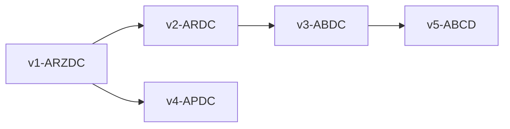
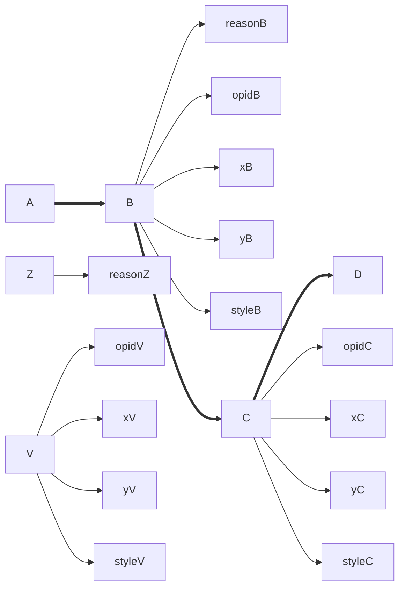

# API

The GVE API provides backend logic for parsing and running chain operations.

## Parse Operations

- 🌐 `POST /api/text/operations/parse`
- 🎯 Parse the received text representing a batch of operations (one operation per line) and return a result wrapping a list of operations, or an error message in case of error.
- ▶️ Input:
  - `text` (`string`): the text to parse.
- ◀️ Output (`ResultWrapper<IList<CharChainOperationSource>>`):
  - `result`: the result, null on error (in this case `error` holds the error message), else an array of objects:
    - `rank` (`short`)
    - `groupId` (`string?`)
    - `features` (`OperationFeature[]`):
      - `name` (`string`)
      - `value` (`string?`)
      - `setPolicy` (0=multiple, 1=single, 2=singleFirst)
      - `isNegated` (`boolean`)
      - `isGlobal` (`boolean`)
      - `isShortLived` (`boolean`)
    - `sources` (`OperationSource[]`):
      - `id` (`string`)
      - `type` (`string?`)
      - `rank` (`short`)
      - `note` (`string?`)
    - `diplomatics` (`OperationDiplomatics`):
      - `g` (`string?`)
      - `isNewTextHidden` (`boolean`)
      - `features` (`Feature[]`)
        - `name` (`string`)
        - `value` (`string?`)
        - `setPolicy` (0=multiple, 1=single, 2=singleFirst)
      - `elementFeatures` (dictionary of Feature's, key=element ID)
    - `id` (`string`)
    - `type` (0=replace, 1=delete, 2=add before, 3=add after, 4=move before, 5=move after, 6=swap, 7=annotate)
    - `inputTag` (`string?`)
    - `outputTag` (`string?`)
    - `atAsIndex` (`boolean`)
    - `at` (`int`)
    - `run` (`int`)
    - `toAsIndex` (`boolean`)
    - `to` (`int`)
    - `toRun` (`int`)
    - `Value` (`string?`)
  - `error` (`string?`): error message if any.

## Get Operation Tags

- 🌐 `POST /api/text/operations/tags`
- 🎯 Get a list of input/output tags from the received list of operations.
- ▶️ Input: object with an `operations` array (`CharChainOperationSource[]`).
- ◀️ Output: array of input/output tags pairs, one per operation:
  - `inputTag` (`string`)
  - `outputTag` (`string`)

Input and output tags are often a calculated value, so this method uses the logic defined in the operations model to explicitly assign input and output tags to each received operation.

## Run Operations

- 🌐 `POST /api/text/operations/run`
- 🎯 Run the specified list of operations.
- ▶️ Input (`TextOperationsBindingModel`):
  - `text` (`string`): the base text.
  - `operations` (`CharChainOperationSource[]`): the operations to run.
- ◀️ Output (`ResultWrapper<CharChainResultModel>`):
  - `result`:
    - `steps` (`ChainOperationContextStep[]`): this represents a single step of execution. Every operation run generates a context step:
      - `operation` (`OperationMetadata`): the source operation:
        - `id` (`string`)
        - `rank` (`short`)
        - `groupId` (`string?`)
        - `features` (`OperationFeature[]`)
        - `sources` (`OperationSource[]`)
        - `diplomatics` (`OperationDiplomatics?`)
      - `inputTag` (`string`)
      - `outputTag` (`string`)
      - `result` (`string?`)
      - `featureSet` (`ChainOperationContextFeats`): the set of features current at this execution step, both for the version as a whole and for each node. These are all the features up to this step, also including those nodes which are not used to build the output sequence (in `TaggedNodes`).
        - `features` (`OperationFeature[]`): global features.
        - `nodeFeatures` (dictionary where key=version tag + `_` + node ID and value=`OperationFeature`): node features.
        - `refNodeIds` (`int[]`): the IDs of the reference nodes. These nodes are the input nodes used as reference by each operation. For instance, the reference node of a delete operation is the deleted node.
    - `chainDump` (`string?`)
    - `chainTags` (`string[]`)
    - `taggedNodes` (dictionary of nodes (`CharChainNode`) keyed by version tag). This provides the nodes in their order for each version tag. The version tag is the key, whose value is an array of nodes in the order they are arranged for that version.
      - `id` (`int`)
      - `index` (`int`)
      - `label` (`string`)
      - `data` (`char`)
      - `sourceTag` (`string`)
      - `features` (`Feature[]`)
  - `error` (`string?`): error message if any.

As an example, consider these JSON data:

- [sample run request](sample-run-request.json): this is the body content of the POST run request.
- [sample run response](sample-run-response.json): this is the result of the POST run request.

The request just provides a very short mock text `ARZDC`, with these operations:

1. deleting `Z`;
2. replace `R` with `V` (getting staged version "alpha");
3. replace `V` with `B`;
4. replace `R` with `P` (getting staged version "beta);
5. swap `D` with `C` (getting staged version "gamma").


The source text for these operations is:

1. `3- [*log="delete Z" reason="don't like Z"]` with a red stroke on Z.
2. `2=V [*log="replace R with V" *version^:=alpha x:=48 y:=65 style:=font-size:36px;fill:gray]` with a gray stroke on R.
3. `6=B [*log="replace V with B" reason="like B" x:=74 y:=70 style:=font-size:36px;fill:orange]` with an orange stroke on V.
4. `(v1:) 2=P [*log="replace R with P" *version^:=beta x:=24 y:=18 style:=font-size:36px;fill:blue]` with a blue stroke to connect P.
5. `(v3:) 4<>5 [*log="swap D with C" *version^:=gamma]` with a green stroke on D and a green C.

The endpoint returns a data object where each step contains:

- its source operation;
- input and output tags;
- global features; these features refer to the output version as a whole.
- node features. This dictionary contains an entry for each tag + node ID pair, with its array of features. In most cases, features get accumulated as operations are run, but the details are driven by the set policy of each added feature.

For instance, starting from base text `ARZDC`:

```txt
12345
ARZDC
```

| tag | op         | out   | feats                                                     | node feats                                                                                                                               |
|-----|------------|-------|-----------------------------------------------------------|------------------------------------------------------------------------------------------------------------------------------------------|
| v0  | -          | ARZDC |                                                           |                                                                                                                                          |
| v1  | del Z      | ARDC  | log=del-Z                                                 | v1_3:reason=don't like Z                                                                                                                 |
| v2  | R=V (6)    | AVDC  | log=del-Z, log=R=V, version=α                             | v1_3 v2_3:reason=don't like Z, v2_6:opid,x,y,style                                                                                       |
| v3  | V=B (7)    | ABDC  | log=del-Z, log=R=V, log=V=B                               | v1_3 v2_3 v3_3:reason=don't like Z, v2_6 v3_6:opid,x,y,style, v3_7:opid,x,y,style,reason=like B                                          |
| v4  | v1:R=P (8) | APDC  | log=del-Z, log=R=V, log=V=B, log=R=P, version=β           | v1_3 v2_3 v3_3 v4_3:reason=don't like Z, v2_6 v3_6:opid,x,y,style, v3_7:opid,x,y,style,reason=like B, v4_8:opid,x,y,style                |
| v5  | v3:D<>C    | ABCD  | log=del-Z, log=R=V, log=V=B, log=R=P, log=swap, version=γ | v1_3 v2_3 v3_3 v4_3 v5_3:reason=don't like Z, v2_6 v3_6 v5_6:opid,x,y,style, v3_7 v5_7:opid,x,y,style,reason=like B, v4_8:opid,x,y,style |

As you can see, this sequence is not linear, as it branches after v1. The resulting operations tree is:



So, besides its global features, `v5` has these node features:

- 3 (Z):
  - reason=don't like Z
- 6 (V):
  - opid
  - x
  - y
  - style
- 7 (B):
  - opid
  - x
  - y
  - style
  - reason=like B



The details of features step by step follows:

1. del-z (log, Z:reason):

- v0>v1=ARDC
- log=delete Z
- node:
  - v1_3: reason=don't like Z

2. rep R=V (log, version=alpha; V#6:x,y,style):

- v1>v2=AVDC
- log=delete Z
- log=replace R with V
- version=alpha
- node:
  - v1_3: reason=don't like Z
  - v2_3: reason=don't like Z
  - v2_6: opid
  - v2_6: x
  - v2_6: y
  - v2_6: style

3. rep V=B (log, B#7:reason,x,y,style)

- v2>v3=ABDC
- log=delete Z
- log=replace R with V
- log=replace V with B
- node:
  - v1_3: reason=don't like Z
  - v2_3: reason=don't like Z
  - v3_3: reason=don't like Z
  - v2_6: opid
  - v2_6: x
  - v2_6: y
  - v2_6: style
  - v3_6: opid
  - v3_6: x
  - v3_6: y
  - v3_6: style
  - v3_7: reason=like B
  - v3_7: x
  - v3_7: y
  - v3_7: style

4. rep R=P (log, version=beta; P#8:x,y,style):

- v1>v4=APDC
- log=delete Z
- log=replace R with V
- log=replace V with B
- log=replace R with P
- version=beta
- node:
  - v1_3: reason=don't like Z
  - v2_3: reason=don't like Z
  - v3_3: reason=don't like Z
  - v4_3: reason=don't like Z
  - v2_6: opid
  - v2_6: x
  - v2_6: y
  - v2_6: style
  - v3_6: opid
  - v3_6: x
  - v3_6: y
  - v3_6: style
  - v3_7: reason=like B
  - v3_7: x
  - v3_7: y
  - v3_7: style
  - v4_8: opid
  - v4_8: x
  - v4_8: y
  - v4_8: style

5. swap C<>D (log=swap D with C, version=gamma)

- v3>v5=ABCD
- log=delete Z
- log=replace R with V
- log=replace V with B
- log=replace R with P
- log=swap D with C
- version=gamma
- node:
  - v1_3: reason=don't like Z
  - v2_3: reason=don't like Z
  - v3_3: reason=don't like Z
  - v4_3: reason=don't like Z
  - v5_3: reason=don't like Z
  - v2_6: opid
  - v2_6: x
  - v2_6: y
  - v2_6: style
  - v3_6: opid
  - v3_6: x
  - v3_6: y
  - v3_6: style
  - v3_7: reason=like B
  - v3_7: x
  - v3_7: y
  - v3_7: style
  - v4_8: opid
  - v4_8: x
  - v4_8: y
  - v4_8: style
  - v5_6: opid
  - v5_6: x
  - v5_6: y
  - v5_6: style
  - v5_7: reason=like B
  - v5_7: x
  - v5_7: y
  - v5_7: style

## Get Chain

- 🌐 `POST /api/text/operations/run/chain`
- 🎯 Run the specified list of operations returning data from the inner chain structure.
- ▶️ Input (`TextOperationsBindingModel`):
  - `text` (`string`): the base text.
  - `operations` (`CharChainOperationSource[]`): the operations to run.
- ◀️ Output (`ResultWrapper<CharChainModel>`):
  - `result`:
    - `nodes` (`CharChainNodeModel[]`):
      - `id` (`int`)
      - `label` (`string`)
      - `data` (`char`)
      - `sourceTag` (`string`)
    - `links` (`CharChainLinkModel[]`):
      - `tag` (`string`)
      - `sourceId` (`int`)
      - `targetId` (`int`)
  - `error` (`string?`): error message if any.

The result contains the two data sets of the underlying chain structure, for nodes and links. This endpoint is essentially used for diagnostic purposes, to let users view the chain contents.
