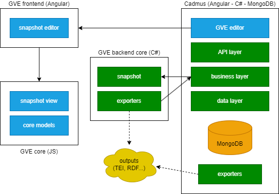

# Development

The GVE architecture is based on three main groups of components:

- backend components, which provide the snapshot model and the logic for dealing with it. These are all implemented with C#.
- frontend components, which provide a set of layers to be used both in editing and in displaying snapshots. Core models are in a pure Typescript library; the snapshot viewer is a pure web component, so that it can be easily placed in a web page or integrated in any JS-based UI; the snapshot editor is a set of Angular components providing a full-fledged editor for snapshots.
- Cadmus components, which provide integration with the [Cadmus](https://myrmex.github.io/overview/cadmus) editor. Cadmus is a web-based, modular editor for highly structured data, based on a layered architecture and storing its data in a NoSql, JSON-based database (MongoDB). All its backend layers are implemented in C# language, using ASP.NET for web API endpoints, including CORS, JWT, rate limiting, and auditing. Its frontend is based on Angular. For GVE, this generic Cadmus solution uses GVE-specific models from the corresponding backend and frontend libraries.

The API layer allows to share the core logic (stored in separated libraries) with clients written in any language, and all the applications are distributed via Docker containers, thus making it easy to both host them in a server and use them on a local machine, without requiring any configuration.

The main code repositories are:

(a) backend:

- [GVE core](https://github.com/vedph/gve-core): core business logic (with a demo UI) and API layers for both GVE shell and Cadmus.

(b) frontend:

- [GVE snapshot models](https://github.com/vedph/gve-snapshot-core): frontend models.
- [GVE snapshot view web component](https://github.com/vedph/gve-snapshot-view): pure web component for snapshot view.
- [GVE shell](https://github.com/vedph/gve-shell): Angular components for GVE frontend UI.
- [Cadmus GVE editor](https://github.com/vedph/cadmus-gve-app): Cadmus GVE editor frontend.

## GVE Backend

The GVE backend essentially consists of the snapshot model and its core chain data structure. The only language used for backend is C#.

The technical documentation about these components is temporarily located at <http://www.fusisoft.it/docs/gve/index.html>. The [full reference](http://www.fusisoft.it/docs/gve/api/Cadmus.Gve.Parts.html) can be found there, while the conceptual documentation has been included and refactored in this site.

### Backend Core

The core GVE components are hosted in a single C# library, [Gve Text](http://www.fusisoft.it/docs/gve/api/Gve.Text.html), which has no dependencies on any project-specific component.

All the other backend components essentially are infrastructure.

### Demo Infrastructure

These components provide infrastructure for the GVE shell frontend, used to develop and test the frontend snapshot editor components, and the GVE chain demo.

- [GVE shell API](http://www.fusisoft.it/docs/gve/api/Gve.Api.html): API endpoints for the GVE shell frontend. This frontend is a web UI used to develop and test GVE frontend components used in the snapshot editor. The backend API provide chain transformation functionality.
- [GVE demo app](http://www.fusisoft.it/docs/gve/api/Gve.Demo.html): a Blazor web application used for playing with the chain data structure. Using Blazor allows to directly access the C# core without an intermediate API layer.

### Cadmus Infrastructure

These components provide infrastructure for using the GVE model from within [Cadmus](https://myrmex.github.io/overview/cadmus). This allows reusing this modular web-based editor to enter data for the whole edition, including but not limited to the snapshots.

- [Cadmus part for GVE snapshot](http://www.fusisoft.it/docs/gve/api/Cadmus.Gve.Parts.html): a Cadmus part representing a GVE snapshot. Essentially it is just a wrapper for the snapshot in a form usable by the Cadmus editor.
- [Cadmus part seeders for GVE snapshot](http://www.fusisoft.it/docs/gve/api/Cadmus.Seed.Gve.Parts.html): a mock data seeder for the Cadmus part for GVE snapshot. Usually, every part in Cadmus has a corresponding seeder, which is used to generate mock data to be used in the editor.
- [Cadmus GVE services](http://www.fusisoft.it/docs/gve/api/Cadmus.Gve.Services.html): services providing the GVE models to the Cadmus infrastructure.
- [Cadmus GVE API](http://www.fusisoft.it/docs/gve/api/CadmusGveApi.html): API endpoints for the Cadmus GVE editor.

## GVE Frontend

The frontend portion provides UI for displaying and editing snapshots.

The UI has been designed into a set of **layers and modules**, with the primary purpose of providing a reusable tool for this and other projects. Currently, there are 4 layers, each corresponding to a different implementation technology:

1. **snapshot core** (TS library, packaged with NPM: `gve-snapshot-core`): this is a pure Typescript library, framework-agnostic, containing just the definitions of the parts of a snapshot model. These definitions are provided in a separate library so that everyone can reuse them even without importing any piece of logic, which is rather provided by upper layers.
2. **snapshot view** (Web Component, packaged with NPM: `gve-snapshot-view`): this is a framework-agnostic, pure web component which can be directly integrated in any HTML page or application to visualize a snapshot. Integrating this component is as simple as typing the name of its tag in the HTML page, and passing it a JS object with data of the snapshot to visualize. Starting from this object, the view takes care of all the complex details relative to generating an interactive SVG-based visualization of the snapshot. As such, this component can be used both in an editing environment, where it works as a preview (and that's how we use it in our editor), and in a presentation environment for end users. This is why it has been implemented with a highly neutral web-based technology with no dependencies from a specific web framework like Angular, React, or the like: this is a pure W3C standard web component.
3. **snapshot editor** (Angular 18+ library, packaged with NPM: [gve-core](gve-core)): this is the core component used to fully edit the snapshot model. This is implemented as an Angular library, so that it can be easily integrated into any Angular based web application. In turn, this editor uses the snapshot view to preview the content being edited.
4. **VEdition editor** (Angular 18+ [Cadmus](https://myrmex.github.io/overview/cadmus)-based editor, distributed in containerized Docker images: `cadmus-gve-app`): this is the editor planned for the full content of VEdition, which is not limited to snapshots, but extends to a whole tree of entities based on it. In this case we adopt [Cadmus](https://myrmex.github.io/overview/cadmus) for its modularity and extensibility, which allows us to build a full web editor on top of an already mature tool, backed by a full-fledged database. In turn, this editor uses the snapshot editor library for editing snapshots, and more libraries for the other entities involved.

This layered design allows to reuse the logic included in each component without having to introduce unwanted dependencies, according to the purposes and environment of reuse.
