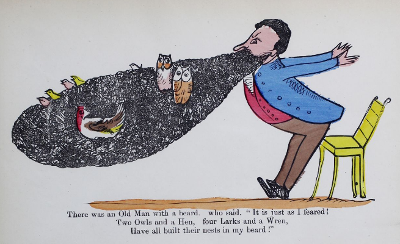
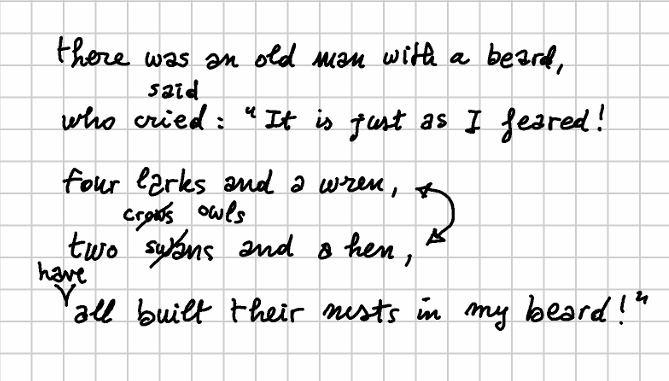

# True Text Example

Let us make an example with a true text. Consider the first limerick in [The Book of Nonsense](http://purl.flvc.org/fsu/fd/FSULearBook_012) by Edward Lear (p.7 of the 1875 edition you can find at <http://purl.flvc.org/fsu/fd/FSULearBook_012>):



```txt
1  There was an Old Man with a beard,
2  who said, "It is just as I feared!
3  Two Owls and a Hen,
4  four Larks and a Wren,
5  Have all built their nests in my beard!"
```

Let's pretend that we had an autograph like this:



This is our **snapshot**. We now use the snapshot editor to enter its data in the GVE [text model](textual.md).

## Base Text

Let us start by defining the **base text** (`v0`). Our mock snapshot is very simple: by looking at it, we can clearly see that this corresponds to the text which was first laid out following the printed sheet lines. So, we can define the base text as:

```txt
there was an old man with a beard,
who cried: "It is just as I feared!
four larks and a wren,
two swans and a hen,
all built their nests in my beard!"
```

>👉 Note that the base text essentially is just a string, so that newlines are represented in it just like any character node, corresponding to a single newline character (LF). In the UI this is visualized as an arrow-down character.

In the GVE UI, we can just paste this text to get the identifiers assigned to each node in the base text. In the screenshot below, I have selected the nodes corresponding to the word "cried", ranging from 40 to 44 (a `40x5` span coordinate, as displayed at the top of the screenshot):


>💡 To select a range, click on the first node, and then Ctrl+click on the last one.

## Operations

We can now start interpreting the snapshot by inferring editing **operations** from it.

Of course, operations are the product of our subjective interpretation, while compatible with the objective data provided by the snapshot. Here, we assume that after changing a couple of words, the author inserted "have" for metrical reasons, and this produced what we regard as a staged version, named "alpha".

We then assume that later, the author read this text again, and he decided to swap verses 3-4 to get a better progression (both numeric and in syllabic mass). Finally, he also changed "crows" into "owls". The final outcome is what we regard as staged version "beta".

So, more formally, we have:

1. replace "cried" with "said";
2. replace "swans" with "crows";
3. insert "have" before "all" (for metrical reasons);
4. swap verses 3-4;
5. replace "crows" with "owls".

Let us formalize this interpretation, representing it with the [DSL syntax](textual.md#operations-dsl) used for essential GVE operations:

1. `40x5="said"`: replace "cried" with "said" (`v1`). Note that this introduces new nodes in the graph, one for each character of the word "said". We can predict the identifiers assigned to these new letters because the algorithm is designed to make it possible: we just get the maximum ID number, and add 1 to it to get the next ID. So here we can predict that `s`=151, `a`=152, `i`=153, `d`=154. Alternatively, we can just use the UI to execute operations up to the desired point, and then look at the resulting output, which allows you to get the IDs of each node while also inspecting all their metadata.
2. `99x5="crows"`: replace "swans" with "crows" (`v2`). Again, we can predict the new IDs (155-159).
3. `116+["have " [*version^="alpha" reason="metrical"]`: insert "have" before "all" (`v3`): staged version alpha. As we are inserting a separate word, we also add a space after it. Also, note that here we add a couple of operation metadata:
    - `version`: this assigns a staged version metadatum to the output of this operation, i.e. we mean that after this operation we got a version of the text we consider as a real "Fassung" in the history of our text. Of course, we might have thousands reasons for doing this, one of the most obvious being a previous printed edition of this book among our witnesses. Note that by definition whenever we promote an output to a staged version this implies that this refers to the resulting text as a whole, and that it will be made void as soon as we change again that text. This is why in our syntax we add the `*` prefix (=global metadatum) and the `^` suffix (=short-lived).
    - `reason`: the reason we supposed for this operation. The set policy here (as specified by `=`) is multiple, which is the default. We might have several reasons for an operation; and in this case, each would be a different metadatum with same name (`reason`) and different values.
4. `72x23<>95x21`: swap verses 3-4 (`v4`). Note that the swap just takes as reference node the first one of each verse, because due to the nature of range coordinates we just specify a start point (the AT) and a span count (the RUN). So, whatever the identifiers of the nodes in each verse, all verse nodes will be selected. For instance, here "four larks and a wren," (23 characters including LF) include the original sequence of nodes with IDs ranging from 72 to 94; while "two crows and a hen," (21 characters including LF) contains IDs 95-98 (for "two "), 155-159 ("crows"), 104-115 (" and a hen,").
5. `155x5="owls" [*version^="beta"]`: replace "crows" with "owls" (`v5`): staged version beta.

>For diagnostic purposes, all the operations also get a global `log` feature which gets accumulated for the text as each operation is executed.

So, here we are describing all changes step after step. Each operation output produces a new version, but only two of them are marked as staged, with names `alpha` and `beta` respectively. In short:

```txt
40x5="said" [*log="said for cried" x="72" y="140" style="font-size:20px;fill:red"]
99x5="crows" [*log="crows for swans" x="120" y="210" style="font-size:20px;fill:red"]
116+["have " [*log="insert have" *version^="alpha" reason="metrical" x="60" y="270" style="font-size:20px;fill:red"]
72x23<>95x20  [*log="swap verses"]
155x5="owls" [*log="owls for crows" *version^="beta" x="210" y="210" style="font-size:20px;fill:red"]
```

The output versions are:

- `v1` ("said" replaced "cried"):

```txt
there was an old man with a beard,
who said: "It is just as I feared!
four larks and a wren,
two swans and a hen,
all built their nests in my beard!"
```

- `v2` ("crows" replaced "swans"):

```txt
there was an old man with a beard,
who said: "It is just as I feared!
four larks and a wren,
two crows and a hen,
all built their nests in my beard!"
```

- `v3` ("have" added before "all"; staged as `alpha`):

```txt
there was an old man with a beard,
who said: "It is just as I feared!
four larks and a wren,
two crows and a hen,
have all built their nests in my beard!"
```

- `v4` (swapped verses 3-4):

```txt
there was an old man with a beard,
who said: "It is just as I feared!
two crows and a hen,
four larks and a wren,
have all built their nests in my beard!"
```

- `v5` ("owls" replaced "crows"; staged as `beta`):

```txt
there was an old man with a beard,
who said: "It is just as I feared!
two owls and a hen,
four larks and a wren,
have all built their nests in my beard!"
```

This is the minimal data we need to represent our text versions. We can then go on, and add visuals and even timelines; anyway, until now all the snapshot data could be entered via text: a base text and 5 lines representing a batch of edits is all what is required to feed the chain engine and let it generate all the versions, each with its own metadata attached to either specific text nodes, or to the version as a whole.

---

◀️ [snapshot sample](snapshot-sample.md) | 🏠 [home](../index.md)
