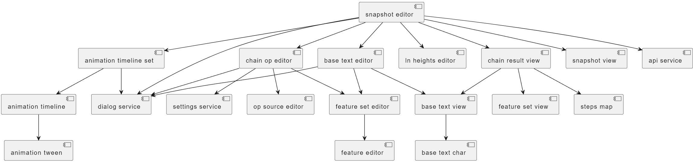

# GVE Snapshot View

The `gve-snapshot-view` Angular library contains core frontend components to be used by GVE client apps.

The top-level component here is the snapshot editor. This provides a complete UI for editing all the data contained by a snapshot, and usually is all what you need to integrate a full snapshot editor in an Angular application.

In turn, the snapshot editor is composed by a lot of other components, covering all the snapshot features.

- [editing snapshots](./usr-snapshot.md)
- [editing operations](./usr-operation.md)
- [editing features](./usr-features.md)
