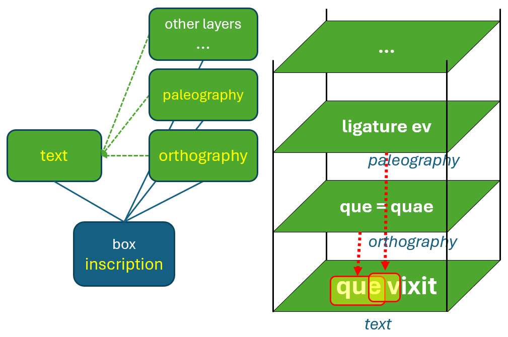
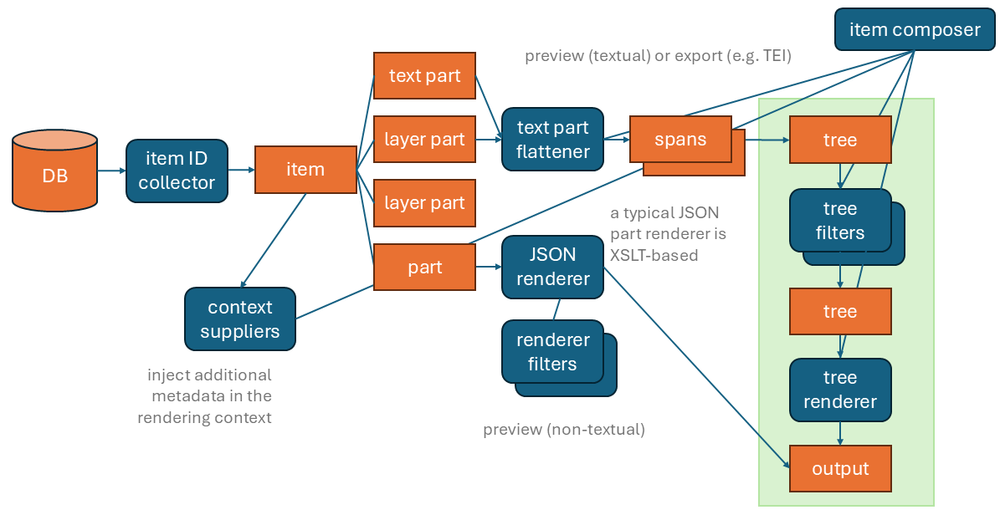
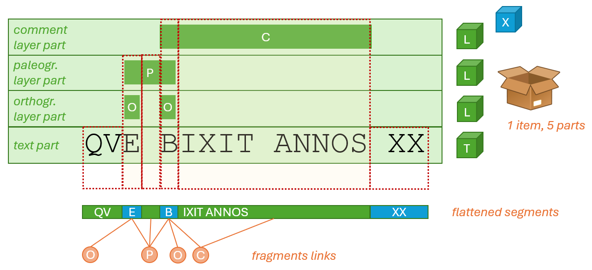
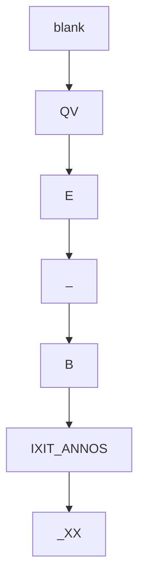

# Cadmus Export

- [Cadmus Export](#cadmus-export)
  - [Layered Text](#layered-text)
  - [Export Pipeline](#export-pipeline)
  - [Tree in the Middle](#tree-in-the-middle)

## Layered Text

The [Cadmus](https://vedph.github.io/cadmus-doc) export system is used in that framework to generate any text-based output (XML, HTML, plain text, PDF...) from highly-structured data in a source database.

As GVE uses Cadmus for its higher-level entities, and its rendering requirements are very similar, the Cadmus pipeline has been refactored to be applied to GVE too. Here we just recall its basic elements, as far as they are useful to better understand the GVE export process.

In Cadmus everything is a composite object; and that's true also for text. For instance, consider an inscription. This is represented as a single Cadmus record, which can be assimilated to a box. A box is just a generic container, which can include any number and type of objects. Each object has its own data model, and a corresponding editor UI. So, both data models and editors are composable.

So, our inscription is a box. Inside it, we put an object representing the text as it is on the stone; plus, unlimited annotation layer objects: one for orthographic annotations, another for paleographic annotations, another for comments; and so forth.

There's no limit to the layers we can stack; and adding layers does not affect existing data.
Also, we get a scalable, independent model, freed from markup constraints, and designed by focusing on it only.

The user experience in layer editing is thus very simple: users select the portion of text they want to annotate, be it a single character or a multiline text; and then click and enter data in the UI specialized for that layer.

## Export Pipeline

At any time, Cadmus can export data into completely different formats (TEI, RDF, HTML, etc.). An _export pipeline_ is built by assembling various modules and covers the full flow from the Cadmus database to the desired output format.

Using a pipeline allows us to split complex logic into smaller, simpler bits; and to reuse them whenever possible. We just chain and configure components in different ways in the pipeline to get different results.

This pipeline covers not only data export, but also its text-like rendition in the UI.
In short, we start from the database, containing many composite records, our items (the "boxes"). Each item is built of various parts (the "objects" put in boxes), each with its own model and editor.

In Cadmus, the pipeline starts with a collector component, used to collect those items we want to export, according to various parameters. We can also have more metadata injected into the export context during this stage by context supplier components. For instance, one such component can be used to inject metadata about whether a specific text item (roughly corresponding to a self-contained TEI block of text, like `div`) is poetry or prose. Another component, the item composer, orchestrates the whole process.

For each collected item, we have its objects. They can represent text, text annotation layers, or any other type of non-textual data.

For non-textual data, a set of renderer components can be used to generate a text representation for a preview in the UI. Their result can be further transformed via filters.

For text, a flattener component selects the requested layers and flattens them into a single sequence of characters. This is required because we have a multiple-layers set of annotations in our source. This generates a set of text spans, i.e. a _dynamically_ defined segmentation of the text, driven by the annotations we have selected for export.

These spans then are converted into a single-branch tree, where each span is a child node of the previous span. From there, tree filters can variously transform it, until a tree renderer renders it into some output format, like TEI or HTML.

>This modular pipeline is designed to be completely configured with a declarative approach. A JSON document contains its full configuration, telling which components to use and how to configure them, from data source up to the final output. This allows even non-technical users to define and customize the export process at will, without having to write a single line of code. On the other hand, technical users will be able to create their own modules and chain them into the pipeline, should a highly specific logic be required. That's a modular and collaborative approach, in the spirit of the Cadmus system.

Another benefit of this dynamic segmentation is that for those cases where we have a lot of different annotations, we are not forced to systematically wrap each word of our text in advance like in stand-off. In that case, we use some neutral TEI element like `seg` to annotate each word with an ID; and then, we can refer to each span via these identifiers, thus avoiding overlap. Yet, this is redundant; and it forces us to use a preset markup unit, like here the word, thus making us stick to that level of granularity.

In Cadmus export process segmentation is not preset, but calculated at the time of export, according to our annotations. We start with multiple layers of annotations on top of a base text; we select the layers we want, and their combinations define the resulting segments.

For instance, in the above diagram we have a box representing an inscription. In it there are 5 parts, and among them 4 are related to text: one is the text itself; another is the orthography layer, which registers orthographic deviations and their underlying linguistic phenomena, like e.g. the E in QVE (for QVAE) and the B in BIXIT (for VIXIT); another is the paleographic layer, for a ligature between E and B; and ● another is the comment layer, for BIXIT ANNOS (about the usage of accusative rather than ablative in this expression).

If we now project all the segmentations from each layer into a single plane, what we get is a sequence of 6 variable length segments. Some of these segments are linked to one or more annotation layers.

We thus have these segments:

1. `QV`;
2. `E`, linked to orthography and paleography;
3. space, linked to paleography;
4. `B`, linked to orthography, paleography, and comment;
5. `IXIT ANNOS`, linked to comment;
6. space + `XX`, linked to nothing, like the initial `QV`.

So, rather than having a fixed and systematic segmentation like word-by-word, affecting the whole text, we have a dynamic one, with variable length, perfectly fit to our annotations. This simplifies the export process, and ensures that the resulting output will be as compact as possible.
Once this segmentation is in place, it will be turned into a tree structure, which will be variously manipulated to generate the desired markup from its logic model. In it, each node corresponds to a segment.

## Tree in the Middle

Now, in this pipeline the tree has been introduced for GVE right to provide more flexibility in output.

Before, we just had a sequence of text spans. Now, we start with the same sequence, but this is stored as the nodes of a single-branch tree. The tree starts with a single branch, but it can later be transformed into any other shape.

For instance, from the above text segments we would get a tree with a blank root node, whose unique child is a node for `QV`; in turn, this node would have as its unique child another node for `E`; and so forth.

So, each tree node represents a variable-length portion of the text, variously linked to any number of metadata. The link is implemented by a set of features, which are simple name=value pairs.

When the pipeline starts, this tree has a single branch. Later, it can be transformed in any way, and split into multiple branches, nesting without limits, to best fit the desired output structure.

>In GVE, the tree also starts with single-character segments. So, each node corresponds to 1 character. Later, filters transform it by building larger segments, e.g. according to the metadata attached them.

This has many benefits:

- it is fit to the _target format_, which is typically based on a [DOM tree](https://en.wikipedia.org/wiki/Document_Object_Model), like XML or HTML. We can thus generate the tree, and then just materialize it into markup.
- it allows for _multiple text flows_. For instance, in the Saba 1919 TEI scheme branches like `lem` and `rdg` are used to represent different text versions.
- it allows for [complex single text flows](export-trees.md), which branch into segments representing alternative versions, like for instance in TEI parallel segmentation.
