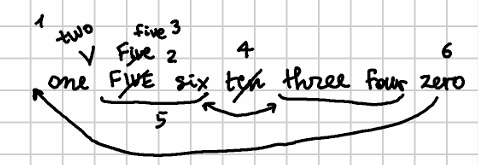

# TEI Export Sample - Digits

## Snapshot

Let us start from this mock autograph, where I numbered the operations to make it easier to read its interpretation:



In our interpretation, we have:

- base text (v0):

```txt
one FIVE six ten three four zero
```

- operations (DSL):

```txt
5+["two "
5x4="Five"
37x4="five"
14x4- [*version^:=alpha]
@8x8<>17x10
29x4>[1@zero
1+[" "@zero [*version^:=beta]
```

These operations can be read as follows:

1. v0>v1: insert `two_` before `FIVE`
2. v1>v2: replace `FIVE` with `Five`
3. v2>v3: replace `Five` with `five`
4. v3>v4: delete `ten_` (staged version "alpha")
5. v4>v5: swap `five six` with `three four`
6. v5>v6: move `zero` before `one`
7. v6>v7: insert space before `one` (staged version "beta")

>Note that the last 2 operations are grouped because they are semantically one, i.e. adding the space is implicit in moving the word so that we avoid stitching words after moving. Additionally, we might also add another operation to remove the final space after zero is moved, but we omit this to make the example shorter, as a trailing space in the rendition makes no harm.

## Versions

The generated versions are:

- v1 `one two FIVE six ten three four zero`
- v2 `one two Five six ten three four zero`
- v3 `one two five six ten three four zero`
- v4 `one two five six three four zero` (alpha)
- v5 `one two three four five six zero`
- v6 `zeroone two three four five six`
- v7 `zero one two three four five six` (beta)

The trace features generated by executing the operations are (each character of the referenced text has them):

- at alpha:
  - v0:
    - `$anchor` on `F`IVE (v0:v1)
  - v1:
    - `$seg-out` (v0:v1) for `two_`
    - `$seg-in` (v1:v2) for `FIVE`
  - v2:
    - `$seg-out` (v1:v2) for `Five`
    - `$seg-in` (v2:v3) for `Five`
  - v3:
    - `$seg-out` (v2:v3) for `five`
    - `$seg-in` (v3:v4) for `ten_`
  - v4:
    - `$seg-in` (v4:v5) for `five`

We can summarize these features by wrapping the corresponding text into `{}` for deletions and `[]` for output segments, followed by the target version number:

```txt
one [two ]1{FIVE}2{Five}4[five]5 six {ten }4three four zero
```

### Version Alpha

- v4 `one two five six three four zero`

The alpha version branch is the first child of the root node (as always, ignore operation IDs as these get automatically generated and this document was written in different times). Its dump is reported below: each node, corresponding to one character of the version's text, is a line; indentation has been removed to make the nodes list more compact. The line contains the node's Y and X positions, its label, and the data payload attached to that node after a right arrow. Features (selected from the larger set available for each character) are listed with their name and value separated by an equals sign.

```txt
+ ⯈ [2.1] →  (sub-id=v4, version=alpha)
+ ⯈ [3.1] o → #1: o
+ ⯈ [4.1] n → #2: n
+ ⯈ [5.1] e → #3: e
+ ⯈ [6.1]   → #4:  
+ ⯈ [7.1] t → #33: t ($seg-out="dc328266f2 v0:v1 1")
+ ⯈ [8.1] w → #34: w ($seg-out="dc328266f2 v0:v1 2")
+ ⯈ [9.1] o → #35: o ($seg-out="dc328266f2 v0:v1 3")
+ ⯈ [10.1]   → #36:   ($seg-out="dc328266f2 v0:v1 4")
+ ⯈ [11.1] f → #41: f ($seg-in="5efc466ae9 v4:v5 1", $seg-out="980a28378f v2:v3 1")
+ ⯈ [12.1] i → #42: i ($seg-in="5efc466ae9 v4:v5 2", $seg-out="980a28378f v2:v3 2")
+ ⯈ [13.1] v → #43: v ($seg-in="5efc466ae9 v4:v5 3", $seg-out="980a28378f v2:v3 3")
+ ⯈ [14.1] e → #44: e ($seg-in="5efc466ae9 v4:v5 4", $seg-out="980a28378f v2:v3 4")
+ ⯈ [15.1]   → #9:   ($seg-in="5efc466ae9 v4:v5 5")
+ ⯈ [16.1] s → #10: s ($seg-in="5efc466ae9 v4:v5 6")
+ ⯈ [17.1] i → #11: i ($seg-in="5efc466ae9 v4:v5 7")
+ ⯈ [18.1] x → #12: x ($seg-in="5efc466ae9 v4:v5 8")
+ ⯈ [19.1]   → #13:  
+ ⯈ [20.1] t → #18: t ($seg2-in="5efc466ae9 v4:v5 1")
+ ⯈ [21.1] h → #19: h ($seg2-in="5efc466ae9 v4:v5 2")
+ ⯈ [22.1] r → #20: r ($seg2-in="5efc466ae9 v4:v5 3")
+ ⯈ [23.1] e → #21: e ($seg2-in="5efc466ae9 v4:v5 4")
+ ⯈ [24.1] e → #22: e ($seg2-in="5efc466ae9 v4:v5 5")
+ ⯈ [25.1]   → #23:   ($seg2-in="5efc466ae9 v4:v5 6")
+ ⯈ [26.1] f → #24: f ($seg2-in="5efc466ae9 v4:v5 7")
+ ⯈ [27.1] o → #25: o ($seg2-in="5efc466ae9 v4:v5 8")
+ ⯈ [28.1] u → #26: u ($seg2-in="5efc466ae9 v4:v5 9")
+ ⯈ [29.1] r → #27: r ($seg2-in="5efc466ae9 v4:v5 10")
+ ⯈ [30.1]   → #28:  
+ ⯈ [31.1] z → #29: z
+ ⯈ [32.1] e → #30: e
+ ⯈ [33.1] r → #31: r
- ■ [34.1] o → #32: o
```

>The number after `#` is the original node ID (source ID) from the GVE chain structure. So, at start each node will have a unique source ID; once we start restoring deleted nodes, it might happen that duplicated nodes share the same source ID.

As you can see, in this linear (single-branch) tree each character is a child node of the preceding character. Note that the branch starts at 2.1, having a couple of features related to the version the branch refers to (`v4`, staged as `alpha`); the root at level 1 instead is the root of the whole tree, which contains one child branch for each version.

Once the tree has been built, the builder goes on to restore deletions (as we requested in its configuration), from v3 backwards. In case of replacements (due to replacements or swap operations), the builder restores each segment right before the one replacing it. Here you can follow the restore process, step by step.

(1) v3 (delete `ten_`): the characters of the deleted segment are restored:

```txt
+ ⯈ [2.1] →  (sub-id=v4, version=alpha)
+ ⯈ [3.1] o → #1: o
+ ⯈ [4.1] n → #2: n
+ ⯈ [5.1] e → #3: e
+ ⯈ [6.1]   → #4:  
+ ⯈ [7.1] t → #33: t ($seg-out="dc328266f2 v0:v1 1")
+ ⯈ [8.1] w → #34: w ($seg-out="dc328266f2 v0:v1 2")
+ ⯈ [9.1] o → #35: o ($seg-out="dc328266f2 v0:v1 3")
+ ⯈ [10.1]   → #36:   ($seg-out="dc328266f2 v0:v1 4")
+ ⯈ [11.1] f → #41: f ($seg-in="5efc466ae9 v4:v5 1", $seg-out="980a28378f v2:v3 1")
+ ⯈ [12.1] i → #42: i ($seg-in="5efc466ae9 v4:v5 2", $seg-out="980a28378f v2:v3 2")
+ ⯈ [13.1] v → #43: v ($seg-in="5efc466ae9 v4:v5 3", $seg-out="980a28378f v2:v3 3")
+ ⯈ [14.1] e → #44: e ($seg-in="5efc466ae9 v4:v5 4", $seg-out="980a28378f v2:v3 4")
+ ⯈ [15.1]   → #9:   ($seg-in="5efc466ae9 v4:v5 5")
+ ⯈ [16.1] s → #10: s ($seg-in="5efc466ae9 v4:v5 6")
+ ⯈ [17.1] i → #11: i ($seg-in="5efc466ae9 v4:v5 7")
+ ⯈ [18.1] x → #12: x ($seg-in="5efc466ae9 v4:v5 8")
+ ⯈ [19.1]   → #13:  

+ ⯈ [20.1] t → #14: t ($del="196de059bf v3:v4 1")
+ ⯈ [21.1] e → #15: e ($del="196de059bf v3:v4 2")
+ ⯈ [22.1] n → #16: n ($del="196de059bf v3:v4 3")
+ ⯈ [23.1]   → #17:   ($del="196de059bf v3:v4 4")

+ ⯈ [24.1] t → #18: t ($seg2-in="5efc466ae9 v4:v5 1")
+ ⯈ [25.1] h → #19: h ($seg2-in="5efc466ae9 v4:v5 2")
+ ⯈ [26.1] r → #20: r ($seg2-in="5efc466ae9 v4:v5 3")
+ ⯈ [27.1] e → #21: e ($seg2-in="5efc466ae9 v4:v5 4")
+ ⯈ [28.1] e → #22: e ($seg2-in="5efc466ae9 v4:v5 5")
+ ⯈ [29.1]   → #23:   ($seg2-in="5efc466ae9 v4:v5 6")
+ ⯈ [30.1] f → #24: f ($seg2-in="5efc466ae9 v4:v5 7")
+ ⯈ [31.1] o → #25: o ($seg2-in="5efc466ae9 v4:v5 8")
+ ⯈ [32.1] u → #26: u ($seg2-in="5efc466ae9 v4:v5 9")
+ ⯈ [33.1] r → #27: r ($seg2-in="5efc466ae9 v4:v5 10")
+ ⯈ [34.1]   → #28:  
+ ⯈ [35.1] z → #29: z
+ ⯈ [36.1] e → #30: e
+ ⯈ [37.1] r → #31: r
- ■ [38.1] o → #32: o
```

Note that each restored node has a `$del` trace feature which marks it as a restoration.

(2) v2 (replace `Five` with `five`): `Five` nodes are restored before `five`:

```txt
+ ⯈ [2.1] →  (sub-id=v4, version=alpha)
+ ⯈ [3.1] o → #1: o
+ ⯈ [4.1] n → #2: n
+ ⯈ [5.1] e → #3: e
+ ⯈ [6.1]   → #4:  
+ ⯈ [7.1] t → #33: t ($seg-out="dc328266f2 v0:v1 1")
+ ⯈ [8.1] w → #34: w ($seg-out="dc328266f2 v0:v1 2")
+ ⯈ [9.1] o → #35: o ($seg-out="dc328266f2 v0:v1 3")
+ ⯈ [10.1]   → #36:   ($seg-out="dc328266f2 v0:v1 4")

+ ⯈ [11.1] F → #37: F ($del="980a28378f v2:v3 1")
+ ⯈ [12.1] i → #38: i ($del="980a28378f v2:v3 2")
+ ⯈ [13.1] v → #39: v ($del="980a28378f v2:v3 3")
+ ⯈ [14.1] e → #40: e ($del="980a28378f v2:v3 4")

+ ⯈ [15.1] f → #41: f ($seg-in="5efc466ae9 v4:v5 1", $seg-out="980a28378f v2:v3 1")
+ ⯈ [16.1] i → #42: i ($seg-in="5efc466ae9 v4:v5 2", $seg-out="980a28378f v2:v3 2")
+ ⯈ [17.1] v → #43: v ($seg-in="5efc466ae9 v4:v5 3", $seg-out="980a28378f v2:v3 3")
+ ⯈ [18.1] e → #44: e ($seg-in="5efc466ae9 v4:v5 4", $seg-out="980a28378f v2:v3 4")
+ ⯈ [19.1]   → #9:   ($seg-in="5efc466ae9 v4:v5 5")
+ ⯈ [20.1] s → #10: s ($seg-in="5efc466ae9 v4:v5 6")
+ ⯈ [21.1] i → #11: i ($seg-in="5efc466ae9 v4:v5 7")
+ ⯈ [22.1] x → #12: x ($seg-in="5efc466ae9 v4:v5 8")
+ ⯈ [23.1]   → #13:  
+ ⯈ [24.1] t → #14: t ($del="196de059bf v3:v4 1")
+ ⯈ [25.1] e → #15: e ($del="196de059bf v3:v4 2")
+ ⯈ [26.1] n → #16: n ($del="196de059bf v3:v4 3")
+ ⯈ [27.1]   → #17:   ($del="196de059bf v3:v4 4")
+ ⯈ [28.1] t → #18: t ($seg2-in="5efc466ae9 v4:v5 1")
+ ⯈ [29.1] h → #19: h ($seg2-in="5efc466ae9 v4:v5 2")
+ ⯈ [30.1] r → #20: r ($seg2-in="5efc466ae9 v4:v5 3")
+ ⯈ [31.1] e → #21: e ($seg2-in="5efc466ae9 v4:v5 4")
+ ⯈ [32.1] e → #22: e ($seg2-in="5efc466ae9 v4:v5 5")
+ ⯈ [33.1]   → #23:   ($seg2-in="5efc466ae9 v4:v5 6")
+ ⯈ [34.1] f → #24: f ($seg2-in="5efc466ae9 v4:v5 7")
+ ⯈ [35.1] o → #25: o ($seg2-in="5efc466ae9 v4:v5 8")
+ ⯈ [36.1] u → #26: u ($seg2-in="5efc466ae9 v4:v5 9")
+ ⯈ [37.1] r → #27: r ($seg2-in="5efc466ae9 v4:v5 10")
+ ⯈ [38.1]   → #28:  
+ ⯈ [39.1] z → #29: z
+ ⯈ [40.1] e → #30: e
+ ⯈ [41.1] r → #31: r
- ■ [42.1] o → #32: o
```

(3) v1 (replace `FIVE` with `Five`): `FIVE` nodes are restored before `Five`:

```txt
+ ⯈ [2.1] →  (sub-id=v4, version=alpha)
+ ⯈ [3.1] o → #1: o
+ ⯈ [4.1] n → #2: n
+ ⯈ [5.1] e → #3: e
+ ⯈ [6.1]   → #4:  
+ ⯈ [7.1] t → #33: t ($seg-out="dc328266f2 v0:v1 1")
+ ⯈ [8.1] w → #34: w ($seg-out="dc328266f2 v0:v1 2")
+ ⯈ [9.1] o → #35: o ($seg-out="dc328266f2 v0:v1 3")
+ ⯈ [10.1]   → #36:   ($seg-out="dc328266f2 v0:v1 4")

+ ⯈ [11.1] F → #5: F ($del="91b036cd5e v1:v2 1")
+ ⯈ [12.1] I → #6: I ($del="91b036cd5e v1:v2 2")
+ ⯈ [13.1] V → #7: V ($del="91b036cd5e v1:v2 3")
+ ⯈ [14.1] E → #8: E ($del="91b036cd5e v1:v2 4")

+ ⯈ [15.1] F → #37: F ($del="980a28378f v2:v3 1")
+ ⯈ [16.1] i → #38: i ($del="980a28378f v2:v3 2")
+ ⯈ [17.1] v → #39: v ($del="980a28378f v2:v3 3")
+ ⯈ [18.1] e → #40: e ($del="980a28378f v2:v3 4")
+ ⯈ [19.1] f → #41: f ($seg-in="5efc466ae9 v4:v5 1", $seg-out="980a28378f v2:v3 1")
+ ⯈ [20.1] i → #42: i ($seg-in="5efc466ae9 v4:v5 2", $seg-out="980a28378f v2:v3 2")
+ ⯈ [21.1] v → #43: v ($seg-in="5efc466ae9 v4:v5 3", $seg-out="980a28378f v2:v3 3")
+ ⯈ [22.1] e → #44: e ($seg-in="5efc466ae9 v4:v5 4", $seg-out="980a28378f v2:v3 4")
+ ⯈ [23.1]   → #9:   ($seg-in="5efc466ae9 v4:v5 5")
+ ⯈ [24.1] s → #10: s ($seg-in="5efc466ae9 v4:v5 6")
+ ⯈ [25.1] i → #11: i ($seg-in="5efc466ae9 v4:v5 7")
+ ⯈ [26.1] x → #12: x ($seg-in="5efc466ae9 v4:v5 8")
+ ⯈ [27.1]   → #13:  
+ ⯈ [28.1] t → #14: t ($del="196de059bf v3:v4 1")
+ ⯈ [29.1] e → #15: e ($del="196de059bf v3:v4 2")
+ ⯈ [30.1] n → #16: n ($del="196de059bf v3:v4 3")
+ ⯈ [31.1]   → #17:   ($del="196de059bf v3:v4 4")
+ ⯈ [32.1] t → #18: t ($seg2-in="5efc466ae9 v4:v5 1")
+ ⯈ [33.1] h → #19: h ($seg2-in="5efc466ae9 v4:v5 2")
+ ⯈ [34.1] r → #20: r ($seg2-in="5efc466ae9 v4:v5 3")
+ ⯈ [35.1] e → #21: e ($seg2-in="5efc466ae9 v4:v5 4")
+ ⯈ [36.1] e → #22: e ($seg2-in="5efc466ae9 v4:v5 5")
+ ⯈ [37.1]   → #23:   ($seg2-in="5efc466ae9 v4:v5 6")
+ ⯈ [38.1] f → #24: f ($seg2-in="5efc466ae9 v4:v5 7")
+ ⯈ [39.1] o → #25: o ($seg2-in="5efc466ae9 v4:v5 8")
+ ⯈ [40.1] u → #26: u ($seg2-in="5efc466ae9 v4:v5 9")
+ ⯈ [41.1] r → #27: r ($seg2-in="5efc466ae9 v4:v5 10")
+ ⯈ [42.1]   → #28:  
+ ⯈ [43.1] z → #29: z
+ ⯈ [44.1] e → #30: e
+ ⯈ [45.1] r → #31: r
- ■ [46.1] o → #32: o
```

At this stage, version 4 branch is complete and ready for its rendition. When later the branch passes to the Saba 1919 renderer, it gets materialized into this TEI fragment (the renderer was configured to output trace comments, and I manually indented the result to make it more readable):

```xml
<rdg>
  <mod n="v4">
    <!--⯈ [3.1] one  #2-->
    one 
    <!--⯈ [4.1] two  #3-->
    <ins source="o275cc81635">two </ins>
    <!--⯈ [5.1] FIVE #4-->
    <subst source="o04c07a71b7">
      <del source="o04c07a71b7">FIVE</del>
      <ins source="o04c07a71b7">
        <!--⯈ [6.1] Five #5-->
        <subst source="o0b2c6f7068">
          <del source="o0b2c6f7068">Five</del>
          <ins source="o0b2c6f7068"><!--⯈ [7.1] five #6-->five</ins>
          <!--⯈ [8.1]  six  #7-->
        </subst>
      </ins>
    </subst>
     six 
    <!--⯈ [9.1] ten  #8-->
    <del source="of63bacae53">ten </del>
    <!--■ [10.1] three four zero #9-->
    three four zero
  </mod>
</rdg>
```

>As the renderer has been configured to treat v7 (beta) as the preferred one, v4 here is wrapped inside an `rdg` element. The preferred version will then be wrapped inside a `lem` element.

### Version Beta

- v7 `zero one two three four five six`

The branch built from v7 (`zero one two three four five six_`) is:

```txt
+ ⯈ [2.2] →  (sub-id=v7, version=beta)
+ ⯈ [3.1] z → #29: z ($seg-in="cbdd5bf924 v5:v6 1", $seg-out="cbdd5bf924 v5:v6 1")
+ ⯈ [4.1] e → #30: e ($seg-in="cbdd5bf924 v5:v6 2", $seg-out="cbdd5bf924 v5:v6 2")
+ ⯈ [5.1] r → #31: r ($seg-in="cbdd5bf924 v5:v6 3", $seg-out="cbdd5bf924 v5:v6 3")
+ ⯈ [6.1] o → #32: o ($seg-in="cbdd5bf924 v5:v6 4", $seg-out="cbdd5bf924 v5:v6 4")
+ ⯈ [7.1]   → #45:   ($seg-out="27140c3f3c v6:v7 1")
+ ⯈ [8.1] o → #1: o ($anchor="cbdd5bf924 v5:v6", $anchor="27140c3f3c v6:v7")
+ ⯈ [9.1] n → #2: n
+ ⯈ [10.1] e → #3: e
+ ⯈ [11.1]   → #4:  
+ ⯈ [12.1] t → #33: t ($seg-out="dc328266f2 v0:v1 1")
+ ⯈ [13.1] w → #34: w ($seg-out="dc328266f2 v0:v1 2")
+ ⯈ [14.1] o → #35: o ($seg-out="dc328266f2 v0:v1 3")
+ ⯈ [15.1]   → #36:   ($seg-out="dc328266f2 v0:v1 4")
+ ⯈ [16.1] t → #18: t ($seg2-in="5efc466ae9 v4:v5 1", $seg-out="5efc466ae9 v4:v5 1")
+ ⯈ [17.1] h → #19: h ($seg2-in="5efc466ae9 v4:v5 2", $seg-out="5efc466ae9 v4:v5 2")
+ ⯈ [18.1] r → #20: r ($seg2-in="5efc466ae9 v4:v5 3", $seg-out="5efc466ae9 v4:v5 3")
+ ⯈ [19.1] e → #21: e ($seg2-in="5efc466ae9 v4:v5 4", $seg-out="5efc466ae9 v4:v5 4")
+ ⯈ [20.1] e → #22: e ($seg2-in="5efc466ae9 v4:v5 5", $seg-out="5efc466ae9 v4:v5 5")
+ ⯈ [21.1]   → #23:   ($seg2-in="5efc466ae9 v4:v5 6", $seg-out="5efc466ae9 v4:v5 6")
+ ⯈ [22.1] f → #24: f ($seg2-in="5efc466ae9 v4:v5 7", $seg-out="5efc466ae9 v4:v5 7")
+ ⯈ [23.1] o → #25: o ($seg2-in="5efc466ae9 v4:v5 8", $seg-out="5efc466ae9 v4:v5 8")
+ ⯈ [24.1] u → #26: u ($seg2-in="5efc466ae9 v4:v5 9", $seg-out="5efc466ae9 v4:v5 9")
+ ⯈ [25.1] r → #27: r ($seg2-in="5efc466ae9 v4:v5 10", $seg-out="5efc466ae9 v4:v5 10")
+ ⯈ [26.1]   → #13:  
+ ⯈ [27.1] f → #41: f ($seg-out="980a28378f v2:v3 1", $seg-in="5efc466ae9 v4:v5 1", $seg2-out="5efc466ae9 v4:v5 1")
+ ⯈ [28.1] i → #42: i ($seg-out="980a28378f v2:v3 2", $seg-in="5efc466ae9 v4:v5 2", $seg2-out="5efc466ae9 v4:v5 2")
+ ⯈ [29.1] v → #43: v ($seg-out="980a28378f v2:v3 3", $seg-in="5efc466ae9 v4:v5 3", $seg2-out="5efc466ae9 v4:v5 3")
+ ⯈ [30.1] e → #44: e ($seg-out="980a28378f v2:v3 4", $seg-in="5efc466ae9 v4:v5 4", $seg2-out="5efc466ae9 v4:v5 4")
+ ⯈ [31.1]   → #9:   ($seg-in="5efc466ae9 v4:v5 5", $seg2-out="5efc466ae9 v4:v5 5")
+ ⯈ [32.1] s → #10: s ($seg-in="5efc466ae9 v4:v5 6", $seg2-out="5efc466ae9 v4:v5 6")
+ ⯈ [33.1] i → #11: i ($seg-in="5efc466ae9 v4:v5 7", $seg2-out="5efc466ae9 v4:v5 7")
+ ⯈ [34.1] x → #12: x ($seg-in="5efc466ae9 v4:v5 8", $seg2-out="5efc466ae9 v4:v5 8")
- ■ [35.1]   → #28:  
```

At this stage the builder starts restoring deletions, from v6 backwards (v6 is skipped because it has no deletion):

(1) v5 (move `zero`): `zero` is restored at the end:

```txt
+ ⯈ [2.2] →  (sub-id=v7, version=beta)
+ ⯈ [3.1] z → #29: z ($seg-in="cbdd5bf924 v5:v6 1", $seg-out="cbdd5bf924 v5:v6 1")
+ ⯈ [4.1] e → #30: e ($seg-in="cbdd5bf924 v5:v6 2", $seg-out="cbdd5bf924 v5:v6 2")
+ ⯈ [5.1] r → #31: r ($seg-in="cbdd5bf924 v5:v6 3", $seg-out="cbdd5bf924 v5:v6 3")
+ ⯈ [6.1] o → #32: o ($seg-in="cbdd5bf924 v5:v6 4", $seg-out="cbdd5bf924 v5:v6 4")
+ ⯈ [7.1]   → #45:   ($seg-out="27140c3f3c v6:v7 1")
+ ⯈ [8.1] o → #1: o ($anchor="cbdd5bf924 v5:v6", $anchor="27140c3f3c v6:v7")
+ ⯈ [9.1] n → #2: n
+ ⯈ [10.1] e → #3: e
+ ⯈ [11.1]   → #4:  
+ ⯈ [12.1] t → #33: t ($seg-out="dc328266f2 v0:v1 1")
+ ⯈ [13.1] w → #34: w ($seg-out="dc328266f2 v0:v1 2")
+ ⯈ [14.1] o → #35: o ($seg-out="dc328266f2 v0:v1 3")
+ ⯈ [15.1]   → #36:   ($seg-out="dc328266f2 v0:v1 4")
+ ⯈ [16.1] t → #18: t ($seg2-in="5efc466ae9 v4:v5 1", $seg-out="5efc466ae9 v4:v5 1")
+ ⯈ [17.1] h → #19: h ($seg2-in="5efc466ae9 v4:v5 2", $seg-out="5efc466ae9 v4:v5 2")
+ ⯈ [18.1] r → #20: r ($seg2-in="5efc466ae9 v4:v5 3", $seg-out="5efc466ae9 v4:v5 3")
+ ⯈ [19.1] e → #21: e ($seg2-in="5efc466ae9 v4:v5 4", $seg-out="5efc466ae9 v4:v5 4")
+ ⯈ [20.1] e → #22: e ($seg2-in="5efc466ae9 v4:v5 5", $seg-out="5efc466ae9 v4:v5 5")
+ ⯈ [21.1]   → #23:   ($seg2-in="5efc466ae9 v4:v5 6", $seg-out="5efc466ae9 v4:v5 6")
+ ⯈ [22.1] f → #24: f ($seg2-in="5efc466ae9 v4:v5 7", $seg-out="5efc466ae9 v4:v5 7")
+ ⯈ [23.1] o → #25: o ($seg2-in="5efc466ae9 v4:v5 8", $seg-out="5efc466ae9 v4:v5 8")
+ ⯈ [24.1] u → #26: u ($seg2-in="5efc466ae9 v4:v5 9", $seg-out="5efc466ae9 v4:v5 9")
+ ⯈ [25.1] r → #27: r ($seg2-in="5efc466ae9 v4:v5 10", $seg-out="5efc466ae9 v4:v5 10")
+ ⯈ [26.1]   → #13:  
+ ⯈ [27.1] f → #41: f ($seg-out="980a28378f v2:v3 1", $seg-in="5efc466ae9 v4:v5 1", $seg2-out="5efc466ae9 v4:v5 1")
+ ⯈ [28.1] i → #42: i ($seg-out="980a28378f v2:v3 2", $seg-in="5efc466ae9 v4:v5 2", $seg2-out="5efc466ae9 v4:v5 2")
+ ⯈ [29.1] v → #43: v ($seg-out="980a28378f v2:v3 3", $seg-in="5efc466ae9 v4:v5 3", $seg2-out="5efc466ae9 v4:v5 3")
+ ⯈ [30.1] e → #44: e ($seg-out="980a28378f v2:v3 4", $seg-in="5efc466ae9 v4:v5 4", $seg2-out="5efc466ae9 v4:v5 4")
+ ⯈ [31.1]   → #9:   ($seg-in="5efc466ae9 v4:v5 5", $seg2-out="5efc466ae9 v4:v5 5")
+ ⯈ [32.1] s → #10: s ($seg-in="5efc466ae9 v4:v5 6", $seg2-out="5efc466ae9 v4:v5 6")
+ ⯈ [33.1] i → #11: i ($seg-in="5efc466ae9 v4:v5 7", $seg2-out="5efc466ae9 v4:v5 7")
+ ⯈ [34.1] x → #12: x ($seg-in="5efc466ae9 v4:v5 8", $seg2-out="5efc466ae9 v4:v5 8")
+ ⯈ [35.1]   → #28:  

+ ⯈ [36.1] z → #29: z ($del="cbdd5bf924 v5:v6 1")
+ ⯈ [37.1] e → #30: e ($del="cbdd5bf924 v5:v6 2")
+ ⯈ [38.1] r → #31: r ($del="cbdd5bf924 v5:v6 3")
- ■ [39.1] o → #32: o ($del="cbdd5bf924 v5:v6 4")
```

(2) v4 (swap `five six` with `three four`): a swap implies two restorations: first, `five six` before `three four`:

```txt
+ ⯈ [2.2] →  (sub-id=v7, version=beta)
+ ⯈ [3.1] z → #29: z ($seg-in="cbdd5bf924 v5:v6 1", $seg-out="cbdd5bf924 v5:v6 1")
+ ⯈ [4.1] e → #30: e ($seg-in="cbdd5bf924 v5:v6 2", $seg-out="cbdd5bf924 v5:v6 2")
+ ⯈ [5.1] r → #31: r ($seg-in="cbdd5bf924 v5:v6 3", $seg-out="cbdd5bf924 v5:v6 3")
+ ⯈ [6.1] o → #32: o ($seg-in="cbdd5bf924 v5:v6 4", $seg-out="cbdd5bf924 v5:v6 4")
+ ⯈ [7.1]   → #45:   ($seg-out="27140c3f3c v6:v7 1")
+ ⯈ [8.1] o → #1: o ($anchor="cbdd5bf924 v5:v6", $anchor="27140c3f3c v6:v7")
+ ⯈ [9.1] n → #2: n
+ ⯈ [10.1] e → #3: e
+ ⯈ [11.1]   → #4:  
+ ⯈ [12.1] t → #33: t ($seg-out="dc328266f2 v0:v1 1")
+ ⯈ [13.1] w → #34: w ($seg-out="dc328266f2 v0:v1 2")
+ ⯈ [14.1] o → #35: o ($seg-out="dc328266f2 v0:v1 3")
+ ⯈ [15.1]   → #36:   ($seg-out="dc328266f2 v0:v1 4")

+ ⯈ [16.1] f → #41: f ($del="5efc466ae9 v4:v5 1")
+ ⯈ [17.1] i → #42: i ($del="5efc466ae9 v4:v5 2")
+ ⯈ [18.1] v → #43: v ($del="5efc466ae9 v4:v5 3")
+ ⯈ [19.1] e → #44: e ($del="5efc466ae9 v4:v5 4")
+ ⯈ [20.1]   → #9:   ($del="5efc466ae9 v4:v5 5")
+ ⯈ [21.1] s → #10: s ($del="5efc466ae9 v4:v5 6")
+ ⯈ [22.1] i → #11: i ($del="5efc466ae9 v4:v5 7")
+ ⯈ [23.1] x → #12: x ($del="5efc466ae9 v4:v5 8")

+ ⯈ [24.1] t → #18: t ($seg2-in="5efc466ae9 v4:v5 1", $seg-out="5efc466ae9 v4:v5 1")
+ ⯈ [25.1] h → #19: h ($seg2-in="5efc466ae9 v4:v5 2", $seg-out="5efc466ae9 v4:v5 2")
+ ⯈ [26.1] r → #20: r ($seg2-in="5efc466ae9 v4:v5 3", $seg-out="5efc466ae9 v4:v5 3")
+ ⯈ [27.1] e → #21: e ($seg2-in="5efc466ae9 v4:v5 4", $seg-out="5efc466ae9 v4:v5 4")
+ ⯈ [28.1] e → #22: e ($seg2-in="5efc466ae9 v4:v5 5", $seg-out="5efc466ae9 v4:v5 5")
+ ⯈ [29.1]   → #23:   ($seg2-in="5efc466ae9 v4:v5 6", $seg-out="5efc466ae9 v4:v5 6")
+ ⯈ [30.1] f → #24: f ($seg2-in="5efc466ae9 v4:v5 7", $seg-out="5efc466ae9 v4:v5 7")
+ ⯈ [31.1] o → #25: o ($seg2-in="5efc466ae9 v4:v5 8", $seg-out="5efc466ae9 v4:v5 8")
+ ⯈ [32.1] u → #26: u ($seg2-in="5efc466ae9 v4:v5 9", $seg-out="5efc466ae9 v4:v5 9")
+ ⯈ [33.1] r → #27: r ($seg2-in="5efc466ae9 v4:v5 10", $seg-out="5efc466ae9 v4:v5 10")
+ ⯈ [34.1]   → #13:  
+ ⯈ [35.1] f → #41: f ($seg-out="980a28378f v2:v3 1", $seg-in="5efc466ae9 v4:v5 1", $seg2-out="5efc466ae9 v4:v5 1")
+ ⯈ [36.1] i → #42: i ($seg-out="980a28378f v2:v3 2", $seg-in="5efc466ae9 v4:v5 2", $seg2-out="5efc466ae9 v4:v5 2")
+ ⯈ [37.1] v → #43: v ($seg-out="980a28378f v2:v3 3", $seg-in="5efc466ae9 v4:v5 3", $seg2-out="5efc466ae9 v4:v5 3")
+ ⯈ [38.1] e → #44: e ($seg-out="980a28378f v2:v3 4", $seg-in="5efc466ae9 v4:v5 4", $seg2-out="5efc466ae9 v4:v5 4")
+ ⯈ [39.1]   → #9:   ($seg-in="5efc466ae9 v4:v5 5", $seg2-out="5efc466ae9 v4:v5 5")
+ ⯈ [40.1] s → #10: s ($seg-in="5efc466ae9 v4:v5 6", $seg2-out="5efc466ae9 v4:v5 6")
+ ⯈ [41.1] i → #11: i ($seg-in="5efc466ae9 v4:v5 7", $seg2-out="5efc466ae9 v4:v5 7")
+ ⯈ [42.1] x → #12: x ($seg-in="5efc466ae9 v4:v5 8", $seg2-out="5efc466ae9 v4:v5 8")
+ ⯈ [43.1]   → #28:  
+ ⯈ [44.1] z → #29: z ($del="cbdd5bf924 v5:v6 1")
+ ⯈ [45.1] e → #30: e ($del="cbdd5bf924 v5:v6 2")
+ ⯈ [46.1] r → #31: r ($del="cbdd5bf924 v5:v6 3")
- ■ [47.1] o → #32: o ($del="cbdd5bf924 v5:v6 4")
```

then, restoring `three four` before `five six` (not the restored one):

```txt
+ ⯈ [2.2] →  (sub-id=v7, version=beta)
+ ⯈ [3.1] z → #29: z ($seg-in="cbdd5bf924 v5:v6 1", $seg-out="cbdd5bf924 v5:v6 1")
+ ⯈ [4.1] e → #30: e ($seg-in="cbdd5bf924 v5:v6 2", $seg-out="cbdd5bf924 v5:v6 2")
+ ⯈ [5.1] r → #31: r ($seg-in="cbdd5bf924 v5:v6 3", $seg-out="cbdd5bf924 v5:v6 3")
+ ⯈ [6.1] o → #32: o ($seg-in="cbdd5bf924 v5:v6 4", $seg-out="cbdd5bf924 v5:v6 4")
+ ⯈ [7.1]   → #45:   ($seg-out="27140c3f3c v6:v7 1")
+ ⯈ [8.1] o → #1: o ($anchor="cbdd5bf924 v5:v6", $anchor="27140c3f3c v6:v7")
+ ⯈ [9.1] n → #2: n
+ ⯈ [10.1] e → #3: e
+ ⯈ [11.1]   → #4:  
+ ⯈ [12.1] t → #33: t ($seg-out="dc328266f2 v0:v1 1")
+ ⯈ [13.1] w → #34: w ($seg-out="dc328266f2 v0:v1 2")
+ ⯈ [14.1] o → #35: o ($seg-out="dc328266f2 v0:v1 3")
+ ⯈ [15.1]   → #36:   ($seg-out="dc328266f2 v0:v1 4")
+ ⯈ [16.1] f → #41: f ($del="5efc466ae9 v4:v5 1")
+ ⯈ [17.1] i → #42: i ($del="5efc466ae9 v4:v5 2")
+ ⯈ [18.1] v → #43: v ($del="5efc466ae9 v4:v5 3")
+ ⯈ [19.1] e → #44: e ($del="5efc466ae9 v4:v5 4")
+ ⯈ [20.1]   → #9:   ($del="5efc466ae9 v4:v5 5")
+ ⯈ [21.1] s → #10: s ($del="5efc466ae9 v4:v5 6")
+ ⯈ [22.1] i → #11: i ($del="5efc466ae9 v4:v5 7")
+ ⯈ [23.1] x → #12: x ($del="5efc466ae9 v4:v5 8")
+ ⯈ [24.1] t → #18: t ($seg2-in="5efc466ae9 v4:v5 1", $seg-out="5efc466ae9 v4:v5 1")
+ ⯈ [25.1] h → #19: h ($seg2-in="5efc466ae9 v4:v5 2", $seg-out="5efc466ae9 v4:v5 2")
+ ⯈ [26.1] r → #20: r ($seg2-in="5efc466ae9 v4:v5 3", $seg-out="5efc466ae9 v4:v5 3")
+ ⯈ [27.1] e → #21: e ($seg2-in="5efc466ae9 v4:v5 4", $seg-out="5efc466ae9 v4:v5 4")
+ ⯈ [28.1] e → #22: e ($seg2-in="5efc466ae9 v4:v5 5", $seg-out="5efc466ae9 v4:v5 5")
+ ⯈ [29.1]   → #23:   ($seg2-in="5efc466ae9 v4:v5 6", $seg-out="5efc466ae9 v4:v5 6")
+ ⯈ [30.1] f → #24: f ($seg2-in="5efc466ae9 v4:v5 7", $seg-out="5efc466ae9 v4:v5 7")
+ ⯈ [31.1] o → #25: o ($seg2-in="5efc466ae9 v4:v5 8", $seg-out="5efc466ae9 v4:v5 8")
+ ⯈ [32.1] u → #26: u ($seg2-in="5efc466ae9 v4:v5 9", $seg-out="5efc466ae9 v4:v5 9")
+ ⯈ [33.1] r → #27: r ($seg2-in="5efc466ae9 v4:v5 10", $seg-out="5efc466ae9 v4:v5 10")
+ ⯈ [34.1]   → #13:  

+ ⯈ [35.1] t → #18: t ($del="5efc466ae9 v4:v5 1")
+ ⯈ [36.1] h → #19: h ($del="5efc466ae9 v4:v5 2")
+ ⯈ [37.1] r → #20: r ($del="5efc466ae9 v4:v5 3")
+ ⯈ [38.1] e → #21: e ($del="5efc466ae9 v4:v5 4")
+ ⯈ [39.1] e → #22: e ($del="5efc466ae9 v4:v5 5")
+ ⯈ [40.1]   → #23:   ($del="5efc466ae9 v4:v5 6")
+ ⯈ [41.1] f → #24: f ($del="5efc466ae9 v4:v5 7")
+ ⯈ [42.1] o → #25: o ($del="5efc466ae9 v4:v5 8")
+ ⯈ [43.1] u → #26: u ($del="5efc466ae9 v4:v5 9")
+ ⯈ [44.1] r → #27: r ($del="5efc466ae9 v4:v5 10")

+ ⯈ [45.1] f → #41: f ($seg-out="980a28378f v2:v3 1", $seg-in="5efc466ae9 v4:v5 1", $seg2-out="5efc466ae9 v4:v5 1")
+ ⯈ [46.1] i → #42: i ($seg-out="980a28378f v2:v3 2", $seg-in="5efc466ae9 v4:v5 2", $seg2-out="5efc466ae9 v4:v5 2")
+ ⯈ [47.1] v → #43: v ($seg-out="980a28378f v2:v3 3", $seg-in="5efc466ae9 v4:v5 3", $seg2-out="5efc466ae9 v4:v5 3")
+ ⯈ [48.1] e → #44: e ($seg-out="980a28378f v2:v3 4", $seg-in="5efc466ae9 v4:v5 4", $seg2-out="5efc466ae9 v4:v5 4")
+ ⯈ [49.1]   → #9:   ($seg-in="5efc466ae9 v4:v5 5", $seg2-out="5efc466ae9 v4:v5 5")
+ ⯈ [50.1] s → #10: s ($seg-in="5efc466ae9 v4:v5 6", $seg2-out="5efc466ae9 v4:v5 6")
+ ⯈ [51.1] i → #11: i ($seg-in="5efc466ae9 v4:v5 7", $seg2-out="5efc466ae9 v4:v5 7")
+ ⯈ [52.1] x → #12: x ($seg-in="5efc466ae9 v4:v5 8", $seg2-out="5efc466ae9 v4:v5 8")
+ ⯈ [53.1]   → #28:  
+ ⯈ [54.1] z → #29: z ($del="cbdd5bf924 v5:v6 1")
+ ⯈ [55.1] e → #30: e ($del="cbdd5bf924 v5:v6 2")
+ ⯈ [56.1] r → #31: r ($del="cbdd5bf924 v5:v6 3")
- ■ [57.1] o → #32: o ($del="cbdd5bf924 v5:v6 4")
```

(3) v3 (delete `ten_`): `ten_` is restored after `six` and before `three four`. Note that here the builder makes an adjustment to the position of the restored segment. According to its metadata, it should be placed before node 24.1 #18 (after `six` and before `three`); but this would break the segments pair built by the implicit coupling of the two segments of a replacement:

- the deleted segment `five six` (deletion here is part of swapping);
- the inserted segment `three four`.

So, an adjustment is defined which, when the reference node has `$seg-out` feature(s) with the same operation as the `$del` features of the previous node, the reference head node becomes the first node past the `$seg-out` segment (and after space nodes): here, this is 39.1 #18. This avoids a later rendition of `subst` where the `del`/`ins` pair would be split by a restored `<del>ten </del>`.

```txt
+ ⯈ [2.2] →  (sub-id=v7, version=beta)
+ ⯈ [3.1] z → #29: z ($seg-in="cbdd5bf924 v5:v6 1", $seg-out="cbdd5bf924 v5:v6 1")
+ ⯈ [4.1] e → #30: e ($seg-in="cbdd5bf924 v5:v6 2", $seg-out="cbdd5bf924 v5:v6 2")
+ ⯈ [5.1] r → #31: r ($seg-in="cbdd5bf924 v5:v6 3", $seg-out="cbdd5bf924 v5:v6 3")
+ ⯈ [6.1] o → #32: o ($seg-in="cbdd5bf924 v5:v6 4", $seg-out="cbdd5bf924 v5:v6 4")
+ ⯈ [7.1]   → #45:   ($seg-out="27140c3f3c v6:v7 1")
+ ⯈ [8.1] o → #1: o ($anchor="cbdd5bf924 v5:v6", $anchor="27140c3f3c v6:v7")
+ ⯈ [9.1] n → #2: n
+ ⯈ [10.1] e → #3: e
+ ⯈ [11.1]   → #4:  
+ ⯈ [12.1] t → #33: t ($seg-out="dc328266f2 v0:v1 1")
+ ⯈ [13.1] w → #34: w ($seg-out="dc328266f2 v0:v1 2")
+ ⯈ [14.1] o → #35: o ($seg-out="dc328266f2 v0:v1 3")
+ ⯈ [15.1]   → #36:   ($seg-out="dc328266f2 v0:v1 4")
+ ⯈ [16.1] f → #41: f ($del="5efc466ae9 v4:v5 1")
+ ⯈ [17.1] i → #42: i ($del="5efc466ae9 v4:v5 2")
+ ⯈ [18.1] v → #43: v ($del="5efc466ae9 v4:v5 3")
+ ⯈ [19.1] e → #44: e ($del="5efc466ae9 v4:v5 4")
+ ⯈ [20.1]   → #9:   ($del="5efc466ae9 v4:v5 5")
+ ⯈ [21.1] s → #10: s ($del="5efc466ae9 v4:v5 6")
+ ⯈ [22.1] i → #11: i ($del="5efc466ae9 v4:v5 7")
+ ⯈ [23.1] x → #12: x ($del="5efc466ae9 v4:v5 8")
+ ⯈ [24.1] t → #18: t ($seg2-in="5efc466ae9 v4:v5 1", $seg-out="5efc466ae9 v4:v5 1")
+ ⯈ [25.1] h → #19: h ($seg2-in="5efc466ae9 v4:v5 2", $seg-out="5efc466ae9 v4:v5 2")
+ ⯈ [26.1] r → #20: r ($seg2-in="5efc466ae9 v4:v5 3", $seg-out="5efc466ae9 v4:v5 3")
+ ⯈ [27.1] e → #21: e ($seg2-in="5efc466ae9 v4:v5 4", $seg-out="5efc466ae9 v4:v5 4")
+ ⯈ [28.1] e → #22: e ($seg2-in="5efc466ae9 v4:v5 5", $seg-out="5efc466ae9 v4:v5 5")
+ ⯈ [29.1]   → #23:   ($seg2-in="5efc466ae9 v4:v5 6", $seg-out="5efc466ae9 v4:v5 6")
+ ⯈ [30.1] f → #24: f ($seg2-in="5efc466ae9 v4:v5 7", $seg-out="5efc466ae9 v4:v5 7")
+ ⯈ [31.1] o → #25: o ($seg2-in="5efc466ae9 v4:v5 8", $seg-out="5efc466ae9 v4:v5 8")
+ ⯈ [32.1] u → #26: u ($seg2-in="5efc466ae9 v4:v5 9", $seg-out="5efc466ae9 v4:v5 9")
+ ⯈ [33.1] r → #27: r ($seg2-in="5efc466ae9 v4:v5 10", $seg-out="5efc466ae9 v4:v5 10")
+ ⯈ [34.1]   → #13:  

+ ⯈ [35.1] t → #14: t ($del="196de059bf v3:v4 1")
+ ⯈ [36.1] e → #15: e ($del="196de059bf v3:v4 2")
+ ⯈ [37.1] n → #16: n ($del="196de059bf v3:v4 3")
+ ⯈ [38.1]   → #17:   ($del="196de059bf v3:v4 4")

+ ⯈ [39.1] t → #18: t ($del="5efc466ae9 v4:v5 1")
+ ⯈ [40.1] h → #19: h ($del="5efc466ae9 v4:v5 2")
+ ⯈ [41.1] r → #20: r ($del="5efc466ae9 v4:v5 3")
+ ⯈ [42.1] e → #21: e ($del="5efc466ae9 v4:v5 4")
+ ⯈ [43.1] e → #22: e ($del="5efc466ae9 v4:v5 5")
+ ⯈ [44.1]   → #23:   ($del="5efc466ae9 v4:v5 6")
+ ⯈ [45.1] f → #24: f ($del="5efc466ae9 v4:v5 7")
+ ⯈ [46.1] o → #25: o ($del="5efc466ae9 v4:v5 8")
+ ⯈ [47.1] u → #26: u ($del="5efc466ae9 v4:v5 9")
+ ⯈ [48.1] r → #27: r ($del="5efc466ae9 v4:v5 10")
+ ⯈ [49.1] f → #41: f ($seg-out="980a28378f v2:v3 1", $seg-in="5efc466ae9 v4:v5 1", $seg2-out="5efc466ae9 v4:v5 1")
+ ⯈ [50.1] i → #42: i ($seg-out="980a28378f v2:v3 2", $seg-in="5efc466ae9 v4:v5 2", $seg2-out="5efc466ae9 v4:v5 2")
+ ⯈ [51.1] v → #43: v ($seg-out="980a28378f v2:v3 3", $seg-in="5efc466ae9 v4:v5 3", $seg2-out="5efc466ae9 v4:v5 3")
+ ⯈ [52.1] e → #44: e ($seg-out="980a28378f v2:v3 4", $seg-in="5efc466ae9 v4:v5 4", $seg2-out="5efc466ae9 v4:v5 4")
+ ⯈ [53.1]   → #9:   ($seg-in="5efc466ae9 v4:v5 5", $seg2-out="5efc466ae9 v4:v5 5")
+ ⯈ [54.1] s → #10: s ($seg-in="5efc466ae9 v4:v5 6", $seg2-out="5efc466ae9 v4:v5 6")
+ ⯈ [55.1] i → #11: i ($seg-in="5efc466ae9 v4:v5 7", $seg2-out="5efc466ae9 v4:v5 7")
+ ⯈ [56.1] x → #12: x ($seg-in="5efc466ae9 v4:v5 8", $seg2-out="5efc466ae9 v4:v5 8")
+ ⯈ [57.1]   → #28:  
+ ⯈ [58.1] z → #29: z ($del="cbdd5bf924 v5:v6 1")
+ ⯈ [59.1] e → #30: e ($del="cbdd5bf924 v5:v6 2")
+ ⯈ [60.1] r → #31: r ($del="cbdd5bf924 v5:v6 3")
- ■ [61.1] o → #32: o ($del="cbdd5bf924 v5:v6 4")
```

(4) v2 (replace `Five` with `five`): `Five` nodes are restored before `five`:

```txt
+ ⯈ [2.2] →  (sub-id=v7, version=beta)
+ ⯈ [3.1] z → #29: z ($seg-in="f92da3d45b v5:v6 1", $seg-out="f92da3d45b v5:v6 1")
+ ⯈ [4.1] e → #30: e ($seg-in="f92da3d45b v5:v6 2", $seg-out="f92da3d45b v5:v6 2")
+ ⯈ [5.1] r → #31: r ($seg-in="f92da3d45b v5:v6 3", $seg-out="f92da3d45b v5:v6 3")
+ ⯈ [6.1] o → #32: o ($seg-in="f92da3d45b v5:v6 4", $seg-out="f92da3d45b v5:v6 4")
+ ⯈ [7.1]   → #45:   ($seg-out="4d523ffe80 v6:v7 1")
+ ⯈ [8.1] o → #1: o ($anchor="f92da3d45b v5:v6", $anchor="4d523ffe80 v6:v7")
+ ⯈ [9.1] n → #2: n
+ ⯈ [10.1] e → #3: e
+ ⯈ [11.1]   → #4:  
+ ⯈ [12.1] t → #33: t ($seg-out="3000a2997e v0:v1 1")
+ ⯈ [13.1] w → #34: w ($seg-out="3000a2997e v0:v1 2")
+ ⯈ [14.1] o → #35: o ($seg-out="3000a2997e v0:v1 3")
+ ⯈ [15.1]   → #36:   ($seg-out="3000a2997e v0:v1 4")
+ ⯈ [16.1] f → #41: f ($del="13765c894f v4:v5 1")
+ ⯈ [17.1] i → #42: i ($del="13765c894f v4:v5 2")
+ ⯈ [18.1] v → #43: v ($del="13765c894f v4:v5 3")
+ ⯈ [19.1] e → #44: e ($del="13765c894f v4:v5 4")
+ ⯈ [20.1]   → #9:   ($del="13765c894f v4:v5 5")
+ ⯈ [21.1] s → #10: s ($del="13765c894f v4:v5 6")
+ ⯈ [22.1] i → #11: i ($del="13765c894f v4:v5 7")
+ ⯈ [23.1] x → #12: x ($del="13765c894f v4:v5 8")
+ ⯈ [24.1] t → #18: t ($seg2-in="13765c894f v4:v5 1", $seg-out="13765c894f v4:v5 1")
+ ⯈ [25.1] h → #19: h ($seg2-in="13765c894f v4:v5 2", $seg-out="13765c894f v4:v5 2")
+ ⯈ [26.1] r → #20: r ($seg2-in="13765c894f v4:v5 3", $seg-out="13765c894f v4:v5 3")
+ ⯈ [27.1] e → #21: e ($seg2-in="13765c894f v4:v5 4", $seg-out="13765c894f v4:v5 4")
+ ⯈ [28.1] e → #22: e ($seg2-in="13765c894f v4:v5 5", $seg-out="13765c894f v4:v5 5")
+ ⯈ [29.1]   → #23:   ($seg2-in="13765c894f v4:v5 6", $seg-out="13765c894f v4:v5 6")
+ ⯈ [30.1] f → #24: f ($seg2-in="13765c894f v4:v5 7", $seg-out="13765c894f v4:v5 7")
+ ⯈ [31.1] o → #25: o ($seg2-in="13765c894f v4:v5 8", $seg-out="13765c894f v4:v5 8")
+ ⯈ [32.1] u → #26: u ($seg2-in="13765c894f v4:v5 9", $seg-out="13765c894f v4:v5 9")
+ ⯈ [33.1] r → #27: r ($seg2-in="13765c894f v4:v5 10", $seg-out="13765c894f v4:v5 10")
+ ⯈ [34.1]   → #13:  
+ ⯈ [35.1] t → #14: t ($del="8fc6b83c48 v3:v4 1")
+ ⯈ [36.1] e → #15: e ($del="8fc6b83c48 v3:v4 2")
+ ⯈ [37.1] n → #16: n ($del="8fc6b83c48 v3:v4 3")
+ ⯈ [38.1]   → #17:   ($del="8fc6b83c48 v3:v4 4")
+ ⯈ [39.1] t → #18: t ($del="13765c894f v4:v5 1")
+ ⯈ [40.1] h → #19: h ($del="13765c894f v4:v5 2")
+ ⯈ [41.1] r → #20: r ($del="13765c894f v4:v5 3")
+ ⯈ [42.1] e → #21: e ($del="13765c894f v4:v5 4")
+ ⯈ [43.1] e → #22: e ($del="13765c894f v4:v5 5")
+ ⯈ [44.1]   → #23:   ($del="13765c894f v4:v5 6")
+ ⯈ [45.1] f → #24: f ($del="13765c894f v4:v5 7")
+ ⯈ [46.1] o → #25: o ($del="13765c894f v4:v5 8")
+ ⯈ [47.1] u → #26: u ($del="13765c894f v4:v5 9")
+ ⯈ [48.1] r → #27: r ($del="13765c894f v4:v5 10")

+ ⯈ [49.1] F → #37: F ($del="089ef22b95 v2:v3 1")
+ ⯈ [50.1] i → #38: i ($del="089ef22b95 v2:v3 2")
+ ⯈ [51.1] v → #39: v ($del="089ef22b95 v2:v3 3")
+ ⯈ [52.1] e → #40: e ($del="089ef22b95 v2:v3 4")

+ ⯈ [53.1] f → #41: f ($seg-out="089ef22b95 v2:v3 1", $seg-in="13765c894f v4:v5 1", $seg2-out="13765c894f v4:v5 1")
+ ⯈ [54.1] i → #42: i ($seg-out="089ef22b95 v2:v3 2", $seg-in="13765c894f v4:v5 2", $seg2-out="13765c894f v4:v5 2")
+ ⯈ [55.1] v → #43: v ($seg-out="089ef22b95 v2:v3 3", $seg-in="13765c894f v4:v5 3", $seg2-out="13765c894f v4:v5 3")
+ ⯈ [56.1] e → #44: e ($seg-out="089ef22b95 v2:v3 4", $seg-in="13765c894f v4:v5 4", $seg2-out="13765c894f v4:v5 4")
+ ⯈ [57.1]   → #9:   ($seg-in="13765c894f v4:v5 5", $seg2-out="13765c894f v4:v5 5")
+ ⯈ [58.1] s → #10: s ($seg-in="13765c894f v4:v5 6", $seg2-out="13765c894f v4:v5 6")
+ ⯈ [59.1] i → #11: i ($seg-in="13765c894f v4:v5 7", $seg2-out="13765c894f v4:v5 7")
+ ⯈ [60.1] x → #12: x ($seg-in="13765c894f v4:v5 8", $seg2-out="13765c894f v4:v5 8")
+ ⯈ [61.1]   → #28:  
+ ⯈ [62.1] z → #29: z ($del="f92da3d45b v5:v6 1")
+ ⯈ [63.1] e → #30: e ($del="f92da3d45b v5:v6 2")
+ ⯈ [64.1] r → #31: r ($del="f92da3d45b v5:v6 3")
- ■ [65.1] o → #32: o ($del="f92da3d45b v5:v6 4")
```

(5) v1 (replace `FIVE` with `Five`): `FIVE` nodes are restored before `Five`:

```txt
+ ⯈ [2.2] →  (sub-id=v7, version=beta)
+ ⯈ [3.1] z → #29: z ($seg-in="f92da3d45b v5:v6 1", $seg-out="f92da3d45b v5:v6 1")
+ ⯈ [4.1] e → #30: e ($seg-in="f92da3d45b v5:v6 2", $seg-out="f92da3d45b v5:v6 2")
+ ⯈ [5.1] r → #31: r ($seg-in="f92da3d45b v5:v6 3", $seg-out="f92da3d45b v5:v6 3")
+ ⯈ [6.1] o → #32: o ($seg-in="f92da3d45b v5:v6 4", $seg-out="f92da3d45b v5:v6 4")
+ ⯈ [7.1]   → #45:   ($seg-out="4d523ffe80 v6:v7 1")
+ ⯈ [8.1] o → #1: o ($anchor="f92da3d45b v5:v6", $anchor="4d523ffe80 v6:v7")
+ ⯈ [9.1] n → #2: n
+ ⯈ [10.1] e → #3: e
+ ⯈ [11.1]   → #4:  
+ ⯈ [12.1] t → #33: t ($seg-out="3000a2997e v0:v1 1")
+ ⯈ [13.1] w → #34: w ($seg-out="3000a2997e v0:v1 2")
+ ⯈ [14.1] o → #35: o ($seg-out="3000a2997e v0:v1 3")
+ ⯈ [15.1]   → #36:   ($seg-out="3000a2997e v0:v1 4")
+ ⯈ [16.1] f → #41: f ($del="13765c894f v4:v5 1")
+ ⯈ [17.1] i → #42: i ($del="13765c894f v4:v5 2")
+ ⯈ [18.1] v → #43: v ($del="13765c894f v4:v5 3")
+ ⯈ [19.1] e → #44: e ($del="13765c894f v4:v5 4")
+ ⯈ [20.1]   → #9:   ($del="13765c894f v4:v5 5")
+ ⯈ [21.1] s → #10: s ($del="13765c894f v4:v5 6")
+ ⯈ [22.1] i → #11: i ($del="13765c894f v4:v5 7")
+ ⯈ [23.1] x → #12: x ($del="13765c894f v4:v5 8")
+ ⯈ [24.1] t → #18: t ($seg2-in="13765c894f v4:v5 1", $seg-out="13765c894f v4:v5 1")
+ ⯈ [25.1] h → #19: h ($seg2-in="13765c894f v4:v5 2", $seg-out="13765c894f v4:v5 2")
+ ⯈ [26.1] r → #20: r ($seg2-in="13765c894f v4:v5 3", $seg-out="13765c894f v4:v5 3")
+ ⯈ [27.1] e → #21: e ($seg2-in="13765c894f v4:v5 4", $seg-out="13765c894f v4:v5 4")
+ ⯈ [28.1] e → #22: e ($seg2-in="13765c894f v4:v5 5", $seg-out="13765c894f v4:v5 5")
+ ⯈ [29.1]   → #23:   ($seg2-in="13765c894f v4:v5 6", $seg-out="13765c894f v4:v5 6")
+ ⯈ [30.1] f → #24: f ($seg2-in="13765c894f v4:v5 7", $seg-out="13765c894f v4:v5 7")
+ ⯈ [31.1] o → #25: o ($seg2-in="13765c894f v4:v5 8", $seg-out="13765c894f v4:v5 8")
+ ⯈ [32.1] u → #26: u ($seg2-in="13765c894f v4:v5 9", $seg-out="13765c894f v4:v5 9")
+ ⯈ [33.1] r → #27: r ($seg2-in="13765c894f v4:v5 10", $seg-out="13765c894f v4:v5 10")
+ ⯈ [34.1]   → #13:  
+ ⯈ [35.1] t → #14: t ($del="8fc6b83c48 v3:v4 1")
+ ⯈ [36.1] e → #15: e ($del="8fc6b83c48 v3:v4 2")
+ ⯈ [37.1] n → #16: n ($del="8fc6b83c48 v3:v4 3")
+ ⯈ [38.1]   → #17:   ($del="8fc6b83c48 v3:v4 4")
+ ⯈ [39.1] t → #18: t ($del="13765c894f v4:v5 1")
+ ⯈ [40.1] h → #19: h ($del="13765c894f v4:v5 2")
+ ⯈ [41.1] r → #20: r ($del="13765c894f v4:v5 3")
+ ⯈ [42.1] e → #21: e ($del="13765c894f v4:v5 4")
+ ⯈ [43.1] e → #22: e ($del="13765c894f v4:v5 5")
+ ⯈ [44.1]   → #23:   ($del="13765c894f v4:v5 6")
+ ⯈ [45.1] f → #24: f ($del="13765c894f v4:v5 7")
+ ⯈ [46.1] o → #25: o ($del="13765c894f v4:v5 8")
+ ⯈ [47.1] u → #26: u ($del="13765c894f v4:v5 9")
+ ⯈ [48.1] r → #27: r ($del="13765c894f v4:v5 10")

+ ⯈ [49.1] F → #5: F ($del="43c7bd7748 v1:v2 1")
+ ⯈ [50.1] I → #6: I ($del="43c7bd7748 v1:v2 2")
+ ⯈ [51.1] V → #7: V ($del="43c7bd7748 v1:v2 3")
+ ⯈ [52.1] E → #8: E ($del="43c7bd7748 v1:v2 4")

+ ⯈ [53.1] F → #37: F ($del="089ef22b95 v2:v3 1")
+ ⯈ [54.1] i → #38: i ($del="089ef22b95 v2:v3 2")
+ ⯈ [55.1] v → #39: v ($del="089ef22b95 v2:v3 3")
+ ⯈ [56.1] e → #40: e ($del="089ef22b95 v2:v3 4")
+ ⯈ [57.1] f → #41: f ($seg-out="089ef22b95 v2:v3 1", $seg-in="13765c894f v4:v5 1", $seg2-out="13765c894f v4:v5 1")
+ ⯈ [58.1] i → #42: i ($seg-out="089ef22b95 v2:v3 2", $seg-in="13765c894f v4:v5 2", $seg2-out="13765c894f v4:v5 2")
+ ⯈ [59.1] v → #43: v ($seg-out="089ef22b95 v2:v3 3", $seg-in="13765c894f v4:v5 3", $seg2-out="13765c894f v4:v5 3")
+ ⯈ [60.1] e → #44: e ($seg-out="089ef22b95 v2:v3 4", $seg-in="13765c894f v4:v5 4", $seg2-out="13765c894f v4:v5 4")
+ ⯈ [61.1]   → #9:   ($seg-in="13765c894f v4:v5 5", $seg2-out="13765c894f v4:v5 5")
+ ⯈ [62.1] s → #10: s ($seg-in="13765c894f v4:v5 6", $seg2-out="13765c894f v4:v5 6")
+ ⯈ [63.1] i → #11: i ($seg-in="13765c894f v4:v5 7", $seg2-out="13765c894f v4:v5 7")
+ ⯈ [64.1] x → #12: x ($seg-in="13765c894f v4:v5 8", $seg2-out="13765c894f v4:v5 8")
+ ⯈ [65.1]   → #28:  
+ ⯈ [66.1] z → #29: z ($del="f92da3d45b v5:v6 1")
+ ⯈ [67.1] e → #30: e ($del="f92da3d45b v5:v6 2")
+ ⯈ [68.1] r → #31: r ($del="f92da3d45b v5:v6 3")
- ■ [69.1] o → #32: o ($del="f92da3d45b v5:v6 4")
```

TODO

```xml
<lem>
  <mod n="v7">
    <!--⯈ [3.1] zero #2-->
    <ins source="f92da3d45b 29×4&gt;[1@zero">zero</ins>
    <!--⯈ [4.1]   #3-->
    <ins source="4d523ffe80 1×0+[&quot; &quot;@zero [*version^:=beta]"> </ins>
    <!--⯈ [5.1] one  #4-->one <!--⯈ [6.1] two  #5-->
    <ins source="3000a2997e 5×0+[&quot;two &quot;">two </ins>
    <!--⯈ [7.1] five six #6-->
    <subst source="13765c894f @8×8&lt;&gt;17x10">
      <del source="13765c894f @8×8&lt;&gt;17x10">five six</del>
      <ins source="13765c894f @8×8&lt;&gt;17x10"><!--⯈ [8.1] three four #7-->three four</ins>
    </subst>
    <!--⯈ [9.1]   #8--> <!--⯈ [10.1] ten  #9-->
    <del source="8fc6b83c48 14×4- [*version^:=alpha]">ten </del>
    <!--⯈ [11.1] three four #10-->
    <subst source="13765c894f @8×8&lt;&gt;17x10"><del source="13765c894f @8×8&lt;&gt;17x10">three four</del><ins source="13765c894f @8×8&lt;&gt;17x10"><!--⯈ [12.1] FIVE #11--><subst source="43c7bd7748 5×4=&quot;Five&quot;"><del source="43c7bd7748 5×4=&quot;Five&quot;">FIVE</del><ins source="43c7bd7748 5×4=&quot;Five&quot;"><!--⯈ [13.1] Five #12--><subst source="089ef22b95 37×4=&quot;five&quot;"><del source="089ef22b95 37×4=&quot;five&quot;">Five</del><ins source="089ef22b95 37×4=&quot;five&quot;"><!--⯈ [14.1] five #13-->five</ins></subst><!--⯈ [15.1]  six #14--> six</ins></subst><!--⯈ [16.1]   #15--></ins></subst> <!--■ [17.1] zero #16--><del source="f92da3d45b 29×4&gt;[1@zero">zero</del></mod>
</lem>
```

This is the full output of the renderer, without any manual changes:

```xml
<app>
  <rdg>
    <mod n="v4">
      <!--⯈ [3.1] one  #2-->one <!--⯈ [4.1] two  #3--><ins source="3000a2997e 5×0+[&quot;two &quot;">two </ins><!--⯈ [5.1] FIVE #4--><subst source="43c7bd7748 5×4=&quot;Five&quot;"><del source="43c7bd7748 5×4=&quot;Five&quot;">FIVE</del><ins source="43c7bd7748 5×4=&quot;Five&quot;"><!--⯈ [6.1] Five #5--><subst source="089ef22b95 37×4=&quot;five&quot;"><del source="089ef22b95 37×4=&quot;five&quot;">Five</del><ins source="089ef22b95 37×4=&quot;five&quot;"><!--⯈ [7.1] five #6-->five</ins></subst><!--⯈ [8.1]  six  #7--></ins></subst> six <!--⯈ [9.1] ten  #8--><del source="8fc6b83c48 14×4- [*version^:=alpha]">ten </del><!--■ [10.1] three four zero #9-->three four zero</mod>
  </rdg>
  <lem>
    <mod n="v7">
      <!--⯈ [3.1] zero #2-->
      <ins source="f92da3d45b 29×4&gt;[1@zero">zero</ins>
      <!--⯈ [4.1]   #3-->
      <ins source="4d523ffe80 1×0+[&quot; &quot;@zero [*version^:=beta]"> </ins>
      <!--⯈ [5.1] one  #4-->one <!--⯈ [6.1] two  #5--><ins source="3000a2997e 5×0+[&quot;two &quot;">two </ins><!--⯈ [7.1] five six #6--><subst source="13765c894f @8×8&lt;&gt;17x10"><del source="13765c894f @8×8&lt;&gt;17x10">five six</del><ins source="13765c894f @8×8&lt;&gt;17x10"><!--⯈ [8.1] three four #7-->three four</ins></subst><!--⯈ [9.1]   #8--> <!--⯈ [10.1] ten  #9--><del source="8fc6b83c48 14×4- [*version^:=alpha]">ten </del><!--⯈ [11.1] three four #10--><subst source="13765c894f @8×8&lt;&gt;17x10"><del source="13765c894f @8×8&lt;&gt;17x10">three four</del><ins source="13765c894f @8×8&lt;&gt;17x10"><!--⯈ [12.1] FIVE #11--><subst source="43c7bd7748 5×4=&quot;Five&quot;"><del source="43c7bd7748 5×4=&quot;Five&quot;">FIVE</del><ins source="43c7bd7748 5×4=&quot;Five&quot;"><!--⯈ [13.1] Five #12--><subst source="089ef22b95 37×4=&quot;five&quot;"><del source="089ef22b95 37×4=&quot;five&quot;">Five</del><ins source="089ef22b95 37×4=&quot;five&quot;"><!--⯈ [14.1] five #13-->five</ins></subst><!--⯈ [15.1]  six #14--> six</ins></subst><!--⯈ [16.1]   #15--></ins></subst> <!--■ [17.1] zero #16--><del source="f92da3d45b 29×4&gt;[1@zero">zero</del></mod>
  </lem>
</app>
```
