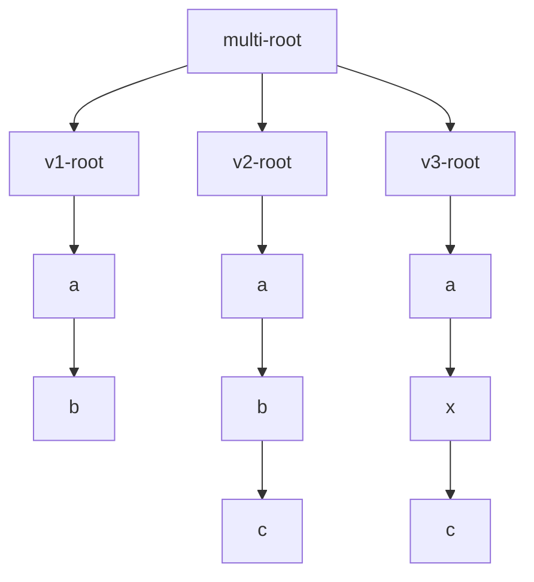

- [Exporting GVE into TEI](#exporting-gve-into-tei)
  - [Stage 1: Preprocessing](#stage-1-preprocessing)
  - [Stage 2: Tree Filtering](#stage-2-tree-filtering)
  - [Stage 3: Tree Rendering](#stage-3-tree-rendering)
  - [Stage 4: Text Filtering](#stage-4-text-filtering)

# Exporting GVE into TEI

This section describes the rendering [pipeline](index#pipeline) used to export GVE snapshots into TEI.

## Stage 1: Preprocessing

As seen about the [pipeline](index.md#pipeline), this first stage is the only one which is specific to GVE. Once it has been executed, data is in a format which can be used by any text tree renderer, and the rest of the pipeline is generic and reusable. The same approach is used by the [Cadmus export subsystem](export-cadmus).

In GVE, a specialized component (`GveTextTreeBuilder`) is used to build a linear text tree for each text version derived from a [GVE chain](../model/textual.md#chain). At this stage:

- each node in this tree corresponds to a single character, as this is the maximum granularity level simply inherited from the GVE chain.
- each node in the tree contains all or a subset of the features injected into it by operations, plus automatically injected trace features.

The logic of this builder is driven by these parameters:

- **feature names**: when set, only features with names equal to the names in this list are included in the tree.
- **filter inversion**: when enabled, only features with names _not_ present in the list are included in the tree.
- **trace features flattening**: when enabled, trace features linked to nodes are not only drawn from the each processed version, but also from all the previous versions. By definition, trace features do not outlive their version (except for deletions), as they depend on the operation affecting the chain to represent their input and output.
- **include deleted nodes**: when enabled, for each generated version the builder will backtrack to the previous versions one after another, and insert nodes deleted by delete, replace, move, or swap operations at their place, with a delete feature. This relies on trace features: each operation injects segment-in trace features in the input version nodes, representing the nodes selected by it; and segment-out trace features in the output version nodes, representing the nodes produced or affected by it. So, when going backwards, we can find the nodes to insert by selecting nodes with segment-in features produced by operations which delete these segments, e.g. delete, replace, move, swap.

Note that given the multi-dimensional nature of a GVE chain, the builder produces **multiple trees**, one per text version. Each of them will then have to go through the successive stages of filtering and rendering.

In order to adapt this scenario to the pipeline, we need to add a very simple operation at the end of our preprocessing stage. In fact, the pipeline requires a single tree to deal with, while we have many linear trees. So, we just create a new tree having a blank root node, whose children are the root nodes of each of the linear trees representing versions. Each of these root nodes also gets a `sub-id` feature with the version's tag, and an optional `version` feature with the staged version identifier, when there is any.

For instance, if we have 3 text versions (`ab`, `abc`, `axc`), each represented by a separate linear tree, we will merge them into a new tree:

This way, we will be able to process all the versions in a single pipeline.

Given that our pipeline is modular, and any tree filter and renderer components can be chained into it, this implies dealing with the fact that sometimes their input tree might really be a wrapper for multiple trees, where each needs to be processed by the same component. Formally, we have a single input type (a tree) for all the components; yet, in some cases this is really a wrapper for multiple trees, represented as branches of a blank root node.

Of course, having two versions of the same component to accommodate for two different input types (a "single tree" and a "multi-tree") would not be a viable approach. Rather, the solution adopted here is using composition:

- add a generic **composite tree filter**, which can be used to wrap an instance of any tree filter. This simply assumes that its input is a multi-tree, and applies its inner tree filter to each branch stemming from its root node. So, the inner filter being applied to each branch needs to know nothing about the difference between "single" or "multi" trees; it just works on a single linear tree. In this context anyway this linear tree happens to be a branch of a multi-tree. This allows reusing any tree filter component by just wrapping it into this, which in turn is yet another tree filter. Thus, we can freely chain all the filters we want in the pipeline, whether we are dealing with "single" or "multi" trees.
- add a generic **composite tree renderer**, using a similar approach.

## Stage 2: Tree Filtering

Tree filtering usually contains most of the transformation logic towards a specific output. Filters are chained so that each applies a small bit of logic towards the final stage of the pipeline.

A fundamental filter here is the **linear merge filter** (`LinearMergeTextTreeFilter`), usually applied as the first in the chain. This filter merges multiple nodes of a linear tree into a single node, whose text is the concatenation of the text of all the merged nodes. Merging groups are defined by checking node features: all the subsequent nodes having the same set of features (both for their name and their value) are merged into a single node.

Note that you are in charge of defining the features you want to be considered as merging criteria; you can define both their names, and any number of replacement filters for their values.

So, this filter produces a **dynamic segmentation** of the text, where each segment is represented by a single node and its text is linked to the same metadata (features). Rather than positing an a-priori segmentation unit for the whole document (like e.g. when systematically wrapping all the words in elements like `seg` to attach some data to them without knowing in advance the annotation extent), dynamic segmentation merges all the characters having the same set of annotations, whether they are a full sentence, or just a single character, or anything in between. This maximizes efficiency and reduces complexity. We always use the segment with the maximum extent, whatever it is, leveraging full information about the extent of the annotations we selected for export.

## Stage 3: Tree Rendering

Once we have prepared the text tree, we are ready to render it into the desired format. Rendering is done by a component which takes as its input the tree plus the renderer context (an object carrying data used during the pipeline execution), and produces some representation of it.

The output of a tree renderer is not necessarily a string; the reason for this is flexibility. The renderer here adopts a strategy already used by the Proteus conversion system (empowering both GVE and Cadmus exports) in its text filters. There, each text filter internally handles its data with the model it prefers: some of them use a string; others use a string builder (an object type used to optimize the programmatic creation of a string: `StringBuilder`); others use an object representing the model of an XML element (`XElement`); and so forth.

Despite this freedom, text filters concatenation in Proteus is still possible thanks to an adapter layer between each pair of filters, which in turn uses different "plug" services. Each plug service can convert a given type from a string, or into a string. This way, whatever the data type internally used by the filter's implementation, we can still freely chain any of them in the pipeline.

>The adaptation only happens when types don't match. When two consecutive filters work on the same type (like both using `XElement`), no adaptation occurs. In this case, the output from the first filter directly passes to the next filter without any unnecessary conversion. This optimization avoids the performance and potential data loss costs of unnecessarily converting between identical types.

This architecture is especially useful with modules in a pipeline, like in Proteus text filters, because each of them is free to use its best model for the task, and the pipeline can be easily extended with new modules without breaking the existing ones. So, the same approach is applied to text tree renderers: the return type is generic (an `object` or `null`) just like for text filters, because this allows the maximum flexibility in the rendering process. The renderer can return a `string`, an `XElement`, or any other type, and the caller can then decide how to handle it.

Thus, if we are rendering a tree into XML, often the best choice is to use an `XElement` as the output type. This allows us to build a tree of XML elements, which can then be easily manipulated or serialized into a string.

Additionally, this allows to connect the result of rendering to a Proteus pipeline of text filters, which can be used to further refine the output. In fact, that's the last stage in our rendering pipeline.

So, two architectural choices are made here:

- use a **tree structure** to represent text with nodes (each having a text segment data payload), rather than just an array of text segments. This is very useful when we need to manipulate the underlying structure before materializing it into markup like XML, because we can transform the tree to branch at will.
- use a **generic object** as the output type of the renderer, which allows us to use this type-free rendition, followed by a type-free pipeline of filters for further refinement.

## Stage 4: Text Filtering

Finally, and optionally, the result of a tree renderer can be further refined by applying to it a chain of Proteus text filters. These might be as simple as text replacements, or fairly complex bits of logic; whatever their task, it's always designed as a standalone unit of work, often customized via specific options.

After this stage the pipeline has completed, and the result is any text-based output format, often some form of TEI.
