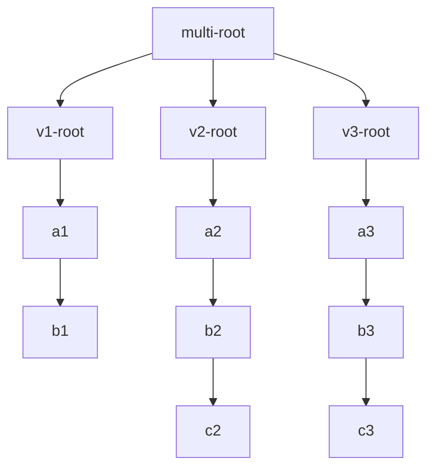
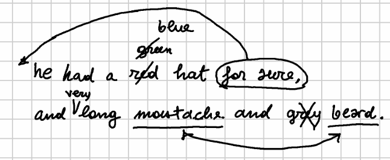

# Export TEI

Exporting TEI from a GVE model uses a refactored version of the [Cadmus rendering subsystem](https://vedph.github.io/cadmus-doc/migration/rendering/rendition.html). The main data flow follows a pipeline leading from the [GVE snapshot](../model/textual.md) to the final result, whether it's some form of TEI or any other format:


Except for the first step, which adapts GVE data to the rendering pipeline, this is shared with the Cadmus rendering subsystem, typically (but not only) used to export multi-layered text into various forms of TEI.

We can devise 4 main stages in the pipeline flow:

1. **preprocessing**: adapt the input to the model used by the first part of the pipeline (in this case using a _tree builder_), i.e. a "linear tree". This is a tree structure having a single branch and starting with a blank root node. Every text segment being processed is represented by a node; and each node is child of the node with the previous segment, and parent of the node with the next one. So, at start this tree is functionally like an array: we just have a sequence of segments. Yet, in the next stages the tree may branch and transform as required by the desired output.
2. **tree filtering**: the tree passes through any number of _tree filters_, which can freely transform it. Each filter has a tree as its input, and the same tree or a new one as its output. The output of each filter will thus be the input for the next one.
3. **tree rendering**: the tree structure is materialized into some text-based output format, using a _tree renderer_. This receives the filtered tree as its input, and outputs an object whose type depends on the renderer: it might be a string, an object representing an XML element, etc.
4. **text filtering**: the output is optionally further refined by passing through a sequence of _text filters_. Despite their name, these filters are free to represent their object in the way it best fits their task. For instance, some of them just look at the text as a string, while others may look at it as an XML element using a structured object to represent it.

## Stage 1: Preprocessing

As already remarked, this first stage is the only one which is specific to GVE. Once it has been executed, data is in a format which can be used by any text tree renderer, and the rest of the pipeline is generic and reusable. The same approach is used by the Cadmus export subsystem.

In GVE, a specialized component (`GveTextTreeBuilder`) is used to build a linear text tree for each text version derived from a GVE chain. At this stage:

- each node in this tree corresponds to a single character, as this is the maximum granularity level inherited from the GVE chain.
- each node in the tree contains all or a subset of the features injected into it by operations, plus automatically injected trace features.

The logic of this builder is driven by these parameters:

- **feature names**: when set, only features with names equal to the names in this list are included in the tree.
- **filter inversion**: when enabled, only features with names _not_ present in the list are included in the tree.
- **trace features flattening**: when enabled, trace features linked to nodes are not only drawn from the each processed version, but also from all the previous versions. By definition, trace features do not outlive their version (except for deletions), as they depend on the operation affecting the chain to represent their input and output.
- **include deleted nodes**: when enabled, for each generated version the builder will backtrack to the previous versions one after another, and insert nodes deleted by delete, replace, move, or swap operations at their place, with a delete feature. This relies on trace features: each operation injects segment-in trace features in the input version nodes, representing the nodes selected by it; and segment-out trace features in the output version nodes, representing the nodes produced or affected by it. So, when going backwards, we can find the nodes to insert by selecting nodes with segment-in features produced by operations which delete these segments, e.g. delete, replace, move, swap.

Note that given the multi-dimensional nature of a GVE chain, the builder produces **multiple trees**, one per text version. Each of them will then have to go through the successive stages of filtering and rendering.

In order to adapt this scenario to the pipeline, a very simple operation is added at the end of our preprocessing stage: as the pipeline requires a single tree to deal with, while we have many linear trees, we just create a new tree having a blank root node, whose children are the root nodes of each of the linear trees representing versions. Each of these root nodes also gets a `v` feature with the version's tag.

For instance, if we have 3 versions, each represented by a separate linear tree, we will merge them into a new tree:



This way, we will be able to process all the versions in a single pipeline.

Anyway, given that our pipeline is modular, and any tree filter and renderer components can be chained into it, this implies dealing with the fact that sometimes their input tree might really be a wrapper for multiple trees, where each needs to be processed by the same component. Formally we have a single input type for all the components: a tree; yet, in some cases this is really a wrapper for multiple trees, represented as branches of a blank root node.

Of course, having two versions of the same component to accommodate for two different input types (a "single tree" and a "multi-tree") would not be a viable approach. Rather, the approach is:

- add a generic **composite tree filter**, which can be used to wrap an instance of any tree filter. This simply assumes that its input is a multi-tree, and applies its inner tree filter to each branch stemming from its root node. So, the inner filter being applied to each branch needs to know nothing about the difference between "single" or "multi" trees; it just works on a single linear tree. In this context anyway this linear tree happens to be a branch of a multi-tree. This allows reusing any tree filter component by just wrapping it into this, which in turn is yet another tree filter. Thus, we can freely chain all the filters we want in the pipeline, whether we are dealing with "single" or "multi" trees.
- add a generic **composite tree renderer**, inspired by the same approach.

## Stage 2: Tree Filtering

Tree filtering usually contains most of the transformation logic towards a specific output. Filters are chained so that each applies a small bit of logic towards the final stage of the pipeline.

A fundamental filter here is the linear merge filter (`LinearMergeTextTreeFilter`), usually applied as the first in the chain. This filter merges multiple nodes of a linear tree into a single node, whose text is the concatenation of the text of all the merged nodes. Merging groups are defined by checking node features: all the subsequent nodes having the same set of features (both for their name and their value) are merged into a single node.

Note that you are in charge of defining the features you want to be considered as merging criteria; you can define both their names, and any number of replacement filters for their values.

So, this filter produces a **dynamic segmentation** of the text, where each segment is represented by a single node and its text is linked to the same metadata (features). Such segmentation provides maximum efficiency for the subsequent rendering, because we always use the segment with the maximum extent, whatever it is, from a single character to hundreds of them.

## Stage 3: Tree Rendering

Once we have prepared the text tree, we are ready to render it into the desired format. Rendering is done by a component which takes the tree plus the renderer context (an object carrying data used during the pipeline execution), and produces some representation of it.

The output of a tree renderer is not necessarily a string; the reason for this is flexibility. The renderer here adopts a strategy already used by the Proteus conversion system (empowering both GVE and Cadmus exports) in its text filters. There, each text filter internally handles its data with the model it prefers: some of them use a string; others use a string builder (an object used to optimize the programmatic creation of a string: `StringBuilder`); others use an object representing the model of an XML element (`XElement`); and so forth.

Despite this freedom, text filters concatenation in Proteus is still possible thanks to an adapter layer between each pair of filters, which in turn uses different "plug" services. Each plug service can convert a given type from a string or into a string. This way, whatever the data type internally used by the filter's implementation, we can still freely chain any of them in the pipeline.

>The adaptation only happens when types don't match. When two consecutive filters work on the same type (like both using `XElement`), no adaptation occurs. In this case, the output from the first filter passes directly to the next filter without any unnecessary conversion. This optimization avoids the performance and potential data loss costs of converting between identical types unnecessarily.

This architecture is especially useful with modules in a pipeline, like in Proteus text filters, because each of them is free to use its best model for the task, and the pipeline can be easily extended with new modules without breaking the existing ones. So, the same approach is applied to text tree renderers: the return type is generic (an `object` or `null`) just like for text filters, because this allows the maximum flexibility in the rendering process. The renderer can return a `string`, an `XElement`, or any other type, and the caller can then decide how to handle it.

Thus, if we are rendering a tree into XML, often the best choice is to use an `XElement` as the output type. This allows us to build a tree of XML elements, which can then be easily manipulated or serialized into a string.

Additionally, this allows to connect the result of rendering to a Proteus pipeline of text filters, which can be used to further refine the output. In fact, that's the last stage in our rendering pipeline.

So, two architectural choices are made here:

- use a **tree structure** to represent text with nodes (each having a text segment data payload), rather than just an array of text segments. This is very useful when we need to manipulate the underlying structure before materializing it into markup like XML, because we can transform the tree to branch at will.
- use a **generic object** as the output type of the renderer, which allows us to use this type-free rendition, followed by a type-free pipeline of filters for further refinement.

## Stage 4: Text Filtering

Finally, and optionally, the result of a tree renderer can be further refined by applying to it a chain of Proteus text filters. These might be as simple as text replacements, or fairly complex bits of logic; whatever their task, it's always designed as a standalone unit of work, often customized via specific options.

After this stage the pipeline has completed, and the result is any text-based output format, often some form of TEI.

## Example

Let us see a sample illustrating this process using a simple pipeline with a short mock autograph text, represented by Figure 1:


The base text (version `v0`), written on the regular lines of the notebook, is just three words:

```txt
123456789
a red pen
```

Say that our interpretation defines the following operations starting from the base text, which is the one first written down on the regular notebook lines (after each operation I add the more formal representation of the operation in its DSL syntax):

1. (`v0`>`v1`): delete `red` + space: `"3x4- [*log="delete 'red '"]`.
2. (`v1`>`v2`): replace `pen` with `hat`: `7x3="hat" [*log="replace 'pen' with 'hat'"]`.
3. (`v2`>`v3`): replace `hat` with `cat`: `10x3="cat" [*log="replace 'hat' with 'cat'"]`.
4. (`v3`>`v4`): insert `nice` + space before `cat`: `13+["nice " [*log="insert 'nice ' before 'cat'"]`.
5. (`v4`>`v5`): swap `nice` with `cat`: `16x4<>13x3 [*log="swap 'nice' with 'cat'"]`.
6. (`v5`>`v6`): insert `is` + space before `nice`: `16+["is " [*log="insert 'is ' before 'nice'"]`.

These operations generate the following text versions:

- `v1`: `a pen`
- `v2`: `a hat`
- `v3`: `a cat`
- `v4`: `a nice cat`
- `v5`: `a cat nice`
- `v6`: `a cat is nice`

>As usual, note that these are just the outputs of each operation. Every operation alters the text along the path leading from one staged version to the next; so many of the outputs are just intermediate steps along this path. This is clearly the case especially when the output does not make sense, like in `v5`. For instance, on the basis of external information here one might consider as staged versions just `v4` and `v6`. This is of course a matter of interpretation, within the constraints defined by the snapshot.

TODO

As an example, say we want to get a TEI output where, for a given text (an epigram, a page, etc.):

1. all the versions are inside an `app` element;
2. in `app`, each version is inside a `lem` or `rdg` element;
3. in `lem`/`rdg`, a `mod` contains more metadata about the version (in attributes);
4. in `mod`, we use `del`, `add`, or `subst` as customary in TEI critical.

This is the structure used by the Saba edition, and thus can be displayed in EVT 3.

## Procedure

### 1. Operations

We start with the GVE model recipe, i.e. the base text and its operations. That's our model, the _snapshot_. This time, we use them to directly generate a tree structure for each staged version:

- build a linear tree from base text (v0) having a blank root node.
- for each operation:
  - if it's INS: add new nodes with features `$ins`=`OPID N` (`OPID`=operation ID, `N`=operation number), and operation-injected features;
  - if it's DEL: mark deleted nodes with features `$del` (as for `$ins`) and operation-injected features;
  - if it's REP/MOV: DEL and INS;
  - if it's SWP: DEL and INS for 1st segment, DEL and INS for 2nd segment;
  - if it's ANN: add operation-injected features.

All the globally-injected features are stored in the root node.

This results into a linear tree structure where each node is a single character and has all the injected features, plus these trace-like features starting with `$`. Of course, we will need a separate tree for each staged version, rather than a single graph like in the chain; but the model behind these structures is the same, and it works in the same way.

As an example, let us consider this mock autograph:



The base text, written on the regular lines of the notebook, is:

```txt
         10        20        30        40        50
123456789-123456789-123456789-123456789-123456789-123456789-1
he had a red hat for sure,|and long moustache and grey beard.
```

Say that our interpretation defines the following operations starting from the base text, which is the one first written down on the regular notebook lines:

1. insert "very " before "long": `32+["very " [*log="insert 'very ' before 'long'"]` (`v1`);
2. replace "red" with "green": `10x3="green" [*log="replace 'red' with 'green'"]` (`v2`);
3. delete "grey": `51x5- [*log="delete grey" *version^="A"]` (`v3`, staged as `A`);
4. move "for sure," before "he": `18x9>[1@fs [*log="move 'for sure,' before 'he'"]` (`v4`);
5. delete tail space: `17-@fs [*log="delete tail ' '"]` (`v5`);
6. insert space before "he": `1+[" "@fs [*log="insert space before 'he'"]` (`v6`);
7. swap moustache/beard: `37x9<>56x5 [*log="swap 'moustache' / 'beard'" *version^="B"]` (`v7`, staged as `B`).

From base text we get this tree:

1. root node;
2. nodes for `he had a red hat for sure,|and long moustache and grey beard.`.

We then run the operations:

1. insert "very" before "long": `he had a red hat for sure,|and [very ]long moustache and grey beard.`.
2. replace "red" with "green": `he had a [×red][green] hat for sure,|and [very ]long moustache and grey beard.`
3. delete "grey": `he had a [×red][green] hat for sure,|and [very ]long moustache and [×grey] beard.`
4. move "for sure," before "he": `[for sure,]he had a [×red][green] hat [×for sure,]|and [very ]long moustache and [×grey] beard.`
5. delete tail space: `[for sure,]he had a [×red][green] hat[× ][×for sure,]|and [very ]long moustache and [×grey] beard.`
6. insert space before "he": `[for sure,][ ]he had a [×red][green] hat[× ][×for sure,]|and [very ]long moustache and [×grey] beard.`
7. swap moustache/beard: `[for sure,][ ]he had a [×red][green] hat[× ][×for sure,]|and [very ]long [×moustache][beard] and [×grey] [×beard][moustache].`

To keep the example short, say that we are interested in exporting the final version only; anyway, whatever the number of versions the procedure is the same.

The next step is segmenting the text, i.e. merging nodes to create the maximum-length spans of texts sharing the same set of annotations.

## 2. Segmentation

For segmentation we must define which injected features are relevant. This is up to the user, and depends on the markup we want to generate. Trace features instead are always relevant because they define the text which works as the basis for markup.

First, we filter the tree so that we remove annotations on any whitespace nodes. This avoids redundant annotations, whence this tree (each character is a node, and we wrap annotated characters in `[...]` for `$ins` or `[×...]` for `$del`):

```txt
[for sure,] he had a [×red][green] hat [×for sure,]|and [very] long [×moustache][beard] and [×grey] [×beard][moustache].
```

The procedure is:

- let node = root's child node;
- do:
  - let start = node;
  - collect node's relevant features in a set;
  - while node's child (if any) is whitespace, or has the same set, move to it by setting node=node's child (after moving, stop if the node was LF, to preserve line breaks at segment end);
  - if node is not start, set start's text to the string resulting from appending the text of all the nodes from start to the last collected node, and remove all the collected nodes except start. This has the effect of merging all the collected nodes into one, with a longer text, which is the maximum span of text having the same relevant features;
  - node = child (if any) of last collected node: if no more children, stop; else continue the loop.

>The whitespace condition is due to the filter we applied, which removed features from whitespace characters. Such characters are considered as neutral for features, so they always match, or we would risk to break a segment too early.

So, for our example, we get these nodes (OPID are really GUID-like strings, but I am just reporting their ordinal number for simplicity):

1. root;
2. `for sure,`: `$ins` OPID 4;
3. ` he had a `;
4. `red`: `$del` OPID 2;
5. `green`: `$ins` OPID 2;
6. ` hat `
7. `for sure,`: `$del` OPID 4;
8. `and` + space
9. `very`: `$ins` OPID 1;
10. ` long `
11. `moustache`: `$del` OPID 7;
12. `beard`: `$ins` OPID 7;
13. ` and `
14. `grey`: `$del` OPID 3;
15. `beard`: `$del` OPID 7;
16. `moustache`: `$ins` OPID 7;
17. `.`.

Note that this procedure, as usual in our approach, leverages a _dynamic_ segmentation process, where we do not set any specific segmentation unit in advance. We just calculate the best unit for the most efficient and compact output during export.

At the end of this segmentation process, our linear tree structure has not changed, but in most cases it now contains less nodes, because of merging. We can now proceed to materialize this structure into markup.

### 3. Materialization

This materializes the tree into markup:

- at the root node add `app` with child `lem` (in our case the final version is the "preferred" one) with child `mod`, with all the metadata you might want to encode;
- let node = root's child node;
- pop all the stack elements corresponding to OPID which are no longer present in node's features;
- if required, push a block element (e.g. `l`, `p`...) as child of `app`;
- do:
  - examine node's features:
    - `$ins`: push an `ins` element with its attributes;
    - `$del`: if next segment has a `$ins` with the same OPID, push a `subst`; then, push a `del` element with its attributes;
  - if node's text ends with LF and we are using a block, pop the whole stack and the block element if required; then, push the popped stack back recreating all the elements which were in it before closing the block;
  - node = node's child, stop if no child.

So for our example (I am just writing the essential markup here, without detailed metadata or custom renditions; also, I assume `l` as block element):

```xml
<app>
  <!-- previous versions would go here when we want them... -->
  <lem>
    <mod>
      <ins>for sure,</ins> he had a <subst><del>red</del><ins>green</ins></subst> hat <del>for sure,</del>and <ins>very</ins> long <subst><del>moustache</del><ins>beard</ins></subst> and <del>grey</del><subst><del>beard</del><ins>moustache</ins></subst>.
    </mod>
  </lem>
</app>
```

If we just represent the text with strikethrough for deletions and bold for insertions we get this:

**for sure**, he had a ~~red~~**green** hat ~~for sure,~~and **very** long ~~moustache~~**beard** and ~~grey~~~~beard~~**moustache**.
