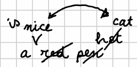

# Export GVE into TEI

This section describes the rendering pipeline used for GVE data sources.

## Stage 1: Preprocessing

As seen about the [pipeline](index.md#pipeline), this first stage is the only one which is specific to GVE. Once it has been executed, data is in a format which can be used by any text tree renderer, and the rest of the pipeline is generic and reusable. The same approach is used by the Cadmus export subsystem.

In GVE, a specialized component (`GveTextTreeBuilder`) is used to build a linear text tree for each text version derived from a GVE chain. At this stage:

- each node in this tree corresponds to a single character, as this is the maximum granularity level inherited from the GVE chain.
- each node in the tree contains all or a subset of the features injected into it by operations, plus automatically injected trace features.

The logic of this builder is driven by these parameters:

- **feature names**: when set, only features with names equal to the names in this list are included in the tree.
- **filter inversion**: when enabled, only features with names _not_ present in the list are included in the tree.
- **trace features flattening**: when enabled, trace features linked to nodes are not only drawn from the each processed version, but also from all the previous versions. By definition, trace features do not outlive their version (except for deletions), as they depend on the operation affecting the chain to represent their input and output.
- **include deleted nodes**: when enabled, for each generated version the builder will backtrack to the previous versions one after another, and insert nodes deleted by delete, replace, move, or swap operations at their place, with a delete feature. This relies on trace features: each operation injects segment-in trace features in the input version nodes, representing the nodes selected by it; and segment-out trace features in the output version nodes, representing the nodes produced or affected by it. So, when going backwards, we can find the nodes to insert by selecting nodes with segment-in features produced by operations which delete these segments, e.g. delete, replace, move, swap.

Note that given the multi-dimensional nature of a GVE chain, the builder produces **multiple trees**, one per text version. Each of them will then have to go through the successive stages of filtering and rendering.

In order to adapt this scenario to the pipeline, a very simple operation is added at the end of our preprocessing stage: as the pipeline requires a single tree to deal with, while we have many linear trees, we just create a new tree having a blank root node, whose children are the root nodes of each of the linear trees representing versions. Each of these root nodes also gets a `v` feature with the version's tag.

For instance, if we have 3 text versions (`ab`, `abc`, `axc`), each represented by a separate linear tree, we will merge them into a new tree:


This way, we will be able to process all the versions in a single pipeline.

Anyway, given that our pipeline is modular, and any tree filter and renderer components can be chained into it, this implies dealing with the fact that sometimes their input tree might really be a wrapper for multiple trees, where each needs to be processed by the same component. Formally we have a single input type for all the components: a tree; yet, in some cases this is really a wrapper for multiple trees, represented as branches of a blank root node.

Of course, having two versions of the same component to accommodate for two different input types (a "single tree" and a "multi-tree") would not be a viable approach. Rather, the approach is:

- add a generic **composite tree filter**, which can be used to wrap an instance of any tree filter. This simply assumes that its input is a multi-tree, and applies its inner tree filter to each branch stemming from its root node. So, the inner filter being applied to each branch needs to know nothing about the difference between "single" or "multi" trees; it just works on a single linear tree. In this context anyway this linear tree happens to be a branch of a multi-tree. This allows reusing any tree filter component by just wrapping it into this, which in turn is yet another tree filter. Thus, we can freely chain all the filters we want in the pipeline, whether we are dealing with "single" or "multi" trees.
- add a generic **composite tree renderer**, inspired by the same approach.

## Stage 2: Tree Filtering

Tree filtering usually contains most of the transformation logic towards a specific output. Filters are chained so that each applies a small bit of logic towards the final stage of the pipeline.

A fundamental filter here is the linear merge filter (`LinearMergeTextTreeFilter`), usually applied as the first in the chain. This filter merges multiple nodes of a linear tree into a single node, whose text is the concatenation of the text of all the merged nodes. Merging groups are defined by checking node features: all the subsequent nodes having the same set of features (both for their name and their value) are merged into a single node.

Note that you are in charge of defining the features you want to be considered as merging criteria; you can define both their names, and any number of replacement filters for their values.

So, this filter produces a **dynamic segmentation** of the text, where each segment is represented by a single node and its text is linked to the same metadata (features). Such segmentation provides maximum efficiency for the subsequent rendering, because we always use the segment with the maximum extent, whatever it is, from a single character to hundreds of them.

## Stage 3: Tree Rendering

Once we have prepared the text tree, we are ready to render it into the desired format. Rendering is done by a component which takes the tree plus the renderer context (an object carrying data used during the pipeline execution), and produces some representation of it.

The output of a tree renderer is not necessarily a string; the reason for this is flexibility. The renderer here adopts a strategy already used by the Proteus conversion system (empowering both GVE and Cadmus exports) in its text filters. There, each text filter internally handles its data with the model it prefers: some of them use a string; others use a string builder (an object used to optimize the programmatic creation of a string: `StringBuilder`); others use an object representing the model of an XML element (`XElement`); and so forth.

Despite this freedom, text filters concatenation in Proteus is still possible thanks to an adapter layer between each pair of filters, which in turn uses different "plug" services. Each plug service can convert a given type from a string or into a string. This way, whatever the data type internally used by the filter's implementation, we can still freely chain any of them in the pipeline.

>The adaptation only happens when types don't match. When two consecutive filters work on the same type (like both using `XElement`), no adaptation occurs. In this case, the output from the first filter passes directly to the next filter without any unnecessary conversion. This optimization avoids the performance and potential data loss costs of converting between identical types unnecessarily.

This architecture is especially useful with modules in a pipeline, like in Proteus text filters, because each of them is free to use its best model for the task, and the pipeline can be easily extended with new modules without breaking the existing ones. So, the same approach is applied to text tree renderers: the return type is generic (an `object` or `null`) just like for text filters, because this allows the maximum flexibility in the rendering process. The renderer can return a `string`, an `XElement`, or any other type, and the caller can then decide how to handle it.

Thus, if we are rendering a tree into XML, often the best choice is to use an `XElement` as the output type. This allows us to build a tree of XML elements, which can then be easily manipulated or serialized into a string.

Additionally, this allows to connect the result of rendering to a Proteus pipeline of text filters, which can be used to further refine the output. In fact, that's the last stage in our rendering pipeline.

So, two architectural choices are made here:

- use a **tree structure** to represent text with nodes (each having a text segment data payload), rather than just an array of text segments. This is very useful when we need to manipulate the underlying structure before materializing it into markup like XML, because we can transform the tree to branch at will.
- use a **generic object** as the output type of the renderer, which allows us to use this type-free rendition, followed by a type-free pipeline of filters for further refinement.

## Stage 4: Text Filtering

Finally, and optionally, the result of a tree renderer can be further refined by applying to it a chain of Proteus text filters. These might be as simple as text replacements, or fairly complex bits of logic; whatever their task, it's always designed as a standalone unit of work, often customized via specific options.

After this stage the pipeline has completed, and the result is any text-based output format, often some form of TEI.

## Example 1

Let us see a sample illustrating this process using a simple pipeline with a short mock autograph text, represented in Figure 1. Of course, that's a totally unrealistic text, but it was created with the aim of including most of the operation types with a few words.



- _Figure 1 - A mock autograph_

The base text (version `v0`), written on the regular lines of the notebook, is just three words:

```txt
123456789
a red pen
```

Say that our interpretation defines the following operations starting from the base text, which is the one first written down on the regular notebook lines (after each operation I add the more formal representation of the operation in its DSL syntax):

1. (`v0`>`v1`): delete `red` + space: `"3x4- [*log="delete 'red '"]`.
2. (`v1`>`v2`): replace `pen` with `hat`: `7x3="hat" [*log="replace 'pen' with 'hat'"]`.
3. (`v2`>`v3`): replace `hat` with `cat`: `10x3="cat" [*log="replace 'hat' with 'cat'"]`.
4. (`v3`>`v4`): insert `nice` + space before `cat`: `13+["nice " [*log="insert 'nice ' before 'cat'"]`.
5. (`v4`>`v5`): swap `nice` with `cat`: `16x4<>13x3 [*log="swap 'nice' with 'cat'"]`.
6. (`v5`>`v6`): insert `is` + space before `nice`: `16+["is " [*log="insert 'is ' before 'nice'"]`.

These operations generate the following text versions:

- `v1`: `a pen`
- `v2`: `a hat`
- `v3`: `a cat`
- `v4`: `a nice cat`
- `v5`: `a cat nice`
- `v6`: `a cat is nice`

>As usual, note that these are just the outputs of each operation. Every operation alters the text along the path leading from one staged version to the next one; so many of the outputs are just intermediate steps along this path. This is clearly the case especially when the output does not make sense, like in `v5`. For instance, on the basis of external information here one might consider as staged versions just `v4` and `v6`. This is of course a matter of interpretation, within the constraints defined by the snapshot.

Tagging the image with numbers should make our interpretation more evident (Figure 2):


- _Figure 2 - Tagged mock autograph_

So, this is the essential data of our snapshot: a base text, and the operations affecting it. We now want to export this into a specific form of TEI, namely the scheme adopted by the Saba 1919 digital edition (which can be displayed in [EVT](http://evt.labcd.unipi.it) 3).

There, for a given multiple-versions text (an epigram, a page, etc.):

1. all the versions are inside an `app` element;
2. in `app`, each version is inside a `lem` (when the version is preferred by the editor) or `rdg` element;
3. in `lem`/`rdg`, a `mod` contains more metadata about the version (in attributes);
4. in `mod`, we use `del`, `add`, or `subst` as customary in the TEI critical module.

Having defined both the start and the desired end of our transformation, let us now proceed with the export pipeline.

### Example 1 - Stage 1

First, we use a tree builder to create a tree from the GVE snapshot. We then compose version trees into a "multi" tree, containing all the branches we want to export. Say we want only to export `v4` and `v6` assuming them as the staged versions, and that we want only trace features (dropping log features, in this example).

>As remarked, when building the tree you can select the features you want in or out of the resulting nodes. Of course this depends on the annotations you will be using in generating the output. In this case we have no other metadata we are interested in; but there might be other cases where operations inject more metadata about e.g. other authors or revisors, ink types, etc. Any selected feature will be carried by its node, and pass through filters unless these are designed to affect them.

Also, we need to restore the deleted nodes into the exported trees, because we are going to need them in our desired TEI format. So, we just configure the builder accordingly via its options.

The dump for the linear tree built for `v4` is:

```txt
+ ⯈ [1.1]
 + ⯈ [2.1] → #1: a
  + ⯈ [3.1] → #2:  
   + ⯈ [4.1] → #16: n ($seg-out="fdf91da3b9 v3:v4 1", $seg-in="9dcb36963d v4:v5 1")
    + ⯈ [5.1] → #17: i ($seg-out="fdf91da3b9 v3:v4 2", $seg-in="9dcb36963d v4:v5 2")
     + ⯈ [6.1] → #18: c ($seg-out="fdf91da3b9 v3:v4 3", $seg-in="9dcb36963d v4:v5 3")
      + ⯈ [7.1] → #19: e ($seg-out="fdf91da3b9 v3:v4 4", $seg-in="9dcb36963d v4:v5 4")
       + ⯈ [8.1] → #20:   ($seg-out="fdf91da3b9 v3:v4 5")
        + ⯈ [9.1] → #3: r ($del="723a2d3720 v0:v1 1")
         + ⯈ [10.1] → #4: e ($del="723a2d3720 v0:v1 2")
          + ⯈ [11.1] → #5: d ($del="723a2d3720 v0:v1 3")
           + ⯈ [12.1] → #6:   ($del="723a2d3720 v0:v1 4")
            + ⯈ [13.1] → #7: p ($del="dc16589efc v1:v2 1")
             + ⯈ [14.1] → #8: e ($del="dc16589efc v1:v2 2")
              + ⯈ [15.1] → #9: n ($del="dc16589efc v1:v2 3")
               + ⯈ [16.1] → #10: h ($del="5292f1f888 v2:v3 1")
                + ⯈ [17.1] → #11: a ($del="5292f1f888 v2:v3 2")
                 + ⯈ [18.1] → #12: t ($del="5292f1f888 v2:v3 3")
                  + ⯈ [19.1] → #13: c ($seg2-in="9dcb36963d v4:v5 1", $seg-out="5292f1f888 v2:v3 1", $anchor="fdf91da3b9 v3:v4")
                   + ⯈ [20.1] → #14: a ($seg2-in="9dcb36963d v4:v5 2", $seg-out="5292f1f888 v2:v3 2")
                    - ■ [21.1] → #15: t ($seg2-in="9dcb36963d v4:v5 3", $seg-out="5292f1f888 v2:v3 3")
```

Here, each node is listed in a line, including its data payload after the right arrow: the node's ID, its text value, and its optional features in brackets. Note that trace features, all starting with `$`, were automatically injected by operations.

>Note that, as explained, trace feature values have always the form `OPID TAGIN:TAGOUT NR`, where `OPID`=operation ID, `TAGIN`=input version tag, `TAGOUT`=output version tag, and `NR`=ordinal number of the node in the segment selected by the operation. As for feature names, `$seg-in` represents a node selected by the operation as its input; `$seg-out` a node selected by the operation as its output; `$del` a deleted node. Names with `$seg2...` are the same, but refer to the second segment of a swap operation, which by definition deals with two distinct segments.

This is a linear tree, with a single branch starting from a blank node, and having a child node for each successive character. Here is the corresponding dump for `v6`:

```txt
+ ⯈ [1.1]
 + ⯈ [2.1] → #1: a
  + ⯈ [3.1] → #2:  
   + ⯈ [4.1] → #16: n ($del="9dcb36963d v4:v5 1")
    + ⯈ [5.1] → #17: i ($del="9dcb36963d v4:v5 2")
     + ⯈ [6.1] → #18: c ($del="9dcb36963d v4:v5 3")
      + ⯈ [7.1] → #19: e ($del="9dcb36963d v4:v5 4")
       + ⯈ [8.1] → #3: r ($del="723a2d3720 v0:v1 1")
        + ⯈ [9.1] → #4: e ($del="723a2d3720 v0:v1 2")
         + ⯈ [10.1] → #5: d ($del="723a2d3720 v0:v1 3")
          + ⯈ [11.1] → #6:   ($del="723a2d3720 v0:v1 4")
           + ⯈ [12.1] → #7: p ($del="dc16589efc v1:v2 1")
            + ⯈ [13.1] → #8: e ($del="dc16589efc v1:v2 2")
             + ⯈ [14.1] → #9: n ($del="dc16589efc v1:v2 3")
              + ⯈ [15.1] → #10: h ($del="5292f1f888 v2:v3 1")
               + ⯈ [16.1] → #11: a ($del="5292f1f888 v2:v3 2")
                + ⯈ [17.1] → #12: t ($del="5292f1f888 v2:v3 3")
                 + ⯈ [18.1] → #13: c ($seg-out="5292f1f888 v2:v3 1", $anchor="fdf91da3b9 v3:v4", $seg2-in="9dcb36963d v4:v5 1")
                  + ⯈ [19.1] → #14: a ($seg-out="5292f1f888 v2:v3 2", $seg2-in="9dcb36963d v4:v5 2")
                   + ⯈ [20.1] → #15: t ($seg-out="5292f1f888 v2:v3 3", $seg2-in="9dcb36963d v4:v5 3")
                    + ⯈ [21.1] → #20:   ($seg-out="fdf91da3b9 v3:v4 5")
                     + ⯈ [22.1] → #21: i ($seg-out="56e0de97a8 v5:v6 1")
                      + ⯈ [23.1] → #22: s ($seg-out="56e0de97a8 v5:v6 2")
                       + ⯈ [24.1] → #23:   ($seg-out="56e0de97a8 v5:v6 3")
                        + ⯈ [25.1] → #13: c ($del="9dcb36963d v4:v5 1")
                         + ⯈ [26.1] → #14: a ($del="9dcb36963d v4:v5 2")
                          + ⯈ [27.1] → #15: t ($del="9dcb36963d v4:v5 3")
                           + ⯈ [28.1] → #16: n ($seg-out="fdf91da3b9 v3:v4 1", $seg-in="9dcb36963d v4:v5 1", $anchor="56e0de97a8 v5:v6")
                            + ⯈ [29.1] → #17: i ($seg-out="fdf91da3b9 v3:v4 2", $seg-in="9dcb36963d v4:v5 2")
                             + ⯈ [30.1] → #18: c ($seg-out="fdf91da3b9 v3:v4 3", $seg-in="9dcb36963d v4:v5 3")
                              - ■ [31.1] → #19: e ($seg-out="fdf91da3b9 v3:v4 4", $seg-in="9dcb36963d v4:v5 4")
```

So in the end we will have a "multi" tree with a blank root node having 2 branches for `v4` and `v6`:


This tree can now enter the export pipeline.

### Example 1 - Stage 2

The pipeline contains a single tree filter, the _linear merge filter_. This will merge nodes into single nodes representing their text as a single, multiple-characters segment, according to the features we select.

In our example we are interested only in the trace features which help us define the text structure: `$seg-out`, `$seg2-out`, `$del`. This does not mean that other features will be dropped; it just means that they won't be taken into consideration when delimiting the maximum extent of each segment according to its set of relevant features.

So, all the successive nodes sharing the same set of relevant features (here defined as `$seg-out`, `$seg2-out`, `$del`) will be merged into a single node, concatenating their characters into a single text segment.

Note that with "sharing the same set" we mean that, among the features defined as relevant, each merged node must have each feature name and value equal to the corresponding feature in another merged node. Yet, for values we can define filters to consider just a specific portion of them for the purpose of this comparison.

>In our example, we are going to use a single feature value filter, represented by the regular expression `^([^ ]+).*$`, replaced with `$1`. This means that we're going to select only the `OPID` operation ID from the whole value of the trace features. This is required because otherwise we could not merge any nodes given that each of them has a different value for `NR`.

As already remarked, here we need to wrap this filter into a composite filter, because our tree really is just a wrapper for multiple trees, one per version. So, we are going to place in the pipeline a composite filter wrapping a linear merge filter. This will apply the linear merge filter to each sub-tree: `v4` and `v6`.

The result of this filter can be summarized by a new dump (the two sub-trees have been separated by a blank line for more readability):

```txt
+ ⯈ [1.1]

 + ⯈ [2.1] →  (v=v4)
  + ⯈ [3.1] → #1: a 
   + ⯈ [4.1] → #16: nice  ($seg-out="90da420ff9 v3:v4 1", $seg-in="f118ee1cd3 v4:v5 1", $seg-out="90da420ff9 v3:v4 2", $seg-in="f118ee1cd3 v4:v5 2", $seg-out="90da420ff9 v3:v4 3", $seg-in="f118ee1cd3 v4:v5 3", $seg-out="90da420ff9 v3:v4 4", $seg-in="f118ee1cd3 v4:v5 4", $seg-out="90da420ff9 v3:v4 5")
    + ⯈ [5.1] → #3: red  ($del="f3ac775e10 v0:v1 1", $del="f3ac775e10 v0:v1 2", $del="f3ac775e10 v0:v1 3", $del="f3ac775e10 v0:v1 4")
     + ⯈ [6.1] → #7: pen ($del="3b224463a2 v1:v2 1", $del="3b224463a2 v1:v2 2", $del="3b224463a2 v1:v2 3")
      + ⯈ [7.1] → #10: hat ($del="a915b9b07a v2:v3 1", $del="a915b9b07a v2:v3 2", $del="a915b9b07a v2:v3 3")
       - ■ [8.1] → #13: cat ($seg2-in="f118ee1cd3 v4:v5 1", $seg-out="a915b9b07a v2:v3 1", $anchor="90da420ff9 v3:v4", $seg2-in="f118ee1cd3 v4:v5 2", $seg-out="a915b9b07a v2:v3 2", $seg2-in="f118ee1cd3 v4:v5 3", $seg-out="a915b9b07a v2:v3 3")

 + ⯈ [2.2] →  (v=v6)
  + ⯈ [3.1] → #1: a 
   + ⯈ [4.1] → #16: nice ($del="f118ee1cd3 v4:v5 1", $del="f118ee1cd3 v4:v5 2", $del="f118ee1cd3 v4:v5 3", $del="f118ee1cd3 v4:v5 4")
    + ⯈ [5.1] → #3: red  ($del="f3ac775e10 v0:v1 1", $del="f3ac775e10 v0:v1 2", $del="f3ac775e10 v0:v1 3", $del="f3ac775e10 v0:v1 4")
     + ⯈ [6.1] → #7: pen ($del="3b224463a2 v1:v2 1", $del="3b224463a2 v1:v2 2", $del="3b224463a2 v1:v2 3")
      + ⯈ [7.1] → #10: hat ($del="a915b9b07a v2:v3 1", $del="a915b9b07a v2:v3 2", $del="a915b9b07a v2:v3 3")
       + ⯈ [8.1] → #13: cat ($seg-out="a915b9b07a v2:v3 1", $anchor="90da420ff9 v3:v4", $seg2-in="f118ee1cd3 v4:v5 1", $seg-out="a915b9b07a v2:v3 2", $seg2-in="f118ee1cd3 v4:v5 2", $seg-out="a915b9b07a v2:v3 3", $seg2-in="f118ee1cd3 v4:v5 3")
        + ⯈ [9.1] → #20:   ($seg-out="90da420ff9 v3:v4 5")
         + ⯈ [10.1] → #21: is  ($seg-out="8f7c9ffd80 v5:v6 1", $seg-out="8f7c9ffd80 v5:v6 2", $seg-out="8f7c9ffd80 v5:v6 3")
          + ⯈ [11.1] → #13: cat ($del="f118ee1cd3 v4:v5 1", $del="f118ee1cd3 v4:v5 2", $del="f118ee1cd3 v4:v5 3")
           - ■ [12.1] → #16: nice ($seg-out="90da420ff9 v3:v4 1", $seg-in="f118ee1cd3 v4:v5 1", $anchor="8f7c9ffd80 v5:v6", $seg-out="90da420ff9 v3:v4 2", $seg-in="f118ee1cd3 v4:v5 2", $seg-out="90da420ff9 v3:v4 3", $seg-in="f118ee1cd3 v4:v5 3", $seg-out="90da420ff9 v3:v4 4", $seg-in="f118ee1cd3 v4:v5 4")
```

The following diagram summarizes the above dump (I applied the red color to the deleted nodes):


>On passage, note that this defines a segment including only a space (between "cat" and "is"). This is the consequence of the design of the filter's behavior, because that space refers to a different operation and thus has different metadata. Yet, the power of the pipeline approach is right in concatenating small pieces of reusable logic. Should we want to merge this space into the previous segment, we could just concatenate another filter which deals with whitespace-only segments and merges them following some specific logic.

### Example 1 - Stage 3

Once we have our "multi" tree representing our staged versions, we can finally proceed to materialize this abstract structure into TEI markup.

As the tree contains multiple branches, one per sub-tree, we are going to use a composite "Saba" tree renderer. This will wrap a "Saba" tree renderer which, like most filters, just deals with a linear tree.

The logic of a composite renderer is more complex than that of a composite filter though, because the renderer might compose the partial renditions got from its inner component in unpredictable ways. So, we effectively have two distinct components: one is the single "Saba" tree renderer, which can be used also in isolation; another is the composed "Saba" tree renderer, which combines the results of the former into a single `app` element.

The single tree renderer essentially walks the linear branch down, nd after adding a `lem`/`rdg` element with its child `mod` and some metadata, it inspects the trace features of each walked node:

- when it's a delete, add a `subst/del` branch for replace or swap operations, or just `del` for other operation types. This is because we are going to represent the nodes removed by replace or swap to the left of the nodes which replaced them; and in this case we want to wrap both these groups into a `subst` element representing the replacement operations as a deletion paired with an insertion. In both cases, the `del` element's text will be represented by the deleted segment.
- when it's a `seg-out` (or `seg2-out`) feature, add an `ins` element with the inserted segment as its text content. Then, if this has a `subst` ancestor, pop XML elements until we reach the one belonging to the same operation of the `del` element. This ensures that we are properly wrapping each pair of `del`+`ins` under a `subst`.
- when there is no feature, just add the text.

As you can see, the rendition logic here is minimal, because we are at the end of a pipeline where most of the work has already been completed in the previous stages.

The result of this renderer for the two staged versions (`v4` and `v6`) is reported below (I am pretty-printing the code here to make it more readable, even if in the real output no indentation is added inside `mod`):

```xml
<app xmlns="http://www.tei-c.org/ns/1.0">
  <rdg>
    <mod n="v4">a 
      <ins source="oe43f114758">nice </ins>
      <del source="oda74a8a542">red </del>
      <subst source="o1218b2292d">
        <del>pen</del>
        <subst source="ob0f47c5e00">
          <del>hat</del>cat
        </subst>
      </subst>
    </mod>
  </rdg>
  <lem>
    <mod n="v6">a 
      <subst source="od9ab6e69f9">
        <del>nice</del>
        <del source="oda74a8a542">red </del>
        <subst source="o1218b2292d">
          <del>pen</del>
          <subst source="ob0f47c5e00">
            <del>hat</del>cat
            <ins source="oe43f114758"></ins>
          </subst>
        </subst>
        <ins source="o951ad2d17c">is </ins>
        <subst source="od9ab6e69f9">
          <del>cat</del>
          <ins source="oe43f114758">nice</ins>
        </subst>
      </subst>
    </mod>
  </lem>
</app>
```

Of course, this is a simplified rendition to keep the example readable; so we just added a `@n` attribute with the version tag to each `mod`, and a `@source` attribute linking to the corresponding operation. We could easily add much more data, and even think about rendering more features.

So, we got to the end of our pipeline: starting from a GVE snapshot, we ended up with a TEI document fragment which can be easily augmented by adding new filters in stage 4 (e.g. to wrap this result into a full TEI document template, add more metadata to the header, etc.). All the components along the pipeline have access to the rendering context, which keeps a shared state and allows to get data directly from the GVE model itself, and to a logging system, which provides diagnostic details about each rendition stage.
