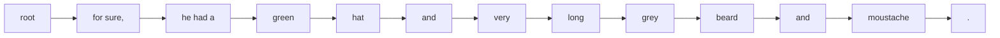

# Exporting to TEI

The Cadmus export subsystem is thus based on these principles:

- the **layered text** consists of a base text, and any number of annotation layers. Each layer contains any number of annotations, and every annotation is linked to a specific portion of the base text, whatever its extent, from a single character to sentences and beyond. There is no constraint at all on the portion of text targeted by an annotation, except that no two annotations belonging to the _same_ layer can overlap. This is consistent with the model, because it can hardly be the case that two annotations belonging to the same knowledge domain overlap; and that's also more compatible with later processing outside Cadmus.

- the user selects which annotation layers to include in the export. It is right this selection which drives a **dynamic text segmentation** process. This is dynamic because we do not start with a predefined granularity level. In TEI practice, especially connected with stand-off, usually this is fixed and corresponds to a word, because we can't know in advance the extent of the text span to be marked. So, the "word" (mostly in graphical sense) is usually the best guess as the "atom" of markup, at least when semantics is the focus. In a Cadmus export instead segmentation is driven by efficiency: we want to maximum possible extent of each portion of text, which is defined by the longest sequence of characters linked to the same annotations from all the selected layers. Segmentation does not happen before annotating text, but after; so we can take advantage of the fact that we know exactly which portions of the text are annotated, and define our segmentation according to them.

Dynamic segmentation in Cadmus is the product of flattening the target spans of text of all the annotations from all layers into a single linear sequence. We then model this sequence as a single-branch tree, where each node corresponds to a segment (except for the root one, which is blank), having the next segment as its child. Once we get this tree, we variously manipulate it to fit to our desired structure, and finally materialize it into TEI markup.

In GVE segmentation is a similar process, but it varies according to the purposes. For instance, a segmentation strategy based on a collected set of nodes is used for rendering a linear text with annotations, while another based on merging versions into trees is used for multi-linear texts explicitly encoded all at once.

## Linear Text

In this approach we want to export a single annotated text for one or more versions. Typically (but this depends on encoding details), each version selected for output will generate a self-standing document.

As per GVE model, we start from a graph where all the text versions exist in the same space and time, and where each node corresponds to a single character. Each of these versions is just the output of an operation (and the input for the next operation). Of course, not all of these outputs are considered a consistent, self-standing version of the text; they are just steps toward it. Only some of these steps are marked as "staged" versions, so that when exporting we focus only on them.

Thus, when exporting we will consider only the base text and all its subsequent staged versions. This means that all the changes applied by operations are accumulated from one staged version to the next one.

Considering that in exporting we are focusing on those portions of text which were subject to changes, for each version we can arrange nodes in a linear sequence, where segmentation is defined by the extent of the text span affected by the operation which generated that version.

So, if an operation replaced "red" with "blue", the resulting version text will have "blue" as a segment. Its metadata will tell us that "blue" derives from "red". All the following operations up to the next staged version will then define their own output segments. These might be located in other parts of the text, or variously overlap with previously defined segments.

This means that the flattening process for GVE should:

1. select the staged versions you want to export. This means selecting the trace `seg-out`/`seg2-out` features which reflect their operation.
2. select the optional features you want to export from nodes.
3. additionally, select specific features attached to nodes for export.

This defines a set of features we are interested in. Now the export process can be executed as follows:

1. from the chain graph, generate all the versions from base text onwards.
2. collect into a set all the nodes with any features matching the selected set. The set being collected contains no duplicates: when a node already exists, we just merge features into it.
3. whenever we get to a selected staged version, we export it as an output text.

To export a text:

1. select all the nodes belonging to its version in their order.
2. build tree: convert this sequence into a linear tree, where a blank root node has descendant nodes with a payload having the node's text and its features.
3. fiter tree: merge multiple tree nodes into single nodes representing segments, according to the features assigned to each node. In this process:
   - never merge when there is a line break;
   - treat grouped `seg-out` or `seg2-out` features as a single one for the purpose of splitting.

At this stage, we can join the Cadmus export pipeline with the filters and the renderer we desire. The renderer will have access to the chain and its operations, so it can query it for any metadata, starting from node features.

Let us show this with a concrete example, short but complex enough to represent many different operations and also a group of operations. Consider this mock autograph:


The base text, written on the regular lines of the notebook, is:

```txt
         10        20        30        40        50
123456789-123456789-123456789-123456789-123456789-123456789-1
he had a red hat for sure,|and long moustache and grey beard.
```

Say that our interpretation defines the following operations starting from the base text, which is the one first written down on the regular notebook lines:

1. insert "very " before "long": `32+["very " [*log="insert 'very ' before 'long'"]` (`v1`);
2. replace "red" with "green": `10x3="green" [*log="replace 'red' with 'green'"]` (`v2`);
3. delete "grey": `51x5- [*log="delete grey" *version^="A"]` (`v3`, staged as `A`);
4. move "for sure," before "he": `18x9>[1@fs [*log="move 'for sure,' before 'he'"]` (`v4`);
5. delete tail space: `17-@fs [*log="delete tail ' '"]` (`v5`);
6. insert space before "he": `1+[" "@fs [*log="insert space before 'he'"]` (`v6`);
7. swap moustache/beard: `37x9<>56x5 [*log="swap 'moustache' / 'beard'" *version^="B"]` (`v7`, staged as `B`).

>Note the group ID `fs` assigned to operations 4-6: this is used to mark the grouped operations as a virtually single macro-operation. In this case, we are moving "for sure," before "he"; this also implies removing the space which separated "hat" from it, because after moving the word "hat" is found at line end, and that space would be redundant. Also, we need to add a space after the comma. This is done by two additional operations, which logically depend on the move operation, and are thus grouped as a whole in a single macro. For variants generation this has no relevance, because all the operation effects get accumulated up to the next staged version; but it will be useful for export.

These operations generate the following versions (staged versions are shown in brackets):

- v1 `he had a red hat for sure,|and [very ]long moustache and grey beard.`
- v2 `he had a [green] hat for sure,|and very long moustache and grey beard.`
- v3 `he had a green hat for sure,|and very long moustache and beard.` (version A)

- v4 `[for sure,]he had a green hat |and very long moustache and beard.`
- v5 `for sure,he had a green hat|and very long moustache and beard.`
- v6 `for sure,[ ]he had a green hat|and very long moustache and beard.`

- v7 `for sure, he had a green hat|and very long [beard] and [moustache].` (version B)

Now, say that we want to export the final version B. If we select just the `seg-out`/`seg2-out` trace features for each version from start to end, and segment the final text according to them, we get this result (where numbers refer to operations and `g` is the macro corresponding to operations 4+5+6):

```txt
for sure, he had a green hat|and very long beard and moustache.
gggggggggg.........22222.........11111.....77777.....777777777.
4-6
```

We also collect deleted nodes (when they aren't just whitespaces):

```txt
grey_
33333
```

This was before `beard`. So, after we have lined up our nodes according to the final version, we insert the deleted text back in its relative position:

```txt
for sure, he had a green hat|and very long grey beard and moustache.
gggggggggg.........22222.........11111.....3333377777.....777777777.
4-6
```

The resulting segments and the corresponding operations linked to them are thus 12 (because as anticipated we never want a segment to include line breaks, so we split `hat|and` in two):

1. `for sure,_`: 4-6
2. `he_had_a_`
3. `green`: 2
4. `_hat|`
5. `and_`
6. `very_`: 1
7. `long_`
8. `grey_`: 3
9. `beard`: 7
10. `_and_`
11. `moustache`: 7
12. `.`



At this stage, we can join the general Cadmus export flow, as we have just defined a very similar input: a linear tree of segment nodes, each linked to zero or more annotations. We can thus go on with the processing pipeline based on tree filters and a final tree renderer, followed by optional text filters.

The details of TEI rendering will depend on the desired output, and will be generated by the tree renderer, once filters have possibly transformed the source tree to best serve the renderer's logic.

In this case, we have defined a tree which can be used to output a _single_ text version (here the final one) with annotations about its genesis. We could repeat this export procedure for each staged version, and get two TEI documents: one for version A, and another for version B. Or, we could also adopt other strategies to represent multiple text versions explicitly, at the cost of higher redundancy and nesting.

## Multilinear Text

In this alternative approach we rather want multiple versions to be explicitly encoded in the same document. At each alternative, the text flow will branch.

Let us start again from the same mock autograph used in the previous section:


In this case, we want to use TEI elements `app`, `lem` and `rdg` to encode branching whenever there is an alternative in the text: `app` will be the branching point, and text branches will continue to flow separately, starting from its children `lem` and `rdg` (or just `rdg` and `rdg` when there is no preferred version).

For reader's sake, here are again the 7 versions encoded by the chain structure (square brackets delimit the nodes marked by output segment features, while `|` represents a newline character):

- v1 `he had a red hat for sure,|and [very ]long moustache and grey beard.`
- v2 `he had a [green] hat for sure,|and very long moustache and grey beard.`
- v3 `he had a green hat for sure,|and very long moustache and beard.` (version A)

- v4 `[for sure,]he had a green hat |and very long moustache and beard.`
- v5 `for sure,he had a green hat|and very long moustache and beard.`
- v6 `for sure,[ ]he had a green hat|and very long moustache and beard.`

- v7 `for sure, he had a green hat|and very long [beard] and [moustache].` (version B)

Here we want a segmentation which minimizes the markup required to represent branching; so, until the text does not branch, it should be shared. The approach is thus different from the one seen above: rather than collecting annotated nodes from versions as the base for our segmentation, we progressively build a tree by adding one version at a time.

TODO
