# Export - Trees

The tree structure is used in the rendering pipeline to represent the text being transformed, up to its materialization performed by a tree renderer. In this context, tree filters are used to transform a text tree into another text tree.

In these trees, each node represents a variable-length portion of the text, variously linked to any number of metadata. The link is implemented by a set of so-called features, which are simple name=value pairs.

Using trees rather than a simple sequence of text blocks allows for more powerful transformations, especially when our target is a format based on the same structure, like TEI or HTML.

In some cases, a GVE chain might be directly projected into trees to represent multiple text versions at a time, even though this implies added redundancy and complexity in comparison with the source graph structure.

In this section I show some examples about this type of projections, which provide practical examples about the benefits of adopting a tree rather than a list: the tree can be used for all the purposes a list could be used for, but also for much more. So, this more capable structure was chosen for the pipeline.

## Projecting Graph

Let us consider the versions produced by our [mock example](sample-arzdc.md):

- v0: ARZDC
- v1: ARDC
- v2: AVDC
- v3: ABDC
- v4: APDC
- v5: APCD
- v6: ABCD

As you can see from its chain, the graph contains 7 different paths we can follow to build all the versions from v0 to v6:

Versions in this graph are multi-dimensional: each path defining a version defines a different direction. The graph is a multi-dimensional representation of linear combinations representing versions. In this graph, it is the metadata attached to each link which guides across the various paths across nodes, thus defining different versions of the same text. This is very compact, because no node (with all its metadata) needs to be duplicated; we just link the same nodes in different ways (or even leave them out, in some paths).

Typically, in this graph's export scenarios it's the nodes which get materialized, as they carry text. Links have no meaning there, because the sequence is defined by the order in which nodes are arranged in a linear text. So, text versions must result from the arrangement of segments corresponding to nodes.

This implies adding at least one constraint to the number of links stemming from a node. This is what happens in a tree structure: there, a node can still have many children nodes, but it can only have a single parent; and it always has one, unless it's the root node.

>The constraint defining the hierarchical tree structure is the same which explains why we can't overlap tags.

In a tree, we can thus start from any of the leaf nodes, those at the bottom of the tree with no children, and traverse the tree upwards, parent after parent. At each node there is no other information required to move, because it's implied that it can have one and one only parent node; so we just move from a node to its parent, and then from that parent to its parent; and so on until we get to the root (which by definition has no parent).

So, the above graph with its seven variants can be transformed into such a tree; but the cost of this operation will be duplicating nodes, because once we are on a branch, we can no longer jump back: we have to go forward in a linear way.

Say we start from v6 `ABCD`, and then we want to add v1 `APCD`. At first, we just start with a single branch, a linear tree:

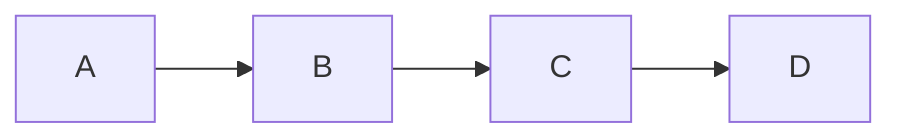

Then we add `APCD`, which implies that `A` now branches into two alternative paths, one starting with `B` and another with `P`:

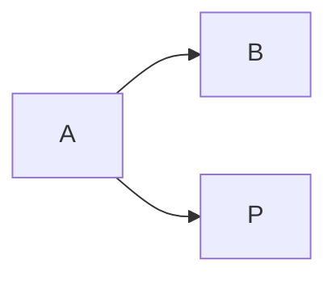

If we follow the first branch, we will have:

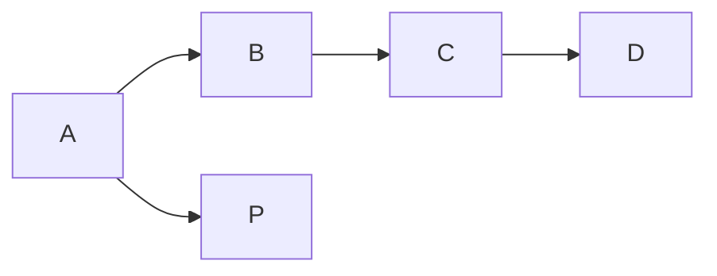

If now we want to follow the second branch, we can't link `P` to the existing `C` node as its parent; because that node already has a parent (`B`), and in a tree we are constrained to a single parent per node. The only choice left is _duplicating_ all the following nodes for the version I want to represent, even though they are all equal:

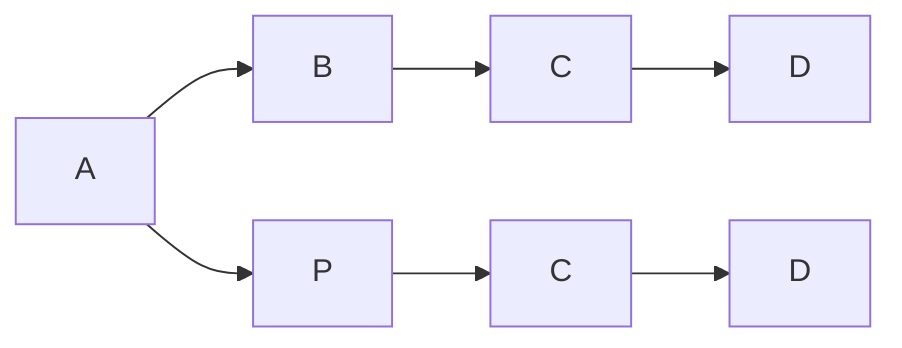

So, with only two versions we already had to duplicate 2 nodes (and their metadata). Anyway, once we have this tree structure, we can start from any leaf node (one of the two `D` in this example), and just go back to build a full linear text version like `ABCD` from the first branch, or `APCD` from the second one. Redundancy is the price to pay for reducing the complexity of traversal operations. In a tree we can either move on the vertical axis (to a sibling, if our tree is drawn left to right like here), or on the horizontal axis (to a child or parent); so starting from a leaf and going backwards we have no choice to make, because there is only a single path to be followed. That's of course the reason behind the tree model for markup like TEI: essentially, we have a linear text (a sequence of characters) which can branch into many children lines, in our case to represent multiple versions of it.

Yet, in the case of markup representing a text with variants (be it a critical text, or an autograph) we hardly deal with atomic segments, like single characters; in most cases, we deal with "words", or even word groups. Text segmentation here depends on what we want to annotate for each segment of text; maybe a single word, or longer, or sometimes even shorter, portions. Of course, while often variants are linked to word segments, this is not always the case; and the more variants we add, the more opportunities for segmentation to vary, even in a way which could hardly be dealt with in this scenario.

In this context, a popular TEI method for representing multiple versions of a text while avoiding overlap is represented by the so-called _parallel segmentation method_ for critical texts. This has also been proposed for the autograph variants as a highly compatible encoding to be consumed in legacy tools.

In this method, the texts compared are split into matching segments in synch with one another, like in our example above with two branches. Whenever there is a branching, we wrap variants in an `app` element, including each one in `rdg` (or in `lem` when this is a preferred variant). This makes it easy to compare different readings side by side, and also to extract the full text of any witness (or version, in our scenario). Of course, its drawback is that this encoding may quickly become highly nested and redundant; and there might be issues when trying to adopt different levels of granularity in segmenting text, because we need to keep the branches in synch.

Apart from segmentation issues anyway, high nesting and redundancy can be mitigated by generating XML encoding via software. At any rate, whatever the encoding strategy for our markup export, we first need to transform our graph into a tree. In turn, there are a couple of transformation strategies we can devise to best prepare our structure for markup rendition. Let us start from the less constrained one, which is thus less distant from our source graph.

### N-ary Tree

To start with, let us see how we can project the graph into a tree without constraining the number of node's children.

Again, consider the above graph for our seven text versions. Let us start from the latest version, v6, which is the "final" stage of our transformations in our reconstruction. This final stage will be our main text line, and each departure from it will produce a branching with two or more lines stemming from it (initially the lines will be two, but others may be added later). Let us follow this procedure, starting from a blank root node to ensure that we have a single root (arrow points to child nodes). So, at start we have a tree with a single root node:

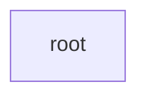

---

(1) **v6**: ABCD: this version is represented by a single lineage: A is child of root, B is child of A, C is child of B, and D is child of C:

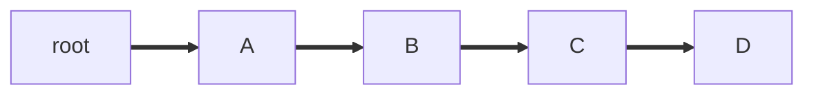

---

(2) **v5**: APCD: again, starting from the root we first find an A child; this is equal to our first A node of APCD, so we keep going along the existing lineage until we find a match. This will reduce nodes redundancy in our projected tree. As soon as we step down to B, we have a mismatch (with P): this defines the parent of this mismatching node as the branching point.

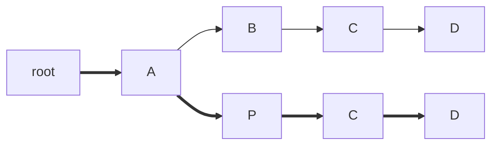

---

(3) **v4**: APDC: starting from the root, we follow matches up to the P node of APCD; this will be our branching node. The new branch will thus be DC:

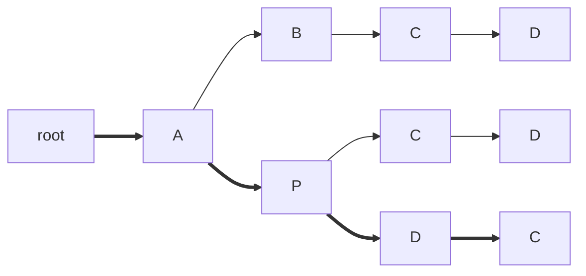

---

(4) **v3**: ABDC: starting from the root, we follow matches up to the B node of AB; this will be our branching node, adding to it the child branch DC:

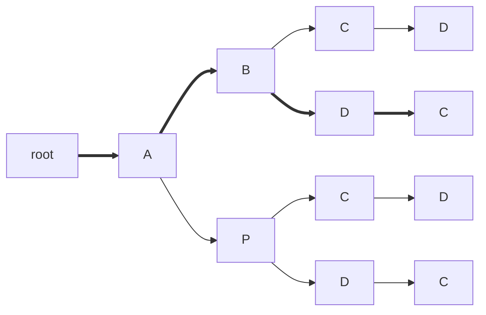

---

(5) **v2**: AVDC: starting from the root, we follow matches up to its A child node. We will thus add a third branch to it, VDC:

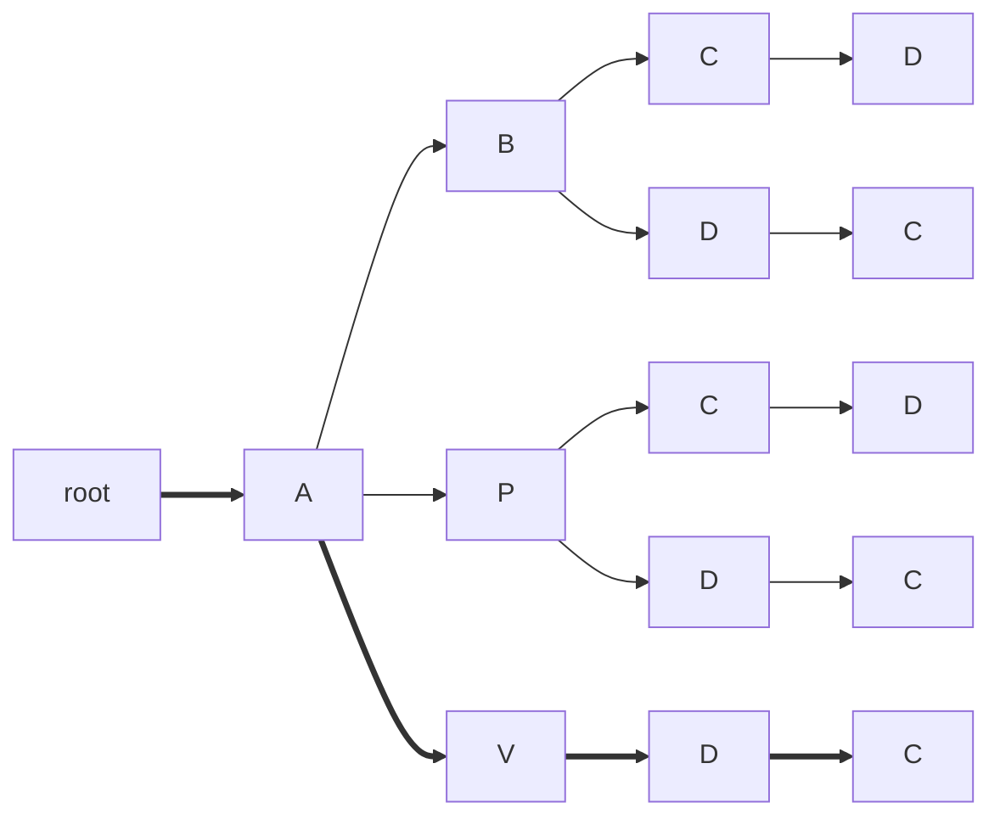

---

(6) **v1**: ARDC: starting from the root, we follow matches up to its A child, as above; its new branch will be RDC:

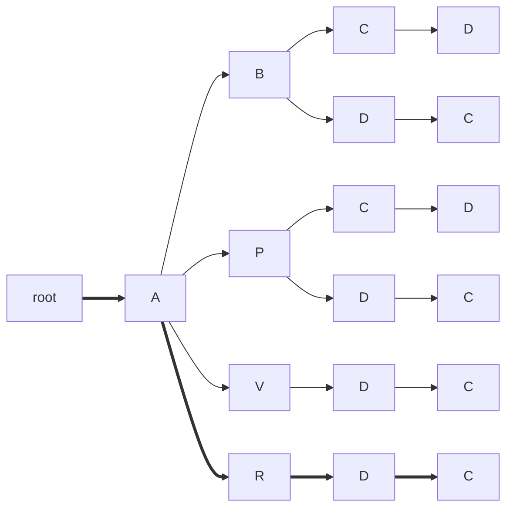

---

(7) **v0**: ARZDC: starting from the root, we follow matches up to its R child, which becomes a new branching node. To this we will add the branch ZDC:

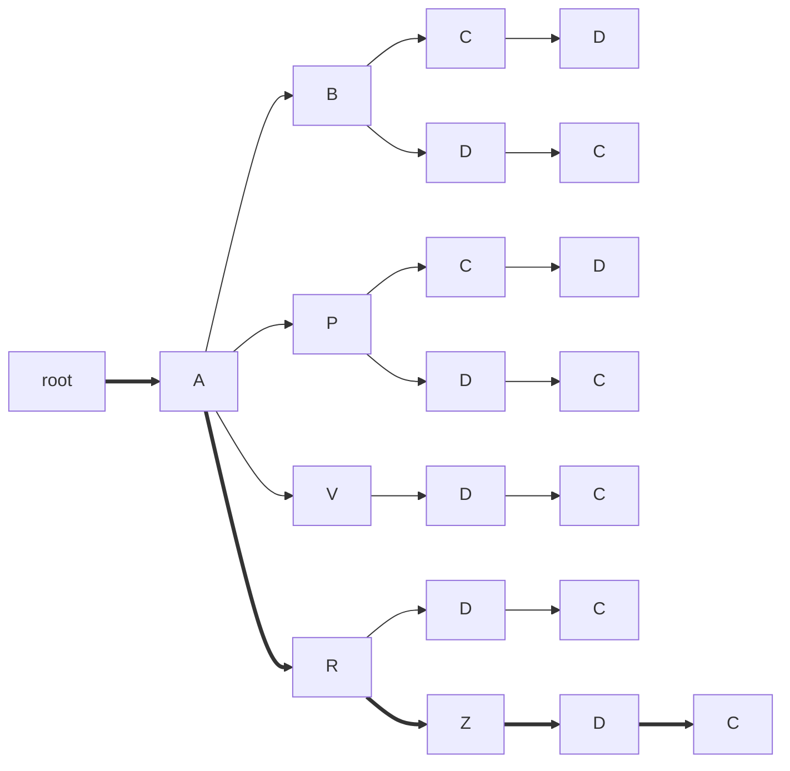

We have now considered all the outputs of the chain graph, building a full path for each, in a trie-like structure. Starting from the root we can follow branches, each corresponding to a version. We are thus representing the same linear combinations as the chain graph, but in a tree-shaped structure, which implies that we have to duplicate nodes. Yet, this structure is now fit to an XML-based rendition.

In fact, if we traverse the tree (depth-first), we get:

- ABCD (v6, as defined by the last, leaf node in this traversal)
- ABDC (v3)
- APCD (v5)
- APDC (v4)
- AVDC (v2)
- ARDC (v1)
- ARZDC (v0)

Of course, this is much more redundant than the source graph: here we use 21 nodes, while the graph just had 8 with no duplication. Yet, we have a more constrained structure where every node can still have multiple children, but only a single parent.

Here is a more compact visualization for this N-ary tree (as generated by the code itself). Note how each version ends with a leaf node:

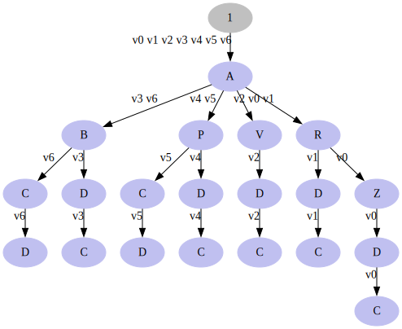

### Binary Tree

Let us now consider an even more constrained tree. In the above tree, we still deal with a lot of branches stemming from each node. This potentially can be an issue for encoding methods like parallel segmentation, as they rely on keeping the segments of each version in synch. The more the versions, the higher the possibilities that segments do not align. Further, when adapting this method to autographs, a typical technique is using a nested binary branching at each `app` element, with two children for two versions being compared. So, to render an XML based on a binary alternative like in the example of `app` including `lem` and `rdg`, we need to further constrain the above structure to allow _at most two children per node_.

So, when more than 2 children would be required, we need to insert a blank fork node, having as first child the original node, and as second child the new one. This blank node will be inserted at the place of the last child of the last maching node, whether it's a node with payload or a blank fork node. With this recursive structure, we can encode as many branches as we want, of course each incurring in the overhead of one additional nesting level.

To make things clearer, let us start as in the previous example:

---

(1) **v6**: ABCD, a single branch: in the tree, each sequence is defined by descendant nodes. So here we start with the first sequence, ABCD, which means that root's child will be A; A's child will be B; B's child will be C; and C's child will be D.

---

(2) **v5**: APCD: we traverse the nodes depth-first, starting from the root, following all the branches so that we reach the maximum number of matching descendants. If we find blank nodes during traversal, we just ignore them and keep moving. The last matching descendant node here is B; as its last child we will add a blank fork node, having as children the descendants of B on one branch, and the new sequence on another one:

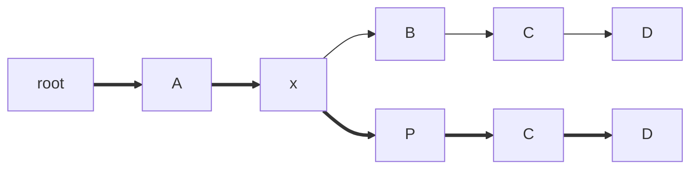

---

(3) **v4**: APDC: we traverse nodes root, A, and blank, up to P, which is the last matching one. We thus move on its child C, and insert a blank fork node at its place. Its first child is C; its second child is the next character of the newly inserted sequence, D. With its child C it forms APDC.

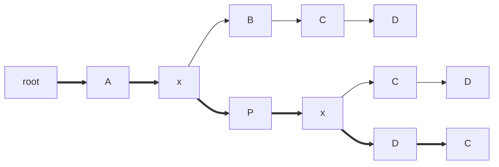

---

(4) **v3**: ABDC: we traverse nodes root, A, blank, and B, which is the last matching node. So we insert a blank fork node as its child, having C as the first child, and the new D as its second one.

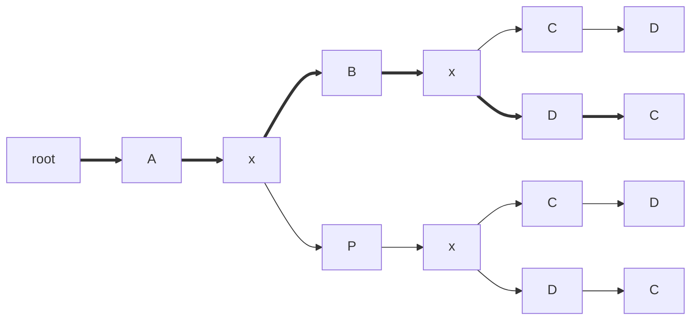

---

(5) **v2**: AVDC: we traverse nodes root, A, and blank, which is the last matching node, because its children are B and P, and neither of them matches V. So again, we replace the last child of the last matching node, here the blank, with a blank fork node, having children P and the new V.

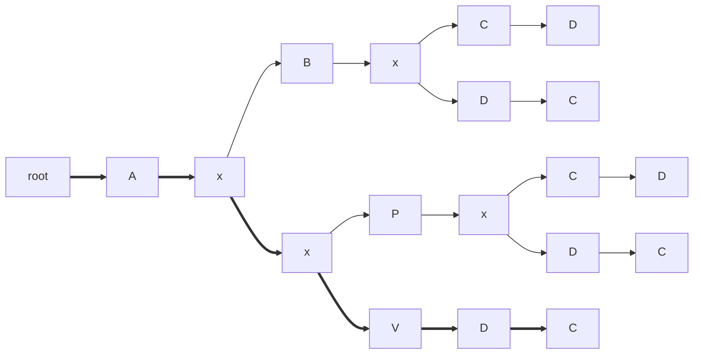

---

(6) **v1**: ARDC: we traverse node A and a blank node (sibling of B), which is the last matching node. So, we insert a blank fork node before it, having as first child the blank with P and V, and as second child the new R node.

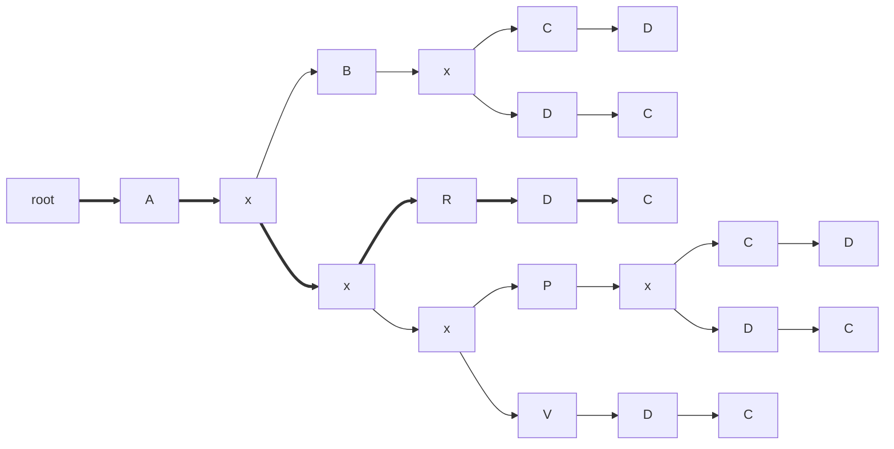

---

(7) **v0**: ARZDC: finally, we traverse node up the last matching one, which is R; we thus insert a blank fork node at the place of its last child (D), having as children D and the new Z.

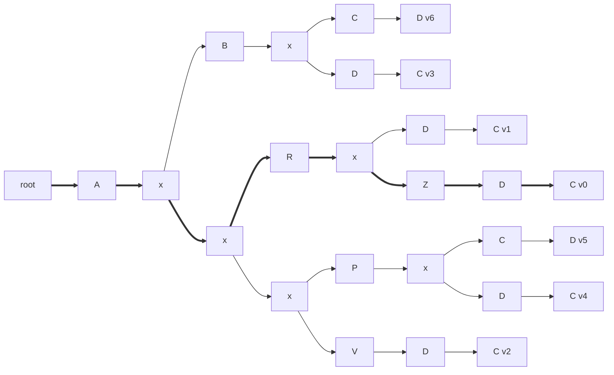

Finally, here is the more compact visualization (as generated by the code itself; here the nodes with a number are the fork blank nodes):

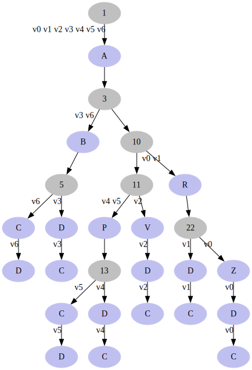

Again, here each leaf corresponds to a version. Blank nodes do not contribute to the text of each version, as they are just fixtures required for building this structure. So, if you follow any version path collecting text from all nodes having it, you still get the seven versions we started from.

Of course, given that this is the most constrained structure, it also is the most redundant. We got 27 nodes, to represent what our graph does with just 8 nodes and no duplicates.
