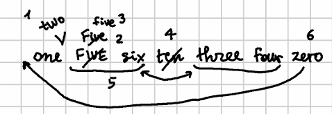
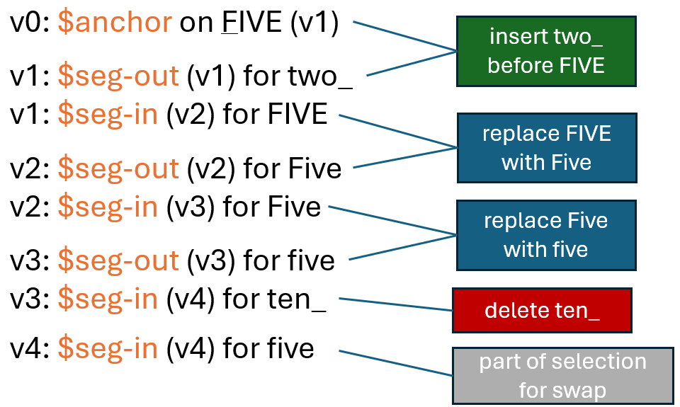
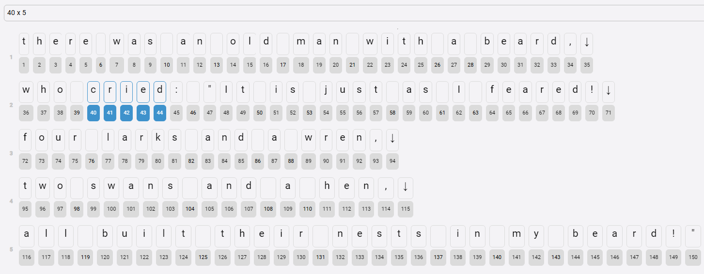

- [Trace Features](#trace-features)
  - [Types](#types)
    - [Replace](#replace)
    - [Delete](#delete)
    - [Add Before/After](#add-beforeafter)
  - [Move Before/After](#move-beforeafter)
  - [Swap](#swap)
  - [Annotate](#annotate)
  - [Simple Example](#simple-example)
  - [Limerick Example](#limerick-example)

# Trace Features

In exporting outputs like TEI, we will need to know which portions of text were changed and how. In the context of a generic export architecture, we prefer a loose coupling between the snapshot model and the export pipeline.

So, in the export pipeline we avoid borrowing logic from the inner workings of the snapshot model. Rather, we want a text with all the annotations required to build our TEI with this additional information.

To this end _trace features_ were introduced in the snapshot core. These are [operation features](../model/textual.md#features) which get automatically injected by each operation to trace its effect on the text being built.

So, for instance a replacement operation will mark with all the characters it is going to replace with a specific trace feature, and all the characters replacing them with another one. The first feature will tell us that those nodes were collected for deletion; the second one that other nodes were added to their place.

Trace features are clearly distinguished from those you are free to add to any operations. All the trace features have these properties:

- their name starts with `$`, a prefix reserved to trace features.
- their value is composite. It always includes operation ID, input and output version, and possibly the segment ordinal number for the features requiring it. All these components are separated by space.
- there can be multiple trace features of the same type. This happens when we have branching, so that e.g. the same node can be the input of two different operations belonging to different branches.
- they are _not_ copied into the next version. So, the lifespan of each trace feature is limited: whenever a new operation is executed, it does not inherit trace features from the previous result.

Thanks to these features, at each version we can see all the nodes affected by the operation which generated it, and connect them to the previous or next versions.

## Types

Currently there are these types of trace features:

- `$seg-in`: input _segment_ (=sequence of _contiguous_ nodes) selected by the operation. Value is `OPID TAGIN:TAGOUT N` where `OPID` is the operation ID, `TAGIN` the input version tag, `TAGOUT` the output version tag, and `N` the ordinal number of the node in the segment captured by the operation.
- `$seg-out`: output segment affected by the operation. Value is the same as `$seg-in`.
- `$seg2-in`: same as `seg-in`, for the second segment in a swap operation.
- `$seg2-out`: same as `seg-out`, for the second segment in a swap operation.
- `$anchor`: marks a single anchor node, used as a reference for add or move operations. The value is like that of segments, except for the final `N` which would not make sense for an anchor. By definition, only a single node can be used as anchor, so there is no need to specify its relative position in a segment.
- `$left-anchor`, `$right-anchor`: anchor nodes set in the node before a deleted segment, and in the node after it (when they are present). Value is `OPID TAGIN:TAGOUT IDLIST` where `IDLIST` is the list of the IDs of the deleted nodes.

>Of course, segments are contiguous in a specific version only. Operations (except for the annotate operation) alter the order of the nodes, and versions are just their output. That's why to ease later processing it is convenient to store the relative position of each node in a segment for every version.

### Replace

- input: the segment to be replaced.
- output: the new segment nodes which replaced the old one.

💡 Example: `2=B` in replace `R` with `B` in `ARZDC` (`v0`) > `ABZDC` (`v1`):

- `v0`:
  - `$seg-in` for `R`
- `v1`:
  - `opid` for `B`
  - `$seg-out` for `B`

### Delete

- input: the segment to be deleted.
- output: left/right anchors. The delete operation has no output segment by definition; so, the deleted node, once detached from the version text, will just retain its input segment feature. Anyway, all _deleted_ nodes have a standard `del` feature, whose value is equal to that of the trace features for segments. The `del` feature is not a trace feature because it must persist forever once attached to a node: once a node is deleted, it will never come back in a sequence. In fact, together with `opid`, these feature mark the entrance and exit of a node, as versions define new sequences.

💡 Example: `3-` = delete `Z` in `ARZDC` (`v0`) > `ARDC` (`v1`):

- `v0`:
  - `$seg-in` for `Z`
- `v1`:
  - `$left-anchor` for `R`
  - `$right-anchor` for `D`

>As for deletion, remember that in the chain structure no node is ever removed from the set (just like in a sheet of paper you can put a stroke on a word, but the word still is there, taking the space originally assigned to it). So, even deleted nodes are still part of it; only, they are no longer included in sequences representing a specific combination of nodes resulting in a text version. That's what the stroke of our example means. Once nodes get out of a sequence, they will never come back in any other one. We might add new nodes equal to the old ones; but they will be represented as such -- _new_ nodes, which get _added_ to the set. That's consistent with the underlying process this model represents: in most cases, it's not possible to physically remove a word. If you mark it as deleted, like e.g. with a stroke, you might later reintroduce that word by writing it again somewhere else, and that's right what is represented by "duplicate" nodes in the model.

### Add Before/After

- input: the anchor node gets an anchor feature.
- output: the added segment nodes.

💡 Example: `3+[Y` = add `Y` before `Z` in `ARZDC` (`v0`) > `ARYZDC` (`v1`):

- `v0`:
  - `$anchor` for `Z`
- `v1`:
  - `$opid` for `Y`
  - `$seg-out` for `Y`

## Move Before/After

- input: the segment to be moved; also, the anchor node gets an anchor feature.
- output: the added segment nodes.

💡 Example: `3>]5` = move `Z` after `C` in `ARZDC` (`v0`) > `ARDCZ` (`v1`):

- `v0`:
  - `$seg-in` for `Z`
- `v1`:
  - `$anchor` for `C`

## Swap

- input: the segments to be swapped: one in `seg-in` and another in `seg2-in`.
- output: the swapped segments: one in `seg-out` and another in `seg2-out`.

💡 Example: `1x2<>4x2` = swap `AR` with `DC` in `ARZDC` (`v0`) > `DCZAR` (`v1`):

- `v0`:
  - `$seg-in` for `AR`
  - `$seg2-in` for `DC`
- `v1`:
  - `$seg2-out` for `AR`
  - `$seg2-out` for `DC`

## Annotate

- input: the segment to annotate.
- output: the segment annotated. This is equal to the input segment.

💡 Example: `3: [note=sample]` = annotate `Z` in `ARZDC` (`v0`) > unchanged (`v1`):

- `v0`:
  - `$seg-in` for `Z`
- `v1`:
  - `note` = `sample`
  - `$seg-out` for `Z`

## Simple Example

For instance, consider this mock autograph with numbers, where I added an ordinal number to each operation to make it easier to read it:



The text versions in this autograph are:

- v0 one FIVE six ten three four zero
- v1 one two FIVE six ten three four zero
- v2 one two Five six ten three four zero
- v3 one two five six ten three four zero
- v4 one two five six three four zero (alpha)
- v5 one two three four five six zero
- v6 zeroone two three four five six
- v7 zero one two three four five six (beta)

These versions are generated by these operations:

1. insert "two" before "FIVE".
2. replace FIVE with the corresponding title-case word "Five".
3. replace this with the full lowercased word, "five".
4. remove "ten". This version 4 is labeled as a staged version, named alpha, i.e. a stage during the text transformation which happens to be considered as a waypoint along the path towards the final state of the text, accumulating the effects of all the operations up to this point.
5. swap "three four" with "five six".
6. move "zero" from the tail to the head.
7. insert a space to separate these words. Once we get to this final version 7, we have another staged version, named beta.

Now, let us focus on staged version alpha (v4) and look at the corresponding trace features:



We have an anchor before "FIVE" which is the reference point for the insertion of "two"; what gets inserted is found in the next version 1 as an output segment ("two").

Then, "FIVE" is selected as the input segment for the next operation, a replacement, whose output segment is the title-cased word.

The same happens to this "Five", which gets lowercased by another replacement: so, title-case "Five" is the input segment, and in the next version lowercase "five" is the output segment.

Finally, we select "ten" as the input segment of a delete operation. Note that there's no output segment for it; or in other words, the output segment is zero. Then we have "five" selected as a portion of the text involved in the next operation, the swap, which is past version alpha.

We could go on, but that's the point: trace features allow us to track the effect of editing operations in text without having to execute them again from another context, which is loosely coupled to the snapshot model.

Let us look at this list of trace features, from bottom to top, i.e. from version 4 back to version 0, which is the base text. First, we can see that the "ten" input segment was removed; the lowercase "five" segment replaced a title-case "Five"; in turn, this replaced an uppercase "FIVE". Before it, "two" was inserted.

So, trace features coupled with the type and metadata of each operation (operation identifiers are found in the feature value) in most cases are all what a renderer needs to build its output.

>🚀 You can inspect trace features using the developer's demo at <https://gve-demo.fusi-soft.com>. Just click `Snapshots`, pick the "digits" preset from the list, run operations, and switch to the `Steps` tab. This contains a row for each output (version). You can use the `n-features` column controls to inspect node features, including trace features, for each version up to that corresponding to its row.

## Limerick Example

Let us now consider a more realistic example, like our [limerick example](../model/sample-limerick). We can use a screenshot of the base text UI to show its characters with their numeric IDs:



The snapshot operations are:

1. replace "cried" with "said" (in this sample I'll use `REP_CRIED` as its ID): `v1`;
2. replace "swans" with "crows" (`REP_SWANS`): `v2`;
3. insert "have" + space before "all" (for metrical reasons; `INS_HAVE`): `v3`, staged as `alpha`;
4. swap verses 3-4 (`SWAP`): `v4`;
5. replace "crows" with "owls" (`REP_CROWS`): `v5`, staged as `beta`.

When using trace features, we get (I replace the alphanumeric operation IDs with symbolic names to enhance readability):

- **v0** (base text):
  - `$seg-in`: for the input segment `cried` of the first replace operation (`REP_CRIED`). Its 5 nodes (40-44) have values like `REP_CRIED v0:v1 1` (from `1` to `5`).

- **v1** (output of `REP_CRIED`, replace "cried" with "said"):
  - `$seg-out` for the output segment `said` of the first replace operation (`REP_CRIED`). Its 4 nodes (151-154) have values like `REP_CRIED v0:v1 1` (from `1` to `4`). The same nodes also carry a standard `opid` feature with the ID of the operation which added them to the chain. As expected, `opid` features get inherited from version to version: once a node has been added, it stays in the chain forever.
  - `$seg-in`: for the input segment `swans` of `REP_SWANS`. Its 5 nodes (99-103) have values like `REP_SWANS v1:v2 1` (from `1` to `5`).

- **v2** (output of `REP_SWANS`, replace "swans" with "crows"):
  - `$seg-out`: for the output segment `crows` of `REP_SWANS`. Its 5 nodes (155-159) have values like `REP_SWANS v1:v2 1` (from `1` to `5`). The same nodes also carry a standard `opid` feature.
  - `$anchor`: for node 116 (`a`) with value `INS_HAVE v2:v3` defines the anchor working as a reference for the insertion operation. There is no input segment here, i.e. it's zero, because we are going to add new nodes for `have` before `all`.

- **v3** (output of `INS_HAVE`, insert "have" + space before "all"):
  - `$seg-out`: for the inserted segment `have` + space of `INS_HAVE`. Its 5 nodes (160-164) have values like `INS_HAVE v2:v3 1` (from `1` to `5`). These nodes also carry the standard features for `opid` and `reason`.
  - `$seg-in`: for the first input segment `four larks and a wren,↓` of `SWAP`. Its 23 nodes (72-94) have values like `SWAP v3:v4 1` (from `1` to `23`).
  - `$seg2-in`: `two crows and a hen↓`, for the second input segment of `SWAP`. Its 21 nodes (95-98, 155-159, 104-115) have values like `SWAP v3:v4 1` (from `1` to `21`).

- **v4** (output of `SWAP`, swap `four larks and a wren,↓` with `two crows and a hen↓`):
  - `$seg-out`: for the swapped segment `four larks and a wren,↓` of `SWAP`. Its 23 nodes (72-94) have values like `SWAP v3:v4 1` (from `1` to `23`).
  - `$seg2-out`: `two crows and a hen↓`, for the second input segment of `SWAP`. Its 21 nodes (95-98, 155-159, 104-115) have values like `SWAP v3:v4 1` (from `1` to `21`).
  - `$seg-in`: for the input segment `crows` of `REP_CROWS`. Its 5 nodes (155-159) have values like `$seg-in:="REP_CROWS v4:v5 1` (from `1` to `5`).

- **v5** (output of `REP_CROWS`, replace "crows" with "owls"):
  - `$seg-out`: for the output segment `owls` of `REP_CROWS`. Its 4 nodes (165-168) have values like `$seg-out:="01ed346709 v4:v5 1` (from `1` to `4`).

So, at each version we can look at the trace features to see which segments were affected by the previous operation (in `seg-out` and `seg2-out`), and which will be affected by the next one (in `seg-in` and `seg2-in`). In the following table, I list each segment defined for all the versions:

| ver | previous (out)                                 | next (in)                                      |
|-----|------------------------------------------------|------------------------------------------------|
| v0  |                                                | cried                                          |
| v1  | said                                           | swans                                          |
| v2  | crows                                          | ⚓ a(ll)                                        |
| v3  | have_                                          | four larks and a wren,↓ / two crows and a hen↓ |
| v4  | two crows and a hen↓ / four larks and a wren,↓ | crows                                          |
| v5  | owls                                           |                                                |

As an example, consider how these features would help in later processing like rendering. For instance, by reading backwards we can pick the _output_ segment of each version and find the corresponding _input_ segment (=the input segment with the same operation ID) in its _previous_ version (which is not necessarily equal to the current version - 1, because we might have branching); we then repeat this until we get to the start of the transformation:

- v5 `owls` is from `crows` (`REP_CROWS` v4>v5 beta);
- v4 `two crows...` and `four larks...` and  are from `four larks...` and `two crows...` (here we have segments pairs as that's a swap: `SWAP` v3>v4);
- v3 `have_` was inserted before `all` (`INS_HAVE` v2>v3 alpha);
- v2 `crows` is from `swans` (`REP_SWANS` v1>v2);
- v1 `said` is from `cried` (`REP_CRIED` v0>v1).

If we were to represent the final staged version _beta_ as a simple text with notes about its transformations, we could do as follows:

1. determine the _versions range_: every staged version starts from the first version past the previous staged version, and ends with itself. So, for beta we start from the first version past alpha, which corresponds to v4, and ends with v5, which corresponds to beta. Should we rather want version alpha, we would start from the base text (as there is no previous staged version) and end with v3.
2. collect all the _output segments_ in that range, i.e.:
   - v5: `owls`;
   - v4: `two crows and a hen↓` / `four larks and a wren,↓`.
3. _flatten_ these segments into a single line, getting:

```txt
[1:there was an old man with a beard,
who said: "It is just as I feared!]
[2:two ][3:owls][4: and a hen,]
[5:four larks and a wren,]
[6:have all built their nests in my beard!"]
```

Here we have 6 segments:

- `there was an old man... I feared`: this had no changes.
- `two_`: this was part of the first segment of the swap operation.
- `owls`: this has been replaced from `crows`.
- `_and a hen`: this was part of the swap operation.
- `four larks and a wren,`: this was the second segment of the swap operation.
- `have all...beard!`: this had no changes.

That's a trivial output, but it shows how trace features can ease such processes, especially useful in rendition tasks.

Of course, the more the changes, the more the fragmentation; that's the price to pay for a lossy, flattened representation of a more structured model. For instance, if we had no `alpha` staged version, our versions range would include all the operations, which would result into these collected segments:

- v5: `owls`;
- v4: `two crows and a hen↓` / `four larks and a wren,↓`.
- v3: `have_`
- v2: `crows`
- v1: `said`

By projecting them into the final text as a flat linear sequence with no nesting, we would get this segmentation:

```txt
[1:there was an old man with a beard,
who ][2:said][3:: "It is just as I feared!]
[4:two ][5:owls][6: and a hen,]
[7:four larks and a wren,]
[8:have ][9:all built their nests in my beard!"]
```

where each segment could be annotated like this:

1. `there was... who_`: no changes.
2. `said` from `cried`.
3. `: ... feared!`: no change.
4. `two_` is part of the first segment in swap.
5. `owls` from `crows`.
6. `_and a hen` is part of the first segment in swap.
7. `four larks and a wren,` is the second segment of the swap operation.
8. `have_` was inserted before `all`.
9. `all... beard!`: no changes.

Additionally, we could leverage all the standard features attached to operations (e.g. source, ink color, reason, etc.) for richer notes.
