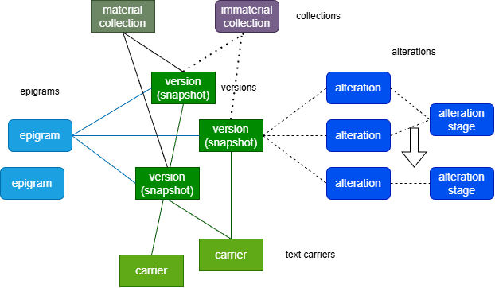

# Data

Data for the VE edition is very peculiar, and represents an extreme case in authorial philology. Nonetheless, the solution adopted here may have a more general impact on editing such texts, right because its purpose is to provide models and tooling for one of the most complex scenarios, strong enough to cope with VE and yet easy to scale down.

In a more traditional approach, one of the most popular models is based on a systematic comparison of different stages of what is regarded as the same text. Each stage is a text document on its own, and gets marked to explicitly define its differences with what is usually taken as a comparison.

So, here markup becomes the link between these stages: in each document, tags mark portions which have been deleted or ad­ded with reference to another one. This is similar to a _diffing_ operation between two documents: we compare them, and whenever they diverge, we annotate the deviation type.

A big advantage of this approach is that it allows scholars to reuse models and tools created for traditional philo­logical scenarios, where we compare text witnesses to reconstruct a hypothetical text. In fact, here we mostly use mark­up from the critical edi­tion TEI module, adapting models designed for a single text with multiple witnesses to represent multiple stages of a text.

While this is a perfectly fine approach, the VEdition scenario poses serious issues for its practical application. Here we are dealing with a work which has never got an authoritative publication, and is rather a "constellation" of texts. Our material evidence is represented by notebooks or single sheets (sometimes also letters) with multiple compositions, plus a set of printed editions with a subset of them. Many of these compositions can be easily recognized as different **versions** of what we can consider the "same" **epigram**.

In turn, manuscript texts are often a complex document, where annotations from author, revisors or editors accumulate on a "base" text to represent its **alterations** of any sort. Such alterations usually culminate into an **alteration stage** representing the final state after all changes belonging to the same hand have been accumulated. For instance, there can be a set of annotations in pencil, another one in brown ink, and another one in red ink.

So, these manuscripts literally capture in a sort of photographic **snapshot** a specific moment in the creative process of their text, freezing in it all the changes accumulated on the original text, from the first to the last one for that specific carrier. This rich material evidence often points to even dozens of different alterations for each snapshot.

So in the end, the "epigram" here is a pure abstraction, the set of all the texts with its variants, where none can be assumed as the final one. This is an unordered set of variants all related to what we recognize as a single epigram. The material support of these variants (here generically named **text carrier**, whether it's a notebook, a sheet, a letter, or a printed page) is either a manuscript or a printed edition, assembled in a less or more arbitrary way in different times and with different purposes.

Finally, the versions collected in a specific sequence, whether it is materially attested (e.g. a printed edition) or it's just suggested by annotations on snapshots (e.g. numbers on the margin of each version) represent **collections**.

