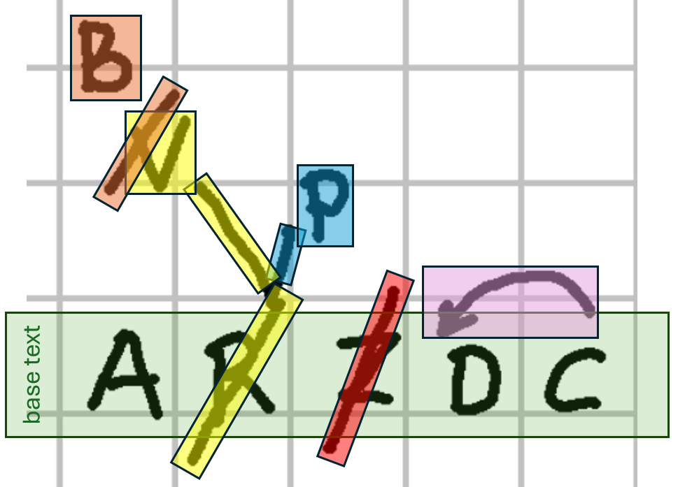
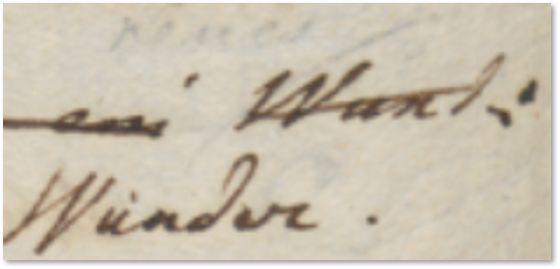

- [Diplomatic Model](#diplomatic-model)
  - [Graphical Approach](#graphical-approach)
    - [Animation](#animation)
    - [GSAP Model](#gsap-model)
    - [Animation Model](#animation-model)
  - [Symbolic Approach](#symbolic-approach)
    - [Pragmatic Signs Classification](#pragmatic-signs-classification)
    - [Symbolic Rendition Logic](#symbolic-rendition-logic)

# Diplomatic Model

On the diplomatic side, our model should provide an at least approximate graphical representation of the snapshot.

>Note that this is not a requirement for the textual side of the model; we could just implement this without its graphical counterpart, which in some cases might be less relevant or too costly. So this is just an additional part of the model, which is anyway designed to preserve the separation between these two layers.

In the course of evolution of the project, two alternative strategies for representing visuals have been defined.

The original strategy is purely graphical, and more faithful in reproducing the facsimile image, literally re-drawing on top of it (via SVG), and positioning added text according to diplomatic metadata. Animations are used to represent the temporal flow of operations. This method, while accurate, can be complex and time-consuming, unless driven by a more automated data flow for imaging.

To enhance efficiency and provide more granular data at the visual level, a new, symbolic approach has been introduced abstracting the visualization process. Instead of redrawing each sign, operations are described using rendition features (like “diagonal line”, “box”, “cross”, "below and to the left", “shifted right”, etc.), while the visualization engine uses this visual grammar to do the math to properly size and position each element.

## Graphical Approach

As we have seen, the core of the textual model is represented by the chain structure, and by operations acting on it. Each operation is an act executed on the text, and in most cases corresponding to some graphical representation in the snapshot.

For instance, consider our usual mock snapshot:

Here I have highlighted each portion of visuals with a different color, corresponding to the operations represented by the snapshot:

- the red bar on top of `Z` represents its deletion.
- the yellow bar on top of `R`, continued to the left up to a `V`, represents a replacement: `R` is replaced by `V`. The visuals here are 3: two segments and a `V` letter.
- the orange bar on top of `V` and the `B` drawn above it are the visuals corresponding to another replacement. This time, `V` is replaced by `B`.
- the magenta arrow on top of `DC` represents a movement operation: `C` is moved before `D`, or alternatively, `D` and `C` are swapped. As in many other cases, here the choice depends on the one which best fits our interpretation.

So, at this level of abstraction, any annotation in our snapshot can be graphically represented by a set of visuals, corresponding to any mixture of geometric shapes and/or text, whatever its complexity.

As annotations are modeled as operations, this means that we can add the graphical representation of each operation as a set of visuals linked to it. This is essentially what is done by the diplomatic portion of the model, which adds these metadata to operations:

- `g`: the SVG `g` element graphically representing the operation this diplomatic information is attached to. SVG being XML, this is just a string in the object model. SVG here is the ideal candidate for this graphical representation, because it's a W3C standard for vector and interactive graphics in HTML pages. As an XML dialect, SVG can represent any geometrical form or text, with all its visual features, just with some text; and this is compatible with both HTML and XML, including of course TEI. Also, it can be made interactive and animated by controlling each of its elements via JavaScript. An SVG `g` element is a group, which may contain any type and number of shapes or texts, or even other groups. So, a single `g` element for each operation can represent any complex visuals for it, as a single unit.
- `features`: a set of generic features attached to the operation as a whole and related to its diplomatic aspects. For instance, we might want to add information about ink, size, etc. Features are modeled as already seen for the textual portion (name/value pairs).
- `element features`: this is a dictionary of features sets, keyed under SVG element IDs. The dictionary allows to attach features to a specific element of the operation visuals, rather than to their whole set. To this end, you assign an arbitrarily chosen ID to every SVG element you want to attach features to, and then add as many features as needed to it under the key of its ID. For instance, we might want to add a specific set of features to only the orange bar among the two visuals building the group representing the replacement of `V` with `B`.

So, this model not only links visuals to each operation, but also attaches optional metadata on the diplomatic side, both to the operation as a whole, or to any parts of its visuals. Yet, the model is very simple, because it rests on just text: SVG code for the visuals, and name=value pairs for features.

### Animation

Additionally, this bidimensional, geometric model can be further extended by adding the dimension of _time_ in the form of animations.

In depicting our interpretations of a snapshot, tracing back text versions to the actions performed by its author, animations can play a significant semantic role in the context of this model. Of course, they belong to the same realm of interpretation we have already distinguished in that model, but a digital publication can greatly benefit from them.

With reference to our architecture, animations must be designed no longer at the level of each single operation, but rather within the scope of the whole snapshot. For instance, think about a `B`  inserted between `A` and `C`: we might want to animate this insertion by moving `B` between these two letters, which in turn would require to be moved in opposite directions, so to make space for the new one. So, this goes beyond the scope of a single operation, and is rather contained in the snapshot as a whole.

As we have seen, a chain contains the representation of many versions of what we consider the "same" text, as defined by a set of operations. Each operation generates a new state for the text, representing a **step** towards the "final" state for the text, as reconstructed by our interpretation.

While there is a new step for each operation, usually not all these steps represent what we consider as a true **version** of the text. Anyway, in the model this is just a detail, implemented with a specific metadatum which tags some of the steps as representing a version.

The purpose of animations is visally hinting at the transition between two steps; so, animations are tightly coupled with steps. This has a number of implications, which help shape the model of animations in a simpler tool:

- each animation is _tagged_ with the step ID corresponding to its target state. For instance, if an animation must animate the transition between `v3` and `v4`, its tag will be `v4`. While many operations can stem from the same step (for instance, two different variants branching from the same base at different times), each operation always produces a different, uniquely identified step. This is what is used to link animations with steps.

- each animation deals with _all the visuals present in the snapshot up to its reference step, included_. So, if an animation refers to `v4`, and the steps preceding it are `v0`, `v1`, `v2` and `v3`, all the visuals introduced by these steps will be present and available for the animation. As the animation is a transition between the state represented by its source step and that represented by its target step, this in practice means that it is going to provide entrance- (and possibly side-) effects for the visuals in the target step. Thus, in our example we can assume that the visuals up to `v3` are all present and visible in the snapshot, while those of `v4` are present (as injected by executing the operation leading to `v4`), but not yet visible. It is the task of the animation to bring them into visibility with the desired transitions. For instance, a line representing a stroke on a letter to mean its deletion might be progressively revealed like a pen's trait, with a point which stretches into a segment, becoming longer until it reaches its final dimension. In this case, we start with this invisible segment, and apply an animation which gives the live effect of "drawing" it.

>In an autograph, visuals in fact accumulate on the snapshot as they get added to it step by step. Once added, unless we aim for some more abstract visualization their place no longer changes. So, introducing animation here is just a matter of animating the transition between a step with existing visuals to another one with additional visuals. This reflects the physical nature of the model: a snapshot is a set of graphical signs on a material support, and once these signs are traced, there is no way of undoing this action. Of course one can change his mind and graphically represent this by e.g. drawing a stroke on them, or even overwriting them; but once a visual is there, the very fact of its presence cannot be deleted.

- _animations are an optional feature_: the model can work even without them, and still retain its essential representative power. This allows different projects to choose whether to add this additional layer of data, or just be happy with the basic one. A snapshot without animations is just a sequence of still frames; whereas one with animations provides transitions between these stills, by means of value interpolation. Metaphorically, this allows moving from a gallery of single shots to a movie. When properly used, such animations convey more meaning rather than just being a fancy addition: they can help in leading the reader's attention to the crucial stages of a transformation happening right before his eyes, thus helping in understanding the evolution of a text along the time axis by actually using time for this purpose.

### GSAP Model

Animations are complex; yet, given that we don't need (nor desire) overtly complex features in our general-purpose model, we can leverage some existing software libraries to define a generic model for them.

Among the freeware libraries targeting web, one of the most popular and well-suited for these requirements is represented by [GSAP](https://gsap.com). The basic concepts and entities used there can be easily imported in our model.

GSAP is based on _tweens_. A **tween** is just a _property setter_, capable of animating any property, like for instance the position of an element, its size, rotation, color, etc. Its name clearly comes from the fact that animation essentially interpolates _between_ two different states of an object.

In GSAP, a tween object is created with a function specifying either its start point (`from`, assuming the current state as the end point), or its end point (`to`, assuming the current state as the start point), or both (`fromTo`).

Each of these functions gets these [arguments](https://gsap.com/docs/v3/GSAP/Tween):

1. a `selector` to define the target element(s).
2. a `vars` object, with all the properties/values pairs you want to animate (e.g. `rotation: 360`). This can also include some special properties, whose names are reserved to specify animation behaviors, like `duration`, `delay`, `ease`, etc.

In turn, tweens are contained in **timelines**, which can be further configured with `vars`, as for tweens. Timelines orchestrate the animations represented by tweens, coordinating their timing and order.

To add a tween to a timeline, the timeline object has corresponding methods (`to`, `from`, `fromTo`). This adds a third optional parameter, [position](https://gsap.com/docs/v3/GSAP/Timeline#positioning-animations-in-a-timeline), a string with its own syntax, used to precisely control where things are placed.

### Animation Model

The animation model here can be designed in compliance with a basic usage of GSAP:

- `timelines` (`AnimationTimeline`): a dictionary of 1 or more timelines, keyed under version tags. Each version can thus have its own animation, as it's selecting and reordering a subset of operations on the chain. Each timeline contains a set of tweens.
  - `tweens` (`AnimationTween`):
    - `label`: a human-friendly label for the tween.
    - `note`: a free text note about the tween.
    - `type`: whether it animates from current state to another one (`to`), vice-versa (`from`), or specifying both initial and final states (`fromTo`).
    - `selector`, usually the target element ID. This can be the ID of any of the elements in the SVG code of any operation with a visual representation in the whole snapshot.
    - `vars` (`AnimationVars`, a map where keys are strings and values are strings, numbers, or booleans): a free object with variables to be animated, whose values can be scalar or other objects. As GSAP is JavaScript-based, the object can be encoded as a JSON string. Anyway currently we limit the logic to scalars, as it seems there is no need for more complex values here.
    - `position`: this is just a string.

>A timeline can be easily transformed into a set of instructions for GSAP. Essentially, a tween is created with the timeline's function corresponding to its type (`to`, `from`, `fromTo`), which gets as parameters selector, vars and position from the corresponding tween's properties. In tweens, both label and note have no usage, except facilitating the users work in editing the timeline.

## Symbolic Approach

While the graphical approach provides a faithful representation of visuals, for scalability reasons it is better fit to a flow where imaging is managed with some level of automation. For instance, in a HTR-based scenario one could leverage the regions defined by this process to support the digitization of signs and their connection with operations.

Anyway, especially those scholars more versed in traditional philology having to redraw non-textual signs on top of the facsimile and manually position text on it (via features like `x` and `y`) would be time-consuming, and possibly distracting when they mostly focus on text.

Also, it could be interesting to provide a more computable, and thus more abstract, representation of visuals, so that one could also analyze the distribution of their features among carriers and their relationship with their meaning. A specific visual representation might be typical of a period, a set of documents, a hand, etc; and from a paleographic point of view, one might be even interested in collecting, classifying, and quantifying the distribution of signs with their meanings.

So, an alternative approach has been designed, whose model relies on operation features and on a sort of catalog of visuals with their animations. Here, it is no longer the user, but the software which draws signs on a surface on their behalf, following directions provided by features and taking care of all the heavy math to size and position them.

### Pragmatic Signs Classification

The symbolic approach is a more abstract model based on a pragmatic classification of signs. The best way to illustrate it is starting with the real-world image in Figure 1:

- Figure 1 - A couple of words on an autograph sheet

This image shows the end of a line ("... Wund:"); below and slightly to the left of the final word "Wund:", a replacement word "Wunder." has been written.

So, let us consider the types of these signs. The most obvious type is the **base text** itself: here "Wund:" is part of it.

After the base text was written, many other signs were added later. One of them is a diagonal line crossing this word; this line hints at the _deletion_ of it. So, the meaning of this sign is an editing operation; it literally _hints_ at it. We call these signs **hints** right because of this. They are the visual counterpart (when there is any) of editing operations.

Another type of sign is then the word which was meant to replace "Wund:": "Wunder.", written below and to the left of it. With reference to the base text, which is our starting point, this is **added text**.

So, we are _removing_ Wund, and _adding_ Wunder. In simpler terms, we are _replacing_ "Wund:" with "Wunder.". That's our editing operation. The line hints at it, and the new text added by it is written below.

In fact, a replacement is a higher-level operation which could be represented with a delete coupled with an insert. Operations in our model are the mean by which scholars formalize their interpretation of the carrier and indirectly modify the chain data structure, which in turn generates text versions. The creative process being reconstructed is a sequence of such operations, which belong to the subjective layer of interpretation. So, right because of being the middleman between chain data and scholars, operations are modeled at higher level, which better fits a human point of view. Thus, we are not limited to just delete and insert, but we include operations like replace, move, swap, and annotate.

Among operations, only insert and replace add new text. So, whenever they are used, new text nodes will be added to the chain.

Thus, in our example we have a single replacement operation, having two visual counterparts:

- the diagonal line on top of the old word. This is a _hint_.
- the new text written below and to the left of the old word. This is _added text_.

So, from the point of view of our visualization, we define three types of signs on the carrier: base text; text added by operations; and hints which visually correspond to them.

These are the entities involved in the visual presentation of our snapshot. Added text and hints taken together are also known as **added elements**, because they were added later with reference to the base text.

>"Element" in the context of visualization is a specific term belonging to its XML-based encoding, as the visualization relies on SVG.

It should be noticed that the distinction between hints and added text is not a visual one; as for all the signs in this classification, it is functional to the rendering logic. For instance, it may well happen that a hint is represented by text, like the number of an epigram written on its corner, or a textual annotation. Even then, the hint is different because it is just the optional visual counterpart of an operation, and does not represent text which becomes part of the epigram's text. So, it may have the appearance of text, or more frequently be just some freehand drawing; but in both cases, it never represents a part of the text being transformed.

So, in our example the replacement operation's _hint_ is only the line above the old word, while the new word replacing it is _added text_, and becomes part of the epigram's text in the text version(s) following it.

### Symbolic Rendition Logic
