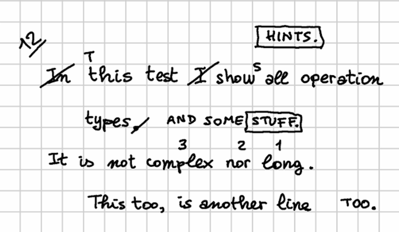
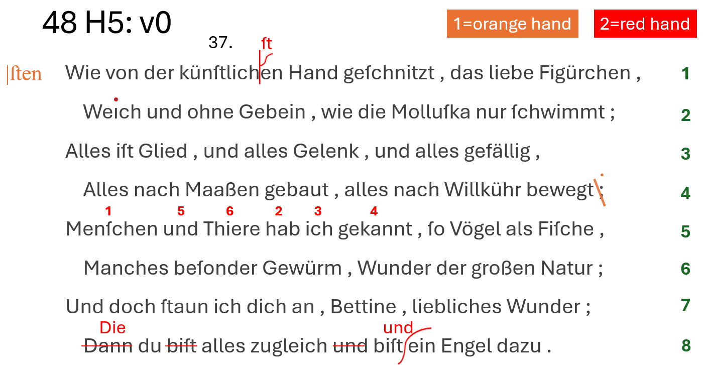

- [Diplomatic Model](#diplomatic-model)
  - [Pragmatic Signs Classification](#pragmatic-signs-classification)
  - [Symbolic Rendition Logic](#symbolic-rendition-logic)
    - [Visuals Catalogs](#visuals-catalogs)
    - [Computing Visuals](#computing-visuals)
    - [Positioning and Sizing Added Elements](#positioning-and-sizing-added-elements)
    - [Hint Model](#hint-model)
    - [Rendition Features](#rendition-features)
    - [Feature Adapter](#feature-adapter)
  - [Software Tools](#software-tools)
  - [Mock Example](#mock-example)
  - [Real-World Example](#real-world-example)

# Diplomatic Model

On the diplomatic side, our model should provide an at least approximate graphical representation of the snapshot.

>Note that this is not a requirement for the textual side of the model; we could just implement this without its graphical counterpart. This is just an additional part of the model, which is anyway designed to preserve the separation between these two layers.

In the course of evolution of the project, two alternative strategies for representing visuals have been defined.

The original strategy is purely graphical, and more faithful in reproducing the facsimile image, literally re-drawing on top of it (via SVG), and positioning added text according to diplomatic metadata. Animations are used to represent the temporal flow of operations. This method, while accurate, can be complex and time-consuming, unless driven by a more automated data flow for imaging.

To enhance efficiency and provide more granular data at the visual level, a new, symbolic approach has been introduced abstracting the visualization process. Instead of redrawing each sign, operations are described using rendition features (like “diagonal line”, “box”, “cross”, "below and to the left", “shifted right”, etc.), while the visualization engine uses this visual grammar to do the math to properly size and position each element.

Also, it could be interesting to provide a more computable, and thus more abstract, representation of visuals, so that one could also analyze the distribution of their features among carriers and their relationship with their meaning. A specific visual representation might be typical of a period, a set of documents, a hand, etc; and from a paleographic point of view, one might be even interested in collecting, classifying, and quantifying the distribution of signs with their meanings.

So, an alternative approach has been designed, whose model relies on operation features and on a sort of catalog of visuals with their animations. Here, it is no longer the user, but the software which draws signs on a surface on their behalf, following directions provided by features and taking care of all the heavy math to size and position them.

## Pragmatic Signs Classification

The symbolic approach is a more abstract model based on a pragmatic classification of signs. The best way to illustrate it is starting with the real-world image in Figure 1:


- Figure 1 - A couple of words on an autograph sheet

This image shows the end of a line ("... Wund:"); below and slightly to the left of the final word "Wund:", a replacement word "Wunder." has been written.

So, let us consider the types of these signs. The most obvious type is the **base text** itself: here "Wund:" is part of it.

After the base text was written, many other signs were added later. One of them is a diagonal line crossing this word; this line hints at the _deletion_ of it. So, the meaning of this sign is an editing operation; it literally _hints_ at it. We call these signs **hints** right because of this. They are the visual counterpart (when there is any) of editing operations.

Another type of sign is then the word which was meant to replace "Wund:": "Wunder.", written below and to the left of it. With reference to the base text, which is our starting point, this is **added text**.

So, we are _removing_ Wund, and _adding_ Wunder. In simpler terms, we are _replacing_ "Wund:" with "Wunder.". That's our editing operation. The line hints at it, and the new text added by it is written below.

In fact, a replacement is a higher-level operation which could be represented with a delete coupled with an insert. Operations in our model are the mean by which scholars formalize their interpretation of the carrier and indirectly modify the chain data structure, which in turn generates text versions. The creative process being reconstructed is a sequence of such operations, which belong to the subjective layer of interpretation. So, right because of being the middleman between chain data and scholars, operations are modeled at higher level, which better fits a human point of view. Thus, we are not limited to just delete and insert, but we include operations like replace, move, swap, and annotate.

Among operations, only insert and replace add new text. So, whenever they are used, new text nodes will be added to the chain.

Thus, in our example we have a single replacement operation, having two visual counterparts:

- the diagonal line on top of the old word. This is a _hint_.
- the new text written below and to the left of the old word. This is _added text_.

So, from the point of view of our visualization, we define three types of signs on the carrier: base text; text added by operations; and hints which visually correspond to them.

These are the entities involved in the visual presentation of our snapshot. Added text and hints taken together are also known as **added elements**, because they were added later with reference to the base text.

>"Element" in the context of visualization is a specific term belonging to its XML-based encoding, as the visualization relies on SVG.

It should be noticed that the distinction between hints and added text is not a visual one; as for all the signs in this classification, it is functional to the rendering logic. For instance, it may well happen that a hint is represented by text, like the number of an epigram written on its corner, or a textual annotation. Even then, the hint is different because it is just the optional visual counterpart of an operation, and does not represent text which becomes part of the epigram's text. So, it may have the appearance of text, or more frequently be just some freehand drawing; but in both cases, it never represents a part of the text being transformed.

So, in our example the replacement operation's _hint_ is only the line above the old word, while the new word replacing it is _added text_, and becomes part of the epigram's text in the text version(s) following it.

## Symbolic Rendition Logic

From a practical standpoint, the logic for rendering text and added text is essentially the same: in both cases we are just drawing text, belonging to the text being transformed.

The real difference is essentially in time: the base text is the entry point for the transformation, typically written with a regular and predictable layout; while added text was introduced later, in an unpredictable way and at any position (usually wherever there is space near to the text being transformed), following the creative process.

This implies that:

- **base text** can be rendered with a simpler logic, essentially equal to that which dictates the arrangement of characters in lines on a sheet of paper. Characters follow each other on the same line, until the next line starts. Of course, this layout can occasionally be modified; for instance, whatever the reasons, a portion of the text might be written with a different size, or along an offset or rotated baseline. Anyway, these are occasional departures which can be implemented by overriding the default logic.
- **added text** instead is placed and sized freely, reflecting its appearance on the carrier.

### Visuals Catalogs

As for **hints**, these can be text (not belonging to the text being transformed), freely sized and positioned like added text, or more often pure geometrical elements, like lines and shapes. So, their appearance is totally unpredictable, as in theory everything could be drawn on a sheet. This is why in the original approach the diplomatic metadata of an operation includes an SVG code fragment, which represents the visual appearance of its hint.

So, we could never be able to predict all the shapes of all the hints found on a sheet, especially when crossing project borders (which is implied by the generic vocation of this system). This implies that our model must be open and capable of representing any drawings.

Nonetheless, it is also true that, especially within a single project's borders, hints can be easily grouped into repeatedly used **types**. Many of them also have a nearly universal use, like the line on top of a word, meaning its deletion.

So, even if each line drawn on the sheet is unique, and corresponds to a unique act happened in time, it can easily be traced back to a single pattern: the symbol for a line. This is an abstraction, but the departures from its ideal appearance can be easily discarded as irrelevant, just like when listening to a speech we discard allophonic variants and identify the immaterial phonemes behind these surface expressions.

Sure, to provide more details, we could multiply these symbols: for instance, we could have one type for the horizontal line (`—`); another for the diagonal line raising from left to right (`/`); and yet another one for the diagonal line lowering from to left to right (`\`). The level of detail depends only on the project's nature and purposes.

Anyway, whatever our choice, in the end we could always define a sort of **catalog of signs** representing hint types, like "horizontal line", "diagonal line up", "diagonal line down", "cross", etc. These would all be abstract types, discarding the single details of each specific stroke drawn on the paper; but they would capture their essential nature, dropping accidental features, while preserving all the different types required by our model.

Thus, the first ingredient for our visualization would be a catalog of hints, each with its own appearance and a set of metadata. Most of these metadata concur to define the behavior of each hint with reference to its rendition, like sizing, positioning, rotation, scale, etc.

Among them, one also connects the hint to its entrance **animation** in the visualization stage. As already remarked, animation here is not just a fancy feature, but it is crucial for the semantics of a visualization which fully embraces the flux of time.

In fact, whatever the approach, graphical or symbolic, a crucial aspect of this model is time: we focus on the transformation process happening during time, step after step, replaying what the writer did, at least according to our reconstruction. In visualization, time means animations, for each state transition.

As we focus on process, animation here is a semantic factor, rather than a fancy decoration. In a traditional approach, we deal with a previous stage, and a next one. We then represent this transformation in terms of its effects, by diffing two stages and emphasizing their differences. For instance, comparison shows us that in stage two something has been deleted; and something has been added. The process remain hidden behind its surface effects; and when faced with tens of stages, figuring it out becomes hard.

In the VEdition approach instead, we replay all the steps between two stages, operation after operation. For instance, we first transform a text by deleting some portion of it: visually, a hint like a diagonal line enters the stage via an animation to represent this. Then, we add some other text, which visually corresponds to this new text entering the stage, again via an animation. So we can literally see the text transforming under our eyes, until it gets to the next alteration stage.

This is why not only each operation is linked to any number of visual hints; but also why each hint in turn is linked to an enter animation.

So, each hint progressively unveils itself, rather than abruptly appearing: this fits the continuous flow of changes occurring along time, and usually mimicks the act of drawing that hint. For instance, a diagonal line can enter via a "wipe-right" animation, which mimicks the effect of drawing it from left to right with a pen on paper.

Here too, we can leverage the same approach for an even more efficient representation: rather than providing a specific animation for each hint instance, we can reuse animations just like we reuse hints. So, the hints catalog stays side by side with an **animations catalog**, and each hint just reuses an animation from it, except when the hint's structure is so peculiar that it requires its own animation.

### Computing Visuals

So, the first ingredient for our visualization is a catalog of visual assets, including SVG code fragments for hints drawings, and JavaScript code fragments for their animations.

The second ingredient is a set of metadata providing a declarative approach to the visualization logic of elements. This metadata is nothing new in the backend model: it is just a set of operation's features, specifically designed for visual rendition, and thus named **rendition features**.

>As a general rule, all features starting with a prefix ending with underscore (e.g. `r_`) are conventionally considered to be functional features, which are not usually displayed to end users among text metadata.

The purpose of these features is _overriding_ some of the default properties of the elements being drawn. All elements follow a general logic for their size, position, and transformation, which allows the software to display them on behalf of the user; rendition features just provide specific behavior for them, so that they can reflect the actual sigs on paper.

For instance, when rendering text the software uses a preset font family, size, and style; but you can change any of them using rendition features which specify new values. Rendition features are specified by users, just like any other features belonging to operations. So the operation continues to be the core representational device handed to users.

So, declarative metadata for visualization essentially has two sources:

- the default metadata, specified by the settings of the software component used for visualization. These settings are thus specified by the page hosting that component. If not specified, they fallback to default values defined by the component itself.
- the metadata specified by users via rendition features.

In both cases, this metadata is meaningful in relation with the **rendition logic** defined by the visualization component. This logic drives the whole visualization, and makes its elements predictable, so that users can expect a specific outcome when adding a specific set of features.

As we have seen, the default rendition logic for text is simple: it just displays one character after another on the same line, until a line-end character is found, using default font properties. Rendition features can be used to customize all the relevant features of such text, including its position by offsetting it. For instance, this is useful to represent indentation or gaps.

With reference to this, the only peculiar aspect of added text is that its position is not determined by this predictable line-based layout, like for base text; added text position is totally arbitrary. The same is true for hints, which can appear everywhere. So, in this respect all added elements (added text or hints) share the same positioning logic.

The logic for added elements is first dictated by the assumption that all added elements by definition _refer to base text elements_. This is a consequence of the fact that added elements represent annotations attached to the base text. For instance, the position of the word "Wunder." in Figure 1 above is defined with reference to the word "Wund:" it is going to replace: it appears below and to the left of it. This assumption thus follows the logic behind the annotation process, reflecting the fact that its actors look at the text they are willing to change, and then add annotations to it in some empty space, usually near to it. So again here the model mimicks the reality of the creative process.

Now, everything the software draws on top of its virtual sheet is text or any type of geometries (using the SVG standard, which was designed right to provide vector-based drawing for HTML pages). So, the software component in charge of rendering the snapshot is completely based on 2D geometry. The sheet is a Cartesian plane, and the signs on it are geometrical shapes (including text, which can be regarded as a set of geometrical paths).

So, to make it general and simple enough, the rendition logic reflecting this reference to the base text adopts the concept of what we call a **reference text bounding rectangle** (RBR for short): this is just the imaginary rectangle we can draw around the reference text to include it (Figure 2)


- Figure 2: the concept of the RBR for "Wund:" (in red): in rendition, it rather refers to the rendered text for that image

Of course, given that this visualization is totally feature-driven, and features are based on operations, the concept of "reference" text is determined by the operation's type and the text it affects. For instance, in a replacement or in a delete operation the reference text is the text being removed; in a move or swap operation is the text(s) being moved; in an insert operation it is the "anchor" text before or after which the text is added.

>This implies that in cases where the reference text is split across multiple lines, there will be multiple RBR's, one per line. The software takes care of this detail anyway, by using the same rendition logic multiple times for each of these RBR's, where it is sound. For instance, a stroke on top of a text representing its deletion will be repeated for each RBR, thus covering the whole text; but a hint with a text annotation will be displayed only once, despite multiple RBR's.

### Positioning and Sizing Added Elements

Once we have defined the RBR, we can then define the position of added elements in relative terms, with a very intuitive model, just like we say that "Wunder." is "below and to the left of" the word it replaces. The software defines a dozen of **relative positions** which can be specified via a rendition feature, as usual, and use abbreviations from cardinal points (Figure 3).


- Figure 3: positions relative to the RBR: the RBR is orange, positions are in blue/cyan

So, in our example the word "Wunder." position is `sw`. So in the end positioning an element is essentially equal to positioning its bounding rectangle with reference to the RBR, like in Figure 3. The `o` position represents the `origin` of the rectangle, i.e. its center.

As most hints (like e.g. lines or boxes) are drawn on top of reference text, the default position is `o`. Also, for hints the RBR is not only the source for their position, but also for their **size**. By default, hints are effectively sized as their RBR: a hint is picked from a catalog, where it has an intrinsic design size, but then it is shrunk or enlarged to fit the RBR size. The effect of this adjustment is that everything which is designed to be drawn on top of reference text fully covers it, as expected. For instance, the diagonal line on top of "Wund:" in Figure 2 will fully conver that text, right because it is the diagonal of its RBR.

This is why the default position for hints is `o`, and the default size is the size of the RBR: this will result in a default behavior which covers the whole reference text. For instance, suppose we would like to draw a box around a word. This happens in our VEdition texts, especially to visually connect two portions of text which are distant, like a replacement word which instead of being above or below a line is far from it, at the top of the whole epigram. This is just due to the accidental circumstance of lack of space, and to make it clear that this word is going to replace one word far below, inside the epigram's text, both the original word and the new one are boxed.

In this case, the model provides a perfect parallel to reality: we can represent this with three operations. Just like the author first boxed the word to replace, then added the new word where he found some space, and finally boxed the new word to link it to the replaced one, we can use this sequence of operations:

1. _annotation_: an annotation operation whose purpose is just to box the original word. This contains the proper rendition features to draw that box, i.e. at a minimum a "hints" feature which tells which are the hint(s) for this operation. In this case its value will be the ID of the hint representing a box, like `box`. The hint's SVG code fragment will just include a rectangle.
2. _replacement_: this effectively changes the text by replacing one word with another one. Note that this operation has no hint in itself, as it is rather part of a sort of "macro" operation (=the three operations we are listing -- you may recall that the operation model has a group ID property, right for the purpose of grouping logically connected operations). Yet, it does have an added text, because it is adding a new word. The added text will be drawn with the size defined by its content and the default font properties (unless overridden by feature properties).
3. _annotation_: this final operation annotates the newly added text with the rendition features needed to draw a box around it, just like we did for the first operation.

Now, this example was not chosen by chance: if we think about it, it has an additional complication: the text being added is **displaced**, far from its reference text; and as we have seen, the position of any added element is always determined by that of its RBR. So, how can we represent this displacement without introducing ad-hoc logic, which would disrupt the elegant generalization of this predictable rendition logic?

The solution is in the logic itself: all added elements still continue to be positioned with reference to the base text; only, here it is the base text to use as the reference which changes. Instead of using the RBR of the replaced text, we will be using the RBR of the text which happens to be found right below the added text, because in our case the added text was written a the top of the epigram. In other terms, it was written above the first line of it, aligned to some specific portion of that line. So, all what we need to do is to override the RBR of the operation with another one, provided by one of its rendition features. Thus, the replacement operation will carry a rendition feature which specifies which portion of the base text should be rather used to compute the RBR: this will effectively displace the added text, positioning it right where we want it.

In the same way we can also represent another detail: the fact that the displaced text is added far above the epigram's first line, so that it's clear that it is not really referring to that line. Again, this is easy to represent by just adding another rendition feature, which specifies a vertical offset from the originally computed position. If our relative position is `n` (=north, i.e. at the top of the displaced RBR), our vertical offset will subtract a certain value to move it upper (the origin of our Cartesian plane is at the top-left corner, so decreasing its Y coordinate will mean moving an element up). So in the end we will add a couple of features: one which displaces the RBR, and another which offsets the computed position up, thus faithfully reflecting what is found on our sheet.

>Note that offsets can be specified not only in pixels, which is the most granular unit, but also in units relative to the text size: `th` for text height, and `tw` for text width. This allows users to provide an approximate value even without measuring the distance in a more precise way.

Finally, we need yet another feature for the box itself: as we have seen, the hint is picked from a catalog and resized to fit its RBR. Given that the default size is the RBR's size, and the default position is the RBR's center, this means we will get a rectangle exactly equal to the RBR. This will probably result in a rectangle which overlaps with the text it should contain. We rather need a bit larger rectangle, so that it fully encompasses its text without touching it. To this end, all what we need to do is change the scale of the hint, setting it e.g. to `1.1` (=110%). This will make it 10% bigger than the RBR, while still centering it because of its `o` position. The result will be a box drawn around the text, at a certain distance from it, exactly as we wanted.

So, besides rendition details, this solution for displacement preserves the general RBR-based logic, by simply overriding the RBR via an operation's feature, not differently from when we override the default font properties of an added text to customize it. In the end, all what users do is specifying the operations representing the creative process. Their visualization is totally computed by software, orchestrating default settings, operation's features, and visuals catalogs.

From the user's standpoint, this approach is far more efficient and even more detailed than the graphical one, as symbolic visuals also provide a basis for studying their distribution. Users just focus on the reconstruction of the creative process, specifying operations and adding to them also some abstract rendition features designed to be general, human-friendly, and yet powerful enough to drive the rendition computed by software. Operations here literally drive not only the transformation of text over time, but also the drawing of all the visuals which represent its evolution, as documented by the carrier. Just like the text changes operation after operations, so visuals accumulate on our virtual sheet reflecting them. At the end of the process, those visuals will be the faithful, yet more symbolic representation of the signs in our sheet, accumulated over time, one after another.

Focusing on a dynamic process, rather than just comparing different static stages, is the core of our model; this is nearer to the reality of the making of the text, and the same holds for both the textual and graphical sides of the model, which reflects the reality of its material counterpart. Essentially, once you write a sign on a sheet of paper, it stays there forever. You might draw a stroke on it, overwrite it, or whatever else hints to its change; but yet, the sign is there, and we are just adding new signs.

The same happens for our model. On the textual side, we have seen that the chain structure contains a set of nodes and a set of links, and any operation just adds items to those sets. Once any item is added, it stays there forever. On the graphical side, any sign we add to our drawing surface, whether it is text or any line or shape, gets accumulated operation after operation, until we reach the final stage where all the signs on the carrier are represented. So again, once a sign is added, it stays there forever; we just add more and more signs during the process. The enter animation of each hint or added text further emphasizes the continuity of this transformation process, fully embracing the flux of time and literally re-playing it below the user's eyes.

### Hint Model

While added text is just text rendered as such, combining the default settings with its rendition features, hints have a more complex model. Each hint essentially is an SVG fragment representing something to be rendered on the component text rendition area and corresponding to a specific operation. As we have seen, hints are defined in a catalog, and linked to operations via a specific rendition feature (`r_hints`: see [below](#rendition-features)), which contains the IDs of all the hints to use for that operation. For instance, `r_hints` = `alpha beta` means that we want to apply 2 hints with ID `alpha` and `beta`, in this order.

The hint has these **properties**:

- `svg`: SVG code for hint's visuals, always having a root g element.
- `position`: relative position for the hint.
- `offsetX`: absolute (10) or proportional (`0.5th` = half text height, `0.5tw` = half text width).
- `offsetY`: absolute (10) or proportional (`0.5th` = half text height, `0.5tw` = half text width)
- `scaleX`: horizontal scale: `1` = match bounds width, `1.1` = 110% of bounds width.
- `scaleY`: vertical scale: `1` = match bounds height, `1.1` = 110% of bounds height.
- `rotation`: optional hint's rotation (`0`=none).
- `animation`: JS code for animating the hint's entrance via [GSAP](https://gsap.com).
- `displacedRefSpan`: a span of base text with format IDxN where ID=node ID and N=count of chars to include, to be used as the RBR instead of the default RBR.

The hint's `svg` property is a string representing the SVG content of a hint. The SVG content has these characteristics:

- by convention, its **root element** is always a `g` element. This allows to manipulate the whole hint as a single entity (e.g. for transforming or animating it). So, there is no `svg` root; this is just a code fragment.
- inside this root `g` element we can have **any SVG code** with groups, shapes, lines, text, etc. Apart from sizing and positioning it, and possibly overriding some of its properties dynamically (e.g. color, text decorations, etc.), the component will just render it as it is.
- it may contain a **handle** element with `id`=`handle`. This represents the "handle" for the SVG code, i.e. the point in it which is used as _the reference for positioning it_. If there is no such handle element, then the component just uses the _bounding rectangle_ for the whole SVG (i.e. its root `g` element, which is always present). Often, in the hint SVG code the handle element has opacity=0 so it is not visible; but this is up to the SVG code you get from the hint. Anyway, the setting `showHintHandles` can force such hidden handles to be displayed setting their opacity to 1 for diagnostic purposes.
- it may contain a **placeholder** element with `id`=`placeholder`. This is usually an SVG shape, like a rectangle including a `text` SVG element which represents the text to draw, or directly a `text` element. Whatever the placeholder element is, in the end it either is a `text` element, or it contains a `text` element. This text element has this behavior:
  - its _text value_ is resolved at runtime: in the hint SVG, it is just the _name of the variable_ containing the text. This is equal to the name of a _feature_ which is supposed to be provided by the same operation the hints belongs to. If a feature with this name is not found, the text value will just be the feature name, so that users will be able to understand that there are issues in their data.
  - as for its _size_:
    - when the hint's placeholder element has a `class` attribute equal to `fit`, the text's size is calculated so that its content fits the container element with the `placeholder` ID. For instance, the SVG code of the hint might represent a callout for insertion, where the balloon is a rectangle with id=`placeholder`, and the line ends into the handle point. This way, the text being added will appear inside the balloon. So, here the text must fit into the container.
    - else, the text value and the settings for drawing it determine the resulting size of `text`. This implies that all the SVG elements containing this `text` element, including the root `g` element, must scale to fit it inside them. So, this is the inverse case with reference to the default one: here the container must fit the text.

Also, the SVG code in the hint's `svg` property can include **placeholder variables**, which are wrapped in `{{...}}` ("whiskers") and are represented by the name of the feature we want to get the value from. For instance, `<rect width="100" height="50" fill="{{r_color}}" />` has a placeholder `{{r_color}}` meaning that we will have to replace it with the value of a feature named `r_color` (or with nothing, when that feature is not found). This allows greater flexibility in reusing hints, as you can pick a generic hint and then change its appearance by means of other features.

Finally, the hint's `animation` property defines its enter animation. It can include:

- the JavaScript code fragment using the GSAP library for animating the hint's SVG.
- the identifier of a preset animation using the GSAP library for animating the hint's SVG, prefixed by `#`. So, if the string starts with `#`, it is assumed that it just contains the ID of a preset animation which must be retrieved to get the corresponding JavaScript code. Such preset animations can be defined in the component's settings.

>⚙️ We use GSAP for animations because it's robust and powerful, and has many powerful plugins available. Note that while plugins first were limited to paid subscriptions, they are now _freely available_ for everyone. All what is required to use a plugin is registering it once in code, e.g.:

```ts
// register a plugin for use
gsap.registerPlugin(DrawSVGPlugin);
console.log("DrawSVG plugin registered:", gsap.plugins.drawSVG !== undefined);
```

The GSAP animation targets the hint's root `g` element, i.e. the whole hint.

>⚠️ Note that the rendering component is a custom web component, so that it uses Shadow DOM and we thus need to _explicitly provide a reference to this element_ to the GSAP code (otherwise, GSAP would not be able to use `getElementById`). So, the rendering component:

- creates the hint's `g` element.
- creates a JS function wrapping the JS animation code got from the hint, and receiving these parameters:
  - `gsap`: the global instance of the GSAP library, defined once outside this JS code;
  - `hintEl`: the created hint's root `g` element;
  - `rootEl`: the root `svg` element of the whole text rendition area, should it ever be required by the GSAP animation code.

>💡 Among the freeware libraries targeting web, one of the most popular and well-suited for these requirements is represented by [GSAP](https://gsap.com). The basic concepts and entities used there can be easily imported in our model. GSAP is based on _tweens_. A **tween** is just a _property setter_, capable of animating any property, like for instance the position of an element, its size, rotation, color, etc. Its name clearly comes from the fact that animation essentially interpolates _between_ two different states of an object.
>In GSAP, a tween object is created with a function specifying either its start point (`from`, assuming the current state as the end point), or its end point (`to`, assuming the current state as the start point), or both (`fromTo`).
>Each of these functions gets these [arguments](https://gsap.com/docs/v3/GSAP/Tween):
>1. a `selector` to define the target element(s).
>2. a `vars` object, with all the properties/values pairs you want to animate (e.g. `rotation: 360`). This can also include some special properties, whose names are reserved to specify animation behaviors, like `duration`, `delay`, `ease`, etc.
>In turn, tweens are contained in **timelines**, which can be further configured with `vars`, as for tweens. Timelines orchestrate the animations represented by tweens, coordinating their timing and order.
>To add a tween to a timeline, the timeline object has corresponding methods (`to`, `from`, `fromTo`). This adds a third optional parameter, [position](https://gsap.com/docs/v3/GSAP/Timeline#positioning-animations-in-a-timeline), a string with its own syntax, used to precisely control where things are placed. As for GSAP reference, see:
>- [GSAP Documentation](https://greensock.com/docs/)
>- [DrawSVG Plugin](https://greensock.com/docs/v3/Plugins/DrawSVGPlugin): plugin for animating SVG.

As an example, consider this simple hint representing a diagonal stroke, encoded as JSON:

```json
{
  "diagonal-stroke": {
    "svg": "<g><line x1=\"0\" y1=\"0\" x2=\"300\" y2=\"100\" stroke=\"{{r_fore-color}}\" stroke-width=\"2\" /></g>",
    "animation": "#fade-in",
  },
}
```

This SVG fragment contains just a root `g` (=group) element with a child `line` element representing a line, starting at 0,0 and going down to 300,100. The design size for hints here is set to 300×100, so this line is equal to the diagonal of its bounding rectangle. Of course, the design size is just an arbitrary size chosen by the catalog's author; the hint will then be resized according to the RBR.

The corresponding animation is defined in the animations catalog with ID `fade-in` and this content:

```js
return new Promise(resolve => {
  gsap.fromTo(targetEl,
    { opacity: 0 },
    { opacity: 1, duration: 1, onComplete: resolve }
  );
});
```

As you can see, the code fragment is really minimalist, as most of the complex animation logic is delegated to GSAP. In this code, `targetEl` is the element to be animated (=the root `g` element of the hint's SVG content), and `gsap` is the imported GSAP object allowing access to animation logic. Here we animate the opacity of the target element from 0 (=invisible) to 1 (=fully visible) within a 1-second interval. The effect of this is gradually revealing the element with a "fade-in" animation.

At any rate, the purpose of the visuals catalog is right to shield users from the complexity of these technologies. Normal users do not need to fuss with SVG (for drawing hints) or JavaScript (for animating their entrance); they just pick a rendition feature from a list in the editor, and the rendition software will take care of all the rest. Also, as shown by this example, usually hints and animations are so generic that they can be easily reused across projects, so that creating them will not be a very frequent requirement, unless you deal with highly custom shapes. Additionally, a [hint designer tool](#software-tools) is also provided to help in creating visuals catalogs.

### Rendition Features

The rendition features defined cover almost all the visualization aspects it could be useful to customize. Here's their list:

- `r_char-offsets` (this is applicable only as an init-feature, i.e. the feature assigned to the first operation in our snapshot when this operation is an annotation operation): the character offsets for rendering some specific text nodes (and thus indirectly also all the character nodes following it, up to line end). In most cases, this is used to change line layout by adding indent, or increasing or decreasing space between lines. Usually, text is rendered in a regular, predictable way, just like text is normally rendered in frame: one character after another on the same baseline, until a newline character is found. When this happens, a new line starts below the previous one, left-aligned with it. This is the default layout which assigns the position to each baseline, according to general settings defined in the component's settings (default font size, default spacing between lines, etc.). This default position can be changed for specific characters by the value of this feature, whose format repeats the pattern `ID:y=...,x=...` (where we can specify only `x`, only `y`, or both, in any order; values represent `px` units). In this pattern:
  - `ID`=character ID. Each character has its unique numeric ID directly got from snapshot data. So here we target the character to be offset. As per the general text layout rules, once we offset this target characters, all the other characters will follow on the same baseline, unless any of them has another offset.
  - `y`=Y offset to add to the computed character baseline, thus shifting its default position down (when the offset is positive) or up (when the offset is negative).
  - `x`=X offset to add to the computed character baseline, thus shifting its default position to the right (when the offset is positive) or to the left (when the offset is negative).
- `r_char-offset`: this works as `r_char-offsets`, but it is provided in the features of a single character node, instead of being an initial setup for multiple characters. For instance, `3:y=10,x=20` means that before rendering the character with ID=3, the baseline will be shifted down by 10 and the X position of the next character will be offset by 20, thus effectively leaving a wider gap between the previous character and the next ones. All the following characters up will follow on this newly defined baseline, unless any of them happens to have another offset.

>The logic for these two features, `r_char-offsets` and `r_char-offset`, is equal; the only difference is that the former works on multiple characters at once. This is preferable to having just `r_char-offset` and using it multiple times, because when a character gets an offset, this affects not only it, but also all the following characters. So, order of application matters, and this could not be ensured when using multiple features, unless introducing ad-hoc logic which would be against generalization.

- `r_font-family`: the font family.
- `r_font-size`: the font size.
- `r_fore-color`: the foreground color.
- `r_back-color`: the background color.
- `r_italic`: the italic value (boolean).
- `r_bold`: the bold value (boolean).
- `r_underline`: the underline value (0-N being the thickness in `px`).
- `r_overline`: the overline value (as for underline).
- `r_strike`: the strikethrough value (as for underline).
- `r_text-line-style`: the style of overline, underline, or strikethrough: `solid`, `dotted`, `dashed`, `wavy` (as in SVG and CSS; corresponds to SVG `text-decoration-line`).
- `r_text-line-color`: the default color of the overline, underline or strikethrough.
- `r_rotate`: the rotation amount to be applied to each single character.
- `r_hints`: this feature is used to link the operation to any number of hints. The value is a space-delimited list of hint IDs, in the order they should be rendered for that operation.
- `r_hint-vars`: this has no effect on text; it is just a rendition feature used to define a set of variables to be used by hints placeholders. Each variable has format `name=value`, and is separated with space. For instance, `color=red bold=1` to pass variables `color`=`red` and `bold`=`1` to the hints being rendered for the operation being processed.

The following text rendition features are applicable only to **added text** (=text nodes added by insert/replace operations):

- `r_t-position`: the relative position of added text.
- `r_t-offset-x`: the X offset for the added text, relative to the computed `r_t-position`.
- `r_t-offset-y`: the Y offset for the added text, relative to the computed `r_t-position`.
- `r_t-solid`: a boolean value (`1` or `0`), telling whether the added text behaves as "solid" (thus triggering elements spreading when added in a place where there is not enough room for it) or not (which is the default).
- `r_t-displaced-span`: a span of base text with format `IDxN` where `ID`=node ID and `N`=count of chars to include, to be used as the RBR instead of the default RBR.
- `r_t-value`: a display-only override for the text value of the operation (which is an operation introducing new text, and thus having this text in its `value` property -- i.e. an add or replace operation). This overrides the operation's `value` property which contains the added text so that something different can be displayed. For instance, say that an operation replaces `;` with `:`, but visually it is represented on a sheet of paper with a diagonal stroke on the comma, and a dot added above the line. This visually depicts two dots one above another, that is a colon; but really the text changes from `;` to `:`. So we can represent this with a replacement operation targeting `;`, with value `:` (the value which replaces the old text), but then visualize it as a diagonal stroke hint and an `r_t-value` equal to `.`. This way, instead of displaying `:` (the proper value of the replacement operation), we override it with `.` in the display only, thus mimicking what is on the sheet.

> All these features can be combined. Also, in backend all rendition features have their lifespan limited to the version generated by their operation. This avoids accumulating them in the output context, ensuring that they are valid only for the immediate output of the operation containing them.

The following rendition features are applied to **hints** only to override its corresponding property:

- `r_h-position`: override hint's `position` property.
- `r_h-offset-x`: override hint's `offsetX` property.
- `r_h-offset-y`: override hint's `offsetY` property.
- `r_h-scale-x`: override hint's `scaleX` property.
- `r_h-scale-y`: override hint's `scaleY` property.
- `r_h-rotation`: override hint's `rotation` property.
- `r_h-solid`: override hint's `solid` property.
- `r_h-displaced-span`: override hint's `desplacedRefSpan` property (for displaced hints).

>By default, the hint rendition features apply to ALL the hints in the operation (those listed by the `r_hints` rendition feature), unless the property value starts with `@` followed by a space delimited list of hint IDs, ended by `:`; in this case, it applies ONLY to those hints matching the list. For instance, `r_h-position`=`e` applies to ALL hints overriding their `position` property to `e`; while `@alpha beta:e` applies ONLY to hints with IDs `alpha` and `beta`, overriding their `position` property to `e`.

### Feature Adapter

Additionally, another layer of abstraction can make operation metadata even more efficient. Side by side with those abstract, yet still lower-level rendition features, which directly specify position, color, font size, and the like, the symbolic approach also allows for the definition of **higher-level features**, acting as a shortcut towards multiple lower-level counterparts.

For instance, consider a real-world example like the numbers later added to some epigrams, to define a collection by specifying their relative order in it. Now, in many cases, this number was made in the context of a single session by a single hand, and thus it typically features a similar appearance and position.

Let us say that in our case the number is written with a smaller text, a brown ink, rotated by about -45 degrees, at the top-left of the epigram, rather offset from it: in this case, we would just have an annotation operation, and users could pick from a list a higher-level feature like `epigram-nr`, entering its number as its value (like `epigram-nr`=`12`), in all the epigrams using the same type of mark.

Then, an adapter software layer would be used before visualization, translating this single feature into multiple lower-level features defining the hint to show (a note with a textual placeholder, here filled with `12`), its position and offsets, color, rotation, and scale. This results in an even more abstract and thus more economic annotation strategy.

The feature adapter is a software service which can be used when hosting the rendition web component in the context of your page, right to provide this translation from higher-level features into the basic rendition features listed above. This adapter starts with a set of features, and transforms it into another set of features. So, it is completely transparent to the rendition component, and is applied to data which feed it before they are passed to the component itself.

The feature adapter works in two steps:

1. **match** the features which must be adapted.
2. **process** each match.

Both these steps are configured by the adapter settings.

The features to be matched are defined by a small DSL with this syntax:

- 1 or more **clauses**, separated by logical operators: `AND`, `OR`, `AND NOT`, `OR NOT`. These follow the standard precedence in boolean algebra: so first NOT, then AND, then OR.
- **whitespace** separate tokens.
- clauses can be grouped with **brackets** `()` for precedence.
- each **clause** has format:
  1. **name**: the feature name.
  2. **operator**: the value comparison operator to use. This can be:
     - `=` equals.
     - `!=` not-equals.
     - `^=` starts-with.
     - `$=` ends-with.
     - `*=` contains.
     - `?=` matches-wildcards `?` and `*`.
     - `~` matches-pattern: matches regular expression.
     - `==` numeric-equals: first cast to numeric value, and if this succeeds compare for equals, else return false.
     - `<>` numeric-not-equals: first cast to numeric value, and if this succeeds compare for equals, else return false.
     - `>` numeric-greater-than: first cast to numeric value, and if this succeeds compare for greater-than, else return false.
     - `<` numeric-less-than: first cast to numeric value, and if this succeeds compare for less-than, else return false.
     - `>` numeric-greater-than-or-equal: first cast to numeric value, and if this succeeds compare for greater than or equal, else return false.
     - `<` numeric-less-than-or-equal: first cast to numeric value, and if this succeeds compare for less-than-or-equal, else return false.
  3. **value**: the value. Its content depends on the operator used. If the value includes spaces, it is wrapped in `""`.

>In clause, operator and value can be omitted if all what we want to match is the feature name.

For instance:

- `note` matches a feature with name=`note`, whatever its value.
- `note^=corrected` matches a feature with name=`note` and value starting with `corrected`.
- `note^=corrected AND (color=red OR color=green)` matches a feature with name=`note` and value starting with `corrected` and either a feature named `color` with value equal to `red` or a feature named `color` with value equal to `green`.

Additionally, each clause can be wrapped in square brackets when you want to capture its name and value, similar to what happens in a regular expression when capturing groups in the matched text. So, `[note^=corrected]` means that we want to capture into a numbered group (1, 2, 3... in the order the captured clauses are specified) the name and value for the matched note feature. Then, in the feature replacement stage, we will use this number prefixed by `$` as a placeholder for the captured name or value, e.g.:

- `$1.name`=captured feature name.
- `$1.value`=captured feature value.

To name a group, rather than using the ordinal number, you can specify the name after `[` and before `:`. For instance, `[corr:note^=corrected]` captures the matched feature into a group named `corr`. So, in this case we would have:

- `$corr.name`=captured feature name.
- `$corr.value`=captured feature value.

## Software Tools

The visualization of a GVE snapshot data model is very complex, and yet it is a crucial part of the system, focused on representing a process over time rather than based on comparing multiple static versions of a text. This is also why animation plays a semantic role in it, rather than just being a fancy addition: it embodies time and allows to unwind the text transformation process under our eyes.

As for any DH project, the point of VEdition is not only provide a solution perfectly fit to its object, but also to generalize it so to offer to the community a paradigmatic model with its software tools. So, just like we provide a full-featured web-based editor for creating data using our model, we also provide reusable tools to visualize them using this complex logic.

As these tools must be integrated in any frontend, from a simple vanilla HTML page to a full-fledged web app, we need to implement them using the most neutral and reusable technologies. In this case, the task of visualizing a snapshot is delegated to a custom web component. **[Custom Web Components](https://developer.mozilla.org/en-US/docs/Web/API/Web_components)** allow developers to define new HTML elements that encapsulate their own structure, style, and behavior, making them reusable across any web environment. Because they rely solely on standardized browser APIs -- Custom Elements, Shadow DOM, and HTML Templates -- they remain framework‑agnostic and can be embedded seamlessly in contexts ranging from static HTML pages to complex frontend frameworks. This ensures strong encapsulation (avoiding CSS or JavaScript conflicts), high reusability, and long‑term technological neutrality, which is essential for DH tools meant to be adopted by diverse communities and infrastructures. In the end, all what it takes to use a custom web component is importing its JavaScript code once, and then use its tag just like any other standard HTML tag.

So, in the context of the GVE system these are the main software components:

- core logic in backend.
- web API surface exposing the core logic, which can be consumed by any software.
- web app with a full-fledged editor for entering snapshot and other data, based on the [Cadmus](https://vedph.github.io/cadmus-doc) system.
- custom web components for snapshot visualization.

In more detail, currently 3 custom web components are available:

- the web component for the **original (graphical) visualization**, currently integrated in the editor.
- the web component for the **symbolic visualization**, to be completed and then integrated in the editor.
- the web component for **editing visual catalogs** of hints with their animations (_hint designer_). This is added to provide a more effective tool to design hints visually with SVG code, create and test GSAP-based animations, manage hint variables for placeholder resolution, and save/load hint data to/from JSON files.

🚀 You can experiment with the hint designer in the vanilla HTML page at <http://gve-hint-designer.surge.sh>. If you inspect the page's source code, you will see that all what it takes to embed in it the full-blown editor is adding its tag like `<gve-hint-designer></gve-hint-designer>`. The demo contains a bit more code just to load some preset data (hints and animations) to play with.

---

## Mock Example

🚀 Demo: <http://gve-rendition.surge.sh>

Let us summarize and see how the symbolic visualization model is used with a mock example. This uses a very simple fake text, but designed so that it covers all operation types, and shows many visual features derived from real-world documents in the VEdition project.

Suppose we have a facsimile from our carrier like that of Figure 4:



- Figure 4 - mock text facsimile

In our reconstruction, we go through 4 stages:

▶️ (1) the base text is:

```txt
In this text I show all operation
    types.
It is not complex nor long.
    This too, is another line
```

▶️ (2) then, a red-ink hand makes these changes:

- change `In this text I show` into `This text shows` in line 1.
- swap `complex` with `long` in line 3.

🚩 The resulting alteration stage is (let us name it `alpha`):

```txt
This text shows all operation
    types.
It is not long nor complex.
    This too, is another line
```

▶️ (3) then, a green-ink hand makes these changes:

- extend `types` with `AND SOME STUFF` in line 2, and immediately after replace `STUFF` with `HINTS`.
- move `too` at the end of line 4.

🚩 The resulting alteration stage is (let us name it `beta`):

```txt
This text shows all operation
    types AND SOME HINTS.
It is not long nor complex.
    This is another line TOO.
```

▶️ (4) finally, a blue-ink hand just adds an epigram number (`12`) at the top-left corner. This does not alter the epigram's text; it just adds a textual annotation.

Now, let us formalize this reconstruction using **operations** while also providing rendition features for them, in order to represent its visual appearance. For each operation, we list the corresponding output version tag (`v1`, `v2`, etc.) in brackets, followed by the DSL representing the operation and its features.

>💡 You can see the backend data for this example by playing with the online chain demo at <https://gve-demo.fusi-soft.com/snapshot>: just pick the `rendition features` preset, click the button to load it, then click `Run`. You can look at the features injected by operations in text under the `Steps` tab. You will see the rendition features among the other ones, after each version.

▶️ (`v1`) **annotate**: `35: [r_char-offsets="35:x=100 70:x=100"]`: this initial annotation operation is used only to provide indents for even lines. Here a character offsets feature provides a 100 pixels offset to the right for the first character of each even line.

▶️ (`v2`) **delete**: `1x3- [r_hints=diagonal-stroke r_fore-color=red]`: delete the initial `In` and its space. This operation's hint is a diagonal stroke on the deleted text. So, a rendition feature picks a hint named `diagonal-stroke` from the catalog, and sets the foreground color to red. As the hint uses a variable named `r_fore-color` for the color of the line it draws, this means that the hint will be displayed in that color.

▶️ (`v3`) **replace**: `4=T [r_t-position=n r_fore-color=red r_font-size=14]`: replace the lowercase `t` with `T` in `this` as this has become the initial word of the sentence. The operation needs no hints, because in the facsimile the added text is enough to imply the replacement. So, the rendition features target the added text: its position (north), foreground color (red), and size (smaller than 16 which was used for the base text).

▶️ (`v4`) **delete**: `14x2- [r_hints=diagonal-stroke r_fore-color=red]`: delete `I` and its following space from line 1. Again, the deletion is visually represented by a red diagonal stroke, whence the corresponding features to pick and color that hint.

▶️ (`v5`) **insert**: `(v5) 19+]s [r_t-position=ne r_fore-color=red r_font-size=14]`: add `s` after `show` to turn it into a third person (`shows`). This operation just adds text and has no hints. So again, it just includes features for position (northeast), foreground color and smaller size.

▶️ (`v6`) **annotate**: `64x4: @swap-complex-long [note=1 r_hints=note-interlinear-above r_fore-color=red]`: now we start a macro-operation, because the next operations are logically grouped. That's why we are assigning them a group ID, which is just an arbitrary name: `swap-complex-long`, hinting at the fact that the group represents a swap operation, decomposed in its single visuals, as they were written one at a time. Here we want to swap `complex` with `long` in line 3. To do this, the author just wrote small numbers on top of 3 words: 1, 2, 3 on `long`, `nor`, and `complex`. We are going to do the same, so the first operation just adds the number 1 on top of `long`. This is an "interlinear note above" hint, whose SVG code contains a placeholder variable named `note`. So, we use the `note` feature to specify the note added by this operation (consisting in number `1`), pick the required hint, and specify its color. The rendition software will take care of fetching the hint's drawing, replacing placeholder variables with values (in this case from the feature named `note`), and override the default color.

▶️ (`v7`) **annotate**: `60x3: @swap-complex-long [note=2 r_hints=note-interlinear-above r_fore-color=red]`: we now move to the next number, `2`, doing the same as before. Note that this operation belongs to the same group, thus implicitly defining a macro-operation.

▶️ (`v8`) **annotate**: `52x7: @swap-complex-long [note=3 r_hints=note-interlinear-above r_fore-color=red]`: finally, we complete the macro-operation by adding the last number, `3`, just like we did for the others. So until now we have just added annotations with hints, mimicking the process we reconstructed.

▶️ (`v9`) **swap**: `52x7<>64x4 [r_fore-color=red *version^=alpha]`: we now swap the words in the text, effectively changing it. This time we have no hints, as the swap has been suggested by all the previous hints (the numbers on the words). Anyway, this ends the red hand's work, so we mark the output of this last operation as an alteration stage, named `alpha`.

▶️ (`v10`) **delete**: `40- @add-stuff [r_hints=diagonal-stroke r_fore-color=green]` we now start the work of the green hand. The first operation is deleting the dot after `types` as we are going to extend this sentence. The deletion is visually represented by a diagonal stroke, but this time it's green. So we have a rendition feature to pick that hint, and another to set its color.

▶️ (`v11`) **insert**: `39+]" AND SOME STUFF." @add-stuff [r_t-position=e r_t-offset-y=0.4th r_fore-color=green]`: we now extend the sentence by adding a space followed by `AND SOME STUFF` after word `types`. So, our operation has features for position (east), color (green), and also a horizontal offset, because as you can see there is a gap before the addition.

▶️ (`v12`) **annotate**: `107x6: @stuff-hints [r_hints=box r_fore-color=green]`: now, we are going to replace `STUFF.` with `HINTS.`, mimicking the reconstructed process, where the hand first wrote `STUFF` and immediately after he repented and replaced it with `HINTS`. The problem here is that the hand chose to write `HINTS` in the space above the first line of the epigram, instead of just above or below it, between lines. Maybe he did not feel comfortable in writing in a small interlinear space, or was thinking about additional changes which would have required more space. So, in order to clarify his intent, he visually linked the two words by boxing both. So, he first drew a box around STUFF; then wrote the new word above; and then drew another box around it. We are replaying the same operations here, so we start with the first box with an annotation operation. This annotation belongs to a macro-operation too, named `stuff-hints`. It just picks the box hint, and tells it to use green color.

▶️ (`v13`) **replace**: `107x6=HINTS.@stuff-hints [r_t-position=n r_fore-color=green r_position=n r_t-displaced-span=21x7 r_t-offset-y=-30]`: after having boxed the old word, `STUFF` and its dot, we replace it with `HINTS` and its dot. Now, here we have a displacement: as explained above, hints are positioned relative to their RBR, which is the operation's affected text. In this case, the RBR would be `STUFF.`, the text being replaced. Yet, `HINTS.` was rather written above the whole epigram; to represent this, we use a "displaced span" feature which overrides the original RBR with that of another text, the first part of `all operation` in the first line. This way, `HINTS.` will be displayed right above them (position is north), but offset up as there is more vertical space between it and the first line.

▶️ (`v14`) **annotate**: `113x6: @stuff-hints [r_hints=box r_fore-color=green]`: finally, we complete this macro-operation by boxing the newly added text, `HINTS.`: we thus pick the box hint, and make it green.

▶️ (`v15`) **delete**: `75x5- @mov-too`: the last action by the green hand is moving `too` at the end of line 4. Note that in the facsimile there is no hint on the original word; the hand just added text at the end of the line. Yet, the movement is implied by the fact that the text added here is the same. So, the operation here reflects this situation: we just delete `too` and its comma, as implied by the addition, without any hints. This is the first part of a macro-operation named `mov-too`.

▶️ (`v16`) **insert**: `94+]" TOO."@mov-too [r_t-position=e r_t-offset-x=20 r_t-offset-y=0.4th r_fore-color=green *version^=beta]`: the second part is adding `TOO` with a dot at the end. The operation belongs to the same group, the position is east, with a small offset to the right to reflect the gap in the facsimile; and the color is green. Also, the output of this operation defines another alteration stage, named `beta`. As for the vertical offset of about half the height of text, this is due to the fact that when something is positioned east or west, it is vertically centered with reference to the RBR. So, this would have the undesired effect of raising the baseline of the added text, and we compensate for this by applying this offset.

▶️ (`v17`) **annotate**: `1: [note=12 r_t-fore-color=blue r_fore-color=blue r_hints=note-underline r_h-scale-x=2 r_h-rotation=-45]`: finally, the last hand, blue, just adds number twelve to the epigram. This is written on a diagonal baseline at the top-left corner of the whole epigram. So, to represent this we pick a hint named `note-underline`, representing an underlined textual hint, and specify its `note` placeholder variable value via `note` equal to `12`. The color is blue, and the text is rotated by minus 45 degrees. Also, we scale the hint to 200%, because we are using as RBR the first character of the epigram, and this being a single character the resulting width would be too narrow.

So, we have here defined all the operations of our reconstructed process, one after another, transforming a text into a couple of alteration stages (`alpha` and `beta`), while fully representing their visuals in a symbolic and highly compact way, via operation features. Now, given that each hint has an entrance animation, you can imagine a visualization where the software starts with the base text, and then progressively "replays" the process step by step, drawing added text and hints on the virtual sheet surface, up to the end, where the resulting picture will be the a symbolic, yet faithful representation of the facsimile. We have thus recovered the dimension of time, and integrated it in an interactive visualization similar to a movie, showing the text being transformed under our eyes.

---

## Real-World Example

🚀 Demo: <http://gve-rendition.surge.sh/?sample=h5-48>

This is a real example from Venetian Epigram 48-H5 as per our project numbering. Figure 5 shows a symbolic facsimile, with added line numbering for reference. There are two hands, one in pencil (orange), and another in red ink. As for the numbers over words in line 5, they are ultimately red, but in this case the second hand just wrote with red ink on top of pencil to confirm the reordering represented by these numbers.



- Figure 5 - text facsimile

▶️ (1) the base text is:

```txt
Wie von der künſtlichen Hand geſchnitzt , das liebe Figürchen ,
Weıch und ohne Gebein , wie die Molluſka nur ſchwimmt ;
Alles iſt Glied , und alles Gelenk , und alles gefällig ,
Alles nach Maaßen gebaut , alles nach Willkühr bewegt ;
Menſchen und Thiere hab ich gekannt , ſo Vögel als Fiſche ,
Manches beſonder Gewürm , Wunder der großen Natur ;
Und doch ſtaun ich dich an , Bettine , liebliches Wunder ;
Dann du biſt alles zugleich und biſt ein Engel dazu .
```

In our reconstruction, the first operation is a simple change in punctuation: at the end of line 4, the hand re­places semicolon with colon.

>Of course, for the whole reconstruction the ordering of operations within a hand is just conventional, even if it often follows the logic of the revisor as it appears from diplomatic evidence.

Then it reorders words in line 5. This is done by just adding ordinal numbers on top of the words. Finally, it adds an annotation at the left of the first line, “sten”. This is the correct ending for the word “künstlichen”. This ends the alteration stages by the orange hand.

Now, the red hand’s operations start. First, the red hand clarifies the intent of the pre­vious hand, by inser­ting “st” at the right place. Then it adds a dot on the “i” of “Weich” (as it was missing), and confirms the reordering in line 5, by redrawing the numbers in red. Then, in the last line it replaces “Dann” with “Die”; removes “bist” and “und” before the second “bist”; and adds “und” before “ein Engel”.

Finally, later an ● epigram number was added, with black ink.

Now, let’s describe all this in our model, for both textual and graphical layers, via operations.

- **orange hand**:

▶️ (`v1`) **annotate**: 65: `[r_char-offsets="65:x=100 179:x=100 295:x=100 406:x=100" *log:="Indent lines."]`: the first operation outputs a new version, v1, and it is just an initial setup to indent lines. As we have seen, base text layout has no indentation, so we need to customize it before start. That’s why we use an annotation operation, which only adds features, without changing the text. In this case we add a horizontal offset to the first character of each even line in the epigram, thus indenting them. The offsets feature contains multiple pairs, each with character identifier and offset value. Also we constantly add a _log_ feature, with a short description about the intent of the operation, to make the code more reada­ble.

▶️ (`v2`) 233=: `[r_hints=diagonal-stroke-down r_h-scale-x=1.2 r_h-offset-x=-6 r_fore-color=orange r_t-position=n r_t-value="." comment="The hand deleted the semicolon's comma, adding a dot to transform it into a colon." *log:="At end of line 4, delete comma of semicolon, thus transforming it into a dot. This means replacing semicolon with colon."]`: now we start transforming the text, repla­cing the semicolon with a colon. Note that visually this is complex: the hand here traced a stroke on the comma, and then added a dot above the existing one, to mean a colon. A comment feature explains this to end users; but we also want to visualize it. So, we first pick a hint, the diagonal stroke down, which represents the stroke on comma. But then, we want to display only _one_ dot above it, even though we are replacing the semicolon `;` with colon `:`, which has _two_ dots. To this end, we add a `r_t-value` feature which chan­ges the operation’s value. This allows us to display another text instead of that pro­vi­ded by the replacement operation: a dot, instead of the colon. This anyway is for visu­alization only; the text is still transformed into a colon. It just appears as a dot. So in the end, we get to write a colon. This way, we can faithfully represent our visuals, while still correctly encoding text changes.

▶️ (`v3`) **annotate**: `235x8: @reorder [note=1 r_hints=note-interlinear-above r_fore-color=orange *log:="Add number 1 above 'Menschen'."]`: next, we are going to reorder words in line 5. We thus replay the reconstructed ac­tions, adding a hint with a number above each word. The first is “Menschen”. So we add a hint whose content is specified by the note feature, and here is just the number 1, still with orange color. Numbers are added one at a time, but they all belong to ● the same logical group, thus building a sort of macro-operation, here named `reorder` (this is just an arbitrary name).

▶️ (`v4`) **annotate**: `255x3: @reorder [note=2 r_hints=note-interlinear-above r_fore-color=orange *log:="Add number 2 above 'hab'"]`: the same happens for all the other numbers. This is number 2, above “hab”.

▶️ (`v5`) **annotate**: `259x3: @reorder [note=3 r_hints=note-interlinear-above r_fore-color=orange *log:="Add number 3 above 'ich'."]`: again for number 3, above “ich”.

▶️ (`v6`) **annotate**: `263x7: @reorder [note=4 r_hints=note-interlinear-above r_fore-color=orange *log:="Add number 4 above 'gekannt'."]`: again for number 4, above "gekannt".

▶️ (`v7`) **annotate**: `244x3: @reorder [note=5 r_hints=note-interlinear-above r_fore-color=orange *log:="Add number 5 above 'und' before 'Thiere'."]`: again for number 5, above "und".

▶️ (`v8`) **annotate**: `248x6: @reorder [note=6 r_hints=note-interlinear-above r_fore-color=orange *log:="Add number 6 above 'Thiere'."]`: finally for number 6, above "Thiere".

▶️ (`v9`) `255x16>[244 @reorder [*log:="Move 'hab ich gekannt_' before 'und Thiere'."]`: until now, we just added signs on our virtual sheet, to represent annotations hinting at a reordering. Now, we effecti­vely transform the text by moving it, so that it matches the order specified by numbers. So, here we move “hab ich ge­kannt” before “und Thiere”. Note that we have no hints for this move operation: they were added right before, one after another, with the annotation operations.

▶️ (`v10`) 1: `[r_hints=note note=|ſten r_fore-color=orange r_h-position=w r_h-offset-x=-20 r_h-offset-y=2 r_h-scale-x=1.5 *version^=alteration1 *log:="Add annotation '|ſten' before the first line."]`: finally, we add the annotation “sten” at the left of the first line. This is not very perspicuous, but it is hinting at the fact that the word “künstlichen” should be corrected. With the output of this operation we complete the first alteration stage, corresponding to changes by the orange hand. A `version` property here assigns “alteration stage 1” to the output of this operation. We thus promote this specific output to an alteration stage; all the pre­vious versions were just steps towards this stage.

- **red hand**:

▶️ (`v11`) `22+[ſt [r_hints=half-psi r_t-position=n r_fore-color=red r_font-size=20 r_t-offset-y=-6 *log:="Add 'ſt' before 'en' in 'künstlichen' with callout whence 'künſtlichſten'."]`: the other hand first makes the last cor­rection explicit, by adding “st” at the top of a callout sign. This sign is repre­sented by the hint named _half-psi_, while the added text appears above (north), a bit smaller (font-size), and offset up (offset-y). Also the color now is red.

▶️ (`v12`) `67: [r_hints=i-dot r_fore-color=red *log:="Add dot on 'i' of 'Weich'."]`: The red hand now adds the missing dot above the “i” of “Weich”. So, this is just a hint, named _i-dot_, written over the letter.

▶️ (`v13`) `235x8: @reorder2 [note=1 r_hints=note-interlinear-above r_fore-color=red reason=confirmation *log:="Rewrite number 1 above 'Menschen'."]`: then, the red hand confirms the word reordering already suggested by the pre­vious hand, by literally re-writing the same numbers with red chalk. So, again we do the same, replaying what happe­ned, number after number. This time, the color will be red, and the macro-opera­tion name is “reorder2”. Also, we have a _reason_ feature, which says that the reason of this annotation is a confirmation.

▶️ (`v14`) `255x3: @reorder2 [note=2 r_hints=note-interlinear-above r_fore-color=red reason=confirmation *log:="Rewrite number 2 above 'hab'."]`: The same happens for all numbers: 2 above “hab”.

▶️ (`v15`) `259x3: @reorder2 [note=3 r_hints=note-interlinear-above r_fore-color=red reason=confirmation *log:="Rewrite number 3 above 'ich'."]`: 3 above "ich".

▶️ (`v16`) `263x7: @reorder2 [note=4 r_hints=note-interlinear-above r_fore-color=red reason=confirmation *log:="Rewrite number 4 above 'gekannt'."]`: 4 above "gekannt".

▶️ (`v17`) `244x3: @reorder2 [note=5 r_hints=note-interlinear-above r_fore-color=red reason=confirmation *log:="Rewrite number 5 above 'und' before 'Thiere'."]`: 5 above "und".

▶️ (`v18`) `248x6: @reorder2 [note=6 r_hints=note-interlinear-above r_fore-color=red reason=confirmation *log:="Rewrite number 6 above 'Thiere'."]`: 6 above "Thiere". Note that here we do not end the macro-operation with the actual change in order, because this already happened before. Here we are just _confirming_ that change.

▶️ (`v19`) `406x4=Die [r_hints=horizontal-stroke r_fore-color=red r_t-position=n r_font-size=20 *log:="Replace 'Dann' with 'Die' in last line."]`: finally, in the last line, we replace “Dann” with “Die”. The hint here is a horizontal stroke on the deleted word, while the added text appears above it (whence position north), and a bit smaller (font-size 20).

▶️ (`v20`) `414x5- @die-du [r_hints=horizontal-stroke r_fore-color=red *log:="Delete first 'biſt_' from last line."]`: we also do a couple of related deletions: first we delete the first “bist” from the last line, again with the same horizontal stroke.

▶️ (`v21`) `434x4- @die-du [r_hints=horizontal-stroke r_fore-color=red *log:="Delete 'und_' before 'biſt ein Engel'."]`: second, we delete “und” before “bist ein Engel”. Again, the same horizontal stroke hints at the deletion.

▶️ (`v22`) `443+["und " [r_hints=snake r_h-offset-x=-6 r_fore-color=red r_t-position=n r_font-size=20 *version^=alteration2 *log:="Insert 'und_' before 'ein Engel'."]`: finally, we add “und” before “ein Engel”. Here we have another hint, named “snake” for its shape, acting as a callout. Note that this hint among its properties already has a vertical scale equal to 200%. This is required and it’s part of it, because hints are sized as their RBR, which would make the snake just as tall as the text. Instead, we want it to ex­tend above and below the text; and this is accomplished by the scale and the center position. Also, the added text is a bit smaller, and red. This completes the second alteration stage: so, a `version` feature tells us that the output of this operation corresponds to that stage.

▶️ (`v23`) `14x4: [r_hints=note note=37. r_t-position=n r_t-offset-y=-20 *log:="Add epigram number 37 above the first line."]`: after all this, later the epigrams get numbered. This epigram gets number 37, with a default black ink. So, we have a final annotation operation above the first line of the epigram, at a certain distance from it (whence the vertical offset), with a note hint and a value equal to 37 plus a dot.

We thus replayed all the actions of the text transformation process, generating a new text version at each step, promoting a couple of those versions to alteration stages, and accumulating all the signs corresponding to our operations on our virtual sheet.
