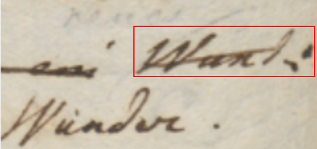
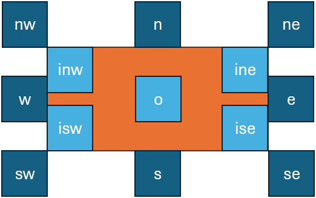

- [Diplomatic Model](#diplomatic-model)
  - [Graphical Approach](#graphical-approach)
    - [Animation](#animation)
    - [GSAP Model](#gsap-model)
    - [Animation Model](#animation-model)
  - [Symbolic Approach](#symbolic-approach)
    - [Pragmatic Signs Classification](#pragmatic-signs-classification)
    - [Symbolic Rendition Logic](#symbolic-rendition-logic)
      - [Visuals Catalogs](#visuals-catalogs)
      - [Computing Visuals](#computing-visuals)
      - [Positioning and Sizing Added Elements](#positioning-and-sizing-added-elements)
      - [Hint Model](#hint-model)
      - [Rendition Features](#rendition-features)
      - [Feature Adapter](#feature-adapter)
  - [Software Tools](#software-tools)

# Diplomatic Model

On the diplomatic side, our model should provide an at least approximate graphical representation of the snapshot.

>Note that this is not a requirement for the textual side of the model; we could just implement this without its graphical counterpart, which in some cases might be less relevant or too costly. So this is just an additional part of the model, which is anyway designed to preserve the separation between these two layers.

In the course of evolution of the project, two alternative strategies for representing visuals have been defined.

The original strategy is purely graphical, and more faithful in reproducing the facsimile image, literally re-drawing on top of it (via SVG), and positioning added text according to diplomatic metadata. Animations are used to represent the temporal flow of operations. This method, while accurate, can be complex and time-consuming, unless driven by a more automated data flow for imaging.

To enhance efficiency and provide more granular data at the visual level, a new, symbolic approach has been introduced abstracting the visualization process. Instead of redrawing each sign, operations are described using rendition features (like “diagonal line”, “box”, “cross”, "below and to the left", “shifted right”, etc.), while the visualization engine uses this visual grammar to do the math to properly size and position each element.

## Graphical Approach

As we have seen, the core of the textual model is represented by the chain structure, and by operations acting on it. Each operation is an act executed on the text, and in most cases corresponding to some graphical representation in the snapshot.

For instance, consider our usual mock snapshot:


Here I have highlighted each portion of visuals with a different color, corresponding to the operations represented by the snapshot:

- the red bar on top of `Z` represents its deletion.
- the yellow bar on top of `R`, continued to the left up to a `V`, represents a replacement: `R` is replaced by `V`. The visuals here are 3: two segments and a `V` letter.
- the orange bar on top of `V` and the `B` drawn above it are the visuals corresponding to another replacement. This time, `V` is replaced by `B`.
- the magenta arrow on top of `DC` represents a movement operation: `C` is moved before `D`, or alternatively, `D` and `C` are swapped. As in many other cases, here the choice depends on the one which best fits our interpretation.

So, at this level of abstraction, any annotation in our snapshot can be graphically represented by a set of visuals, corresponding to any mixture of geometric shapes and/or text, whatever its complexity.

As annotations are modeled as operations, this means that we can add the graphical representation of each operation as a set of visuals linked to it. This is essentially what is done by the diplomatic portion of the model, which adds these metadata to operations:

- `g`: the SVG `g` element graphically representing the operation this diplomatic information is attached to. SVG being XML, this is just a string in the object model. SVG here is the ideal candidate for this graphical representation, because it's a W3C standard for vector and interactive graphics in HTML pages. As an XML dialect, SVG can represent any geometrical form or text, with all its visual features, just with some text; and this is compatible with both HTML and XML, including of course TEI. Also, it can be made interactive and animated by controlling each of its elements via JavaScript. An SVG `g` element is a group, which may contain any type and number of shapes or texts, or even other groups. So, a single `g` element for each operation can represent any complex visuals for it, as a single unit.
- `features`: a set of generic features attached to the operation as a whole and related to its diplomatic aspects. For instance, we might want to add information about ink, size, etc. Features are modeled as already seen for the textual portion (name/value pairs).
- `element features`: this is a dictionary of features sets, keyed under SVG element IDs. The dictionary allows to attach features to a specific element of the operation visuals, rather than to their whole set. To this end, you assign an arbitrarily chosen ID to every SVG element you want to attach features to, and then add as many features as needed to it under the key of its ID. For instance, we might want to add a specific set of features to only the orange bar among the two visuals building the group representing the replacement of `V` with `B`.

So, this model not only links visuals to each operation, but also attaches optional metadata on the diplomatic side, both to the operation as a whole, or to any parts of its visuals. Yet, the model is very simple, because it rests on just text: SVG code for the visuals, and name=value pairs for features.

### Animation

Additionally, this bidimensional, geometric model can be further extended by adding the dimension of _time_ in the form of animations.

In depicting our interpretations of a snapshot, tracing back text versions to the actions performed by its author, animations can play a significant semantic role in the context of this model. Of course, they belong to the same realm of interpretation we have already distinguished in that model, but a digital publication can greatly benefit from them.

With reference to our architecture, animations must be designed no longer at the level of each single operation, but rather within the scope of the whole snapshot. For instance, think about a `B`  inserted between `A` and `C`: we might want to animate this insertion by moving `B` between these two letters, which in turn would require to be moved in opposite directions, so to make space for the new one. So, this goes beyond the scope of a single operation, and is rather contained in the snapshot as a whole.

As we have seen, a chain contains the representation of many versions of what we consider the "same" text, as defined by a set of operations. Each operation generates a new state for the text, representing a **step** towards the "final" state for the text, as reconstructed by our interpretation.

While there is a new step for each operation, usually not all these steps represent what we consider as a true **version** of the text. Anyway, in the model this is just a detail, implemented with a specific metadatum which tags some of the steps as representing a version.

The purpose of animations is visally hinting at the transition between two steps; so, animations are tightly coupled with steps. This has a number of implications, which help shape the model of animations in a simpler tool:

- each animation is _tagged_ with the step ID corresponding to its target state. For instance, if an animation must animate the transition between `v3` and `v4`, its tag will be `v4`. While many operations can stem from the same step (for instance, two different variants branching from the same base at different times), each operation always produces a different, uniquely identified step. This is what is used to link animations with steps.

- each animation deals with _all the visuals present in the snapshot up to its reference step, included_. So, if an animation refers to `v4`, and the steps preceding it are `v0`, `v1`, `v2` and `v3`, all the visuals introduced by these steps will be present and available for the animation. As the animation is a transition between the state represented by its source step and that represented by its target step, this in practice means that it is going to provide entrance- (and possibly side-) effects for the visuals in the target step. Thus, in our example we can assume that the visuals up to `v3` are all present and visible in the snapshot, while those of `v4` are present (as injected by executing the operation leading to `v4`), but not yet visible. It is the task of the animation to bring them into visibility with the desired transitions. For instance, a line representing a stroke on a letter to mean its deletion might be progressively revealed like a pen's trait, with a point which stretches into a segment, becoming longer until it reaches its final dimension. In this case, we start with this invisible segment, and apply an animation which gives the live effect of "drawing" it.

>In an autograph, visuals in fact accumulate on the snapshot as they get added to it step by step. Once added, unless we aim for some more abstract visualization their place no longer changes. So, introducing animation here is just a matter of animating the transition between a step with existing visuals to another one with additional visuals. This reflects the physical nature of the model: a snapshot is a set of graphical signs on a material support, and once these signs are traced, there is no way of undoing this action. Of course one can change his mind and graphically represent this by e.g. drawing a stroke on them, or even overwriting them; but once a visual is there, the very fact of its presence cannot be deleted.

- _animations are an optional feature_: the model can work even without them, and still retain its essential representative power. This allows different projects to choose whether to add this additional layer of data, or just be happy with the basic one. A snapshot without animations is just a sequence of still frames; whereas one with animations provides transitions between these stills, by means of value interpolation. Metaphorically, this allows moving from a gallery of single shots to a movie. When properly used, such animations convey more meaning rather than just being a fancy addition: they can help in leading the reader's attention to the crucial stages of a transformation happening right before his eyes, thus helping in understanding the evolution of a text along the time axis by actually using time for this purpose.

### GSAP Model

Animations are complex; yet, given that we don't need (nor desire) overtly complex features in our general-purpose model, we can leverage some existing software libraries to define a generic model for them.

Among the freeware libraries targeting web, one of the most popular and well-suited for these requirements is represented by [GSAP](https://gsap.com). The basic concepts and entities used there can be easily imported in our model.

GSAP is based on _tweens_. A **tween** is just a _property setter_, capable of animating any property, like for instance the position of an element, its size, rotation, color, etc. Its name clearly comes from the fact that animation essentially interpolates _between_ two different states of an object.

In GSAP, a tween object is created with a function specifying either its start point (`from`, assuming the current state as the end point), or its end point (`to`, assuming the current state as the start point), or both (`fromTo`).

Each of these functions gets these [arguments](https://gsap.com/docs/v3/GSAP/Tween):

1. a `selector` to define the target element(s).
2. a `vars` object, with all the properties/values pairs you want to animate (e.g. `rotation: 360`). This can also include some special properties, whose names are reserved to specify animation behaviors, like `duration`, `delay`, `ease`, etc.

In turn, tweens are contained in **timelines**, which can be further configured with `vars`, as for tweens. Timelines orchestrate the animations represented by tweens, coordinating their timing and order.

To add a tween to a timeline, the timeline object has corresponding methods (`to`, `from`, `fromTo`). This adds a third optional parameter, [position](https://gsap.com/docs/v3/GSAP/Timeline#positioning-animations-in-a-timeline), a string with its own syntax, used to precisely control where things are placed.

### Animation Model

The animation model here can be designed in compliance with a basic usage of GSAP:

- `timelines` (`AnimationTimeline`): a dictionary of 1 or more timelines, keyed under version tags. Each version can thus have its own animation, as it's selecting and reordering a subset of operations on the chain. Each timeline contains a set of tweens.
  - `tweens` (`AnimationTween`):
    - `label`: a human-friendly label for the tween.
    - `note`: a free text note about the tween.
    - `type`: whether it animates from current state to another one (`to`), vice-versa (`from`), or specifying both initial and final states (`fromTo`).
    - `selector`, usually the target element ID. This can be the ID of any of the elements in the SVG code of any operation with a visual representation in the whole snapshot.
    - `vars` (`AnimationVars`, a map where keys are strings and values are strings, numbers, or booleans): a free object with variables to be animated, whose values can be scalar or other objects. As GSAP is JavaScript-based, the object can be encoded as a JSON string. Anyway currently we limit the logic to scalars, as it seems there is no need for more complex values here.
    - `position`: this is just a string.

>A timeline can be easily transformed into a set of instructions for GSAP. Essentially, a tween is created with the timeline's function corresponding to its type (`to`, `from`, `fromTo`), which gets as parameters selector, vars and position from the corresponding tween's properties. In tweens, both label and note have no usage, except facilitating the users work in editing the timeline.

## Symbolic Approach

While the graphical approach provides a faithful representation of visuals, for scalability reasons it is better fit to a flow where imaging is managed with some level of automation. For instance, in a HTR-based scenario one could leverage the regions defined by this process to support the digitization of signs and their connection with operations.

Anyway, especially those scholars more versed in traditional philology having to redraw non-textual signs on top of the facsimile and manually position text on it (via features like `x` and `y`) would be time-consuming, and possibly distracting when they mostly focus on text.

Also, it could be interesting to provide a more computable, and thus more abstract, representation of visuals, so that one could also analyze the distribution of their features among carriers and their relationship with their meaning. A specific visual representation might be typical of a period, a set of documents, a hand, etc; and from a paleographic point of view, one might be even interested in collecting, classifying, and quantifying the distribution of signs with their meanings.

So, an alternative approach has been designed, whose model relies on operation features and on a sort of catalog of visuals with their animations. Here, it is no longer the user, but the software which draws signs on a surface on their behalf, following directions provided by features and taking care of all the heavy math to size and position them.

### Pragmatic Signs Classification

The symbolic approach is a more abstract model based on a pragmatic classification of signs. The best way to illustrate it is starting with the real-world image in Figure 1:


- Figure 1 - A couple of words on an autograph sheet

This image shows the end of a line ("... Wund:"); below and slightly to the left of the final word "Wund:", a replacement word "Wunder." has been written.

So, let us consider the types of these signs. The most obvious type is the **base text** itself: here "Wund:" is part of it.

After the base text was written, many other signs were added later. One of them is a diagonal line crossing this word; this line hints at the _deletion_ of it. So, the meaning of this sign is an editing operation; it literally _hints_ at it. We call these signs **hints** right because of this. They are the visual counterpart (when there is any) of editing operations.

Another type of sign is then the word which was meant to replace "Wund:": "Wunder.", written below and to the left of it. With reference to the base text, which is our starting point, this is **added text**.

So, we are _removing_ Wund, and _adding_ Wunder. In simpler terms, we are _replacing_ "Wund:" with "Wunder.". That's our editing operation. The line hints at it, and the new text added by it is written below.

In fact, a replacement is a higher-level operation which could be represented with a delete coupled with an insert. Operations in our model are the mean by which scholars formalize their interpretation of the carrier and indirectly modify the chain data structure, which in turn generates text versions. The creative process being reconstructed is a sequence of such operations, which belong to the subjective layer of interpretation. So, right because of being the middleman between chain data and scholars, operations are modeled at higher level, which better fits a human point of view. Thus, we are not limited to just delete and insert, but we include operations like replace, move, swap, and annotate.

Among operations, only insert and replace add new text. So, whenever they are used, new text nodes will be added to the chain.

Thus, in our example we have a single replacement operation, having two visual counterparts:

- the diagonal line on top of the old word. This is a _hint_.
- the new text written below and to the left of the old word. This is _added text_.

So, from the point of view of our visualization, we define three types of signs on the carrier: base text; text added by operations; and hints which visually correspond to them.

These are the entities involved in the visual presentation of our snapshot. Added text and hints taken together are also known as **added elements**, because they were added later with reference to the base text.

>"Element" in the context of visualization is a specific term belonging to its XML-based encoding, as the visualization relies on SVG.

It should be noticed that the distinction between hints and added text is not a visual one; as for all the signs in this classification, it is functional to the rendering logic. For instance, it may well happen that a hint is represented by text, like the number of an epigram written on its corner, or a textual annotation. Even then, the hint is different because it is just the optional visual counterpart of an operation, and does not represent text which becomes part of the epigram's text. So, it may have the appearance of text, or more frequently be just some freehand drawing; but in both cases, it never represents a part of the text being transformed.

So, in our example the replacement operation's _hint_ is only the line above the old word, while the new word replacing it is _added text_, and becomes part of the epigram's text in the text version(s) following it.

### Symbolic Rendition Logic

From a practical standpoint, the logic for rendering text and added text is essentially the same: in both cases we are just drawing text, belonging to the text being transformed.

The real difference is essentially in time: the base text is the entry point for the transformation, typically written with a regular and predictable layout; while added text was introduced later, in an unpredictable way and at any position (usually wherever there is space near to the text being transformed), following the creative process.

This implies that:

- **base text** can be rendered with a simpler logic, essentially equal to that which dictates the arrangement of characters in lines on a sheet of paper. Characters follow each other on the same line, until the next line starts. Of course, this layout can occasionally be modified; for instance, whatever the reasons, a portion of the text might be written with a different size, or along an offset or rotated baseline. Anyway, these are occasional departures which can be implemented by overriding the default logic.
- **added text** instead is placed and sized freely, reflecting its appearance on the carrier.

#### Visuals Catalogs

As for **hints**, these can be text (not belonging to the text being transformed), freely sized and positioned like added text, or more often pure geometrical elements, like lines and shapes. So, their appearance is totally unpredictable, as in theory everything could be drawn on a sheet. This is why in the original approach the diplomatic metadata of an operation includes an SVG code fragment, which represents the visual appearance of its hint.

So, we could never be able to predict all the shapes of all the hints found on a sheet, especially when crossing project borders (which is implied by the generic vocation of this system). This implies that our model must be open and capable of representing any drawings.

Nonetheless, it is also true that, especially within a single project's borders, hints can be easily grouped into repeatedly used **types**. Many of them also have a nearly universal use, like the line on top of a word, meaning its deletion.

So, even if each line drawn on the sheet is unique, and corresponds to a unique act happened in time, it can easily be traced back to a single pattern: the symbol for a line. This is an abstraction, but the departures from its ideal appearance can be easily discarded as irrelevant, just like when listening to a speech we discard allophonic variants and identify the immaterial phonemes behind these surface expressions.

Sure, to provide more details, we could multiply these symbols: for instance, we could have one type for the horizontal line (`—`); another for the diagonal line raising from left to right (`/`); and yet another one for the diagonal line lowering from to left to right (`\`). The level of detail depends only on the project's nature and purposes.

Anyway, whatever our choice, in the end we could always define a sort of **catalog of signs** representing hint types, like "horizontal line", "diagonal line up", "diagonal line down", "cross", etc. These would all be abstract types, discarding the single details of each specific stroke drawn on the paper; but they would capture their essential nature, dropping accidental features, while preserving all the different types required by our model.

Thus, the first ingredient for our visualization would be a catalog of hints, each with its own appearance and a set of metadata. Most of these metadata concur to define the behavior of each hint with reference to its rendition, like sizing, positioning, rotation, scale, etc.

Among them, one also connects the hint to its entrance **animation** in the visualization stage. As already remarked, animation here is not just a fancy feature, but it is crucial for the semantics of a visualization which fully embraces the flux of time.

In fact, whatever the approach, graphical or symbolic, a crucial aspect of this model is time: we focus on the transformation process happening during time, step after step, replaying what the writer did, at least according to our reconstruction. In visualization, time means animations, for each state transition.

As we focus on process, animation here is a semantic factor, rather than a fancy decoration. In a traditional approach, we deal with a previous stage, and a next one. We then represent this transformation in terms of its effects, by diffing two stages and emphasizing their differences. For instance, comparison shows us that in stage two something has been deleted; and something has been added. The process remain hidden behind its surface effects; and when faced with tens of stages, figuring it out becomes hard.

In the VEdition approach instead, we replay all the steps between two stages, operation after operation. For instance, we first transform a text by deleting some portion of it: visually, a hint like a diagonal line enters the stage via an animation to represent this. Then, we add some other text, which visually corresponds to this new text entering the stage, again via an animation. So we can literally see the text transforming under our eyes, until it gets to the next alteration stage.

This is why not only each operation is linked to any number of visual hints; but also why each hint in turn is linked to an enter animation.

So, each hint progressively unveils itself, rather than abruptly appearing: this fits the continuous flow of changes occurring along time, and usually mimicks the act of drawing that hint. For instance, a diagonal line can enter via a "wipe-right" animation, which mimicks the effect of drawing it from left to right with a pen on paper.

Here too, we can leverage the same approach for an even more efficient representation: rather than providing a specific animation for each hint instance, we can reuse animations just like we reuse hints. So, the hints catalog stays side by side with an **animations catalog**, and each hint just reuses an animation from it, except when the hint's structure is so peculiar that it requires its own animation.

#### Computing Visuals

So, the first ingredient for our visualization is a catalog of visual assets, including SVG code fragments for hints drawings, and JavaScript code fragments for their animations.

The second ingredient is a set of metadata providing a declarative approach to the visualization logic of elements. This metadata is nothing new in the backend model: it is just a set of operation's features, specifically designed for visual rendition, and thus named **rendition features**.

>As a general rule, all features starting with a prefix ending with underscore (e.g. `r_`) are conventionally considered to be functional features, which are not usually displayed to end users among text metadata.

The purpose of these features is _overriding_ some of the default properties of the elements being drawn. All elements follow a general logic for their size, position, and transformation, which allows the software to display them on behalf of the user; rendition features just provide specific behavior for them, so that they can reflect the actual sigs on paper.

For instance, when rendering text the software uses a preset font family, size, and style; but you can change any of them using rendition features which specify new values. Rendition features are specified by users, just like any other features belonging to operations. So the operation continues to be the core representational device handed to users.

So, declarative metadata for visualization essentially has two sources:

- the default metadata, specified by the settings of the software component used for visualization. These settings are thus specified by the page hosting that component. If not specified, they fallback to default values defined by the component itself.
- the metadata specified by users via rendition features.

In both cases, this metadata is meaningful in relation with the **rendition logic** defined by the visualization component. This logic drives the whole visualization, and makes its elements predictable, so that users can expect a specific outcome when adding a specific set of features.

As we have seen, the default rendition logic for text is simple: it just displays one character after another on the same line, until a line-end character is found, using default font properties. Rendition features can be used to customize all the relevant features of such text, including its position by offsetting it. For instance, this is useful to represent indentation or gaps.

With reference to this, the only peculiar aspect of added text is that its position is not determined by this predictable line-based layout, like for base text; added text position is totally arbitrary. The same is true for hints, which can appear everywhere. So, in this respect all added elements (added text or hints) share the same positioning logic.

The logic for added elements is first dictated by the assumption that all added elements by definition _refer to base text elements_. This is a consequence of the fact that added elements represent annotations attached to the base text. For instance, the position of the word "Wunder." in Figure 1 above is defined with reference to the word "Wund:" it is going to replace: it appears below and to the left of it. This assumption thus follows the logic behind the annotation process, reflecting the fact that its actors look at the text they are willing to change, and then add annotations to it in some empty space, usually near to it. So again here the model mimicks the reality of the creative process.

Now, everything the software draws on top of its virtual sheet is text or any type of geometries (using the SVG standard, which was designed right to provide vector-based drawing for HTML pages). So, the software component in charge of rendering the snapshot is completely based on 2D geometry. The sheet is a Cartesian plane, and the signs on it are geometrical shapes (including text, which can be regarded as a set of geometrical paths).

So, to make it general and simple enough, the rendition logic reflecting this reference to the base text adopts the concept of what we call a **reference text bounding rectangle** (RBR for short): this is just the imaginary rectangle we can draw around the reference text to include it (Figure 2)



- Figure 2: the concept of the RBR for "Wund:" (in red): in rendition, it rather refers to the rendered text for that image

Of course, given that this visualization is totally feature-driven, and features are based on operations, the concept of "reference" text is determined by the operation's type and the text it affects. For instance, in a replacement or in a delete operation the reference text is the text being removed; in a move or swap operation is the text(s) being moved; in an insert operation it is the "anchor" text before or after which the text is added.

>This implies that in cases where the reference text is split across multiple lines, there will be multiple RBR's, one per line. The software takes care of this detail anyway, by using the same rendition logic multiple times for each of these RBR's, where it is sound. For instance, a stroke on top of a text representing its deletion will be repeated for each RBR, thus covering the whole text; but a hint with a text annotation will be displayed only once, despite multiple RBR's.

#### Positioning and Sizing Added Elements

Once we have defined the RBR, we can then define the position of added elements in relative terms, with a very intuitive model, just like we say that "Wunder." is "below and to the left of" the word it replaces. The software defines a dozen of **relative positions** which can be specified via a rendition feature, as usual, and use abbreviations from cardinal points (Figure 3).



- Figure 3: positions relative to the RBR: the RBR is orange, positions are in blue/cyan

So, in our example the word "Wunder." position is `sw`. So in the end positioning an element is essentially equal to positioning its bounding rectangle with reference to the RBR, like in Figure 3. The `o` position represents the `origin` of the rectangle, i.e. its center.

As most hints (like e.g. lines or boxes) are drawn on top of reference text, the default position is `o`. Also, for hints the RBR is not only the source for their position, but also for their **size**. By default, hints are effectively sized as their RBR: a hint is picked from a catalog, where it has an intrinsic design size, but then it is shrunk or enlarged to fit the RBR size. The effect of this adjustment is that everything which is designed to be drawn on top of reference text fully covers it, as expected. For instance, the diagonal line on top of "Wund:" in Figure 2 will fully conver that text, right because it is the diagonal of its RBR.

This is why the default position for hints is `o`, and the default size is the size of the RBR: this will result in a default behavior which covers the whole reference text. For instance, suppose we would like to draw a box around a word. This happens in our VEdition texts, especially to visually connect two portions of text which are distant, like a replacement word which instead of being above or below a line is far from it, at the top of the whole epigram. This is just due to the accidental circumstance of lack of space, and to make it clear that this word is going to replace one word far below, inside the epigram's text, both the original word and the new one are boxed.

In this case, the model provides a perfect parallel to reality: we can represent this with three operations. Just like the author first boxed the word to replace, then added the new word where he found some space, and finally boxed the new word to link it to the replaced one, we can use this sequence of operations:

1. _annotation_: an annotation operation whose purpose is just to box the original word. This contains the proper rendition features to draw that box, i.e. at a minimum a "hints" feature which tells which are the hint(s) for this operation. In this case its value will be the ID of the hint representing a box, like `box`. The hint's SVG code fragment will just include a rectangle.
2. _replacement_: this effectively changes the text by replacing one word with another one. Note that this operation has no hint in itself, as it is rather part of a sort of "macro" operation (=the three operations we are listing -- you may recall that the operation model has a group ID property, right for the purpose of grouping logically connected operations). Yet, it does have an added text, because it is adding a new word. The added text will be drawn with the size defined by its content and the default font properties (unless overridden by feature properties).
3. _annotation_: this final operation annotates the newly added text with the rendition features needed to draw a box around it, just like we did for the first operation.

Now, this example was not chosen by chance: if we think about it, it has an additional complication: the text being added is **displaced**, far from its reference text; and as we have seen, the position of any added element is always determined by that of its RBR. So, how can we represent this displacement without introducing ad-hoc logic, which would disrupt the elegant generalization of this predictable rendition logic?

The solution is in the logic itself: all added elements still continue to be positioned with reference to the base text; only, here it is the base text to use as the reference which changes. Instead of using the RBR of the replaced text, we will be using the RBR of the text which happens to be found right below the added text, because in our case the added text was written a the top of the epigram. In other terms, it was written above the first line of it, aligned to some specific portion of that line. So, all what we need to do is to override the RBR of the operation with another one, provided by one of its rendition features. Thus, the replacement operation will carry a rendition feature which specifies which portion of the base text should be rather used to compute the RBR: this will effectively displace the added text, positioning it right where we want it.

In the same way we can also represent another detail: the fact that the displaced text is added far above the epigram's first line, so that it's clear that it is not really referring to that line. Again, this is easy to represent by just adding another rendition feature, which specifies a vertical offset from the originally computed position. If our relative position is `n` (=north, i.e. at the top of the displaced RBR), our vertical offset will subtract a certain value to move it upper (the origin of our Cartesian plane is at the top-left corner, so decreasing its Y coordinate will mean moving an element up). So in the end we will add a couple of features: one which displaces the RBR, and another which offsets the computed position up, thus faithfully reflecting what is found on our sheet.

>Note that offsets can be specified not only in pixels, which is the most granular unit, but also in units relative to the text size: `th` for text height, and `tw` for text width. This allows users to provide an approximate value even without measuring the distance in a more precise way.

This solution preserves the general RBR-based logic, by simply overriding the RBR via an operation's feature, not differently from when we override the default font properties of an added text to customize it. So in the end, all what users do is specifying the operations representing the creative process. Their visualization is totally computed by software, orchestrating default settings, operation's features, and visuals catalogs.

From the user's standpoint, this approach is far more efficient than the graphical one; users just focus on the reconstruction of the creative process, specifying operations and adding to them also some abstract rendition features designed to be general, human-friendly, and yet powerful enough to drive the rendition computed by software. Operations here literally drive not only the transformation of text over time, but also the drawing of all the visuals which represent its evolution, as documented by the carrier. Just like the text changes operation after operations, so visuals accumulate on our virtual sheet reflecting them. At the end of the process, those visuals will be the faithful, yet more symbolic representation of the signs in our sheet, accumulated over time, one after another.

Focusing on a dynamic process, rather than just comparing different static stages, is the core of our model; this is nearer to the reality of the making of the text, and the same holds for both the textual and graphical sides of the model, which reflects the reality of its material counterpart. Essentially, once you write a sign on a sheet of paper, it stays there forever. You might draw a stroke on it, overwrite it, or whatever else hints to its change; but yet, the sign is there, and we are just adding new signs.

The same happens for our model. On the textual side, we have seen that the chain structure contains a set of nodes and a set of links, and any operation just adds items to those sets. Once any item is added, it stays there forever. On the graphical side, any sign we add to our drawing surface, whether it is text or any line or shape, gets accumulated operation after operation, until we reach the final stage where all the signs on the carrier are represented. So again, once a sign is added, it stays there forever; we just add more and more signs during the process. The enter animation of each hint or added text further emphasizes the continuity of this transformation process, fully embracing the flux of time and literally re-playing it below the user's eyes.

#### Hint Model

While added text is just text rendered as such, combining the default settings with its rendition features, hints have a more complex model. Each hint essentially is an SVG fragment representing something to be rendered on the component text rendition area and corresponding to a specific operation. As we have seen, hints are defined in a catalog, and linked to operations via a specific rendition feature (`r_hints`: see [below](#rendition-features)), which contains the IDs of all the hints to use for that operation. For instance, `r_hints` = `alpha beta` means that we want to apply 2 hints with ID `alpha` and `beta`, in this order.

The hint has these **properties**:

- `svg`: SVG code for hint's visuals, always having a root g element.
- `position`: relative position for the hint.
- `offsetX`: absolute (10) or proportional (`0.5th` = half text height, `0.5tw` = half text width).
- `offsetY`: absolute (10) or proportional (`0.5th` = half text height, `0.5tw` = half text width)
- `scaleX`: horizontal scale: `1` = match bounds width, `1.1` = 110% of bounds width.
- `scaleY`: vertical scale: `1` = match bounds height, `1.1` = 110% of bounds height.
- `rotation`: optional hint's rotation (`0`=none).
- `animation`: JS code for animating the hint's entrance via GSAP.
- `displacedRefSpan`: a span of base text with format IDxN where ID=node ID and N=count of chars to include, to be used as the RBR instead of the default RBR.

The hint's `svg` property is a string representing the SVG content of a hint. The SVG content has these characteristics:

- by convention, its **root element** is always a `g` element. This allows to manipulate the whole hint as a single entity (e.g. for transforming or animating it). So, there is no `svg` root; this is just a code fragment.
- inside this root `g` element we can have **any SVG code** with groups, shapes, lines, text, etc. Apart from sizing and positioning it, and possibly overriding some of its properties dynamically (e.g. color, text decorations, etc.), the component will just render it as it is.
- it may contain a **handle** element with `id`=`handle`. This represents the "handle" for the SVG code, i.e. the point in it which is used as _the reference for positioning it_. If there is no such handle element, then the component just uses the _bounding rectangle_ for the whole SVG (i.e. its root `g` element, which is always present). Often, in the hint SVG code the handle element has opacity=0 so it is not visible; but this is up to the SVG code you get from the hint. Anyway, the setting `showHintHandles` can force such hidden handles to be displayed setting their opacity to 1 for diagnostic purposes.
- it may contain a **placeholder** element with `id`=`placeholder`. This is usually an SVG shape, like a rectangle including a `text` SVG element which represents the text to draw, or directly a `text` element. Whatever the placeholder element is, in the end it either is a `text` element, or it contains a `text` element. This text element has this behavior:
  - its _text value_ is resolved at runtime: in the hint SVG, it is just the _name of the variable_ containing the text. This is equal to the name of a _feature_ which is supposed to be provided by the same operation the hints belongs to. If a feature with this name is not found, the text value will just be the feature name, so that users will be able to understand that there are issues in their data.
  - as for its _size_:
    - when the hint's placeholder element has a `class` attribute equal to `fit`, the text's size is calculated so that its content fits the container element with the `placeholder` ID. For instance, the SVG code of the hint might represent a callout for insertion, where the balloon is a rectangle with id=`placeholder`, and the line ends into the handle point. This way, the text being added will appear inside the balloon. So, here the text must fit into the container.
    - else, the text value and the settings for drawing it determine the resulting size of `text`. This implies that all the SVG elements containing this `text` element, including the root `g` element, must scale to fit it inside them. So, this is the inverse case with reference to the default one: here the container must fit the text.

Also, the SVG code in the hint's `svg` property can include **placeholder variables**, which are wrapped in `{{...}}` ("whiskers") and are represented by the name of the feature we want to get the value from. For instance, `<rect width="100" height="50" fill="{{r_color}}" />` has a placeholder `{{r_color}}` meaning that we will have to replace it with the value of a feature named `r_color` (or with nothing, when that feature is not found).

Finally, the hint's `animation` property defines its enter animation. It can include:

- the JavaScript code fragment using the GSAP library for animating the hint's SVG.
- the identifier of a preset animation using the GSAP library for animating the hint's SVG, prefixed by `#`. So, if the string starts with `#`, it is assumed that it just contains the ID of a preset animation which must be retrieved to get the corresponding JavaScript code. Such preset animations can be defined in the component's settings.

>⚙️ We use GSAP for animations because it's robust and powerful, and has many powerful plugins available. Note that while plugins first were limited to paid subscriptions, they are now _freely available_ for everyone. All what is required to use a plugin is registering it once in code, e.g.:

```ts
// register a plugin for use
gsap.registerPlugin(DrawSVGPlugin);
console.log("DrawSVG plugin registered:", gsap.plugins.drawSVG !== undefined);
```

The GSAP animation targets the hint's root `g` element, i.e. the whole hint.

>⚠️ Note that the rendering component is a custom web component, so that it uses Shadow DOM and we thus need to _explicitly provide a reference to this element_ to the GSAP code (otherwise, GSAP would not be able to use `getElementById`). So, the rendering component:

- creates the hint's `g` element.
- creates a JS function wrapping the JS animation code got from the hint, and receiving these parameters:
  - `gsap`: the global instance of the GSAP library, defined once outside this JS code;
  - `hintEl`: the created hint's root `g` element;
  - `rootEl`: the root `svg` element of the whole text rendition area, should it ever be required by the GSAP animation code.

💡 As for GSAP reference, see:

- [GSAP Documentation](https://greensock.com/docs/)
- [DrawSVG Plugin](https://greensock.com/docs/v3/Plugins/DrawSVGPlugin): plugin for animating SVG.

#### Rendition Features

The rendition features defined cover almost all the visualization aspects it could be useful to customize. Here's their list:

- `r_char-offsets` (this is applicable only as an init-feature, i.e. the feature assigned to the first operation in our snapshot when this operation is an annotation operation): the character offsets for rendering some specific text nodes (and thus indirectly also all the character nodes following it, up to line end). In most cases, this is used to change line layout by adding indent, or increasing or decreasing space between lines. Usually, text is rendered in a regular, predictable way, just like text is normally rendered in frame: one character after another on the same baseline, until a newline character is found. When this happens, a new line starts below the previous one, left-aligned with it. This is the default layout which assigns the position to each baseline, according to general settings defined in the component's settings (default font size, default spacing between lines, etc.). This default position can be changed for specific characters by the value of this feature, whose format repeats the pattern `ID:y=...,x=...` (where we can specify only `x`, only `y`, or both, in any order; values represent `px` units). In this pattern:
  - `ID`=character ID. Each character has its unique numeric ID directly got from snapshot data. So here we target the character to be offset. As per the general text layout rules, once we offset this target characters, all the other characters will follow on the same baseline, unless any of them has another offset.
  - `y`=Y offset to add to the computed character baseline, thus shifting its default position down (when the offset is positive) or up (when the offset is negative).
  - `x`=X offset to add to the computed character baseline, thus shifting its default position to the right (when the offset is positive) or to the left (when the offset is negative).
- `r_char-offset`: this works as `r_char-offsets`, but it is provided in the features of a single character node, instead of being an initial setup for multiple characters. For instance, `3:y=10,x=20` means that before rendering the character with ID=3, the baseline will be shifted down by 10 and the X position of the next character will be offset by 20, thus effectively leaving a wider gap between the previous character and the next ones. All the following characters up will follow on this newly defined baseline, unless any of them happens to have another offset.

>The logic for these two features, `r_char-offsets` and `r_char-offset`, is equal; the only difference is that the former works on multiple characters at once. This is preferable to having just `r_char-offset` and using it multiple times, because when a character gets an offset, this affects not only it, but also all the following characters. So, order of application matters, and this could not be ensured when using multiple features, unless introducing ad-hoc logic which would be against generalization.

- `r_font-family`: the font family.
- `r_font-size`: the font size.
- `r_fore-color`: the foreground color.
- `r_back-color`: the background color.
- `r_italic`: the italic value (boolean).
- `r_bold`: the bold value (boolean).
- `r_underline`: the underline value (0-N being the thickness in `px`).
- `r_overline`: the overline value (as for underline).
- `r_strike`: the strikethrough value (as for underline).
- `r_text-line-style`: the style of overline, underline, or strikethrough: `solid`, `dotted`, `dashed`, `wavy` (as in SVG and CSS; corresponds to SVG `text-decoration-line`).
- `r_text-line-color`: the default color of the overline, underline or strikethrough.
- `r_rotate`: the rotation amount to be applied to each single character.
- `r_hints`: this feature is used to link the operation to any number of hints. The value is a space-delimited list of hint IDs, in the order they should be rendered for that operation.
- `r_hint-vars`: this has no effect on text; it is just a rendition feature used to define a set of variables to be used by hints placeholders. Each variable has format `name=value`, and is separated with space. For instance, `color=red bold=1` to pass variables `color`=`red` and `bold`=`1` to the hints being rendered for the operation being processed.

The following text rendition features are applicable only to **added text** (=text nodes added by insert/replace operations):

- `r_t-position`: the relative position of added text.
- `r_t-offset-x`: the X offset for the added text, relative to the computed `r_t-position`.
- `r_t-offset-y`: the Y offset for the added text, relative to the computed `r_t-position`.
- `r_t-solid`: a boolean value (`1` or `0`), telling whether the added text behaves as "solid" (thus triggering elements spreading when added in a place where there is not enough room for it) or not (which is the default).
- `r_t-displaced-span`: a span of base text with format `IDxN` where `ID`=node ID and `N`=count of chars to include, to be used as the RBR instead of the default RBR.

> All these features can be combined. Also, in backend all rendition features have their lifespan limited to the version generated by their operation. This avoids accumulating them in the output context, ensuring that they are valid only for the immediate output of the operation containing them.

The following rendition features are applied to **hints** only to override its corresponding property:

- `r_h-position`: override hint's `position` property.
- `r_h-offset-x`: override hint's `offsetX` property.
- `r_h-offset-y`: override hint's `offsetY` property.
- `r_h-scale-x`: override hint's `scaleX` property.
- `r_h-scale-y`: override hint's `scaleY` property.
- `r_h-rotation`: override hint's `rotation` property.
- `r_h-solid`: override hint's `solid` property.
- `r_h-displaced-span`: override hint's `desplacedRefSpan` property (for displaced hints).

>By default, the hint rendition features apply to ALL the hints in the operation (those listed by the `r_hints` rendition feature), unless the property value starts with `@` followed by a space delimited list of hint IDs, ended by `:`; in this case, it applies ONLY to those hints matching the list. For instance, `r_h-position`=`e` applies to ALL hints overriding their `position` property to `e`; while `@alpha beta:e` applies ONLY to hints with IDs `alpha` and `beta`, overriding their `position` property to `e`.

Additionally, another layer of abstraction can make operation metadata even more efficient. Side by side with those abstract, yet still lower-level rendition features, which directly specify position, color, font size, and the like, the symbolic approach also allows for the definition of **higher-level features**, acting as a shortcut towards multiple lower-level counterparts.

For instance, consider a real-world example like the numbers later added to some epigrams, to define a collection by specifying their relative order in it. Now, in many cases, this number was made in the context of a single session by a single hand, and thus it typically features a similar appearance and position.

Let us say that in our case the number is written with a smaller text, a brown ink, rotated by about -45 degrees, at the top-left of the epigram, rather offset from it: in this case, we would just have an annotation operation, and users could pick from a list a higher-level feature like `epigram-nr`, entering its number as its value (like `epigram-nr`=`12`), in all the epigrams using the same type of mark.

Then, an adapter software layer would be used before visualization, translating this single feature into multiple lower-level features defining the hint to show (a note with a textual placeholder, here filled with `12`), its position and offsets, color, rotation, and scale. This results in an even more abstract and thus more economic annotation strategy.

#### Feature Adapter

The feature adapter is a software service which can be used when hosting the rendition web component in the context of your page, right to provide this translation from higher-level features into the basic rendition features listed above. This adapter starts with a set of features, and transforms it into another set of features. So, it is completely transparent to the rendition component, and is applied to data which feed it before they are passed to the component itself.

The feature adapter works in two steps:

1. **match** the features which must be adapted.
2. **process** each match.

Both these steps are configured by the adapter settings.

The features to be matched are defined by a small DSL with this syntax:

- 1 or more **clauses**, separated by logical operators: `AND`, `OR`, `AND NOT`, `OR NOT`. These follow the standard precedence in boolean algebra: so first NOT, then AND, then OR.
- **whitespace** separate tokens.
- clauses can be grouped with **brackets** `()` for precedence.
- each **clause** has format:
  1. **name**: the feature name.
  2. **operator**: the value comparison operator to use. This can be:
     - `=` equals.
     - `!=` not-equals.
     - `^=` starts-with.
     - `$=` ends-with.
     - `*=` contains.
     - `?=` matches-wildcards `?` and `*`.
     - `~` matches-pattern: matches regular expression.
     - `==` numeric-equals: first cast to numeric value, and if this succeeds compare for equals, else return false.
     - `<>` numeric-not-equals: first cast to numeric value, and if this succeeds compare for equals, else return false.
     - `>` numeric-greater-than: first cast to numeric value, and if this succeeds compare for greater-than, else return false.
     - `<` numeric-less-than: first cast to numeric value, and if this succeeds compare for less-than, else return false.
     - `>` numeric-greater-than-or-equal: first cast to numeric value, and if this succeeds compare for greater than or equal, else return false.
     - `<` numeric-less-than-or-equal: first cast to numeric value, and if this succeeds compare for less-than-or-equal, else return false.
  3. **value**: the value. Its content depends on the operator used. If the value includes spaces, it is wrapped in `""`.

>In clause, operator and value can be omitted if all what we want to match is the feature name.

For instance:

- `note` matches a feature with name=`note`, whatever its value.
- `note^=corrected` matches a feature with name=`note` and value starting with `corrected`.
- `note^=corrected AND (color=red OR color=green)` matches a feature with name=`note` and value starting with `corrected` and either a feature named `color` with value equal to `red` or a feature named `color` with value equal to `green`.

Additionally, each clause can be wrapped in square brackets when you want to capture its name and value, similar to what happens in a regular expression when capturing groups in the matched text. So, `[note^=corrected]` means that we want to capture into a numbered group (1, 2, 3... in the order the captured clauses are specified) the name and value for the matched note feature. Then, in the feature replacement stage, we will use this number prefixed by `$` as a placeholder for the captured name or value, e.g.:

- `$1.name`=captured feature name.
- `$1.value`=captured feature value.

To name a group, rather than using the ordinal number, you can specify the name after `[` and before `:`. For instance, `[corr:note^=corrected]` captures the matched feature into a group named `corr`. So, in this case we would have:

- `$corr.name`=captured feature name.
- `$corr.value`=captured feature value.

## Software Tools

The visualization of a GVE snapshot data model is very complex, and yet it is a crucial part of the system, focused on representing a process over time rather than based on comparing multiple static versions of a text. This is also why animation plays a semantic role in it, rather than just being a fancy addition: it embodies time and allows to unwind the text transformation process under our eyes.

As for any DH project, the point of VEdition is not only provide a solution perfectly fit to its object, but also to generalize it so to offer to the community a paradigmatic model with its software tools. So, just like we provide a full-featured web-based editor for creating data using our model, we also provide reusable tools to visualize them using this complex logic.

As these tools must be integrated in any frontend, from a simple vanilla HTML page to a full-fledged web app, we need to implement them using the most neutral and reusable technologies. In this case, the task of visualizing a snapshot is delegated to a custom web component. **Custom Web Components** allow developers to define new HTML elements that encapsulate their own structure, style, and behavior, making them reusable across any web environment. Because they rely solely on standardized browser APIs -- Custom Elements, Shadow DOM, and HTML Templates -- they remain framework‑agnostic and can be embedded seamlessly in contexts ranging from static HTML pages to complex frontend frameworks. This ensures strong encapsulation (avoiding CSS or JavaScript conflicts), high reusability, and long‑term technological neutrality, which is essential for DH tools meant to be adopted by diverse communities and infrastructures. In the end, all what it takes to use a custom web component is importing its JavaScript code once, and then use its tag just like any other standard HTML tag.

So, in the context of the GVE system these are the main software components:

- core logic in backend.
- web API surface exposing the core logic, which can be consumed by any software.
- web app with a full-fledged editor for entering snapshot and other data, based on the [Cadmus](https://vedph.github.io/cadmus-doc) system.
- custom web components for snapshot visualization.

In more detail, currently 3 custom web components are available:

- the web component for the **original (graphical) visualization**, currently integrated in the editor.
- the web component for the **symbolic visualization**, to be completed and then integrated in the editor.
- the web component for **editing visual catalogs** of hints with their animations. This is added to provide a more effective tool to design hints visually with SVG code, create and test GSAP-based animations, manage hint variables for placeholder resolution, and save/load hint data to/from JSON files.
