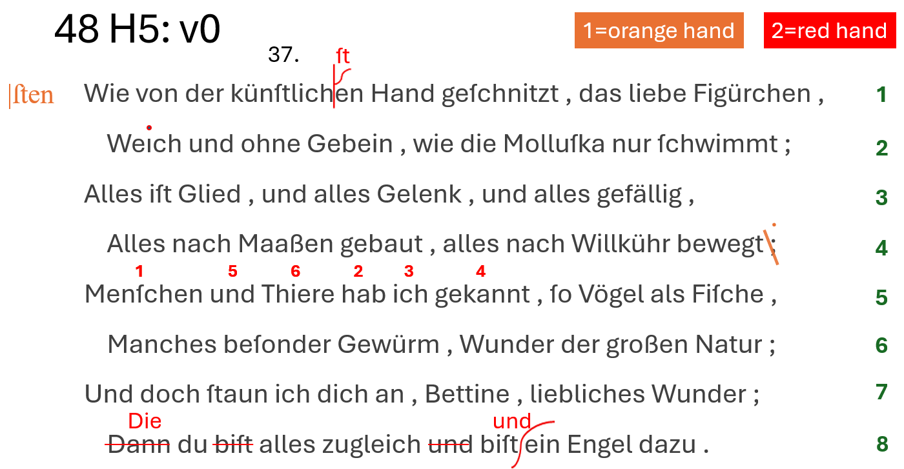

# Example: H5-48

🚀 demo: <http://gve-rendition.surge.sh/?sample=h5-48>

This is a real example from Venetian Epigram H5-48 as per our project numbering. Figure 1 shows a symbolic facsimile, with added line numbering for reference. There are two hands, one in pencil (orange), and another in red ink.

As for the numbers over words in line 5, they are ultimately red, but in this case the second hand just wrote with red ink on top of pencil to confirm the reordering represented by these numbers. So, this is not visible in Figure 1, but will appear in the interactive visualization.



- _Figure 1: H5-48 text facsimile_

## Base Text

▶️ (1) the base text is:

```txt
Wie von der künſtlichen Hand geſchnitzt , das liebe Figürchen ,
Weıch und ohne Gebein , wie die Molluſka nur ſchwimmt ;
Alles iſt Glied , und alles Gelenk , und alles gefällig ,
Alles nach Maaßen gebaut , alles nach Willkühr bewegt ;
Menſchen und Thiere hab ich gekannt , ſo Vögel als Fiſche ,
Manches beſonder Gewürm , Wunder der großen Natur ;
Und doch ſtaun ich dich an , Bettine , liebliches Wunder ;
Dann du biſt alles zugleich und biſt ein Engel dazu .
```

> Note that this transcription preserves the original habit of prepending a space before punctuation characters, and uses characters like `ſ` for `s`.

In our reconstruction, the first operation is a simple change in punctuation: at the end of line 4, the hand re­places semicolon with colon.

> Of course, for the whole reconstruction the ordering of operations within a stage is just conventional and follows the reading order.

Then it reorders words in line 5. This is done by just adding ordinal numbers on top of the words. Finally, it adds an annotation at the left of the first line, "sten". This is the correct ending for the word "künstlichen". This ends the alteration stages by the orange hand.

Now, the red hand's operations start. First, the red hand clarifies the intent of the pre­vious hand, by inser­ting "st" at the right place. Then it adds a dot on the "i" of "Weich" (as it was missing), and confirms the reordering in line 5, by redrawing the numbers in red. Then, in the last line it replaces "Dann" with "Die"; removes "bist" and "und" before the second "bist"; and adds "und" before "ein Engel".

Finally, later an ● epigram number was added, with black ink.

Now, let's describe all this in our model, for both textual and graphical layers, via operations.

- **orange hand**:

▶️ (`v1`) **annotate**: 65: `[r_char-offsets="65:x=100 179:x=100 295:x=100 406:x=100" *log:="Indent lines."]`: the first operation outputs a new version, v1, and it is just an initial setup to indent lines. As we have seen, base text layout has no indentation, so we need to customize it before start. That's why we use an annotation operation, which only adds features, without changing the text. In this case we add a horizontal offset to the first character of each even line in the epigram, thus indenting them. The offsets feature contains multiple pairs, each with character identifier and offset value. Also we constantly add a _log_ feature, with a short description about the intent of the operation, to make the code more reada­ble.

▶️ (`v2`) **replace**: 233=: `[r_hints=diagonal-stroke-down r_h-scale-x=1.2 r_h-offset-x=-6 r_fore-color=orange r_t-position=n r_t-value="." comment="The hand deleted the semicolon's comma, adding a dot to transform it into a colon." *log:="At end of line 4, delete comma of semicolon, thus transforming it into a dot. This means replacing semicolon with colon."]`: now we start transforming the text, repla­cing the semicolon with a colon. Note that visually this is complex: the hand here traced a stroke on the comma, and then added a dot above the existing one, to mean a colon. A comment feature explains this to end users; but we also want to visualize it. So, we first pick a hint, the diagonal stroke down, which represents the stroke on comma. But then, we want to display only _one_ dot above it, even though we are replacing the semicolon `;` with colon `:`, which has _two_ dots. To this end, we add a `r_t-value` feature which chan­ges the operation's value. This allows us to display another text instead of that pro­vi­ded by the replacement operation: a dot, instead of the colon. This anyway is for visu­alization only; the text is still transformed into a colon. It just appears as a dot. So in the end, we get to write a colon. This way, we can faithfully represent our visuals, while still correctly encoding text changes.

▶️ (`v3`) **annotate**: `235x8: @reorder [note=1 r_hints=note-interlinear-above r_fore-color=orange *log:="Add number 1 above 'Menschen'."]`: next, we are going to reorder words in line 5. We thus replay the reconstructed ac­tions, adding a hint with a number above each word. The first is "Menschen". So we add a hint whose content is specified by the note feature, and here is just the number 1, still with orange color. Numbers are added one at a time, but they all belong to ● the same logical group, thus building a sort of macro-operation, here named `reorder` (this is just an arbitrary name).

▶️ (`v4`) **annotate**: `255x3: @reorder [note=2 r_hints=note-interlinear-above r_fore-color=orange *log:="Add number 2 above 'hab'"]`: the same happens for all the other numbers. This is number 2, above "hab".

▶️ (`v5`) **annotate**: `259x3: @reorder [note=3 r_hints=note-interlinear-above r_fore-color=orange *log:="Add number 3 above 'ich'."]`: again for number 3, above "ich".

▶️ (`v6`) **annotate**: `263x7: @reorder [note=4 r_hints=note-interlinear-above r_fore-color=orange *log:="Add number 4 above 'gekannt'."]`: again for number 4, above "gekannt".

▶️ (`v7`) **annotate**: `244x3: @reorder [note=5 r_hints=note-interlinear-above r_fore-color=orange *log:="Add number 5 above 'und' before 'Thiere'."]`: again for number 5, above "und".

▶️ (`v8`) **annotate**: `248x6: @reorder [note=6 r_hints=note-interlinear-above r_fore-color=orange *log:="Add number 6 above 'Thiere'."]`: finally for number 6, above "Thiere".

▶️ (`v9`) **move**: `255x16>[244 @reorder [*log:="Move 'hab ich gekannt_' before 'und Thiere'."]`: until now, we just added signs on our virtual sheet, to represent annotations hinting at a reordering. Now, we effecti­vely transform the text by moving it, so that it matches the order specified by numbers. So, here we move "hab ich ge­kannt" before "und Thiere". Note that we have no hints for this move operation: they were added right before, one after another, with the annotation operations.

▶️ (`v10`) **add before**: 1: `[r_hints=note note=|ſten r_fore-color=orange r_h-position=w r_h-offset-x=-20 r_h-offset-y=2 r_h-scale-x=1.5 *version^=alteration1 *log:="Add annotation '|ſten' before the first line."]`: finally, we add the annotation "sten" at the left of the first line. This is not very perspicuous, but it is hinting at the fact that the word "künstlichen" should be corrected. With the output of this operation we complete the first alteration stage, corresponding to changes by the orange hand. A `version` property here assigns "alteration stage 1" to the output of this operation. We thus promote this specific output to an alteration stage; all the pre­vious versions were just steps towards this stage.

- **red hand**:

▶️ (`v11`) **add before**: `22+[ſt [r_hints=half-psi r_t-position=n r_fore-color=red r_font-size=20 r_t-offset-y=-6 *log:="Add 'ſt' before 'en' in 'künstlichen' with callout whence 'künſtlichſten'."]`: the other hand first makes the last cor­rection explicit, by adding "st" at the top of a callout sign. This sign is repre­sented by the hint named _half-psi_, while the added text appears above (north), a bit smaller (font-size), and offset up (offset-y). Also the color now is red.

▶️ (`v12`) **annotate**: `67: [r_hints=i-dot r_fore-color=red *log:="Add dot on 'i' of 'Weich'."]`: The red hand now adds the missing dot above the "i" of "Weich". So, this is just a hint, named _i-dot_, written over the letter.

▶️ (`v13`) **annotate**: `235x8: @reorder2 [note=1 r_hints=note-interlinear-above r_fore-color=red reason=confirmation *log:="Rewrite number 1 above 'Menschen'."]`: then, the red hand confirms the word reordering already suggested by the pre­vious hand, by literally re-writing the same numbers with red chalk. So, again we do the same, replaying what happe­ned, number after number. This time, the color will be red, and the macro-opera­tion name is "reorder2". Also, we have a _reason_ feature, which says that the reason of this annotation is a confirmation.

▶️ (`v14`) **annotate**: `255x3: @reorder2 [note=2 r_hints=note-interlinear-above r_fore-color=red reason=confirmation *log:="Rewrite number 2 above 'hab'."]`: The same happens for all numbers: 2 above "hab".

▶️ (`v15`) **annotate**: `259x3: @reorder2 [note=3 r_hints=note-interlinear-above r_fore-color=red reason=confirmation *log:="Rewrite number 3 above 'ich'."]`: 3 above "ich".

▶️ (`v16`) **annotate**: `263x7: @reorder2 [note=4 r_hints=note-interlinear-above r_fore-color=red reason=confirmation *log:="Rewrite number 4 above 'gekannt'."]`: 4 above "gekannt".

▶️ (`v17`) **annotate**: `244x3: @reorder2 [note=5 r_hints=note-interlinear-above r_fore-color=red reason=confirmation *log:="Rewrite number 5 above 'und' before 'Thiere'."]`: 5 above "und".

▶️ (`v18`) **annotate**: `248x6: @reorder2 [note=6 r_hints=note-interlinear-above r_fore-color=red reason=confirmation *log:="Rewrite number 6 above 'Thiere'."]`: 6 above "Thiere". Note that here we do not end the macro-operation with the actual change in order, because this already happened before. Here we are just _confirming_ that change.

▶️ (`v19`) **replace**: `406x4=Die [r_hints=horizontal-stroke r_fore-color=red r_t-position=n r_font-size=20 *log:="Replace 'Dann' with 'Die' in last line."]`: finally, in the last line, we replace "Dann" with "Die". The hint here is a horizontal stroke on the deleted word, while the added text appears above it (whence position north), and a bit smaller (font-size 20).

▶️ (`v20`) **delete**: `414x5- @die-du [r_hints=horizontal-stroke r_fore-color=red *log:="Delete first 'biſt_' from last line."]`: we also do a couple of related deletions: first we delete the first "bist" from the last line, again with the same horizontal stroke.

▶️ (`v21`) **delete**: `434x4- @die-du [r_hints=horizontal-stroke r_fore-color=red *log:="Delete 'und_' before 'biſt ein Engel'."]`: second, we delete "und" before "bist ein Engel". Again, the same horizontal stroke hints at the deletion.

▶️ (`v22`) **add before**: `443+["und " [r_hints=snake r_h-offset-x=-6 r_fore-color=red r_t-position=n r_font-size=20 *version^=alteration2 *log:="Insert 'und_' before 'ein Engel'."]`: finally, we add "und" before "ein Engel". Here we have another hint, named "snake" for its shape, acting as a callout. Note that this hint among its properties already has a vertical scale equal to 200%. This is required and it's part of it, because hints are sized as their RBR, which would make the snake just as tall as the text. Instead, we want it to ex­tend above and below the text; and this is accomplished by the scale and the center position. Also, the added text is a bit smaller, and red. This completes the second alteration stage: so, a `version` feature tells us that the output of this operation corresponds to that stage.

▶️ (`v23`) **annotate**: `14x4: [r_hints=note note=37. r_t-position=n r_t-offset-y=-20 *log:="Add epigram number 37 above the first line."]`: after all this, later the epigrams get numbered. This epigram gets number 37, with a default black ink. So, we have a final annotation operation above the first line of the epigram, at a certain distance from it (whence the vertical offset), with a note hint and a value equal to 37 plus a dot.

We thus replayed all the actions of the text transformation process, generating a new text version at each step, promoting a couple of those versions to alteration stages, and accumulating all the signs corresponding to our operations on our virtual sheet.

## Plain Text Encoding

Should we want a compact representation of this model, we could just say that the base text is:

```txt
Wie von der künſtlichen Hand geſchnitzt , das liebe Figürchen ,
Weıch und ohne Gebein , wie die Molluſka nur ſchwimmt ;
Alles iſt Glied , und alles Gelenk , und alles gefällig ,
Alles nach Maaßen gebaut , alles nach Willkühr bewegt ;
Menſchen und Thiere hab ich gekannt , ſo Vögel als Fiſche ,
Manches beſonder Gewürm , Wunder der großen Natur ;
Und doch ſtaun ich dich an , Bettine , liebliches Wunder ;
Dann du biſt alles zugleich und biſt ein Engel dazu .
```

and its operations are:

```txt
65×1: [r_char-offsets="65:x=100 179:x=100 295:x=100 406:x=100" *log:="Indent lines."]
233×1=":" [r_hints=diagonal-stroke-down r_h-scale-x=1.2 r_h-offset-x=-6 r_fore-color=orange r_t-position=n r_t-value=. comment="The hand deleted the semicolon's comma, adding a dot to transform it into a colon." *log:="At end of line 4, delete comma of semicolon, thus transforming it into a dot. This means replacing semicolon with colon."]
235×8:@reorder [note=1 r_hints=note-interlinear-above r_fore-color=orange *log:="Add number 1 above `Menschen`."]
255×3:@reorder [note=2 r_hints=note-interlinear-above r_fore-color=orange *log:="Add number 2 above `hab`"]
259×3:@reorder [note=3 r_hints=note-interlinear-above r_fore-color=orange *log:="Add number 3 above `ich`."]
263×7:@reorder [note=4 r_hints=note-interlinear-above r_fore-color=orange *log:="Add number 4 above `gekannt`."]
244×3:@reorder [note=5 r_hints=note-interlinear-above r_fore-color=orange *log:="Add number 5 above `und` before `Thiere`."]
248×6:@reorder [note=6 r_hints=note-interlinear-above r_fore-color=orange *log:="Add number 6 above `Thiere`."]
255×16>[244@reorder [*log:="Move `hab ich gekannt ` before `und Thiere`."]
1×1: [r_hints=note note=|ſten r_fore-color=orange r_h-position=w r_h-offset-x=-20 r_h-offset-y=2 r_h-scale-x=1.5 *version^=alteration1 *log:="Add annotation `|ſten` before the first line."]
22×0+["ſt" [r_hints=half-psi r_t-position=n r_fore-color=red r_font-size=20 r_t-offset-y=-6 *log:="Add `ſt` before `en` in `künstlichen` with callout whence `künſtlichſten`."]
67×1: [r_hints=i-dot r_fore-color=red *log:="Add dot on `i` of `Weich`."]
235×8:@reorder2 [note=1 r_hints=note-interlinear-above r_fore-color=red reason=confirmation *log:="Rewrite number 1 above `Menschen`."]
255×3:@reorder2 [note=2 r_hints=note-interlinear-above r_fore-color=red reason=confirmation *log:="Rewrite number 2 above `hab`."]
259×3:@reorder2 [note=3 r_hints=note-interlinear-above r_fore-color=red reason=confirmation *log:="Rewrite number 3 above `ich`."]
263×7:@reorder2 [note=4 r_hints=note-interlinear-above r_fore-color=red reason=confirmation *log:="Rewrite number 4 above `gekannt`."]
244×3:@reorder2 [note=5 r_hints=note-interlinear-above r_fore-color=red reason=confirmation *log:="Rewrite number 5 above `und` before `Thiere`."]
248×6:@reorder2 [note=6 r_hints=note-interlinear-above r_fore-color=red reason=confirmation *log:="Rewrite number 6 above `Thiere`."]
406×4="Die" [r_hints=horizontal-stroke r_fore-color=red r_t-position=n r_font-size=20 *log:="Replace `Dann` with `Die` in last line."]
414×5-@die-du [r_hints=horizontal-stroke r_fore-color=red *log:="Delete first `biſt_` from last line."]
434×4-@die-du [r_hints=horizontal-stroke r_fore-color=red *log:="Delete `und_` before `biſt ein Engel`."]
443×0+["und " [r_hints=snake r_h-offset-x=-6 r_fore-color=red r_t-position=n r_font-size=20 *version^=alteration2 *log:="Insert `und_` before `ein Engel`."]
14×4: [r_hints=note note=37. r_t-position=n r_t-offset-y=-20 *log:="Add epigram number 37 above the first line."]
```

This is all what is required to build the model and see it rendered in action. In fact, the visual editor also allows you to enter the full model data in this DSL compact form, as an alternative to the graphical UI.
