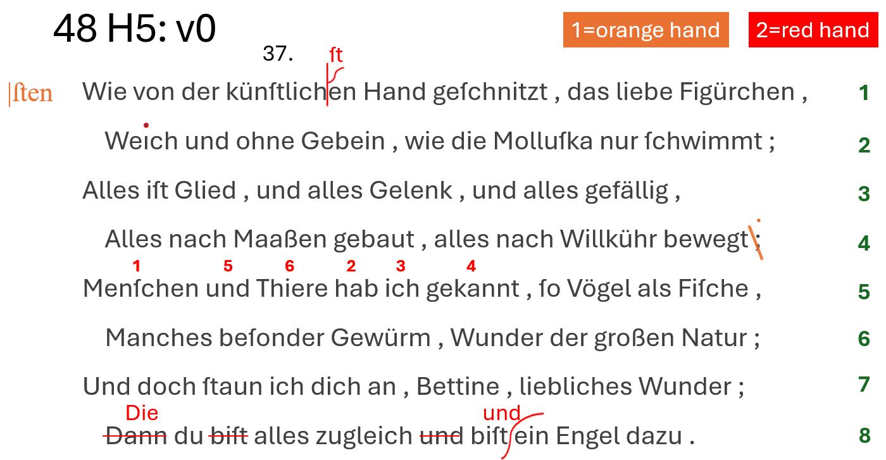
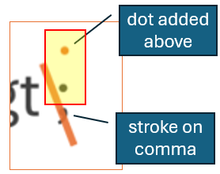

# Example: H5-48

🚀 demo: <http://gve-rendition.surge.sh/?sample=h5-48>

This is a real example from Venetian Epigram H5-48 as per VEdition numbering. Figure 1 shows a symbolic facsimile, with added line numbering for reference. There are two hands, one in pencil (orange), and another in red ink.

As for the numbers over words in line 5, they are ultimately red; but in this case the second hand just wrote with red ink on top of pencil to confirm the reordering represented by these numbers. So, this is not visible in Figure 1, but will appear in the interactive visualization.



- _Figure 1: H5-48 text facsimile_

## Base Text

▶️ (1) the base text is:

```txt
Wie von der künſtlichen Hand geſchnitzt , das liebe Figürchen ,
Weıch und ohne Gebein , wie die Molluſka nur ſchwimmt ;
Alles iſt Glied , und alles Gelenk , und alles gefällig ,
Alles nach Maaßen gebaut , alles nach Willkühr bewegt ;
Menſchen und Thiere hab ich gekannt , ſo Vögel als Fiſche ,
Manches beſonder Gewürm , Wunder der großen Natur ;
Und doch ſtaun ich dich an , Bettine , liebliches Wunder ;
Dann du biſt alles zugleich und biſt ein Engel dazu .
```

> Note that this transcription preserves the original habit of prepending a space before punctuation characters, and uses characters like `ſ` for `s`.

In our **reconstruction** these are the operations grouped by the respective hands (whitin each group, the order of operations is just conventional and follows the reading order: from top to bottom, and from left to right):

- 🟠 _orange hand_:

1. at the end of line 4, re­place semicolon with colon.
2. reorder words in line 5. This is indicated by adding ordinal numbers on top of the words.
3. add an annotation at the left of the first line, "sten". This is the correct ending for the word "künstlichen". This ends the alteration stages by the orange hand.

- 🔴 _red hand_:

1. clarify the intent of the pre­vious hand, by inser­ting "st" at the right place.
2. add a dot on the "i" of "Weich" (as it was missing).
3. confirm the reordering in line 5, by redrawing the numbers in red.
4. in the last line: replace "Dann" with "Die";
5. remove the first "bist";
6. remove the following "und" before the second "bist";
7. add "und" before "ein Engel".

- finally, later an epigram number was added, with black ink.

Now, let's describe all this in our model, for both textual and graphical layers, via operations. In what follows, for each operation we add the tag of the generated text (e.g. `v1`), its type (e.g. `annotate`) followed by its [DSL](snapshot#operations-dsl) representation and a comment.

## Operations

- 🟠 **orange hand**:

▶️ (`v1`) **annotate**: `65: [r_char-offsets="65:x=100 179:x=100 295:x=100 406:x=100" *log:="Indent lines."]`: the first operation outputs a new version, `v1`, and it is just an initial setup to indent lines. As we have seen, base text layout has no indentation, so we need to customize it before start. That's why we use an annotation operation, which only adds features, without changing the text.

In this case we add a horizontal offset to the first character of each even line in the epigram, thus indenting them. The offsets feature contains multiple pairs, each with character identifier and offset value.

Also, we constantly add a _log_ feature, with a short description about the intent of the operation, to make the code more reada­ble. In the visualization this log is displayed whenever you move to an operation, thus helping viewers to follow the transformation of the text step after step.

▶️ (`v2`) **replace**: `233=: [r_hints=diagonal-stroke-down r_h-scale-x=1.2 r_h-offset-x=-6 r_fore-color=orange r_t-position=n r_t-value="." comment="The hand deleted the semicolon's comma, adding a dot to transform it into a colon." *log:="At end of line 4, delete comma of semicolon, thus transforming it into a dot. This means replacing semicolon with colon."]`: now we start transforming the text, repla­cing the semicolon with a colon. Note that visually this is complex: the hand here traced a stroke on the comma, and then added a dot above the existing one, to mean a colon (Figure 2).



- _Figure 2: a hint for changing semicolon to colon_

A comment feature explains this to end users; but we also want to faithfully visualize it: on the textual layer encoding a replacement (`;` → `:`) would be enough; but on the visual side the signs are traced in a more complex, compendiary way: a line and a dot.

So, we still encode a replace operation; will effectively transform our text as intended. Yet, on the visual side we first link the operation to a diagonal stroke down hint, which represents the stroke on comma.

As the replace operation adds new text (here the colon instead of the semicolon), the normal rendition would just display this new text at the specified position (here `n`orth = above the replaced character). Yet, this is not what we want to be displayed; on the visual layer, we just have a single dot above the dot belonging to the original semicolon.

To encode this, we add an `r_t-value` feature which changes the operation's value to be dis-played with the one specified, a single dot. This allows us to display another text instead of that provided by the replacement operation: a dot, instead of the colon; but for visualization only, because the text is still transformed into a colon. It just appears as a dot. So in the end, we get to write a colon. This way, we can faithfully represent our visuals, while still correctly encoding text changes. These two layers preserve each its specific meaning, and although they are different they eventually get renconciled.

This small example shows not only the power of this model, but also the high level of diplomatic encoding we can attain, still preserving the text model correct and functional within its separate layer. The text generated by this operation will effectively get a semicolon replaced with a dot; yet, the peculiar visual appearance hinting at this operation will not be lost, but rather encoded with all its nuances.

▶️ (`v3`) **annotate**: `235x8: @reorder [note=1 r_hints=note-interlinear-above r_fore-color=orange *log:="Add number 1 above 'Menschen'."]`: next, we are going to reorder words in line 5. We thus replay the reconstructed ac­tions, adding a hint with a number above each word. The first is "Menschen".

So, we add a hint whose content is specified by the note feature, and here is just the num-ber 1, still with orange color. Numbers are added one at a time, but they all belong to the same logical group, thus building a sort of macro-operation, here named reorder (this is just an arbitrary name).

Note that here we are adding a hint on the visual layer, with no changes on the textual lay-er. The “1” written above the word is just part of a longer word reordering operation, which results from grouping a sequence of atomic operations. This is why this annotation opera-tion and all the following ones which assign other numbers to the words to be reordered and finally alter the text accordingly are grouped under a single identifier (reorder). The fact that all these operations share the same group ID virtually makes them part of a sort of “macro-operation” internally articulated into these steps, which just reflect the real-world annotation process, where the hand wrote these numbers in sequence, one after another, to imply a text movement.

On passing, if we look at the `svg` property of the hint, we see that it has a text element to contain the text of the annotation; in our case, the number `1`. The placeholder inside this element refers to a feature named `note`. This implies that the renderer will fetch a feature named `note` from the operation and use its value to fill the text:

```xml
<svg xmlns="http://www.w3.org/2000/svg" width="300" height="100"
     viewBox="0 0 300 100">
  <g>
    <text x="0" y="0" font-size="14" fill="red"
          id="placeholder">{{note}}</text>
  </g>
</svg>
```

This is why in our operation we also have a note operation. By simply adding another feature we enable a hint to adapt to its context, with a highly flexible and modular approach.

▶️ (`v4`) **annotate**: `255x3: @reorder [note=2 r_hints=note-interlinear-above r_fore-color=orange *log:="Add number 2 above 'hab'"]`: the same happens for all the other numbers. This is number 2, above "hab".

▶️ (`v5`) **annotate**: `259x3: @reorder [note=3 r_hints=note-interlinear-above r_fore-color=orange *log:="Add number 3 above 'ich'."]`: again for number 3, above "ich".

▶️ (`v6`) **annotate**: `263x7: @reorder [note=4 r_hints=note-interlinear-above r_fore-color=orange *log:="Add number 4 above 'gekannt'."]`: again for number 4, above "gekannt".

▶️ (`v7`) **annotate**: `244x3: @reorder [note=5 r_hints=note-interlinear-above r_fore-color=orange *log:="Add number 5 above 'und' before 'Thiere'."]`: again for number 5, above "und".

▶️ (`v8`) **annotate**: `248x6: @reorder [note=6 r_hints=note-interlinear-above r_fore-color=orange *log:="Add number 6 above 'Thiere'."]`: finally for number 6, above "Thiere".

▶️ (`v9`) **move**: `255x16>[244 @reorder [*log:="Move 'hab ich gekannt_' before 'und Thiere'."]`: until now, we just added signs on our virtual sheet, to represent annotations hinting at a reordering. Now, we effecti­vely transform the text by moving it, so that it matches the order specified by numbers. So, here we move "hab ich ge­kannt" before "und Thiere".

Note that this move operation has no hints at all: they were added right before, one after another, with the annotation operations. In fact, this again clearly shows the distinction betwen textual and visual layers: on the visual layer, we just annotate numbers on top of a sequence of base text words, without any changes on text; on the text layer, we move a portion of text in a different position, without further signs on paper.

▶️ (`v10`) **add before**: `1: [r_hints=note note=|ſten r_fore-color=orange r_h-position=w r_h-offset-x=-20 r_h-offset-y=2 r_h-scale-x=1.5 *version^=alteration1 *log:="Add annotation '|ſten' before the first line."]`: finally, we add the annotation "sten" at the left of the first line. This is not very perspicuous, but it is hinting at the fact that the word "künstlichen" should be corrected.

With the output of this operation we complete the first alteration stage, corresponding to changes by the orange hand. A `version` property here assigns "alteration stage 1" to the output of this operation. We thus promote this specific output to an alteration stage; all the pre­vious alterations were just steps towards this stage.

>The `version` feature is named after the fact that effectively it marks a specific alteration as a true, self-contained and meaningful stage of the text being transformed. In the entities hierarchy, an epigram (which is a pure abstraction) contains many snapshots; and each snapshot contains many versions. These versions are right the alteration staged marked with the version feature.

- 🔴 **red hand**:

▶️ (`v11`) **add before**: `22+[ſt [r_hints=half-psi r_t-position=n r_fore-color=red r_font-size=20 r_t-offset-y=-6 *log:="Add 'ſt' before 'en' in 'künstlichen' with callout whence 'künſtlichſten'."]`: the other hand first makes the last cor­rection explicit, by adding "st" at the top of a callout sign. This sign is repre­sented by the hint named _half-psi_, while the added text appears above (north), a bit smaller (font-size), and offset up (offset-y). Also the color now is red.

▶️ (`v12`) **annotate**: `67: [r_hints=i-dot r_fore-color=red *log:="Add dot on 'i' of 'Weich'."]`: The red hand now adds the missing dot above the "i" of "Weich". So, this is just a hint, named _i-dot_, written over the letter.

▶️ (`v13`) **annotate**: `235x8: @reorder2 [note=1 r_hints=note-interlinear-above r_fore-color=red reason=confirmation *log:="Rewrite number 1 above 'Menschen'."]`: then, the red hand confirms the word reordering already suggested by the pre­vious hand, by literally re-writing the same numbers with red chalk.

So, again we do the same, replaying what happe­ned, number after number. This time, the color will be red, and the macro-opera­tion name is "reorder2".

Also, we have a _reason_ feature, which says that the reason of this annotation is a confirmation.

▶️ (`v14`) **annotate**: `255x3: @reorder2 [note=2 r_hints=note-interlinear-above r_fore-color=red reason=confirmation *log:="Rewrite number 2 above 'hab'."]`: The same happens for all numbers: 2 above "hab".

▶️ (`v15`) **annotate**: `259x3: @reorder2 [note=3 r_hints=note-interlinear-above r_fore-color=red reason=confirmation *log:="Rewrite number 3 above 'ich'."]`: 3 above "ich".

▶️ (`v16`) **annotate**: `263x7: @reorder2 [note=4 r_hints=note-interlinear-above r_fore-color=red reason=confirmation *log:="Rewrite number 4 above 'gekannt'."]`: 4 above "gekannt".

▶️ (`v17`) **annotate**: `244x3: @reorder2 [note=5 r_hints=note-interlinear-above r_fore-color=red reason=confirmation *log:="Rewrite number 5 above 'und' before 'Thiere'."]`: 5 above "und".

▶️ (`v18`) **annotate**: `248x6: @reorder2 [note=6 r_hints=note-interlinear-above r_fore-color=red reason=confirmation *log:="Rewrite number 6 above 'Thiere'."]`: 6 above "Thiere". Note that here we do not end the macro-operation with the actual change in order, because this already happened before. Here we are just _confirming_ that change.

▶️ (`v19`) **replace**: `406x4=Die [r_hints=horizontal-stroke r_fore-color=red r_t-position=n r_font-size=20 *log:="Replace 'Dann' with 'Die' in last line."]`: finally, in the last line, we replace "Dann" with "Die". The hint here is a horizontal stroke on the deleted word, while the added text appears above it (whence position north), and a bit smaller (font-size 20).

▶️ (`v20`) **delete**: `414x5- @die-du [r_hints=horizontal-stroke r_fore-color=red *log:="Delete first 'biſt_' from last line."]`: we also do a couple of related deletions: first we delete the first "bist" from the last line, again with the same horizontal stroke.

▶️ (`v21`) **delete**: `434x4- @die-du [r_hints=horizontal-stroke r_fore-color=red *log:="Delete 'und_' before 'biſt ein Engel'."]`: second, we delete "und" before "bist ein Engel". Again, the same horizontal stroke hints at the deletion.

▶️ (`v22`) **add before**: `443+["und " [r_hints=snake r_h-offset-x=-6 r_fore-color=red r_t-position=n r_font-size=20 *version^=alteration2 *log:="Insert 'und_' before 'ein Engel'."]`: finally, we add "und" before "ein Engel".

Here we have another hint, named "snake" for its shape, acting as a callout.

Note that this hint among its properties already has a vertical scale equal to 200%. This is required and it's intrinsically part of it; because hints are sized as their RBR, which would make the snake just as tall as the text. Instead, we want it to ex­tend above and below the text; and this is accomplished by the scale and the center position.

Also, the added text is a bit smaller, and red.

This completes the second alteration stage: so, a `version` feature tells us that the output of this operation corresponds to that stage.

▶️ (`v23`) **annotate**: `14x4: [r_hints=note note=37. r_t-position=n r_t-offset-y=-20 *log:="Add epigram number 37 above the first line."]`: after all this, later the epigrams get numbered. This epigram gets number 37, with a default black ink. So, we have a final annotation operation above the first line of the epigram, at a certain distance from it (whence the vertical offset), with a note hint and a value equal to 37 plus a dot.

We thus replayed all the actions of the text transformation process, generating a new text version at each step, promoting a couple of those versions to alteration stages, and accumulating all the signs corresponding to our operations on our virtual sheet.

## Plain Text Encoding

Should we want a compact representation of this model, we could just say that the base text is:

```txt
Wie von der künſtlichen Hand geſchnitzt , das liebe Figürchen ,
Weıch und ohne Gebein , wie die Molluſka nur ſchwimmt ;
Alles iſt Glied , und alles Gelenk , und alles gefällig ,
Alles nach Maaßen gebaut , alles nach Willkühr bewegt ;
Menſchen und Thiere hab ich gekannt , ſo Vögel als Fiſche ,
Manches beſonder Gewürm , Wunder der großen Natur ;
Und doch ſtaun ich dich an , Bettine , liebliches Wunder ;
Dann du biſt alles zugleich und biſt ein Engel dazu .
```

and its operations are:

```txt
65×1: [r_char-offsets="65:x=100 179:x=100 295:x=100 406:x=100" *log:="Indent lines."]
233×1=":" [r_hints=diagonal-stroke-down r_h-scale-x=1.2 r_h-offset-x=-6 r_fore-color=orange r_t-position=n r_t-value=. comment="The hand deleted the semicolon's comma, adding a dot to transform it into a colon." *log:="At end of line 4, delete comma of semicolon, thus transforming it into a dot. This means replacing semicolon with colon."]
235×8:@reorder [note=1 r_hints=note-interlinear-above r_fore-color=orange *log:="Add number 1 above `Menschen`."]
255×3:@reorder [note=2 r_hints=note-interlinear-above r_fore-color=orange *log:="Add number 2 above `hab`"]
259×3:@reorder [note=3 r_hints=note-interlinear-above r_fore-color=orange *log:="Add number 3 above `ich`."]
263×7:@reorder [note=4 r_hints=note-interlinear-above r_fore-color=orange *log:="Add number 4 above `gekannt`."]
244×3:@reorder [note=5 r_hints=note-interlinear-above r_fore-color=orange *log:="Add number 5 above `und` before `Thiere`."]
248×6:@reorder [note=6 r_hints=note-interlinear-above r_fore-color=orange *log:="Add number 6 above `Thiere`."]
255×16>[244@reorder [*log:="Move `hab ich gekannt ` before `und Thiere`."]
1×1: [r_hints=note note=|ſten r_fore-color=orange r_h-position=w r_h-offset-x=-20 r_h-offset-y=2 r_h-scale-x=1.5 *version^=alteration1 *log:="Add annotation `|ſten` before the first line."]
22×0+["ſt" [r_hints=half-psi r_t-position=n r_fore-color=red r_font-size=20 r_t-offset-y=-6 *log:="Add `ſt` before `en` in `künstlichen` with callout whence `künſtlichſten`."]
67×1: [r_hints=i-dot r_fore-color=red *log:="Add dot on `i` of `Weich`."]
235×8:@reorder2 [note=1 r_hints=note-interlinear-above r_fore-color=red reason=confirmation *log:="Rewrite number 1 above `Menschen`."]
255×3:@reorder2 [note=2 r_hints=note-interlinear-above r_fore-color=red reason=confirmation *log:="Rewrite number 2 above `hab`."]
259×3:@reorder2 [note=3 r_hints=note-interlinear-above r_fore-color=red reason=confirmation *log:="Rewrite number 3 above `ich`."]
263×7:@reorder2 [note=4 r_hints=note-interlinear-above r_fore-color=red reason=confirmation *log:="Rewrite number 4 above `gekannt`."]
244×3:@reorder2 [note=5 r_hints=note-interlinear-above r_fore-color=red reason=confirmation *log:="Rewrite number 5 above `und` before `Thiere`."]
248×6:@reorder2 [note=6 r_hints=note-interlinear-above r_fore-color=red reason=confirmation *log:="Rewrite number 6 above `Thiere`."]
406×4="Die" [r_hints=horizontal-stroke r_fore-color=red r_t-position=n r_font-size=20 *log:="Replace `Dann` with `Die` in last line."]
414×5-@die-du [r_hints=horizontal-stroke r_fore-color=red *log:="Delete first `biſt_` from last line."]
434×4-@die-du [r_hints=horizontal-stroke r_fore-color=red *log:="Delete `und_` before `biſt ein Engel`."]
443×0+["und " [r_hints=snake r_h-offset-x=-6 r_fore-color=red r_t-position=n r_font-size=20 *version^=alteration2 *log:="Insert `und_` before `ein Engel`."]
14×4: [r_hints=note note=37. r_t-position=n r_t-offset-y=-20 *log:="Add epigram number 37 above the first line."]
```

So, about 30 plain text lines are all what is required to generate dozens of different annotated texts and their full interactive visualization as shown in the demo page. In fact, the output dynamically generated from the execution of all the operations on this snapshot base text amounts to more than 25,000 lines. This is a clear indication of the power and effectiveness of a process-focused model.
