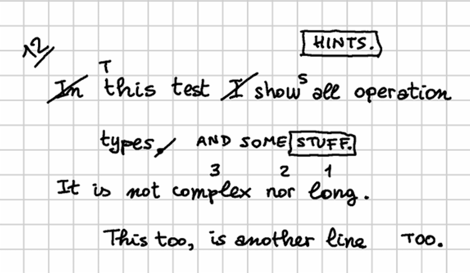

# Example: Mock

🚀 demo: <http://gve-rendition.surge.sh>

Let us summarize and see how the symbolic visualization model is used with a mock example. This uses a very simple fake text, but designed so that it covers all operation types, and shows many visual features derived from real-world documents in the VEdition project.

Suppose we have a facsimile from our carrier like that of Figure 1:



- _Figure 1: mock text facsimile_

In our reconstruction, we go through 4 stages:

▶️ (1) the base text is:

```txt
In this text I show all operation
    types.
It is not complex nor long.
    This too, is another line
```

▶️ (2) then, a red-ink hand makes these changes:

- change `In this text I show` into `This text shows` in line 1.
- swap `complex` with `long` in line 3.

🚩 The resulting alteration stage is (let us name it `alpha`):

```txt
This text shows all operation
    types.
It is not long nor complex.
    This too, is another line
```

▶️ (3) then, a green-ink hand makes these changes:

- extend `types` with `AND SOME STUFF` in line 2, and immediately after replace `STUFF` with `HINTS`.
- move `too` at the end of line 4.

🚩 The resulting alteration stage is (let us name it `beta`):

```txt
This text shows all operation
    types AND SOME HINTS.
It is not long nor complex.
    This is another line TOO.
```

▶️ (4) finally, a blue-ink hand just adds an epigram number (`12`) at the top-left corner. This does not alter the epigram's text; it just adds a textual annotation.

## Operations

Now, let us formalize this reconstruction using operations while also providing rendition features for them, in order to represent its visual appearance. For each operation, we list the corresponding output version tag (`v1`, `v2`, etc.) in brackets, followed by the DSL representing the operation and its features.

> 💡 You can see the backend data for this example by playing with the online chain demo at <https://gve-demo.fusi-soft.com/snapshot>: just pick the `rendition features` preset, click the button to load it, then click `Run`. You can look at the features injected by operations in text under the `Steps` tab. You will see the rendition features among the other ones, after each version.

▶️ (`v1`) **annotate**: `35: [r_char-offsets="35:x=100 70:x=100"]`: this initial annotation operation is used only to provide indents for even lines. Here a character offsets feature provides a 100 pixels offset to the right for the first character of each even line.

▶️ (`v2`) **delete**: `1x3- [r_hints=diagonal-stroke r_fore-color=red]`: delete the initial `In` and its space. This operation's hint is a diagonal stroke on the deleted text. So, a rendition feature picks a hint named `diagonal-stroke` from the catalog, and sets the foreground color to red. As the hint uses a variable named `r_fore-color` for the color of the line it draws, this means that the hint will be displayed in that color.

▶️ (`v3`) **replace**: `4=T [r_t-position=n r_fore-color=red r_font-size=14]`: replace the lowercase `t` with `T` in `this` as this has become the initial word of the sentence. The operation needs no hints, because in the facsimile the added text is enough to imply the replacement. So, the rendition features target the added text: its position (north), foreground color (red), and size (smaller than 16 which was used for the base text).

▶️ (`v4`) **delete**: `14x2- [r_hints=diagonal-stroke r_fore-color=red]`: delete `I` and its following space from line 1. Again, the deletion is visually represented by a red diagonal stroke, whence the corresponding features to pick and color that hint.

▶️ (`v5`) **insert**: `(v5) 19+]s [r_t-position=ne r_fore-color=red r_font-size=14]`: add `s` after `show` to turn it into a third person (`shows`). This operation just adds text and has no hints. So again, it just includes features for position (northeast), foreground color and smaller size.

▶️ (`v6`) **annotate**: `64x4: @swap-complex-long [note=1 r_hints=note-interlinear-above r_fore-color=red]`: now we start a macro-operation, because the next operations are logically grouped. That's why we are assigning them a group ID, which is just an arbitrary name: `swap-complex-long`, hinting at the fact that the group represents a swap operation, decomposed in its single visuals, as they were written one at a time. Here we want to swap `complex` with `long` in line 3. To do this, the author just wrote small numbers on top of 3 words: 1, 2, 3 on `long`, `nor`, and `complex`. We are going to do the same, so the first operation just adds the number 1 on top of `long`. This is an "interlinear note above" hint, whose SVG code contains a placeholder variable named `note`. So, we use the `note` feature to specify the note added by this operation (consisting in number `1`), pick the required hint, and specify its color. The rendition software will take care of fetching the hint's drawing, replacing placeholder variables with values (in this case from the feature named `note`), and override the default color.

▶️ (`v7`) **annotate**: `60x3: @swap-complex-long [note=2 r_hints=note-interlinear-above r_fore-color=red]`: we now move to the next number, `2`, doing the same as before. Note that this operation belongs to the same group, thus implicitly defining a macro-operation.

▶️ (`v8`) **annotate**: `52x7: @swap-complex-long [note=3 r_hints=note-interlinear-above r_fore-color=red]`: finally, we complete the macro-operation by adding the last number, `3`, just like we did for the others. So until now we have just added annotations with hints, mimicking the process we reconstructed.

▶️ (`v9`) **swap**: `52x7<>64x4 [r_fore-color=red *version^=alpha]`: we now swap the words in the text, effectively changing it. This time we have no hints, as the swap has been suggested by all the previous hints (the numbers on the words). Anyway, this ends the red hand's work, so we mark the output of this last operation as an alteration stage, named `alpha`.

▶️ (`v10`) **delete**: `40- @add-stuff [r_hints=diagonal-stroke r_fore-color=green]` we now start the work of the green hand. The first operation is deleting the dot after `types` as we are going to extend this sentence. The deletion is visually represented by a diagonal stroke, but this time it's green. So we have a rendition feature to pick that hint, and another to set its color.

▶️ (`v11`) **insert**: `39+]" AND SOME STUFF." @add-stuff [r_t-position=e r_t-offset-y=0.4th r_fore-color=green]`: we now extend the sentence by adding a space followed by `AND SOME STUFF` after word `types`. So, our operation has features for position (east), color (green), and also a horizontal offset, because as you can see there is a gap before the addition.

▶️ (`v12`) **annotate**: `107x6: @stuff-hints [r_hints=box r_fore-color=green]`: now, we are going to replace `STUFF.` with `HINTS.`, mimicking the reconstructed process, where the hand first wrote `STUFF` and immediately after he repented and replaced it with `HINTS`. The problem here is that the hand chose to write `HINTS` in the space above the first line of the epigram, instead of just above or below it, between lines. Maybe he did not feel comfortable in writing in a small interlinear space, or was thinking about additional changes which would have required more space. So, in order to clarify his intent, he visually linked the two words by boxing both. So, he first drew a box around STUFF; then wrote the new word above; and then drew another box around it. We are replaying the same operations here, so we start with the first box with an annotation operation. This annotation belongs to a macro-operation too, named `stuff-hints`. It just picks the box hint, and tells it to use green color.

▶️ (`v13`) **replace**: `107x6=HINTS.@stuff-hints [r_t-position=n r_fore-color=green r_position=n r_t-displaced-span=21x7 r_t-offset-y=-30]`: after having boxed the old word, `STUFF` and its dot, we replace it with `HINTS` and its dot. Now, here we have a displacement: as explained above, hints are positioned relative to their RBR, which is the operation's affected text. In this case, the RBR would be `STUFF.`, the text being replaced. Yet, `HINTS.` was rather written above the whole epigram; to represent this, we use a "displaced span" feature which overrides the original RBR with that of another text, the first part of `all operation` in the first line. This way, `HINTS.` will be displayed right above them (position is north), but offset up as there is more vertical space between it and the first line.

▶️ (`v14`) **annotate**: `113x6: @stuff-hints [r_hints=box r_fore-color=green]`: finally, we complete this macro-operation by boxing the newly added text, `HINTS.`: we thus pick the box hint, and make it green.

▶️ (`v15`) **delete**: `75x5- @mov-too`: the last action by the green hand is moving `too` at the end of line 4. Note that in the facsimile there is no hint on the original word; the hand just added text at the end of the line. Yet, the movement is implied by the fact that the text added here is the same. So, the operation here reflects this situation: we just delete `too` and its comma, as implied by the addition, without any hints. This is the first part of a macro-operation named `mov-too`.

▶️ (`v16`) **insert**: `94+]" TOO."@mov-too [r_t-position=e r_t-offset-x=20 r_t-offset-y=0.4th r_fore-color=green *version^=beta]`: the second part is adding `TOO` with a dot at the end. The operation belongs to the same group, the position is east, with a small offset to the right to reflect the gap in the facsimile; and the color is green. Also, the output of this operation defines another alteration stage, named `beta`. As for the vertical offset of about half the height of text, this is due to the fact that when something is positioned east or west, it is vertically centered with reference to the RBR. So, this would have the undesired effect of raising the baseline of the added text, and we compensate for this by applying this offset.

▶️ (`v17`) **annotate**: `1: [note=12 r_t-fore-color=blue r_fore-color=blue r_hints=note-underline r_h-scale-x=2 r_h-rotation=-45]`: finally, the last hand, blue, just adds number twelve to the epigram. This is written on a diagonal baseline at the top-left corner of the whole epigram. So, to represent this we pick a hint named `note-underline`, representing an underlined textual hint, and specify its `note` placeholder variable value via `note` equal to `12`. The color is blue, and the text is rotated by minus 45 degrees. Also, we scale the hint to 200%, because we are using as RBR the first character of the epigram, and this being a single character the resulting width would be too narrow.

So, we have here defined all the operations of our reconstructed process, one after another, transforming a text into a couple of alteration stages (`alpha` and `beta`), while fully representing their visuals in a symbolic and highly compact way, via operation features. Now, given that each hint has an entrance animation, you can imagine a visualization where the software starts with the base text, and then progressively "replays" the process step by step, drawing added text and hints on the virtual sheet surface, up to the end, where the resulting picture will be the a symbolic, yet faithful representation of the facsimile. We have thus recovered the dimension of time, and integrated it in an interactive visualization similar to a movie, showing the text being transformed under our eyes.

## Plain Text Encoding

Should we want a compact representation of this model, we could just say that the base text is:

```txt
In this test I show all operation
types.
It is not complex nor long.
This too, is another line
```

and its operations are:

```txt
35: [r_char-offsets="35:x=100 70:x=100"]
1x3- [r_hints=diagonal-stroke r_fore-color=red]
4=T [r_t-position=s r_fore-color=red r_font-size=14]
14x2- [r_hints=diagonal-stroke r_fore-color=red]
19+]s [r_t-position=ne r_fore-color=red r_font-size=14]
64x4: @swap-complex-long [note=1 r_hints=note-interlinear-above r_fore-color=red]
60x3: @swap-complex-long [note=2 r_hints=note-interlinear-above r_fore-color=red]
52x7: @swap-complex-long [note=3 r_hints=note-interlinear-above r_fore-color=red]
52x7<>64x4 [r_fore-color=red *version^=alpha]
40- @add-stuff [r_hints=diagonal-stroke r_fore-color=green]
39+]" AND SOME STUFF." @add-stuff [r_t-position=e r_fore-color=green]
107x6: @stuff-hints [r_hints=box r_fore-color=green]
107x6=HINTS.@stuff-hints [r_t-position=n r_fore-color=green r_position=n r_t-displaced-span=21x7 r_t-offset-y=-30 r_hints=box]
113x6: @stuff-hints [r_hints=box r_fore-color=green]
75x5- @mov-too
94+]" TOO."@mov-too [r_t-position=e r_t-offset-x=20 r_fore-color=green *version^=beta]
1: [note=12 r_t-fore-color=blue r_fore-color=blue r_hints=note-underline r_h-scale-x=2 r_h-rotation=-45]
```

This is all what is required to build the model and see it rendered in action. In fact, the visual editor also allows you to enter the full model data in this DSL compact form, as an alternative to the graphical UI.
