<!-- ---
title: Exporting Tree
layout: default
parent: Model
nav_order: 6
--- -->

# Exporting Tree

⚠️ This is preliminary and incomplete documentation!

Let us consider the versions produced by our [mock example](sample-arzdc.md):

- v0: ARZDC
- v1: ARDC
- v2: AVDC
- v3: ABDC
- v4: APDC
- v5: APCD
- v6: ABCD

As you can see from its chain, the graph contains 7 different paths we can follow to build all the versions from v0 to v6:

Versions in this graph are multi-dimensional: each path defining a version defines a different direction. The graph is a multi-dimensional representation of linear combinations representing versions.

When exporting data, we often need to reduce these dimensions to provide a more linear output. As a privileged target is XML, and XML is tree-based, this implies reducing the multiple dimensions of a graph into a line which can branch into other lines on a bidimensional space.

This will allow using e.g. a TEI `<app>` element with `<lem`> and `<rdg>` as the branching points, opening two different lines each with all its nodes up to the end of each version. To do this we will have to duplicate nodes; but we will end up projecting the multiple dimensions of the graph into a bidimensional tree and thus export into an XML tree, even if a quite nested and complex one.

## Tree

To start with, let us see how we can project the graph into a tree.

Consider the above graph. Let us start from the latest version, v6, which is the "final" stage of our transformations in our reconstruction. This final stage will be our main text line, and each departure from it will produce a branching with two or more lines stemming from it (initially the lines will be two, but others may be added later). Let us follow this procedure, starting from a blank root node to ensure that we have a single root (arrow points to child nodes). So, at start we have a tree with a single root node:

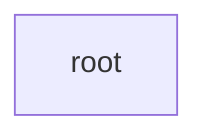

---

(1) **v6**: ABCD: this version is represented by a single lineage: A is child of root, B is child of A, C is child of B, and D is child of C:

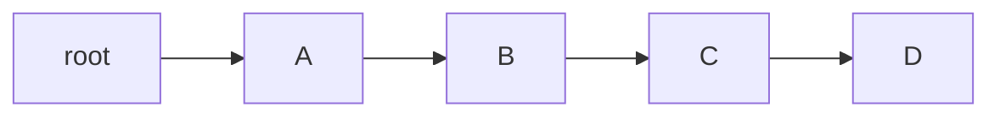

---

(2) **v5**: APCD: again, starting from the root we first find an A child; this is equal to our first A node of APCD, so we keep going along the existing lineage until we find a match. This will reduce nodes redundancy in our projected tree. As soon as we step down to B, we have a mismatch (with P): this defines the parent of this mismatching node as the branching point.

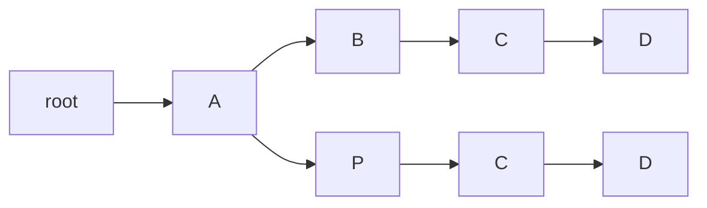

---

(3) **v4**: APDC: starting from the root, we follow matches up to the P node of APCD; this will be our branching node. The new branch will thus be DC:

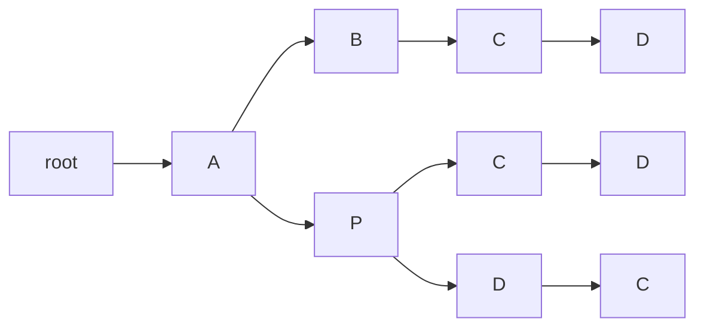

---

(4) **v3**: ABDC: starting from the root, we follow matches up to the B node of AB; this will be our branching node, adding to it the child branch DC:

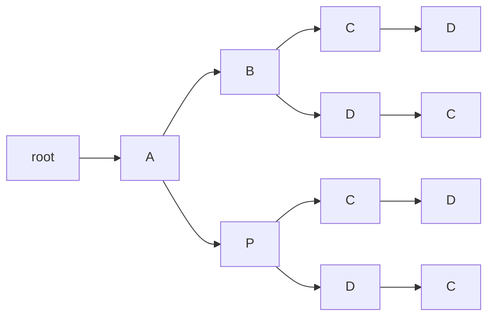

---

(5) **v2**: AVDC: starting from the root, we follow matches up to its A child node. We will thus add a third branch to it, VDC:

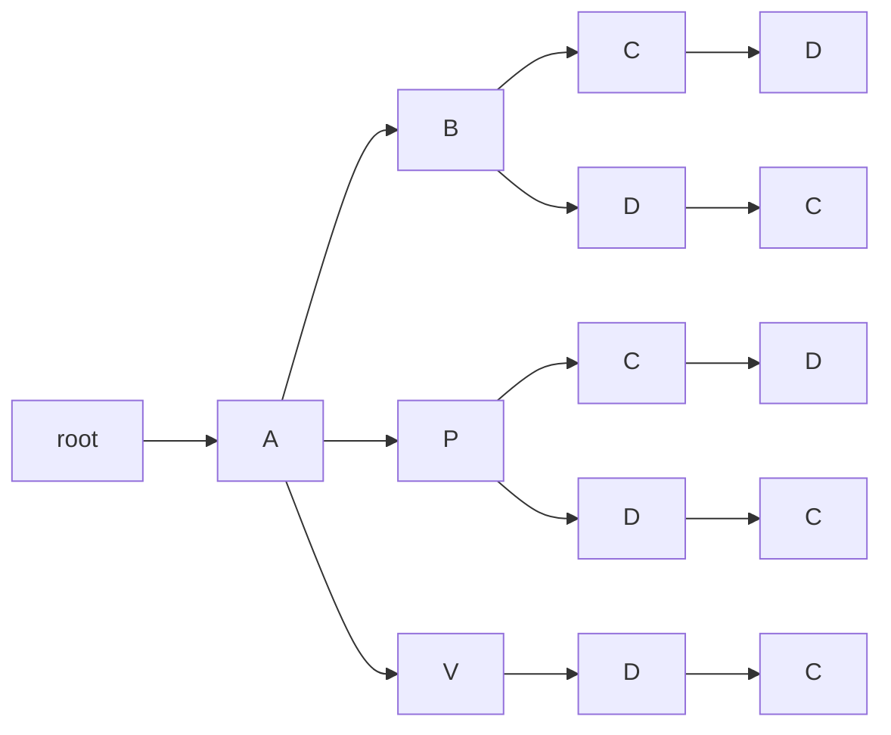

---

(6) **v1**: ARDC: starting from the root, we follow matches up to its A child, as above; its new branch will be RDC:

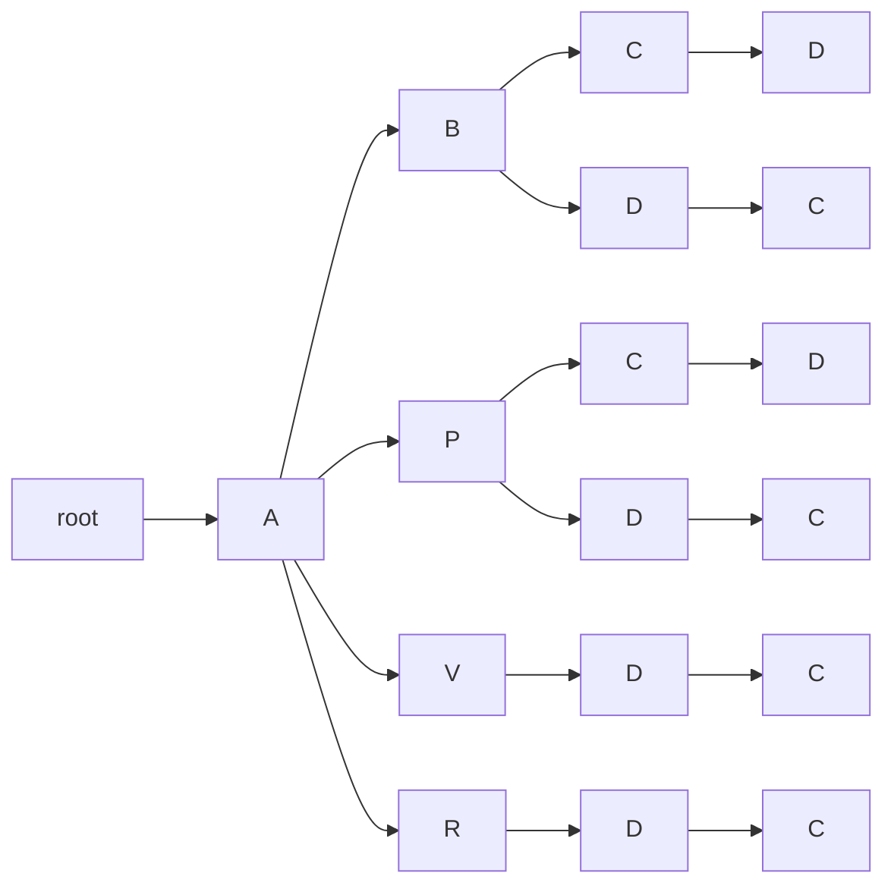

---

(7) **v0**: ARZDC: starting from the root, we follow matches up to its R child, which becomes a new branching node. To this we will add the branch ZDC:

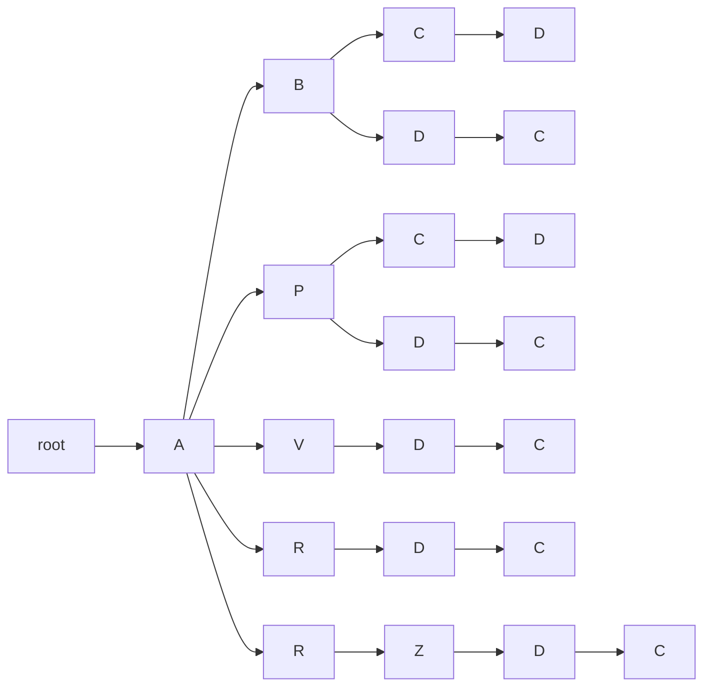

We have now considered all the outputs of the chain graph, building a full path for each, in a trie-like structure. Starting from the root we can follow branches, each corresponding to a version. We are thus representing the same linear combinations as the chain graph, but in a tree-shaped structure, which implies that we have to duplicate nodes. Yet, this structure is now fit to an XML-based rendition.

In fact, if we traverse the tree depth-first, we get:

- ABCD (v6, as defined by the last, leaf node in this traversal)
- ABDC (v3)
- APCD (v5)
- APDC (v4)
- AVDC (v2)
- ARDC (v1)
- ARZDC (v0)

## Binary Tree

To render an XML based on a binary alternative like in the example of `app` including `lem` and `rdg`, we need to further constrain the above structure to allow at most two children per node.

Also, we want to introduce a blank node whenever there is such a fork into two branches. Whenever we locate the node to start branching for, we replace it with a blank whose first child is that node, and the second child is the first non-matching node of the new sequence being added.

Let us start as in the previous example:

---

(1) **v6**: ABCD, a single branch: in the tree, each sequence is defined by descendant nodes. So here we start with the first sequence, ABCD, which means that root's child will be A; A's child will be B; B's child will be C; and C's child will be D.

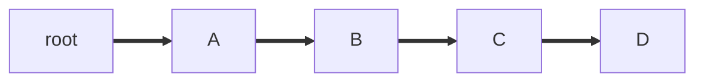

---

(2) **v5**: APCD: we traverse the nodes depth-first, starting from the root, following all the branches so that we reach the maximum number of matching descendants. If we find blank nodes during traversal, we just ignore them and keep moving. The last matching descendant node here is B; as its last child we will add a blank fork node, having as children the descendants of B on one branch, and the new sequence on another one:

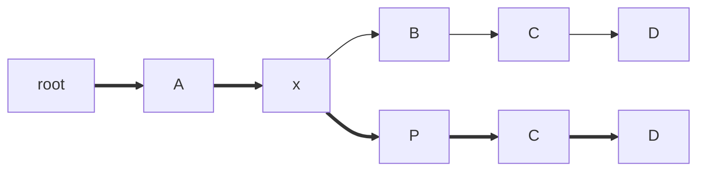

---

(3) **v4**: APDC: we traverse nodes root, A, and blank, up to P, which is the last matching one. We thus move on its child C, and insert a blank fork node at its place. Its first child is C; its second child is the next character of the newly inserted sequence, D. With its child C it forms APDC.

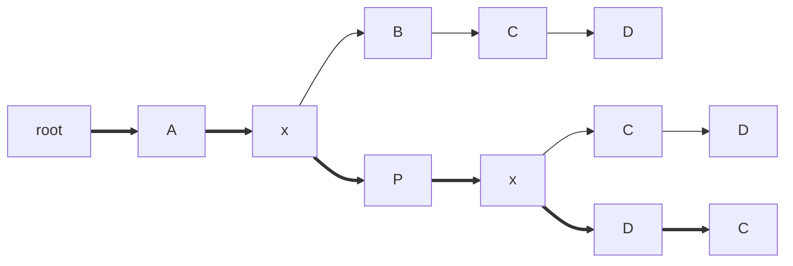

---

(4) **v3**: ABDC: we traverse nodes root, A, blank, and B, which is the last matching node. So we insert a blank fork node as its child, having C as the first child, and the new D as its second one.

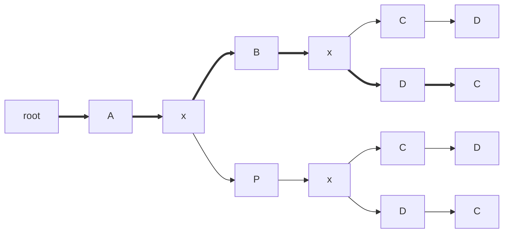

---

(5) **v2**: AVDC: we traverse nodes root, A, and blank, which is the last matching node, because its children are B and P, and neither of them matches V. So again, we replace the last child of the last matching node, here the blank, with a blank fork node, having children P and the new V.

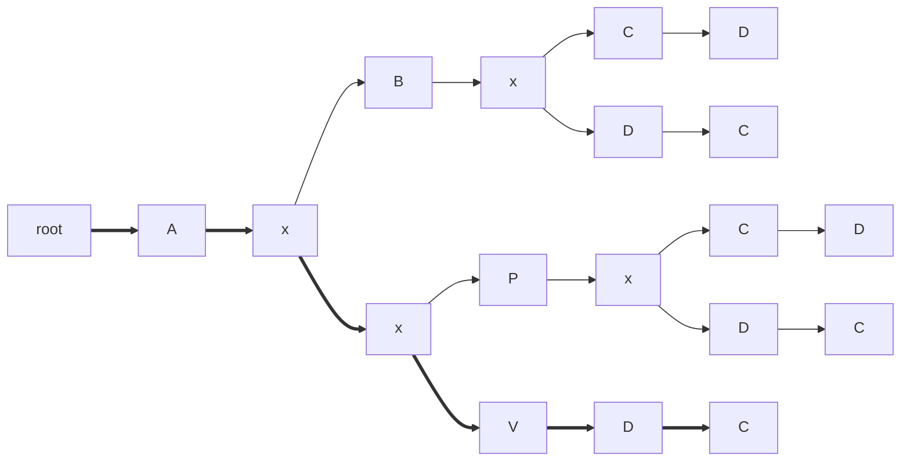

---

(6) **v1**: ARDC: we traverse nodes and find many branches, the longest matching one (or last matching one, when there are many matching branches with the same length) being the blank node having already 2 children P and V. So as usual we insert a new blank node before its second child, having as children V and the new node R.

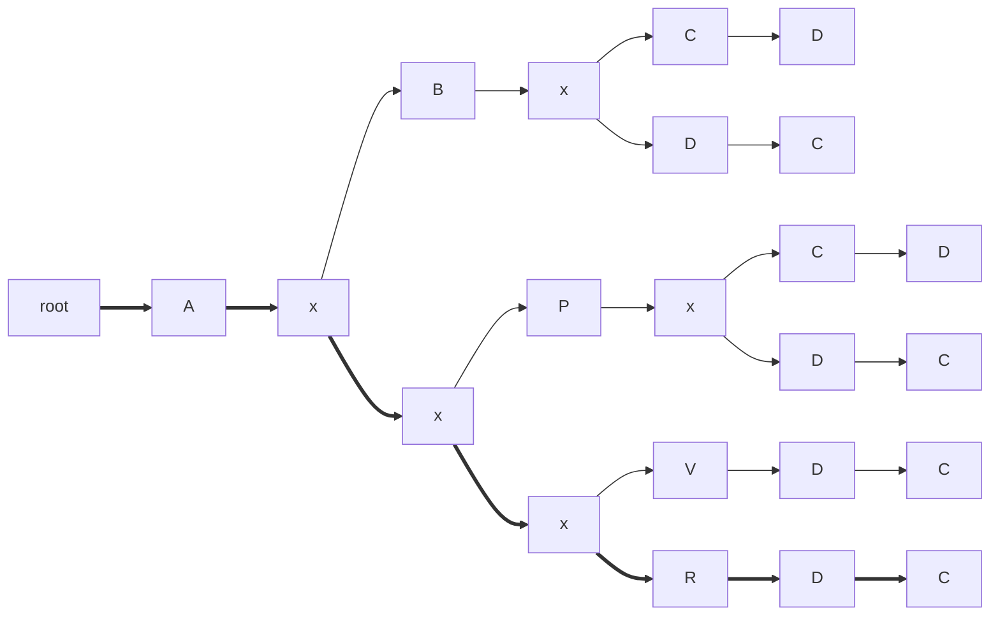

---

(7) **v0**: ARZDC: finally, we traverse node up the last matching one, which is R; we thus insert a blank fork node before it, having as children R and the new Z. So, this last string ARZDC follows the path root, A, blank, blank, blank, blank, Z, D, C.

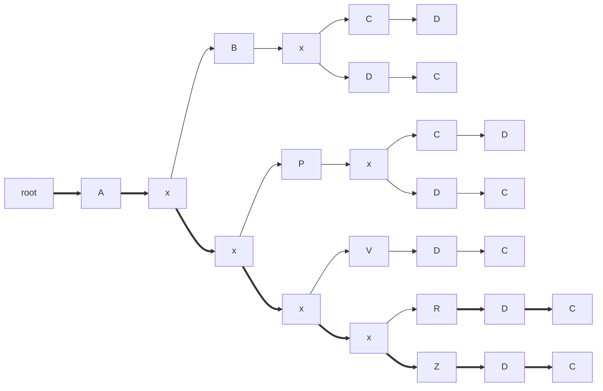
