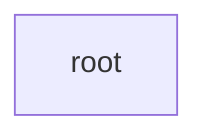
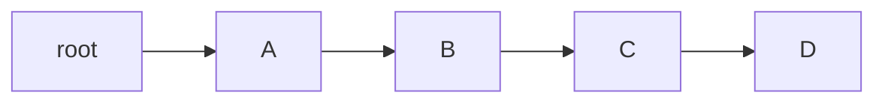
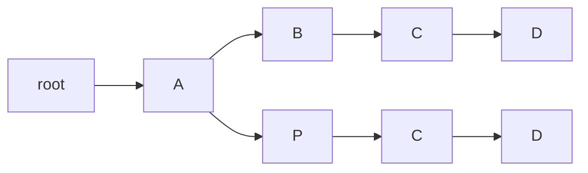

<!-- ---
title: Exporting Tree
layout: default
parent: Model
nav_order: 6
--- -->

# Exporting Tree

⚠️ This is preliminary and incomplete documentation!

Let us consider the versions produced by our [mock example](sample-arzdc.md):

- v0: ARZDC
- v1: ARDC
- v2: AVDC
- v3: ABDC
- v4: APDC
- v5: APCD
- v6: ABCD

As you can see from its chain, the graph contains 7 different paths we can follow to build all the versions from v0 to v6:

Versions in this graph are multi-dimensional: each path defining a version defines a different direction. The graph is a multi-dimensional representation of linear combinations representing versions.

When exporting data, we often need to reduce these dimensions to provide a more linear output. As a privileged target is XML, and XML is tree-based, this implies reducing the multiple dimensions of a graph into a line which can branch into other lines on a bidimensional space.

This will allow using e.g. a TEI `<app>` element with `<lem`> and `<rdg>` as the branching points, opening two different lines each with all its nodes up to the end of each version. To do this we will have to duplicate nodes; but we will end up projecting the multiple dimensions of the graph into a bidimensional tree and thus export into an XML tree, even if a quite nested and complex one.

As an example, consider the above graph. Let us start from the latest version, v6, which is the "final" stage of our transformations in our reconstruction. This final stage will be our main text line, and each departure from it will produce a branching with two or more lines stemming from it (initially the lines will be two, but others may be added later). Let us follow this procedure, starting from a blank root node to ensure that we have a single root (arrow points to child nodes). So, at start we have a tree with a single root node:

(1) v6: ABCD: this version is represented by a single lineage: A is child of root, B is child of A, C is child of B, and D is child of C:

(2) v5: APCD: again, starting from the root we first find an A child; this is equal to our first A node of APCD, so we keep going along the existing lineage until we find a match. This will reduce nodes redundancy in our projected tree. As soon as we step down to B, we have a mismatch (with P): this defines the parent of this mismatching node as the branching point.

