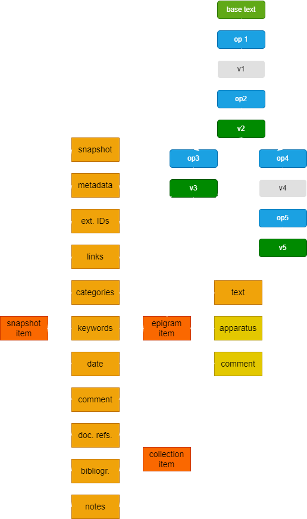

# Entities Hierarchy

The snapshot is just the lowest level entity in our hierarchy. Being closest to the material supports, and representing a highly complex multiple-versions text, it's the most complex one. Yet, above it there are other entities we want to represent in our data.

>⚠️ Given the early stage of this modeling phase, here I'm using a purely IT-oriented and pragmatic terminology for these entities. An appropriate philological naming for these entities is discussed elsewhere.

## Overview

Essentially, in our project we deal with snapshots giving rise to one or more versions of what is regarded as a unique original text. As per the [snapshot model](snapshot), "version" here in technical meaning is just the output of a text-changing operation; many operations affect the base text, transforming it into something else, which represents another "version" of it.

These outputs just represent the steps which progressively lead towards a specific waypoint along the path towards an ideal, final redaction of the text, which in the case of VEdition does not exist. Among these steps, these waypoints define our "staged versions", i.e. steps which get promoted to a visible stage where they act as what we regard as a true redaction of the text on its own, rather than just an intermediate step towards it. Of course, that's a matter of subjective judgement, even if based on all the available evidence.

So, from a pragmatic point of view, we need at least 3 entities in our hierarchy:

- **snapshot**, the digital representation of the material carrier (and of its interpretation) we start from;
- **epigrams**, i.e. the texts corresponding to staged versions, which build up what we can read as an epigram (stemming from a specific ancestor via modifications);
- **collections** of epigrams. The term "collection" here is used with a purely IT sense, meaning any number of items belonging to an ordered set. What corresponds to this collection may vary: it might just be an idea of the author for organizing some epigrams, derived from what he writes about them elsewhere; or it might be what emerges from marks added to the notebooks (e.g. numbers) for each epigram, hinting at some plan for building an ordered collection of them; or it might be something material, like a physical collection of them. Whatever the specific nature, we can adopt a single, more abstract model for them.

## Cadmus for VEdition

Given that our modeling is highly complex, though necessarily open to changes, especially at this early stage; and that we need a quick and effective infrastructure to lean our snapshot on, we are going to adopt [Cadmus](https://vedph.github.io/cadmus-doc) to represent all our entities in a single database, with a uniform data architecture.

Essentially, you can think of Cadmus records (called _items_) as boxes, where you can put any number and type of objects (called _parts_). Each of these objects has its own self-contained model, and is typically designed for reuse, so that you can put the same type of objects in many different boxes. For instance, an object representing a structured datation (with all the nuances for years, months, days, centuries, termini ante and post, etc.) can be put into any box representing an item which requires a date. The data model is thus dynamic and built by composition, and so is the web-based editor corresponding to it: the model of a box is just its content, which varies whenever a new object is put into it or an existing one is removed from it. This modularity allows for highly structured and scalable dynamic models, which fit to a lot of different scenarios, including text with all its annotations, whatever their complexity.

In fact, text in Cadmus is just an object, like any other datum, and so are its annotations. For instance, if you have a text with a critical apparatus, a comment, and paleographic annotations, you might have a box with an object for the plain text; an object for the apparatus annotations; another one for the comments; and yet another one for paleographic annotations. Each of these objects has its own model, so that annotating a text essentially means linking an object of any type to a specific portion of it.

This produces a sort of layered annotation system, where each layer contains a set of annotations belonging to a specific knowledge domain, and thus having its own model. For highly complex or highly frequent annotations this has many benefits: 

- it allows for a highly _scalable_ scenario, where you can add as many annotations (layers) as you want, without affecting the existing text and its other annotations. You just add another annotation to the layer object, or a new layer object for annotations belonging to a different knowledge domain, without having to change neither the text or its existing annotations. This is not true for annotations systems like XML, where a single tree-based structure holds all the metadata attached to portions of the text; there, adding many heterogeneous structures on top of it means struggling to tackle a complex game of interlocking pieces to build a tree with all the required tags woven together. Additionally, this is not always practical or even possible, and eventually ends up hitting the barrier of overlap, which is not allowed in XML. The typical solution in this case is standoff, which in fact is one of the typical outputs of Cadmus when exporting a subset of its data into TEI; yet, that's right its complexity which calls for an automatic generation of it.
- it allows designing the model of each annotation _without constraints_ from the physical model. You can define a highly structured object for each type of annotation, without caring about having to interlock its parts with those of other models into a single, predefined structure. Also, instead of just attaching "flat" tags (as element names or attribute name/value pairs) to a portion of text, you can attach a _fully structured_ object of any depth, where each property is either a scalar value or yet another object, without limits.
- it allows abstracting from a specific physical model (e.g. XML) thus producing an _easy user experience_, requiring no IT skills to create digital content; you just have to fill a web form.
- it allows using the same abstract source model to _generate multiple outputs_, whether it is a TEI document (in one or more different schemas), an RDF graph, etc.

In this context, the planned design might be sketched like in Figure 1:

- Figure 1 - _Cadmus architecture plan for VEdition_

As you can see, here we have at least 3 items types for snapshots, epigrams, and collections, in the broader sense of these terms described above.

### Snapshot

The snapshot item is a box which might include these objects (the links refer to the [list of shared Cadmus models](https://vedph.github.io/cadmus-doc/models/shared.html)), which are a first hypothesis about the types of data one might want to attach to snapshots. Of course, this is just a sketch, and at any rate Cadmus architecture allows us to change it even after entering our data. Also, we are free to design any other object type and add it, just like we did for the snapshot itself.

- snapshot: this is the full [snapshot model](snapshot). As illustrated in the diagram, this is a compact and highly structured way of representing many versions of a given text at once, with a computable and granular approach, while preserving the distinct planes of objective representation and subjective interpretation. So for instance in the diagram the snapshot starts from a base text and changes it via operation 1; this outputs version 1 (v1). In turn, v1 is the input to another operation 2, which outputs v2. This v2 is picked as a staged version, a waypoint marked along the path of text change; that's why it's green rather than gray. In turn, v2 is the input for operation 3, generating a staged version v3; and for operation 4, generating v4, which in turn is the input to operation 5, generating another staged version, v5. So here v4 (just like v1) are only intermediate steps towards different stages. The stages are the effective versions of our epigrams.
- [metadata](https://github.com/vedph/cadmus-general/blob/master/docs/metadata): generic metadata. These can be used to attach generic metadata of any sort to the snapshot, like e.g. human-friendly identifiers, names of the responsible of the item, etc.
- [external IDs](https://github.com/vedph/cadmus-general/blob/master/docs/external-ids): this might be useful to list various external identifiers for the snapshot, maybe derived from third-party repositories, so that we can map the same entities across different data sets.
- [links](https://github.com/vedph/cadmus-general/blob/master/docs/fr.pin-links): this could be used for both internal and external links, in a more structured way than external IDs. It might even totally replace external IDs.
- [categories](https://github.com/vedph/cadmus-general/blob/master/docs/categories): this could be used to tag the snapshot with any type and number of categories drawn from some taxonomies. For instance, they might be related to text topics, formal features, material support features, etc. Tagging various entities in this way might be useful later for connecting them in many different ways via shared features.
- [keywords](https://github.com/vedph/cadmus-general/blob/master/docs/index-keywords): keywords of any sort and language you might want to attach to a snapshot. This has roughly the same purpose of categories, but rather than referring to a set of conceptual classes it just uses highly specific and language-dependent tags.
- [date](https://github.com/vedph/cadmus-general/blob/master/docs/historical-date): if you want to attach a date to the carrier, this could be used for this purpose. There are other object types too, if you need more data; for instance, [chronotopes](https://github.com/vedph/cadmus-general/blob/master/docs/chronotopes) allow you to specify any number of date/place pairs.
- [comment](https://github.com/vedph/cadmus-general/blob/master/docs/comment): if you need to add some free-text comment to the item as a whole, optionally with additional keywords, categories, references, and links, you can use this part.
- [documental references](https://github.com/vedph/cadmus-general/blob/master/docs/doc-references): short documental references using conventional citational systems (like e.g. "Il. 3,25", "CIL X 14" etc.) can be placed here.
- [bibliography](https://github.com/vedph/cadmus-general/blob/master/docs/bibliography): a short set of bibliographic items can be placed here if useful. For more systematic (and highly repetitive) bibliography there are other object types, while this is for more episodic references.
- [notes](https://github.com/vedph/cadmus-general/blob/master/docs/note): a general-purpose free text note, maybe just for internal redactional purposes.

### Epigram

Epigrams in the strictly pragmatic sense defined above are just the staged outputs of the snapshot. So they can be automatically generated. Anyway, once we have generated them, it might be the case that you want to add more data to these texts, well beyond the annotations stemming from the operations on the text. If this happens, we can plan for a set of epigram items in our data.

In this case, we could think of a mixed approach: first we automatically generate epigram items from snapshots, by just running the snapshot operations and collecting the text of each staged version; once this is done, we have our editable records, and we can change and enrich them at will.

Such epigram items might thus have all the object types already listed for snapshots, except of course for the snapshot object. Additionally, they might have:

- [text](https://github.com/vedph/cadmus-general/blob/master/docs/token-text): this is the staged version text as generated by running the snapshot operations.
- [apparatus text layer](https://github.com/vedph/cadmus-philology/blob/master/docs/fr.apparatus): this is a critical apparatus text layer. It might be initially generated from operations metadata, and then edited manually.
- [comment text layer](https://github.com/vedph/cadmus-general/blob/master/docs/fr.comment): you might use this layer to comment a specific portion of the text. The model is the same of the generic comment object.

## Collection

At a higher hierarchy level we finally find collections. These items would probably require a mixture of preset models, like metadata, external IDs, categories, keywords, date, comment, documental references, bibliography, notes, and the like; and of specifically designed models, according to how we will imagine their specific features.
