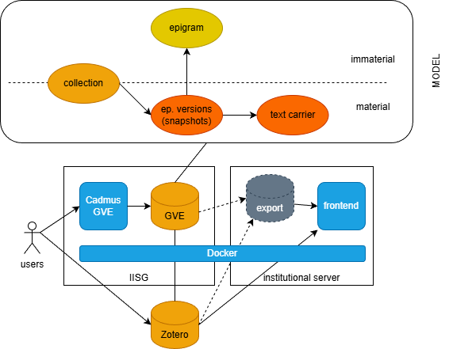

- [Entities Hierarchy](#entities-hierarchy)
  - [Carriers](#carriers)
  - [Snapshots](#snapshots)
  - [Epigrams](#epigrams)
  - [Collections](#collections)
  - [Cadmus for VEdition](#cadmus-for-vedition)
    - [Cadmus GVE Data Model](#cadmus-gve-data-model)
      - [Snapshot Part](#snapshot-part)
      - [Hands Part](#hands-part)
    - [Items](#items)
      - [Flags](#flags)
      - [Carrier Item](#carrier-item)
      - [Snapshot Item](#snapshot-item)
      - [Epigram Item](#epigram-item)
      - [Collection Item](#collection-item)
      - [Parts Matrix](#parts-matrix)
  - [Data Flow](#data-flow)

# Entities Hierarchy

> ⚠️ This document reflects an early stage of the modeling stage for those entities, representing the base for a Cadmus-based editor.

The snapshot is just the bottom level entity in our hierarchy, the nearest to the material support. Yet, it is only a portion of our data:

- the snapshot model itself is part of a larger model, which adds more metadata to it. The snapshot model is a highly computational representation of a text with all its changes; next to it, we may include more data about its hands, bibliography, links, etc.
- beyond the snapshot we have more entities: below it there are the material supports (the text carriers); above it there are abstractions like epigrams and collections.

The diagram below summarizes the main entities in this project:

## Carriers

Starting from the material side (top of the diagram), everything starts with our **carriers**. A carrier is defined as "the concrete, physical object that contains, among other things, the textual witnesses and is then digitally reproduced and described in the edition".

A carrier is usually a notebook with several sheets, which include among other things many epigram versions; but it can also be a letter, a single sheet, etc.

## Snapshots

The [snapshot](textual) is the digital and critical representation of each epigram version found in each carrier. At the lowest level, the text in each carrier is represented by a snapshot, a highly structured and computable digital model representing the **textual situation**, i.e. "the transmitted sum of all variants of textual versions on a text carrier". The snapshot is not just a container of variations of a text, but a compact model capable of generating all of them with their metadata, via operations which represent the scholars’ interpretation of the annotations chaotically scattered on the carrier.

>Sparse lines of text, which happen to be disseminated in some carriers, are considered snapshots too.

## Epigrams

So we have carriers, containing many epigram versions. We talk of "epigram versions" right because we identify many texts from various carriers as all representing variations of what we consider the "same" text. The "epigram" is right this abstract class which encompasses all these instances of text. The epigram is defined as "all textual versions that are "related to each other through textual identity and distinguishable through textual variance" (GGA 224)". In our model, the "epigram" is thus an abstraction, which is conveniently used to hold metadata shared among all the epigrams.

For instance, what we identify as "epigram 48" is the set of all the versions of its text from our various carriers, like that found in carrier H54, carrier H56, etc.

In turn, each of these versions which live under the epigram 48 umbrella have a corresponding snapshot which represents them, both for their text and for their diplomatic part; and which is able to change the base text on the carrier following a sequence of operations represented on it.

This means that:

- each carrier contains 1 or more epigram versions.
- each epigram version is critically represented with a snapshot.
- each snapshot contains 1 or more text alteration stages, produced by applying a sequence of editing operations on the base text.

So, the lower we go into this hierarchy, the higher the number of alternative texts. Also, note that there is no text for the epigram itself: the epigram is an abstraction, and cannot have any text; it is just the set of all the epigram versions scattered in all the carriers we got.

## Collections

Finally, epigram versions are materially or virtually chained into sequences, which represent collections of compositions. These can be defined by their material sequence, like in a printed edition; or by various numberings found on the carriers and hinting at different selections and ordering of sets of compositions.

>Collection is a more specialized IT term fit to the entity represented in the digital model, and essentially corresponding to what is defined as an order or sequence ("the arrangement of all textual witnesses as found on a textual carrier"[^1]). The term "collection" here is used with a purely IT sense, meaning any number of items belonging to an _ordered_ set. What corresponds to this collection may vary: it might just be an idea of the author for organizing some epigrams, derived from what he writes about them elsewhere; or it might be what emerges from marks added to the notebooks (e.g. numbers) for each epigram, hinting at some plan for building an ordered collection of them; or something material, like the physical sequence in which they appear. Whatever the specific nature, we adopt a single, more abstract model for them.

---

## Cadmus for VEdition

Given that our modeling is highly complex, though necessarily open to changes, especially at this early stage; and that we need a quick and effective infrastructure to lean our snapshot on, we have adopted [Cadmus](https://vedph.github.io/cadmus-doc) to represent all our entities in a single database, with a uniform data architecture.

Essentially, you can think of Cadmus records (called _items_) as boxes, where you can put any number and type of objects (called _parts_). Each of these objects has its own self-contained model, and is typically designed for reuse, so that you can put the same type of objects in many different boxes. For instance, an object representing a structured datation (with all the nuances for years, months, days, centuries, termini ante and post, etc.) can be put into any box representing an item which requires a date. The data model is thus dynamic and built by composition, and so is the web-based editor corresponding to it: the model of a box is just its content, which varies whenever a new object is put into it or an existing one is removed from it. This modularity allows for highly structured and scalable dynamic models, which fit to a lot of different scenarios, including text with all its annotations, whatever their complexity.

In fact, text in Cadmus is just an object, like any other datum, and so are its annotations. For instance, if you have a text with a critical apparatus, a comment, and paleographic annotations, you might have a box with an object for the plain text; an object for the apparatus annotations; another one for the comments; and yet another one for paleographic annotations. Each of these objects has its own model, so that annotating a text essentially means linking an object of any type to a specific portion of it.

This produces a sort of layered annotation system, where each layer contains a set of annotations belonging to a specific knowledge domain, and thus having its own model. For highly complex or highly frequent annotations this has many benefits:

- it allows for a highly _scalable_ scenario, where you can add as many annotations (layers) as you want, without affecting the existing text and its other annotations. You just add another annotation to the layer object, or a new layer object for annotations belonging to a different knowledge domain, without having to change neither the text or its existing annotations. This is not true for annotations systems like XML, where a single tree-based structure holds all the metadata attached to portions of the text; there, adding many heterogeneous structures on top of it means struggling to tackle a complex game of interlocking pieces to build a tree with all the required tags woven together. Additionally, this is not always practical or even possible, and eventually ends up hitting the barrier of overlap, which is not allowed in XML. The typical solution in this case is standoff, which in fact is one of the typical outputs of Cadmus when exporting a subset of its data into TEI; yet, that's right its complexity which calls for an automatic generation of it.
- it allows designing the model of each annotation _without constraints_ from the physical model. You can define a highly structured object for each type of annotation, without caring about having to interlock its parts with those of other models into a single, predefined structure. Also, instead of just attaching "flat" tags (as element names or attribute name/value pairs) to a portion of text, you can attach a _fully structured_ object of any depth, where each property is either a scalar value or yet another object, without limits.
- it allows abstracting from a specific physical model (e.g. XML) thus producing an _easy user experience_, requiring no IT skills to create digital content; you just have to fill a web form.
- it allows using the same abstract source model to _generate multiple outputs_, whether it is a TEI document (in one or more different schemas), an RDF graph, etc.

[^1]: Strictly speaking, for a collection it is not necessary that the witnesses belong to a single textual carrier. In theory, one could even envisage a case where someone is planning a collection by picking texts from different carriers. The definition quoted here anyway refers to the most typical case.

### Cadmus GVE Data Model

Two parts are specific to the GVE project: snapshot and hands. Other parts are directly imported from the catalog of existing Cadmus models.

#### Snapshot Part

- [snapshot](https://github.com/vedph/gve-core/blob/master/Cadmus.Gve.Parts/GveSnapshotPart.cs):
  - `text`\* (`CharChainNode[]`):
    - `id`\* (`int`)
    - `index`\* (`int`)
    - `label`\* (`string`)
    - `data`\* (`char`)
    - `sourceTag`\* (`string`)
    - `features` (`Feature[]`):
      - `setPolicy`\* (`FeatureSetPolicy`: 0=multiple, 1=single, 2=single-first)
      - `name`\* (`string`)
      - `value` (`string`)
  - `operations` (`CharChainOperationSource[]`):
    - `rank` (`short`)
    - `groupId` (`string`)
    - `features` (`OperationFeature[]`):
      - `setPolicy`\* (`FeatureSetPolicy`: 0=multiple, 1=single, 2=single-first)
      - `name`\* (`string`)
      - `value` (`string`)
      - `isNegated` (`bool`)
      - `isGlobal` (`bool`)
      - `isShortLived` (`bool`)
    - `sources` (`OperationSource[]`):
      - `id`\* (`string`)
      - `type` (`string`)
      - `rank` (`short`)
      - `note` (`string`)
    - `id` (`string`)
    - `type` (`OperationType`)
    - `inputTag` (`string`)
    - `outputTag` (`string`)
    - `atAsIndex` (`bool`)
    - `at` (`int`)
    - `run` (`int`)
    - `toAsIndex` (`bool`)
    - `to` (`int`)
    - `toRun` (`int`)
    - `value` (`string`)

#### Hands Part

- `hands` (`GveHand[]`):
  - `eid` (`string` 📚 `gve-hand-eids`): the thesaurus is used when you do not need to link the owner ID and have just a closed list, like here.
  - `ownerId` (`AssertedCompositeId`)
  - `tag` (`string` 📚 `gve-hand-tags`)
  - `tool` (`string` 📚 `gve-hand-tools`)
  - `color` (`string` 📚 `gve-hand-colors`)
  - `notes` (dictionary of strings)

### Items

Here we list the Cadmus items with their parts, as defined for the GVE editor in the API backend profile. The references part is mostly used for Zotero-based bibliography.

#### Flags

- `complete`: the item is complete
- `revised`: the item has been revised
- `undisclosed`: the item is not (or not yet) meant for publishing
- `lost` (for carriers and possibly others)
- `sparse` (for sparse lines)

> We can use a flag for `lost` because this allows browsing and filtering carrier items according to these types at a glance (`lost` being something no longer existing, this is a capital distinction to be made), and because this is a single, binary feature for which a categories part would be too much. Also, a `lost` flag might possibly apply to other items, too.

In a publishing flow, where data move from the backend database (edited with Cadmus) to some frontend presentation, there will be rules to determine when an item in the database is to be published: e.g. the item must be complete and not be undisclosed.

#### Carrier Item

- flags: lost.

- _identity_:
  - [metadata](https://github.com/vedph/cadmus-general/blob/master/docs/metadata.md)
  - [shelfmarks](https://github.com/vedph/cadmus-codicology/blob/master/docs/cod-shelfmarks.md)
  - [links](https://github.com/vedph/cadmus-general/blob/master/docs/pin-links.md)
- _material_:
  - [categories](https://github.com/vedph/cadmus-general/blob/master/docs/categories.md):`support`
  - [measurements](https://github.com/vedph/cadmus-general/blob/master/docs/physical-measurements.md)
- _content_:
  - [categories](https://github.com/vedph/cadmus-general/blob/master/docs/categories.md):`content`
  - [categories](https://github.com/vedph/cadmus-general/blob/master/docs/categories.md):`text` (e.g. epigram, letter...)
  - [comment](https://github.com/vedph/cadmus-general/blob/master/docs/comment.md)
- _history_:
  - [chronotopes](https://github.com/vedph/cadmus-general/blob/master/docs/chronotopes.md) for both origin and provenance (use tags).
  - [note](https://github.com/vedph/cadmus-general/blob/master/docs/note.md):`hist`
- _editorial_:
  - [references](https://github.com/vedph/cadmus-bricks/blob/master/docs/doc-reference.md)
  - [note](https://github.com/vedph/cadmus-general/blob/master/docs/note.md)

#### Snapshot Item

The _group ID_ of each snapshot item is the epigram's number. This immediately links each snapshot to the abstract epigram it is an instance of. The connection to the corresponding carrier is implicit in the item titles, which have been systematically generated by an import procedure based on the spreadsheet with the list of epigrams and carriers. This allows users to avoid to add an explicit link to each snapshot, and rather rely on a preset environment where all the relevant entities have already been created.

- _identity_:
  - [metadata](https://github.com/vedph/cadmus-general/blob/master/docs/metadata.md)
  - [links](https://github.com/vedph/cadmus-general/blob/master/docs/pin-links.md)
- _material_:
  - [categories](https://github.com/vedph/cadmus-general/blob/master/docs/categories.md):`support`
  - [preservation states](https://github.com/vedph/cadmus-general/blob/master/docs/physical-states.md)
- _content_:
  - [categories](https://github.com/vedph/cadmus-general/blob/master/docs/categories.md):`content`
  - [categories](https://github.com/vedph/cadmus-general/blob/master/docs/categories.md):`lang`: languages (German, Italian, Latin, Ancient Greek)
  - [snapshot](#snapshot-part) (GVE)
  - [comment](https://github.com/vedph/cadmus-general/blob/master/docs/comment.md) with topic categories.
  - [hands](#hands-part) (GVE)
- _history_:
  - [historical dates](https://github.com/vedph/cadmus-general/blob/master/docs/asserted-historical-dates.md)
- _editorial_:
  - [references](https://github.com/vedph/cadmus-bricks/blob/master/docs/doc-reference.md)
  - [note](https://github.com/vedph/cadmus-general/blob/master/docs/note.md)

#### Epigram Item

- _identity_:
  - [metadata](https://github.com/vedph/cadmus-general/blob/master/docs/metadata.md)
  - [links](https://github.com/vedph/cadmus-general/blob/master/docs/pin-links.md)
- _content_:
  - [comment](https://github.com/vedph/cadmus-general/blob/master/docs/comment.md) with topic categories.
- _editorial_:
  - [references](https://github.com/vedph/cadmus-bricks/blob/master/docs/doc-reference.md)
  - [note](https://github.com/vedph/cadmus-general/blob/master/docs/note.md)

#### Collection Item

- _identity_:
  - [metadata](https://github.com/vedph/cadmus-general/blob/master/docs/metadata.md)
- _content_:
  - [categories](https://github.com/vedph/cadmus-general/blob/master/docs/categories.md):`seq`
  - [links](https://github.com/vedph/cadmus-general/blob/master/docs/pin-links.md):`seq` 🔗 version
  - [comment](https://github.com/vedph/cadmus-general/blob/master/docs/comment.md) with topic categories.
- _editorial_:
  - [references](https://github.com/vedph/cadmus-bricks/blob/master/docs/doc-reference.md)
  - [note](https://github.com/vedph/cadmus-general/blob/master/docs/note.md)

#### Parts Matrix

This table represents the distribution of parts in each item. Items correspond to our entities and are shown in columns; parts correspond to self-contained, independent and reusable models which are composed into items, and are shown in rows. At each intersection of a row and a column, the resulting cell contains `X` meaning that the corresponding part is present in that item, and/or a role identifier (like `content`, `support`, `hist`, etc.) meaning that the corresponding part is present in that item with this specific role. It may also happen that multiple instances of the same part are present in the same item; in this case, the cell contains the role identifiers of each part.

| part           | snapshot             | carrier              | epigram | collection |
| -------------- | -------------------- | -------------------- | ------- | ---------- |
| categories     | content support lang | content support text |         | seq        |
| chronotopes    |                      | X                    |         |            |
| comment        | X                    | X                    | X       | X          |
| hands (GVE)    | X                    |                      |         |            |
| links          | X                    | X                    | X       | links seq  |
| measurements   |                      | X                    |         |            |
| metadata       | X                    | X                    | X       | X          |
| note           | X                    | X hist               | X       | X          |
| references     | X                    | X                    | X       | X          |
| shelfmarks     |                      | X                    |         |            |
| snapshot (GVE) | X                    |                      |         |            |
| states         | X                    |                      |         |            |

On passage, this table clearly shows the architectural design principles of Cadmus in action: here we are effectively reusing most of the models (the parts), thanks to their self-contained and generalistic design; and we are dynamically building entities models by composition (aggregating parts), which allows for unlimited expansion. Modularity here is the key for dynamic, composite models, which also paves the way for a grassroots approach where each project using this system contributes to a catalog of models and editor UIs which can be reused by other projects.

In this project we are effectively using 35 parts for 4 entity types, either material or immaterial, textual and non-textual, and only 2 of those parts were designed specifically for it (those marked by GVE). Given this modularity, we will be able to further expand the models by either adding new entities, or introducing new parts in the existing ones, without having to modify existing data.

Also, while the database is capable to represent virtually any entity, either material or immaterial, textual, meta-textual, or non-textual at all, its data architecture remains uniform and open to unlimited expansion both on data quantity and quality.

These entities are mostly **linked** as follows:

- **snapshot → carrier**: each snapshot item refers to its carrier in its ID and title, so adding a link here is redundant and is avoided just to speed up the work of operators.
- **snapshot → epigram**: each snapshot item is a manuscript or print attesting a materially unique version of an epigram. Snapshots are linked to their epigram via their group ID, which is equal to the epigram's number. Epigrams here are just abstraction, i.e. the sum of all the metadata which can be shared among a set of epigram versions.
- **collection → snapshot**: each collection has an ordered set of links pointing to the selected snapshots, possibly deep linking also a specific alteration stage in them.

## Data Flow

The main data flow for VEdition can be summarized in this diagram:

Reading it from left to right:

1. users concurrently enter data via the Cadmus GVE editor, hosted in an IISG institutional VM.
2. data are stored by Cadmus in a standard NoSql document-based database (MongoDB). The model here essentially deals with 4 entity types: on the material side, the epigram versions including snapshots and the text carriers; on the immaterial side, the epigrams. Between these two realms there are collections, which can be either material or immaterial.
3. additionally, users also maintain an independent Zotero-based bibliography, and Cadmus links to it to provide bibliographic data.
4. these two databases can be directly used by a frontend app (=the VEdition's website), and/or indirectly via an intermediate data export which provides a sort of view-model for data, best fit to the requirements of the app. Zotero data too can either be accessed directly or cached into this intermdiate database, thus avoiding potential issues with Zotero services availability.
5. both the Cadmus editor and the frontend app are containerized with Docker images. This makes it very easy to port them in any environment and ensures a longer duration in time, because the software is completely containerized with all its dependencies and configurations, and servers use it like a black box.
