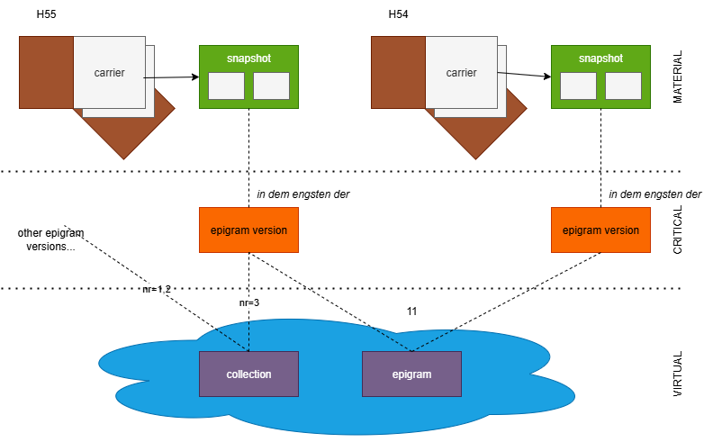
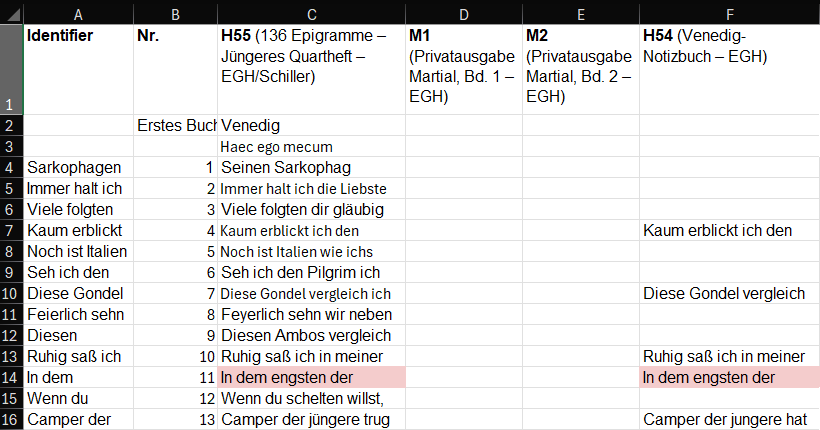

- [Entities Hierarchy](#entities-hierarchy)
  - [Overview](#overview)
    - [Carriers](#carriers)
    - [Snapshots](#snapshots)
    - [Epigram Versions †](#epigram-versions-)
    - [Epigrams](#epigrams)
    - [Collections](#collections)
    - [Sparse Lines](#sparse-lines)
  - [Cadmus for VEdition](#cadmus-for-vedition)
    - [GVE Parts](#gve-parts)
      - [Snapshot Part](#snapshot-part)
      - [Hands Part](#hands-part)
    - [Items](#items)
      - [Flags](#flags)
      - [Carrier Item](#carrier-item)
      - [Snapshot Item](#snapshot-item)
      - [Sparse Lines Item](#sparse-lines-item)
      - [Epigram Item](#epigram-item)
      - [Collection Item](#collection-item)
      - [Parts Matrix](#parts-matrix)
      - [Thesauri List](#thesauri-list)
      - [Operation Features](#operation-features)

# Entities Hierarchy

The snapshot is just the lowest level entity in our hierarchy. Being closest to the material supports, and representing a highly complex multiple-versions text, it's the most complex one. Yet, above it there are other entities we want to represent in our data.

> ⚠️ This document reflects an early stage of the modeling stage for those entities, representing the base for a Cadmus-based editor.

## Overview

The diagram below summarizes the main entities in this project:



### Carriers

Starting from the material side (top of the diagram), everything starts with our **carriers**. A carrier is defined as "the concrete, physical object that contains, among other things, the textual witnesses and is then digitally reproduced and described in the edition".

In the diagram we are representing two notebook carriers, named H55 and H54. So, the first of our entities is the material one, the _carrier_, which will be given all the metadata required to represent it as a physical document preserved in some archive.

### Snapshots

These notebooks contain many texts. In the diagram we focus on a single epigram, which happens to be found in both these notebooks. At the lowest level, the text in each carrier is represented by a [snapshot](textual), a highly structured and computable digital model representing the **textual situation**, i.e. “the transmitted sum of all variants of textual versions on a text carrier”.

The snapshot is not just a container of variations of a text, but a compact model capable of generating all of them with their metadata, via operations which represent the scholars’ interpretation of the annotations chaotically scattered on the carrier. Also, in addition to the snapshot textual data, we might want to provide more metadata to each text, like e.g. a comprehensive comment, shelfmark numbers, bibliographic references, etc. In this context, the snapshot model would just be a subset of this larger entity representing the textual situations in each carrier. Given that the snapshot model is still at its core, we name this entity _snapshot_ from its most important part.

### Epigram Versions †

Above the snapshot level, in theory one could think of a _single_ text version, defined by scholarly judgment, for each of the textual situations. This might be the **epigram version** layer represented in the diagram.

Yet, in VEdition this is not typically the case; in most texts, the variations are too fluid, and their analysis is often so difficult that thinking about such a reconstructed text would be impossible. So, this layer would probably be discarded; as seen above, additional metadata for the snapshot will still be available at that lower level.

### Epigrams

At a higher level instead, we identify all those snapshots in their respective carriers as variations of the same text. Even though it is not possible to reconstruct this text, nonetheless we will probably want to add more metadata to the entity representing it.

From a practical point of view, avoiding duplicating all the metadata we would have to repeat in each snapshot we consider a variant of the same epigram is a sufficient reason to define an epigram entity. This entity happens not to have a text, but it collects all the metadata shared among all its variations as witnessed by snapshots.

Let us provide a less abstract example: the picture below was taken from a spreadsheet collecting all the epigram versions from all the carriers:



As you can see, each column starting from C corresponds to a carrier (H55, M1, M2, H54, etc.). All the epigram versions present in various carriers are aligned on the same row: for instance, at row 14 what can be considered the same epigram is attested by two different epigram versions, one in H55 and another in H54, both with _incipit_ "In dem engsten der".

Now, the very fact that we are aligning the same texts in the same row, and assigning them a shared numeric identifier, implies that we are recognizing them as instances of the same class, the abstract **epigram**. The epigram is defined as "all textual versions that are “related to each other through textual identity and distinguishable through textual variance” (GGA 224)". In our model, the "epigram" is thus an abstraction, which is conveniently used to hold metadata shared among all the epigrams: it corresponds to the row in the spreadsheet table, which is identified by your epigram identifier. "Real" epigrams (=epigram versions) are in columns; but they are all lined up in the same row because we consider all these texts as alternatives of a single unit. This unit is our abstraction, the primary reason for lining them up in the same row; so all what we say about the row is meant to apply to all the columns in it.

In the above diagram, the two epigram versions from snapshots in carriers H55 and H54 are linked to a single epigram. Anyway, probably the final one will drop the mid layer of epigram version and just link epigrams to their snapshots. Texts will reside at the level of the snapshot, together with all their diplomatic data (most of the material data will rather belong to carriers); epigrams will just be a collection of metadata which happens to be shared among the subset of the snapshots representing the “same” text.

### Collections

On top of this abstract layer we find a **collection**. This is a more specialized IT term fit to the entity represented in the digital model, and essentially corresponding to what is defined as an **order or sequence** ("the arrangement of all textual witnesses as found on a textual carrier"[^1]). The term "collection" here is used with a purely IT sense, meaning any number of items belonging to an _ordered_ set. What corresponds to this collection may vary: it might just be an idea of the author for organizing some epigrams, derived from what he writes about them elsewhere; or it might be what emerges from marks added to the notebooks (e.g. numbers) for each epigram, hinting at some plan for building an ordered collection of them; or something material, like the physical sequence in which they appear. Whatever the specific nature, we adopt a single, more abstract model for them.

It should be added that in this generic model, a collection is not necessarily ordered; or it might be ordered in multiple ways. From the point of view of modular architecture, this means separating these two notions: the collection is the overarching entity, and it can sort its items in no way (when not sorted), or in just 1 way, or in multiple ways. This implies that the model for zero or more ordering’s assigned to the items of a collection will be repeated for each different order.
This ensures we have a consistent model without redundancies (i.e. repetitions), and it is also the practical reason for which the collection is a Cadmus “item” (in the technical sense of this term in that framework), while sequences are parts of that item, even if the details of this implementation are still to be defined. So, we can say that those items belong to a collection and say this only once; then, we can add that this collection can be ordered in zero or more different sequences. Anyway, this can be easily regarded as a modeling detail. We can adopt a synecdoche and name these collections “sequences”: from the user’s point of view, nothing changes. Yet internally we distinguish between the collection in the technical sense from how we can arrange items in it.

⚙️ From a purely IT standpoint, a _collection_ is an abstract data type that groups multiple data elements, which can be of the same or different types. That's the most generic, umbrella term and can include sets, lists, arrays, etc. A "set" is a specialization which differs because its elements are all unique. Among collections, some are ordered: these are "sequence", "list", and "array". A sequence can be finite or infinite (e.g. the sequence of numbers). Lists and arrays are both ordered, but lists are dynamically resized, while arrays are static but more memory-efficient. So, "collection" is more abstract: it's a conceptual container that doesn't enforce rules about order, uniqueness, or mutability. It's like saying "a vehicle" without specifying whether it's a car, bike, or spaceship. Instead:

- a set is a collection with constraints: no duplicates, no order.
- a sequence is a collection with structure: order matters, duplicates allowed.
- a list is a sequence with flexibility (dynamic size).
- an array is a sequence with rigidity (fixed size).

### Sparse Lines

Finally, a corner-case entity (not included in the diagram) is represented by sparse lines of text, which happen to be disseminated in some carriers. These are not snapshots with all their complex annotations and transformations, but just text fragments. As such, their model is aligned with that of the epigram version, which here is probably going to be dropped.

## Cadmus for VEdition

So, in the end, we would have these entities:

1. _carriers_: the material carriers for texts, mostly notebooks, but also single sheets.
2. _snapshots_: highly compact structures which represent multiple alteration stages of the “same” text as a creative process witnessed by annotations on top of the base text.
3. _lines_: sparse lines found in carriers.
4. _epigrams_: abstractions (with no text) which reflect our consideration of multiple snapshots as being different versions of the “same” text.
5. _collections_: virtual or material groups of epigrams (mostly ordered).

Given that our modeling is highly complex, though necessarily open to changes, especially at this early stage; and that we need a quick and effective infrastructure to lean our snapshot on, we are going to adopt [Cadmus](https://vedph.github.io/cadmus-doc) to represent all our entities in a single database, with a uniform data architecture.

Essentially, you can think of Cadmus records (called _items_) as boxes, where you can put any number and type of objects (called _parts_). Each of these objects has its own self-contained model, and is typically designed for reuse, so that you can put the same type of objects in many different boxes. For instance, an object representing a structured datation (with all the nuances for years, months, days, centuries, termini ante and post, etc.) can be put into any box representing an item which requires a date. The data model is thus dynamic and built by composition, and so is the web-based editor corresponding to it: the model of a box is just its content, which varies whenever a new object is put into it or an existing one is removed from it. This modularity allows for highly structured and scalable dynamic models, which fit to a lot of different scenarios, including text with all its annotations, whatever their complexity.

In fact, text in Cadmus is just an object, like any other datum, and so are its annotations. For instance, if you have a text with a critical apparatus, a comment, and paleographic annotations, you might have a box with an object for the plain text; an object for the apparatus annotations; another one for the comments; and yet another one for paleographic annotations. Each of these objects has its own model, so that annotating a text essentially means linking an object of any type to a specific portion of it.

This produces a sort of layered annotation system, where each layer contains a set of annotations belonging to a specific knowledge domain, and thus having its own model. For highly complex or highly frequent annotations this has many benefits:

- it allows for a highly _scalable_ scenario, where you can add as many annotations (layers) as you want, without affecting the existing text and its other annotations. You just add another annotation to the layer object, or a new layer object for annotations belonging to a different knowledge domain, without having to change neither the text or its existing annotations. This is not true for annotations systems like XML, where a single tree-based structure holds all the metadata attached to portions of the text; there, adding many heterogeneous structures on top of it means struggling to tackle a complex game of interlocking pieces to build a tree with all the required tags woven together. Additionally, this is not always practical or even possible, and eventually ends up hitting the barrier of overlap, which is not allowed in XML. The typical solution in this case is standoff, which in fact is one of the typical outputs of Cadmus when exporting a subset of its data into TEI; yet, that's right its complexity which calls for an automatic generation of it.
- it allows designing the model of each annotation _without constraints_ from the physical model. You can define a highly structured object for each type of annotation, without caring about having to interlock its parts with those of other models into a single, predefined structure. Also, instead of just attaching "flat" tags (as element names or attribute name/value pairs) to a portion of text, you can attach a _fully structured_ object of any depth, where each property is either a scalar value or yet another object, without limits.
- it allows abstracting from a specific physical model (e.g. XML) thus producing an _easy user experience_, requiring no IT skills to create digital content; you just have to fill a web form.
- it allows using the same abstract source model to _generate multiple outputs_, whether it is a TEI document (in one or more different schemas), an RDF graph, etc.

[^1]: Strictly speaking, for a collection it is not necessary that the witnesses belong to a single textual carrier. In theory, one could even envisage a case where someone is planning a collection by picking texts from different carriers. The definition quoted here anyway refers to the most typical case.

---

### GVE Parts

These parts are specific to the GVE project.

#### Snapshot Part

See [code](https://github.com/vedph/gve-core/blob/master/Cadmus.Gve.Parts/GveSnapshotPart.cs) for more details.

- `snapshot` (`Snapshot`):
  - `size` (`Size`): size in pixels:
    - `width` (`double`)
    - `height` (`double`)
  - `style` (`string`): snapshot CSS style.
  - `defs` (`string`): optional SVG `defs` element code.
  - `image` (`SnapshotImage`): background image:
    - `url`\* (`string`)
    - `canvas` (`Rectangle`):
      - `x` (`double`)
      - `y` (`double`)
      - `width` (`double`)
      - `height` (`double`)
    - `opacity` (`double`)
  - `text` (`CharChainNode[]`):
    - `id` (`int`)
    - `index` (`int`)
    - `label` (`string`)
    - `data` (`char`)
    - `sourceTag` (`string`)
    - `features` (`Feature[]`):
      - `name`\* (`string`)
      - `value` (`string`)
      - `setPolicy`\* (`int`)
  - `textStyle` (`string`): CSS style for base text layer.
  - `textOptions` (`SvgBaseTextOptions`):
    - `lineHeightOffset` (`double`)
    - `charSpacingOffset` (`double`)
    - `spcWidthOffset` (`double`)
    - `offset` (`Point`):
      - `x` (`double`)
      - `y` (`double`)
    - `minLineHeights` (dictionary of doubles keyed by shorts)
  - `operations` (`CharChainOperationSource[]`):
    - `rank` (`short`)
    - `groupId` (`string`)
    - `features` (`OperationFeature[]`):
      - `name` (`string`)
      - `value` (`string`)
      - `setPolicy` (`FeatureSetPolicy`)
      - `isNegated` (`bool`)
      - `isGlobal` (`bool`)
      - `isShortLived` (`bool`)
    - `sources` (`OperationSource[]`):
      - `id`\* (`string`)
      - `type` (`string`)
      - `rank` (`short`)
      - `note` (`string`)
    - `diplomatics` (`OperationDiplomatics`):
      - `g` (string): SVG for the graphical representation of the operation.
      - `isNewTextHidden` (`bool`)
      - `features` (`Feature[]`):
        - `name` (`string`)
        - `value` (`string`)
        - `setPolicy` (`FeatureSetPolicy`)
      - `elementFeatures` (dictionary with key=string and value=list of `Feature`'s)
    - `id`\* (`string`)
    - `type`\* (`OperationType`)
    - `inputTag` (`string`)
    - `outputTag` (`string`)
    - `atAsIndex` (`bool`)
    - `at` (`int`)
    - `run` (`int`)
    - `toAsIndex` (`bool`)
    - `to` (`int`)
    - `toRun` (`int`)
    - `value` (`string`): the primary value argument for this operation.
  - `opStyle` (`string`): CSS style for the operation layer.
  - `timelines` (dictionary with `string` keys and `AnimationTimeline` value):

#### Hands Part

- `hands` (`GveHand[]`):
  - `eid` (`string` 📚 `gve-hand-eids`): the thesaurus is used when you do not need to link the owner ID and have just a closed list, like here.
  - `ownerId` (`AssertedCompositeId`)
  - `tag` (`string` 📚 `gve-hand-tags`)
  - `tool` (`string` 📚 `gve-hand-tools`)
  - `color` (`string` 📚 `gve-hand-colors`)
  - `notes` (dictionary of strings)

Thesauri:

- 📚 `gve-hand-eids`:
  - schlegel=Schlegel
  - schiller=Schiller
  - geist=Geist
  - riemer=Riemer
  - unknown=unknown

### Items

Here we list the Cadmus items with their parts, as defined for the GVE editor in the API backend profile. The references part is mostly used for Zotero-based bibliography.

#### Flags

- `complete`: the item is complete
- `revised`: the item has been revised
- `undisclosed`: the item is not (or not yet) meant for publishing
- `lost` (for carriers and possibly others)

> We can use a flag for `lost` because this allows browsing and filtering carrier items according to these types at a glance (`lost` being something no longer existing, this is a capital distinction to be made), and because this is a single, binary feature for which a categories part would be too much. Also, a `lost` flag might possibly apply to other items, too.

In a publishing flow, where data move from the backend database (edited with Cadmus) to some frontend presentation, there will be rules to determine when an item in the database is to be published: e.g. the item must be complete and not be undisclosed.

#### Carrier Item

- flags: lost.

- _identity_:
  - [metadata](https://github.com/vedph/cadmus-general/blob/master/docs/metadata.md)
  - [shelfmarks](https://github.com/vedph/cadmus-codicology/blob/master/docs/cod-shelfmarks.md)
  - [external IDs](https://github.com/vedph/cadmus-general/blob/master/docs/external-ids.md)
- _material_:
  - [categories](https://github.com/vedph/cadmus-general/blob/master/docs/categories.md):`support`
  - [measurements](https://github.com/vedph/cadmus-general/blob/master/docs/physical-measurements.md); default size `mm`.
  - [preservation states](https://github.com/vedph/cadmus-general/blob/master/docs/physical-states.md)
- _content_:
  - [categories](https://github.com/vedph/cadmus-general/blob/master/docs/categories.md):`content`
  - [categories](https://github.com/vedph/cadmus-general/blob/master/docs/categories.md):`text`: branches for:
    - manuscripts (epigram, epigram collection, letter...)
    - prints (literary magazine, edition volume)
  - [comment](https://github.com/vedph/cadmus-general/blob/master/docs/comment.md) with topic categories.
- _history_:
  - [chronotopes](https://github.com/vedph/cadmus-general/blob/master/docs/chronotopes.md) for both origin and provenance (use tags).
  - [note](https://github.com/vedph/cadmus-general/blob/master/docs/note.md):`hist`
- _editorial_:
  - [references](https://github.com/vedph/cadmus-bricks/blob/master/docs/doc-reference.md)
  - [note](https://github.com/vedph/cadmus-general/blob/master/docs/note.md)

Categories thesauri:

📚 `categories_text`:

- epigram (Epigramm)
- epigram collection (Epigrammsammlung)
- letter (Brief)
- travel journal (Reisetagebuch)
- working notebook (Arbeitsheft)
- index (Index)
- note (Notat)
- letter recipients list (Liste Briefempfänger)
- calculations (Berechnungen)
- sketches (Skizzen)
- itinerary (Reiseplan)
- scientific descriptions (Naturwissenschaftliche Beschreibung)
- list of words (Wörterlisten)
- remarks on epigram meter (Bemerkungen zur Metrik)
- print (Druck):
  - literary magazine (Literaturzeitschrift)
  - edition volume (Editionsband)

#### Snapshot Item

The _group ID_ of each snapshot item is the epigram's EID. This immediately links each snapshot to the abstract epigram it is an instance of.

- _identity_:
  - [metadata](https://github.com/vedph/cadmus-general/blob/master/docs/metadata.md)
  - [shelfmarks](https://github.com/vedph/cadmus-codicology/blob/master/docs/cod-shelfmarks.md)
  - [external IDs](https://github.com/vedph/cadmus-general/blob/master/docs/external-ids.md)
  - [links](https://github.com/vedph/cadmus-general/blob/master/docs/pin-links.md)
- _material_:
  - [categories](https://github.com/vedph/cadmus-general/blob/master/docs/categories.md):`support`: branches for:
    - format (quarto)
    - materials (loose materials, folded materials, bound materials...)
    - paper type
    - paper colors
- _content_:
  - [categories](https://github.com/vedph/cadmus-general/blob/master/docs/categories.md):`content`: branches for:
    - copy type (rough, clean)
    - language (German, Italian, Latin, Ancient Greek)
    - authorship (autograph, allograph)
    - numbering (pagination, foliation)
    - margins (cropped, torn)
    - writing material (ink1, ink2, pencil...)
  - [categories](https://github.com/vedph/cadmus-general/blob/master/docs/categories.md):`lang`: languages (German, Italian, Latin, Ancient Greek)
  - [snapshot](#snapshot-part) (GVE)
  - [comment](https://github.com/vedph/cadmus-general/blob/master/docs/comment.md) with topic categories.
- _history_:
  - [historical dates](https://github.com/vedph/cadmus-general/blob/master/docs/asserted-historical-dates.md)
- _editorial_:
  - [references](https://github.com/vedph/cadmus-bricks/blob/master/docs/doc-reference.md)
  - [note](https://github.com/vedph/cadmus-general/blob/master/docs/note.md)

> The proposed page rotation feature (right or left) is a property of the whole support, so it will not be encoded as an [operation feature](#operation-features). If this is only applied to snapshots, we could add it to its metadata or provide a specific categories for the support; anyway it's easier to just add the rotation to the entries of the `categories:support` part, and use it for snapshots only. This will keep all the support properties in the same set, and avoid a full part for just a couple of entries.

Categories thesauri:

- 📚 `categories_content`:

  - copy type:
    - rough (Rohfassung)
    - clean (Reinschrift)
    - print (Druck): we could put this here because it can't be a flag, as it applies only to carriers; and in a sense it could be aligned to these other types which tend to be mutually exclusive.
  - language:
    - German (Deutsch)
    - Italian (Italienisch)
    - Latin (Lateinisch)
    - Ancient Greek (Altgriechisch)
  - authorship:
    - autograph (Autograph)
    - allograph (Allograph)
  - numbering:
    - pagination (Paginierung)
    - foliation (Folierung)
  - margins (Ränder):
    - cropped (beschnitten)
    - torn (gerissen)
  - writing material (Schreibmaterial):
    - ink 1 (Tinte 1)
    - ink 2 (Tinte 2)
    - pencil (Bleistift)
    - red chalk (Rötel)

- 📚 `categories_support`:
  - format (Format):
    - quarto (Quarto)
  - loose materials (Loses Material)
    - sheet (Blatt)
    - cut-out/clipping (Blattausschnitt)
  - folded materials (Gefaltetes Material)
  - bound materials (Gebundenes Material):
    - notebook cover (Heft mit Umschlag)
    - notebook bound (Heft)
    - book page (Buchseite)
  - rotation (Drehung): added from snapshot diplomatic properties:
    - right (Rechtsdrehung)
    - left (Linksdrehung)

#### Sparse Lines Item

- _identity_:
  - [metadata](https://github.com/vedph/cadmus-general/blob/master/docs/metadata.md)
  - [links](https://github.com/vedph/cadmus-general/blob/master/docs/pin-links.md) 🔗 carrier
  - [links](https://github.com/vedph/cadmus-general/blob/master/docs/pin-links.md):`auth`
- _material_:
  - [preservation states](https://github.com/vedph/cadmus-general/blob/master/docs/physical-states.md)
- _content_:
  - [categories](https://github.com/vedph/cadmus-general/blob/master/docs/categories.md):`text`
  - [token-based text](https://github.com/vedph/cadmus-general/blob/master/docs/token-text.md)
  - [apparatus layer](https://github.com/vedph/cadmus-philology/blob/master/docs/fr.apparatus.md)
  - [comment layer](https://github.com/vedph/cadmus-general/blob/master/docs/fr.comment.md) with topic categories.
  - [hands](#hands-part) (GVE)
- _history_:
  - [chronotopes](https://github.com/vedph/cadmus-general/blob/master/docs/chronotopes.md)
  - [note](https://github.com/vedph/cadmus-general/blob/master/docs/note.md):`hist`
- _editorial_:
  - [references](https://github.com/vedph/cadmus-bricks/blob/master/docs/doc-reference.md)
  - [note](https://github.com/vedph/cadmus-general/blob/master/docs/note.md)

#### Epigram Item

- _identity_:
  - [metadata](https://github.com/vedph/cadmus-general/blob/master/docs/metadata.md)
  - [external IDs](https://github.com/vedph/cadmus-general/blob/master/docs/external-ids.md)
- _content_:
  - [comment](https://github.com/vedph/cadmus-general/blob/master/docs/comment.md) with topic categories.
- _editorial_:
  - [references](https://github.com/vedph/cadmus-bricks/blob/master/docs/doc-reference.md)
  - [note](https://github.com/vedph/cadmus-general/blob/master/docs/note.md)

#### Collection Item

- _identity_:
  - [metadata](https://github.com/vedph/cadmus-general/blob/master/docs/metadata.md)
  - [external IDs](https://github.com/vedph/cadmus-general/blob/master/docs/external-ids.md)
- _content_:
  - [categories](https://github.com/vedph/cadmus-general/blob/master/docs/categories.md):`seq`
  - [links](https://github.com/vedph/cadmus-general/blob/master/docs/pin-links.md):`seq` 🔗 version
  - [comment](https://github.com/vedph/cadmus-general/blob/master/docs/comment.md) with topic categories.
- _editorial_:
  - [references](https://github.com/vedph/cadmus-bricks/blob/master/docs/doc-reference.md)
  - [note](https://github.com/vedph/cadmus-general/blob/master/docs/note.md)

#### Parts Matrix

This table represents the distribution of parts in each item. Items correspond to our entities, and are shown in columns; parts correspond to self-contained, independent and reusable models which are composed into items, and are shown in rows. At each intersection of a row and a column, the resulting cell contains `X` meaning that the corresponding part is present in that item, and/or a role identifier (like `content`, `support`, `hist`, etc.) meaning that the corresponding part is present in that item with this specific role. It may also happen that multiple instance of the same part are present in the same item; in this case, the cell contains the role identifiers of each part.

| part         | snapshot             | carrier              | lines  | epigram | collection |
| ------------ | -------------------- | -------------------- | ------ | ------- | ---------- |
| categories   | content support lang | content support text | text   |         | seq        |
| chronotopes  |                      | X                    | X      |         |            |
| comment      | X                    | X                    |        | X       | X          |
| external IDs | X                    | X                    |        | X       | X          |
| hands (GVE)  |                      |                      | X      |         |            |
| links        | X                    |                      | X auth |         | seq        |
| measurements |                      | X                    |        |         |            |
| metadata     | X                    | X                    | X      | X       | X          |
| note         | X                    | X hist               | X hist | X       | X          |
| references   | X                    | X                    | X      | X       | X          |
| shelfmarks   | X                    | X                    |        |         |            |
| snapshot     | X                    |                      |        |         |            |
| states       |                      | X                    | X      |         |            |
| text         |                      |                      | X      |         |            |
| apparatus=   |                      |                      | X      |         |            |
| comment=     |                      |                      | X      |         |            |

#### Thesauri List

This list currently excludes text-related parts as it is not yet defined whether they will be required.

- categories (carrier, topic, seq):
  - 📚 categories
- comment:
  - 📚 comment-tags
  - 📚 doc-reference-types
  - 📚 doc-reference-tags
  - 📚 comment-id-scopes
  - 📚 comment-id-tags
  - 📚 assertion-tags
  - 📚 comment-categories
  - 📚 comment-keyword-languages
- dates:
  - 📚 doc-reference-types
  - 📚 doc-reference-tags
- events:
  - 📚 event-types
  - 📚 event-tags
  - 📚 chronotope-tags
  - 📚 assertion-tags
  - 📚 doc-reference-types
  - 📚 doc-reference-tags
  - 📚 event-relations
  - 📚 pin-link-scopes
  - 📚 pin-link-tags
  - 📚 assertion-tags
- external IDs:
  - 📚 external-id-tags
  - 📚 external-id-scopes
  - 📚 assertion-tags
  - 📚 doc-reference-types
  - 📚 doc-reference-tags
- flags (txt):
  - 📚 flags
- hands (GVE):
  - 📚 gve-hand-tags
  - 📚 gve-hand-tools
  - 📚 gve-hand-colors
- links (default, auth):
  - 📚 pin-link-scopes
  - 📚 pin-link-tags
  - 📚 pin-link-assertion-tags
  - 📚 pin-link-docref-types
  - 📚 pin-link-docref-tags
- measurements:
  - 📚 physical-size-set-names
  - 📚 physical-size-dim-tags
  - 📚 physical-size-units
- metadata:
  - 📚 metadata-types
  - 📚 metadata-names (eid, author...)
- note (default, hist):
  - 📚 note-tags
- references
  - 📚 doc-reference-types
  - 📚 doc-reference-tags
- shelfmarks:
  - 📚 cod-shelfmark-tags
  - 📚 cod-shelfmark-libraries
- snapshot:
  - 📚 snapshot-feat-names
  - 📚 snapshot-feat-values
  - 📚 snapshot-efeat-names
  - 📚 snapshot-efeat-values
  - 📚 snapshot-dfeat-names
  - 📚 snapshot-dfeat-values
- states:
  - 📚 physical-states
  - 📚 physical-state-features
  - 📚 physical-state-reporters

In the _snapshot_ part, thesauri for names and values follow a specific convention:

- `names` are entries where `id`=entry ID and `value`=entry label, as usual in all thesauri. For instance, `id`=`clr` and `value`=`color`.
- `values` are composite-like entries where `id`=name-id + `:` + value-id and `value`=label. For instance, `id`=`clr:r` and value=`red`. So these entries represent closed sets of values for specific feature names (=the keys in the features map).

#### Operation Features

As for the snapshot features, we can provide one or more of these definitions:

- a set of feature definitions for **operations metadata**.
- a set of feature definitions for **operations diplomatic metadata**. Here you put all what refers to color, shape, etc.
- a set of feature definitions for **operation visual elements metadata**. If not using SVG descriptions these are not required. The set refers to the SVG elements which build up the graphical representation of a feature, when there is one. For instance, say you are graphically representing a composite stroke where for some reason one red segment crosses one black segment: in this case, you would graphically represent this with 2 SVG line elements, 1 per stroke. Each of these lines could have any number of features attached, like the ink color for that specific line. So, the element feature definitions would be used here.

With _definitions_ I mean that not only you can provide a list of features, but also that for each feature in the list you can either leave its values as an open set, or close them, defining a list of allowed values for that feature.

For instance, say we want to have 2 features, one for color and another for size. Of course, this is totally unrealistic; it's just a fake example providing both an open and a closed set. So, we would define 2 features, each having an ID (in English by convention) and a label (in English, German, or any other language we want), e.g.:

- ID=`clr`, label=`color`
- ID=`sz`, label=`size`

> On passage, in real-world we do not usually adopt abbreviated IDs like "clr" or "sz"; we use the full name (see [thesauri naming conventions](https://vedph.github.io/cadmus-doc/models/thesauri.html#naming-conventions)), "color" and "size", unless this is too long. Here I'm just using these abbreviations so we can easily differentiate between IDs and values in the example.

Now, say that the size is free, as we want to enter a free measurement here; while the color is limited to a set including only red, green, blue. This means that we will include a "dictionary" of available colors for the feature with the ID=`clr`, while providing nothing for the other one (`sz`):

- `clr`:
  - ID=`r`, label=`red`
  - ID=`g`, label=`green`
  - ID=`b`, label=`blue`

So, once we have these definitions say for the diplomatic features, the diplomatic features UI will behave as follows:

- the list of features is a closed set, a dropdown list with only "color" and "size";
- when you pick "color", the value is a dropdown list too, with only "red", "green", "blue";
- when you pick "size", the value is a textbox where you are free to type.

Here we represent these features using this convention:

```txt
- diplomatic features
  - names:
    - clr=color
    - sz=size
  - values:
    - clr:r=red
    - clr:g=green
    - clr:b=blue
```

This represents a single definition set, in a specific language; just replicate this structure to cover more languages.

- diplomatic features:
  - names:
    - epigram-nr=epigram number
    - page-nr=page number
    - position=position
    - shape=shape
    - scope=scope
    - color=color
  - values:
    - position:baseline=baseline
    - position:above=interlinear above
    - position:below=interlinear below
    - position:outer-top=outside at top
    - position:outer-bottom=outside at bottom
    - position:outer-left=outside at left
    - position:outer-right=outside at right
    - shape:line-hrz=horizontal straight line
    - shape:line-ne=diagonal up line
    - shape:line-se=dialong down line
    - shape:line-vrt=vertical straight line
    - shape:line-hrz-2=horizontal double straight line
    - shape:scrape=scraped off
    - shape:erasure=erased
    - shape:underline=underline
    - shape:underline-dot=dotted underline
    - shape:underline-2=double underline
    - shape:scribble=scribble
    - shape:dot=dot
    - shape:check=check mark
    - shape:circle-dot=circle with dot
    - shape:curve=curved line
    - shape:curly-90=curly brace rotated down
    - shape:nb=notabene
    - shape:cross=cross
    - scope:comma=comma
    - scope:question-upper=upper part question mark
    - scope:exclam-upper=upper part exclamation mark
    - scope:period=period
    - scope:letter=letter
    - scope:word=word
    - scope:line=line
    - scope:line-2=two lines
    - scope:line-3=three lines
    - scope:epigram=entire epigram
    - color:black=black
    - color:dark-brown=dark brown
    - color:orange=orange
    - color:light-orange=light orange
    - color:red=red

Notes:

- epigram and page numbers are open sets (you enter the number), so they have no entries in `values`.
- the outer position might also be more granular e.g. using `nw`, `n`, `ne`, instead of just `top`, and the like for all the other "directions".
- I am not sure about "illegible" for shape. This is the shape of the sign used to represent a correction.
- I am not sure about "upper" in upper part question/exclamation: it refers to position or sign?
