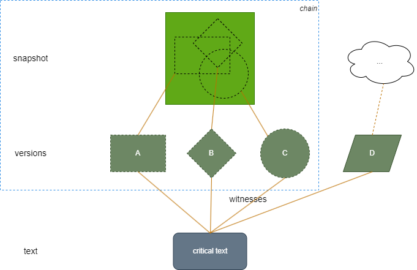

# Model

This conceptual documentation refers to the representation of a manuscript text mostly or exclusively written by the author's hand himself. All the terms used here are just a technical commodity for the sake of this documentation.

The autograph is central to GVE because it represents its starting point: for Goethe's epigrams, we effectively start from notebook sheets by the author's hand. There can be several versions of the same epigram in this form, whether they come from a single sheet with annotated variants, or from different sheets, or a mixture of both.

## Basic Terminology

Let us first use our case study (GVE) to define some terms we use in the technical documentation with a specific algorithmic meaning.

In the case of GVE, the essential source of epigrams is represented by autograph sheets from handbooks. Whatever its physical support(s), here we call the physical support of an autograph text 🔖 **carrier**. In the case of our workbooks, a portion, one, or even more physical sheets referring to each single composition represent a carrier.

The main challenge in modeling the content of these carriers is that they do not just represent a linear text; rather, they represent a sort of 🔖 **snapshot** of the creative process which in the author's mind would have led to the intended text. So, the carrier is the material support of the snapshot, which potentially contains many versions of a text.

In fact, graphically the snapshot does not just represent a text, but it includes many corrections, rethinkings, or refactorings of it, in the form of various types of 🔖 **annotations** (deletions, insertions, transpositions, side notes, etc.) on top of a text.

The snapshot is thus a sort of picture taken from the author's mind in relation to the text being composed at a given point in time. This does not necessarily imply that this is the end stage of the creative process underlying the text. The process may well have gone further on; but this is not reflected by the snapshot, which just represents a picture which froze an instant of this process at a given time.

The snapshot is thus far from being the representation of an undisputed linear text; it's an even chaotic bunch of text and annotations on some carrier. It is up to the reader to make sense of these annotations, and try to deduce one or more versions of the text from his interpretation.

The annotations represent changes on the text; but there often is no way to know their relative order, or even their selection when they represent several competing versions of the text. _It is like having all the ingredients_ (our text with annotations), _when we have lost the recipe_ (how to select and order the annotations to generate the intended version(s)).

When for whatever reason an authoritative version of the final outcome of all these operations on the text is lacking, in a traditional (paper) edition usually we are forced to forge one, representing the best effort in interpreting our carrier's content. Of course, that would just be a best effort; and it might even be the case that we are not sure in deciding among competing interpretations. In the end, we come up with our best recipe.

In a digital edition instead, we have the power to handle all the rich and complex data preserved by our snapshot, without resorting to compromises. We can represent all the ingredients (text and annotations), all the recipes (annotation selection and ordering), and all their outcomes (resulting versions), while still keeping each as a separate layer, so that everyone can evaluate our text reconstruction, and even provide his own alternatives.

When an authoritative version of the final outcome of all these operations in the text is lacking, in a traditional (paper) edition usually we are forced to forge one, representing the best effort in interpreting our carrier's content.

In a digital edition instead, we have the power to handle all the rich and complex data preserved by our snapshot, without resorting to compromises.  We can represent all the ingredients (text with annotations), all the recipes (annotation selection and ordering), and all their outcomes (resulting versions), while keeping each as a separate layer, so that everyone can evaluate our text reconstruction, and even provide his own alternatives. This scenario is depicted in this diagram:

At the top of the diagram we find our carrier, represented by the green rectangle. Here, any part of, or one or more sheets, are the carrier of a snapshot, which potentially defines many versions of the text, here represented by the various shapes inside the rectangle.

As remarked, these versions are not explicitly and clearly defined; they are the product of our interpretation of the snapshot. In our diagram we have extracted 3 versions: A, B, C. At the same time, other versions of what we regard as the same text may come from other sources, whatever their type (other snapshots, other witnesses, previously published versions, etc.). This is the case for version D in the diagram.

So, at the bottom level we find the carrier with its snapshot. On an upper level instead we find the various versions of the text we want to critically publish. These versions might independently exist, or be deduced from one or more snapshots; but for the sake of this architecture that's just a detail. In the end, in relation with the critical text we might want to reconstruct, all these versions work as _witnesses_, just like in a traditional critical edition we deal with different manuscripts and other sources.

So, on a third layer we find the _critical text_, which by definition is a reconstructive hypothesis. This is based on a selection of _versions_ representing our witnesses, and located in a lower layer (versions A-D). Then, in the case of autographs we have yet another lower layer (the carrier with its snapshot), which generates some or all of these versions.

>The critical text can be reconstructed at different levels: we can limit our reconstruction to what is attested by our snapshot's versions, when focusing on the text (in our scenario, an epigram) from each single snapshot; or collect versions coming from several snapshots (and optionally from any other source), when focusing on the epigram derived from the critical comparison of the many epigrams collected from our various sources, if this is feasible and required (e.g. to print a single text). This is just a matter of branches selection in the lineage of our text: when focusing on each single snapshot, we may want to publish a reconstructed text (epigram) from its versions, in this single-ancestor lineage; when focusing on many snapshots or on a mixture of other sources, we may want to publish a reconstructed text from all of them, or rather just provide a set of reconstructed texts. This is what happens in GVE, where there is no authoratitive publication of the text where all the versions would converge. So, in this case we will end up with a collection of multiple versions we might name a “synopsis”; and such will be the level above our snapshot for this peculiar edition. At any rate, at the conceptual level of this model this belongs to the layer of reconstruction, based on the layer of witnesses, whatever its source(s).

Thus, the scope of our autograph model encompasses the area defined by the bounding dashed rectangle in the diagram: a carrier with a snapshot, which potentially defines many versions of a text. What we want from our model is a representation of that snapshot, both on the textual and on the graphical side.

Once this model satisfies all our requirements, it will be the foundation for structured and layered representation of its different parts and planes (textual and diplomatic, objective and subjective) at a high granularity level (up to the single character or visual trait). From this, we will then be able to generate many outputs including TEI documents with various schemas, complex and interactive UIs, or any other type of export.
