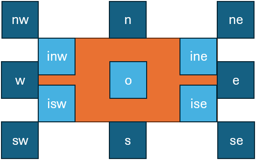

- [Rendition Model](#rendition-model)
  - [Web Component](#web-component)
  - [Elements](#elements)
  - [Rendition Features](#rendition-features)
  - [Placing Added Elements](#placing-added-elements)
  - [Added Text Rendition](#added-text-rendition)
  - [Hints Rendition](#hints-rendition)
  - [Feature Adapter](#feature-adapter)
  - [Hints Designer](#hints-designer)

# Rendition Model

🌐 Quick links:

- [renderer source code](https://github.com/vedph/gve-snapshot-rendition).
- 🚀 [hints designer demo](http://gve-hint-designer.surge.sh)
- 🚀 [real-world epigram rendition example](http://gve-rendition.surge.sh/?sample=h5-48)
- 🚀 [mock text rendition example](http://gve-rendition.surge.sh)

## Web Component

The snapshot model defines the structure and logic of data representing our texts. As already remarked, this definition is an operational one: it gives a machine the recipe to generate all the alterations of a text with their annotations, and also its visual rendition. The purpose of rendition is to provide an interactive representation of the transformations of a text, as defined by edit operations. Changes and visuals by each operation accumulate on the visualization, operation after operation. Users can navigate forward (adding more changes to the original text) or backward (undoing operations back towards the initial base text).

The visualization of a GVE snapshot data model is very complex, and yet it is a crucial part of the system, focused on representing a process over time rather than based on comparing multiple static versions of a text. This is also why animation plays a semantic role in it, rather than just being a fancy addition: it embodies time and allows to unwind the text transformation process under our eyes.

As for any DH project, the point of VEdition is not only provide a solution perfectly fit to its object, but also to generalize it so to offer to the community a paradigmatic model with its software tools. So, just like we provide a full-featured web-based editor for creating data using our model, we also provide reusable tools to visualize them using this complex logic.

As these tools must be integrated in any frontend, from a simple vanilla HTML page to a full-fledged web app, we need to implement them using the most neutral and reusable technologies. In this case, the task of visualizing a snapshot is delegated to a custom web component. **[Custom Web Components](https://developer.mozilla.org/en-US/docs/Web/API/Web_components)** allow developers to define new HTML elements that encapsulate their own structure, style, and behavior, making them reusable across any web environment. Because they rely solely on standardized browser APIs -- Custom Elements, Shadow DOM, and HTML Templates -- they remain framework‑agnostic and can be embedded seamlessly in contexts ranging from static HTML pages to complex frontend frameworks. This ensures strong encapsulation (avoiding CSS or JavaScript conflicts), high reusability, and long‑term technological neutrality, which is essential for DH tools meant to be adopted by diverse communities and infrastructures. In the end, all what it takes to use a custom web component is importing its JavaScript code once, and then use its tag just like any other standard HTML tag.

So, in the context of the GVE system these are the main software components:

- core logic in backend.
- web API surface exposing the core logic, which can be consumed by any software.
- web app with a full-fledged editor for entering snapshot and other data, based on the [Cadmus](https://vedph.github.io/cadmus-doc) system.
- custom web components for snapshot visualization.

In more detail, currently 3 custom web components are available:

- the web component for the **original (graphical) visualization**, currently integrated in the editor.
- the web component for the **symbolic visualization**, to be completed and then integrated in the editor.
- the web component for **editing visual catalogs** of hints with their animations (_hint designer_). This is added to provide a more effective tool to design hints visually with SVG code, create and test GSAP-based animations, manage hint variables for placeholder resolution, and save/load hint data to/from JSON files.

🚀 You can experiment with the hint designer in the vanilla HTML page at <http://gve-hint-designer.surge.sh>. If you inspect the page's source code, you will see that all what it takes to embed in it the full-blown editor is adding its tag like `<gve-hint-designer></gve-hint-designer>`. The demo contains a bit more code just to load some preset data (hints and animations) to play with.

⚙️ This is more technical-oriented documentation, but it provides the conceptual background of snapshot rendition.

## Elements

The whole rendition is based on SVG, which is an obvious choice here: it's a W3C standard, adopts vector-based graphics which can be interactively manipulated in the page, and it's an XML dialect.

As remarked, the **rendered entities** are:

- **base text**: the start input text, rendered all at once at the beginning of the visualization, character by character from left to right, and line by line from top to bottom (text never wraps). Base text appears all at once unless `charAnimationId` setting is set to an animation ID to use for rendering it one character at a time.
- **added text** is rendered character by character and line by line, but its position and size are calculated according to its reference base text, text rendition properties, and operation features.
- **hints** are defined by operation features. A hint is an SVG `g` element with any content and optional placeholders.

In turn, rendered **SVG elements** are:

- **base elements**: existing since start and rendering base text, they are all SVG `text` elements, 1 per character.
- **added elements**: added text (1 SVG `text` element per character) and hints (1 SVG `g` element per hint), both added by operations.
- **text hilites** (temporary): a visualization artifact triggered by user action to hilite some visuals; they depend on existing SVG elements for their size and position, and they do not interact in any other way with them.

The only relevant **control characters** evaluated in text as such are:

- **LF**: line end.
- **space**: rendered by offsetting the position of the next character by a specific amount. The amount is calculated according to the width of a reference character, rendered with the current text settings (font family, size, style, etc.). To this end, the component:
  - uses `m` as the default reference character.
  - makes the space width a fraction of the computed width of the reference character, once all the current text rendition settings have been applied to it. This is defined by component setting `spaceWidthFraction` which defaults to 0.33 (usually the space is 1/3 of the `m` width).

## Rendition Features

Rendition features are used to override rendering settings. All these features can be combined and affect position and size in various ways, so elements are displayed only after evaluating all of them.

> All rendition features names start with `r_`:

- `r_char-offsets` (applicable only to the first operation): character offsets for rendering some specific text nodes (and thus indirectly also all the character nodes following it, up to line end). Used to change line layout by adding indent, or increasing or decreasing space between lines. Format: for each offset, `ID:y=...,x=...` (where we can specify only `x`, only `y`, or both, in any order; values represent `px` units), where:
  - `ID`=target character ID. As per the general text layout rules, once we offset this target characters, all the other characters will follow on the same baseline, unless any of them has another offset.
  - `y`=Y offset to add to the computed character baseline (negative=up, positive=down).
  - `x`=X offset to add to the computed character baseline (negative=left, positive=right).
  - both `x` and `y` can be followed by a unit specifier. The default unit is just pixels; otherwise, the value is followed by suffixes `tw`=text character average width (according to the current font and size) or `th`=text character average height.
- `r_char-offset`: this works as `r_char-offsets`, but it is provided in the features of a single character node. The reason for a multiple-offsets feature (rather than multiple single-offset features) is that when a character gets an offset, this affects not only it, but also all the following characters. So, order of application matters, and this could not be ensured when using multiple features.
- `r_font-family`: font family.
- `r_font-size`: font size.
- `r_fore-color`: foreground color.
- `r_back-color`: background color.
- `r_italic`: italic value (boolean).
- `r_bold`: bold value (boolean).
- `r_underline`: underline value (0-N=thickness in `px`).
- `r_overline`: overline value (as for underline).
- `r_strike`: strikethrough value (as for underline).
- `r_text-line-style`: the style of overline, underline, or strikethrough: `solid`, `dotted`, `dashed`, `wavy` (as in SVG and CSS; corresponds to SVG `text-decoration-line`).
- `r_text-line-color`: default color of the overline, underline or strikethrough.
- `r_rotate`: rotation amount to be applied to each single character.
- `r_hints`: link the operation to any number of hints. The value is a space-delimited list of hint IDs, in rendition order.
- `r_hint-vars`: this has no effect on text; it's used to define a set of variables to be consumed by hints placeholders. Each variable has name=value, and is separated with space. For instance, `color=red bold=1` to pass variables `color`=`red` and `bold`=`1` to the hints being rendered for the operation being processed.

> In backend data, all rendition features have their lifespan limited to the version generated by their operation. This avoids accumulating them in the output context, ensuring that they are valid only for the immediate output of the operation containing them.

## Placing Added Elements

The logic for added elements is first dictated by the assumption that all added elements by definition _refer to base text elements_. This is a consequence of the fact that added elements represent annotations attached to the base text. For instance, the position of the word "Wunder." in Figure 1 is defined with reference to the word "Wund:" it is going to replace: it appears below and to the left of it.


This reflects the fact that annotators look at the text they are willing to change, and then add annotations to it in some empty space, usually near to it. So again here the model mimicks the reality of the creative process.

So, two main factors are used for computing size and position:

- 🔖 **RBR** (_Reference text Bounding Rectangle_): the rectangle including all the bounding rectangles of all the subsequent nodes displayed for the text "selected" by an operation. So, if a segment to be deleted is "DE", its bounding rectangle is the rectangle including all the rectangles for "D" and "E". If reference segments happen to be _split_ in multiple lines then there will be _multiple RBR's_, one for each split portion of the text. In this case:
  - the _additional text_ just refers to the first RBR.
  - the _hint_ is repeated for each RBR, except the hint having a placeholder element.

> The logic of this repetition for hints (and not for additional text or for placeholder hints) is that in most cases hints represent decorations on top of their reference text, e.g. a strikethrough on top of the text being deleted; so, if this text happens to be split between two lines, we still need to apply strikethrough to all the reference text. The exception for the placeholder element is due to the fact that the placeholder element is an element including dynamically defined content (e.g. text) which should not be repeated.

- 🔖 **EBR** (_Element Bounding Rectangle_): the bounding rectangle of the element being added. This can be:
  - for _added text_: the bounding rectangle containing all the SVG text elements representing the added text. Text is added character by character, so when adding "AB", 2 SVG `text` elements will be added, and the rectangle containing both of them will be the EBR.
  - for _hints_: the bounding rectangle containing the root SVG `g` element with all its descendants.

In the end the renderer must compute EBR and then place it relative to the RBR; so it is a matter of placing two rectangles. Relative position values defined for the added element refer to a position of the EBR "outside" or "inside" the RBR (Figure 1). This provides an intuitive model, just like we say that "Wunder." is "below and to the left of" the word it replaces. The software defines a dozen of relative positions which use abbreviations from cardinal points:

- **outside RBR**:
  - `n`: EBR-bottom edge aligned with RBR-top edge; horizontally centered.
  - `s`: EBR-top edge aligned with RBR-bottom edge; horizontally centered.
  - `w`: EBR-right edge aligned with RBR-left edge; vertically centered.
  - `e`: EBR-left edge aligned with RBR-right edge; vertically centered.
  - `nw`: EBR-bottom-right corner aligned with RBR-top-left corner.
  - `ne`: EBR-bottom-left corner aligned with RBR-top-right corner.
  - `sw`: EBR-top-right corner aligned with RBR-bottom-left corner.
  - `se`: EBR-top-left corner aligned with RBR-bottom-right corner.
- **inside RBR**:
  - `inw`=northwest corner: EBR-top-left corner aligned with RBR top-left-corner.
  - `ine`=northeast corner: EBR-top-right corner aligned with RBR top-right-corner.
  - `isw`=southwest corner: EBR-bottom-left corner aligned with RBR bottom-left-corner.
  - `ise`=southeast corner: EBR-bottom-right corner aligned with RBR bottom-right-corner.
  - `o` for origin: the EBR origin (=center) aligned with the RBR origin (=center). This is the _default_ when position is not explicitly specified.



- _Figure 1: relative positions for placing added elements_

A crucial difference between text and hints is that while text elements are **sized** accordingly to their rendition using their current style (as defined by font family, size, color, etc.), _hint elements are initially sized to fit the RBR_. Hints are picked from a catalog, where they have an intrinsic design-time size; but then it is shrunk or enlarged to fit the RBR. The effect of this adjustment is that everything which is designed to be drawn on top of reference text fully covers it, as expected. For instance, the diagonal line on top of "Wund:" in Figure 1 will fully cover that text, right because it is the diagonal of its RBR. This is also why the default position for hints is `o`: this will result in a default behavior which covers the whole reference text.

## Added Text Rendition

Added text is defined by operation's `value` for those operations which add new text (=add or replace operations):

- its size depends on the text and its style, as defined by current settings and possibly overrides from operation features.
- its position depends on the RBR.

These **rendition features** are applicable only to added text:

- `r_t-position`: position of added text relative to the RBR.
- `r_t-offset-x`: X offset for the added text, relative to the computed `r_t-position`.
- `r_t-offset-y`: Y offset for the added text, relative to the computed `r_t-position`.
- `r_t-displaced-span`: a span of base text with format `IDxN` where `ID`=node ID and `N`=count of chars to include, to be used as the RBR instead of the default RBR. This works exactly like a displaced hint, but is applied to added text.
- `r_t-value`: a display-only override for the text value of the operation (which is an operation introducing new text, and thus having this text in its `value` property -- i.e. an add or replace operation). This overrides the operation's `value` property which contains the added text so that something different can be displayed. Note that this value can be an empty string.

## Hints Rendition

A hint is an SVG code fragment linked to a specific operation. Hint rendering always happens before adding the added text possibly introduced by that operation, when there is any.

- hints are defined in a dictionary in the component's **settings**.
- hints SVG has design size and coordinates relative to a fixed-size rectangular area (defined by settings `hintDesignWidth` and `hintDesignHeight`). Then, they are variously scaled according to their computed size and position.
- hints are **linked** to operations via a special `r_hints` rendition feature, which contains the IDs of all the hints to use for that operation. For instance, `r_hints` = `alpha beta` means we want to apply 2 hints with ID `alpha` and `beta`, in this order.

Hints **properties** are:

- `svg`: SVG code for hint's visuals, always having a root `g` element.
- `position`: relative position for the hint.
- `offsetX`: absolute (10) or proportional (`0.5th`=half text character average height, `0.5tw`=half text character average width).
- `offsetY`: absolute (10) or proportional (`0.5th`=half text character average height, `0.5tw`=half text character average width).
- `scaleX`: horizontal scale: `1` = match bounds width, `1.1` = 110% of bounds width.
- `scaleY`: vertical scale: `1` = match bounds height, `1.1` = 110% of bounds height.
- `rotation`: optional hint's rotation (`0`=none).
- `animation`: JS code for animating the hint's entrance via [GSAP](https://gsap.com), or `#` + the ID of a preset animation (defined in settings).
- `displacedRefSpan`: a span of base text with format `IDxN` where `ID`=base text node ID and `N`=count of chars to include, to be used as the RBR instead of the default RBR (as defined by the operation). In most cases it is set programmatically by the `r_h-displaced-span` feature.

The hint's **svg property** is a string representing the SVG content of a hint. The SVG content has these characteristics:

- its **root element** is always a `g` element. This allows to manipulate the whole hint as a single entity (e.g. for transforming or animating it). When adding the hint, the component adds a unique identifier to it, by setting the root `g` element's `id` attribute to a value like `hint-X` where `X` is built from:
  - the _operation's ID_.
  - an _ordinal number_ suffix preceded by `-`: 1=first hint for that operation, 2=second hint for that operation, etc.
- inside the root `g` element there is **any SVG code**. Apart from sizing and positioning it, and possibly overriding some of its properties (color, text decorations, etc.), the component will render it as it is.
- it may contain a **handle** element with `id`=`handle`. This represents the "handle" used as the reference for _positioning_ it (not for sizing it! Handles affect positioning only). Often, in the hint SVG code the handle element has opacity=0 so it's not visible; but this is up to the SVG code. The `showHintHandles` setting can force hidden handles to be displayed (setting their opacity to 1) for diagnostic purposes.
- it may contain **placeholders** wrapped in `{{...}}` (whiskers) with the name of the feature to get the value from. For instance, `<rect width="100" height="50" fill="{{r_color}}" />` has a placeholder `{{r_color}}` to replace with the value of a feature named `r_color` (or with just the placeholder's name, when that feature is not found).
- it may contain a **text placeholder element** with `id`=`placeholder` and an optional `class="fit"` (when text must be rendered to fit its container element). Hints whose SVG include a placeholder element are named _placeholder hints_. There can be only either 0 or 1 placeholder hints per operation. The placeholder is an SVG element including as child or descendant element a `text` SVG element which represents the text to draw. This text element has this behavior:
  - its _text value_ is either a literal, or resolved at runtime when within whiskers (like any placeholder). In the latter case, the text element's value is the name of the feature to get the text value from. For instance, `<text id="placeholder">{{note}}</text>` means that the text will be the value of a `note` feature in the same operation. If a feature with this name is not found, the text displayed is the feature name.
  - its _size_ by default is equal to the RBR size, variously modified by hint's properties and features overriding them, except for the special case of text placeholder hints (see below).

These **rendition features** are applicable only to hints:

- `r_h-position`: override hint's `position` property.
- `r_h-offset-x`: override hint's `offsetX` property.
- `r_h-offset-y`: override hint's `offsetY` property.
- `r_h-scale-x`: override hint's `scaleX` property.
- `r_h-scale-y`: override hint's `scaleY` property.
- `r_h-rotation`: override hint's `rotation` property.
- `r_h-displaced-span`: override hint's `desplacedRefSpan` property (for displaced hints).

By default, hint features apply to ALL hints in the operation (those listed by `r_hints` feature), unless the property value starts with `@` followed by a space-delimited list of targets, ended by `:`; in this case, it applies ONLY to those hints matching the list. Targets can be:

- **hint key strings**: applies to all hints with that key. E.g., `@alpha beta:e` applies to all hints with key `alpha` or `beta`.
- **1-based ordinal numbers**: applies to the hint at that position in `r_hints`. E.g., `@1:e` applies only to the first hint, even if multiple hints share the same key.
- **mixed**: `@1 beta:e` applies to the first hint (by position) and all hints with key `beta`.

When multiple targets match the same hint, ordinal-based overrides take precedence over key-based overrides, which take precedence over the wildcard (no `@` prefix).

## Feature Adapter

An additional layer of abstraction can make operation metadata even more efficient. Side by side with those abstract, yet still lower-level rendition features, which directly specify position, color, font size, and the like, the symbolic approach also allows for the definition of **higher-level features**, acting as a shortcut towards multiple lower-level counterparts.

For instance, consider a real-world example like the numbers later added to some epigrams, to define a collection by specifying their relative order in it. Now, in many cases, this number was made in the context of a single session by a single hand, and thus it typically features a similar appearance and position.

Let us say that in our case the number is written with a smaller text, a brown ink, rotated by about -45 degrees, at the top-left of the epigram, rather offset from it: in this case, we would just have an annotation operation, and users could pick from a list a higher-level feature like `epigram-nr`, entering its number as its value (like `epigram-nr`=`12`), in all the epigrams using the same type of mark.

Then, an adapter software layer would be used before visualization, translating this single feature into multiple lower-level features defining the hint to show (a note with a textual placeholder, here filled with `12`), its position and offsets, color, rotation, and scale. This results in an even more abstract and thus more economic annotation strategy.

The feature adapter is a software service which can be used when hosting the rendition web component in the context of your page, right to provide this translation from higher-level features into the basic rendition features listed above. This adapter starts with a set of features, and transforms it into another set of features. So, it is completely transparent to the rendition component, and is applied to data which feed it before they are passed to the component itself.

The feature adapter works in two steps:

1. **match** the features which must be adapted.
2. **process** each match.

Both these steps are configured by the adapter settings.

The features to be matched are defined by a small DSL with this syntax:

- 1 or more **clauses**, separated by logical operators: `AND`, `OR`, `AND NOT`, `OR NOT`. These follow the standard precedence in boolean algebra: so first NOT, then AND, then OR.
- **whitespace** separate tokens.
- clauses can be grouped with **brackets** `()` for precedence.
- each **clause** has format:
  1. **name**: the feature name.
  2. **operator**: the value comparison operator to use. This can be:
     - `=` equals.
     - `!=` not-equals.
     - `^=` starts-with.
     - `$=` ends-with.
     - `*=` contains.
     - `?=` matches-wildcards `?` and `*`.
     - `~` matches-pattern: matches regular expression.
     - `==` numeric-equals: first cast to numeric value, and if this succeeds compare for equals, else return false.
     - `<>` numeric-not-equals: first cast to numeric value, and if this succeeds compare for equals, else return false.
     - `>` numeric-greater-than: first cast to numeric value, and if this succeeds compare for greater-than, else return false.
     - `<` numeric-less-than: first cast to numeric value, and if this succeeds compare for less-than, else return false.
     - `>` numeric-greater-than-or-equal: first cast to numeric value, and if this succeeds compare for greater than or equal, else return false.
     - `<` numeric-less-than-or-equal: first cast to numeric value, and if this succeeds compare for less-than-or-equal, else return false.
  3. **value**: the value. Its content depends on the operator used. If the value includes spaces, it is wrapped in `""`.

> In clause, operator and value can be omitted if all what we want to match is the feature name.

For instance:

- `note` matches a feature with name=`note`, whatever its value.
- `note^=corrected` matches a feature with name=`note` and value starting with `corrected`.
- `note^=corrected AND (color=red OR color=green)` matches a feature with name=`note` and value starting with `corrected` and either a feature named `color` with value equal to `red` or a feature named `color` with value equal to `green`.

Additionally, each clause can be wrapped in square brackets when you want to capture its name and value, similar to what happens in a regular expression when capturing groups in the matched text. So, `[note^=corrected]` means that we want to capture into a numbered group (1, 2, 3... in the order the captured clauses are specified) the name and value for the matched note feature. Then, in the feature replacement stage, we will use this number prefixed by `$` as a placeholder for the captured name or value, e.g.:

- `$1.name`=captured feature name.
- `$1.value`=captured feature value.

To name a group, rather than using the ordinal number, you can specify the name after `[` and before `:`. For instance, `[corr:note^=corrected]` captures the matched feature into a group named `corr`. So, in this case we would have:

- `$corr.name`=captured feature name.
- `$corr.value`=captured feature value.

## Hints Designer

The hints designer is another custom web component provided by the snapshot rendition GVE library to assist in designing hints for your project. Of course, hints being ultimately just SVG and JSON code, you can also encode them manually.

At any time during your project creation you may find new visuals which you want to add to your visual grammar. In this case, you just have to literally draw their (often simplified) appearance in your favorite SVG editor like [InkScape](https://inkscape.org), and then add it to the hints catalog with its metadata, encoded with JSON.

The hints catalog is defined in the backend profile for your edition, under the `settings.hints` key (see [customization](/usage/customize.md)).

In it, each hint is a JSON object where you specify its properties as described about [hints rendition](#hints-rendition). For instance, here is the diagonal stroke up hint:

```json
"diagonal-stroke-up": {
  "svg": "<g>\n  <line x1=\"0\" y1=\"100\" x2=\"300\" y2=\"0\" stroke=\"{{r_fore-color}}\" stroke-width=\"2\" />\n</g>",
  "position": "o",
  "offsetX": 0,
  "offsetY": 0,
  "scaleX": 1.1,
  "scaleY": 1,
  "rotation": 0,
  "animation": "#wipe-right"
}
```

This represents a diagonal line stroke to be drawn on top of some portion of the base text, typically to represent its deletion.

First, note that all hints in the catalog have a fixed design-time size, here 300x100 (this is defined in rendition settings). The design size is fixed because hints get resized at runtime, so we just provide a size to start with.

Here the hint's SVG code is:

```xml
<g>
  <line x1="0" y1="100"
        x2="300" y2="0"
        stroke="[[r_fore-color]]" stroke-width="2" />
</g>
```

> ⚠️ Note: to avoid issues in visualizing this page, we replace placeholder "whiskers" (which are 2 opening braces and 2 closing braces) with square brackets. In real code you must use braces!

This is a very simple hint: it just contains a line starting from the bottom-right corner of the reference rectangle, and running up to its top-right corner. Its stroke width is 2, and its stroke color is defined by a placeholder variable, named `r_fore-color`. This means that at runtime the renderer will look for a feature with this name in the operation, and use it to get the line's color. This is very convenient, because it allows us to contextually change the color of a hint: you just add another feature with the color, and the hint (here the line) will use it.

Also, note some interesting properties:

- the position is `o` = origin. This way the rectangle including the line will be positioned exactly on top of the rectangle including the reference text.
- the horizontal scale is set to 110% (`1.1`) because we want the line to stretch a bit beyond both edges of the text.
- the entrance animation is wipe-right, so the line will be "drawn" from left to right.

TODO
