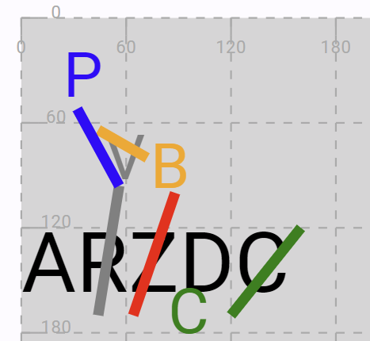
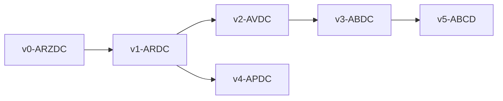

# Mock Snapshot Example

In this example I am going to represent the mock snapshot described in the documentation, split into parts for more readability. Its rendered view is shown below:



The underlying storage format for snapshots in this software system is [JSON](https://en.wikipedia.org/wiki/JSON), which has the advantage of being extensible and compact, and very fit to the JavaScript language used in web applications. In fact, JSON is right the way JavaScript represents its code objects as text.

## Size and Image

A snapshot first has a size. Optionally, it can have an image (with the same size) with some type of visual representation of its carrier: it might just be a photographic image, or a digital drawing extracted from it, or any other kind of surrogate facsimile representation.

So, the following JSON snippet specifies the snapshot view size (in pixels) and the background image to show as a watermark. The image is displayed behind the snapshot visuals, and you can also specify the opacity level (ranging from 0=transparent to 1=100% opaque) you want for it if you want it to fade out more or less with relation to those visuals.

>In JSON, each object is delimited by braces and can have any number of properties. Each property has a name and a value, which can be a scalar value like a string, a number, or a boolean value, or another object or an array (=list) of items. Arrays are delimited by square brackets. Names are between double quotes, and so are string values. So here there is an object including two other objects under properties named `size` and `image`. In turn, `size` has numeric properties `width` and `height`; and `image` has a string `url` property, and a numeric `opacity` property.

```json
{
  "size": {
    "width": 800,
    "height": 600
  },
  "image": {
    "url": "https://via.placeholder.com/800x600",
    "opacity": 0.8
  },
}
```

>In this example, I am using a mock image service to get an image of the desired size (as specified in the image URL) to play with. Of course, in real-world you will use your own image from some other URL.

## Text

The base text follows as an array of chain nodes. When you are entering text as a string, the nodes array is automatically built by the editor from it.

Each chain node is an object, having:

- a _numeric ID_. This is automatically assigned by software in a predictable way: for the base text characters, it is just the ordinal number of each character: so the first character is 1, the second 2, and so forth. Then, should other characters be added by insert or replace operations, they will get the next number available, thus ensuring that all the characters have a unique numeric ID in the context of this snapshot, and that this ID reflects our interpretation about the evolution of the text.
- a _label_. This is the display value for the character, in our case equal to the character itself.
- an _index_: this is the zero-based index of the character in the source text.
- _attached data_, which in our case corresponds to a single character.

>In its backend implementation the chain structure is templated for its data type, as we might want to reuse it to chain types different from single characters. So we might have chains of characters, strings, numbers, or even complex objects. Anyway, in this application we just use the maximum granularity level, represented here by the character, as its data item.

```json
{
    "text": [
    {
      "id": 1,
      "label": "A",
      "index": 0,
      "data": "A"
    },
    {
      "id": 2,
      "label": "R",
      "index": 1,
      "data": "R"
    },
    {
      "id": 3,
      "label": "Z",
      "index": 2,
      "data": "Z"
    },
    {
      "id": 4,
      "label": "D",
      "index": 3,
      "data": "D"
    },
    {
      "id": 5,
      "label": "C",
      "index": 4,
      "data": "C"
    }
  ],
}
```

Optionally you can specify the base text's CSS style (any valid CSS value string) and options (of type `SvgBaseTextOptions`):

```json
{
"textStyle": "font-size: 48px",
  "textOptions": {
    "offset": {
      "x": 0,
      "y": 120
    },
    "lineHeightOffset": 8,
    "charSpacing": 0,
    "spcWidthOffset": 0
  },
}
```

Here I set a big font size, as the snapshot contains a few letters; and I offset the base text top-left corner by 0,120 to leave some space for annotations on top of it.

In general, the **base text options** can include these properties:

- `lineHeightOffset`\* (`number`): offset to add to each line height.
- `charSpacing`\* (`number`): space to add between characters.
- `spcWidthOffset`\* (`number`): offset to add to the space width.
- `offset` (`Point`): offset for the top-left corner of the base text wrapper rectangle.
- `minLineHeights` (`Record<number, number>`): minimum line heights for each line number (1-N). You can specify a minimum line height for each line number to ensure that its height is at least the specified value. This is useful for making room between lines for annotations that may exceed the base text.

## Operations

[Operations](./textual.md#operations) are objects inside an `operations` array property. They are listed in their order of application.

Here I am going to list them one at a time, preceded by its essential text-based representation (which covers only a subset of its properties, but is useful for quick data entry or diagnostic purposes).

### Delete Z

```txt
3- [*log="delete Z" reason:="don't like Z"]
```

This operation deletes the character node with ID=3 (`Z`), and injects two context-wide features: a multiple global one (`*log`) and a single node-scoped one (`reason`).

This is because in this example we want to output a sort of per-operation log to keep track of operations execution, and to attach to the deleted `Z` node the reason for its deletion.

The _log_ feature is global and multiple (`setPolicy=0`), which means that whenever it gets added it attaches itself to the result as a whole, rather than to specific node(s); and that there can be many features with the same name. This allows accumulating log features for each operation, thus keeping track of their execution. Here this has only a diagnostic purpose.

The _reason_ feature is not global and thus node-scoped; it it the operation type which determines the nodes it will attach to, corresponding to the affected nodes. Here, the affected node is the `Z` node being deleted. Also, this feature is single (`setPolicy=1`), which means that whenever we add a new feature with the same name, the old one will be removed.

Finally, the diplomatic (visual) representation has a `g` property with the SVG code for the visuals of the operation. In this case, these are just a diagonal red stroke on the `Z` character.

```json
{
  "features": [
  {
    "isGlobal": true,
    "name": "log",
    "value": "delete Z",
    "setPolicy": 0
  },
  {
    "name": "reason",
    "value": "don't like Z",
    "setPolicy": 1
  }
  ],
  "id": "c705f7c65a",
  "type": 1,
  "at": 3,
  "run": 1,
  "diplomatics": {
  "g": "<g id=\"del-z\"><line x1=\"64\" y1=\"170\" x2=\"88\" y2=\"100\" stroke=\"red\" stroke-width=\"6\"/></g>"
  }
},
```

### Replace R with V

```txt
2=V [*log="replace R with V" *version^:=alpha]
```

This replaces `R` with `V`, injecting the usual _log_ feature, and a _version_ feature. The version feature is meant to promote the operation's output to what we consider as a true version of the text. Every operation produces a new step, but not all the steps correspond to versions; rather, they accumulate until one is reached.

For this reason, version is global (attached to the snapshot result as a whole), single (it replaces an existing version feature), and short-lived. The last property means that the feature will be automatically removed as soon as the next operation is executed. This is the desired behavior here, as we tag as "version" a text state, and as soon as we move away from it that's no longer that version.

The operation visuals deserve more comment (see below).

```json
{
  "features": [
  {
    "isGlobal": true,
    "name": "log",
    "value": "replace R with V",
    "setPolicy": 0
  },
  {
    "isGlobal": true,
    "isShortLived": true,
    "name": "version",
    "value": "alpha",
    "setPolicy": 1
  },
  {
    "name": "x",
    "value": "48",
    "setPolicy": 1
  },
  {
    "name": "y",
    "value": "65",
    "setPolicy": 1
  },
  {
    "name": "style",
    "value": "font-size:36px;fill:gray",
    "setPolicy": 1
  }
  ],
  "sources": [],
  "id": "66aed192fc",
  "type": 0,
  "at": 2,
  "run": 1,
  "value": "V",
  "diplomatics": {
  "g": "<g id=\"rep-RV\"><line x1=\"44\" y1=\"170\" x2=\"56\" y2=\"96\" stroke=\"gray\" stroke-width=\"6\"/></g>"
  }
},
```

The operation visuals here are distributed in two different layers of the snapshot: one is the base text, because we are adding a new node, `V`; another is the diplomatic layer, where we add any visuals representing the operation.

The new node we add should be outside the automatic layout of the base text. This just displays each character after another in a line; but here we want to represent the added character just like it appears in the snapshot, above the text and at the edge of a stroke on the replaced character.

We do not want to represent this `V` character as a mere visual on the diplomatic layer, because it is part of the text: it's a node in it. Yet we have to remove this node from the automatic layout and place it where it belongs. This will allow it to be treated as all the other text nodes in the snapshot.

To this end, we add some node-scoped features to the operation, which will be thus injected in `V`: _x_, _y_, and _style_. A node having _x_ and _y_ is placed at these coordinates, thus outside the automatic layout. Also, the style specifies its color (gray) and its size (a bit smaller than the base text).

💡 Features names _style_ and _class_ are reserved to represent the SVG element attributes `style` and `class` respectively.

On the diplomatic layer instead we just have a grey stroke on `R`.

### Replace V with B

```txt
6=B [*log="replace V with B" reason:="like B"]
```

This is again a replace operation, so it essentially looks like the previous one: a new node `B` and an orange stroke on `V`:

```json
{
    "features": [
    {
    "isGlobal": true,
    "name": "log",
    "value": "replace V with B",
    "setPolicy": 0
  },
  {
    "name": "reason",
    "value": "like B",
    "setPolicy": 1
  },
  {
    "name": "x",
    "value": "74",
    "setPolicy": 1
  },
  {
    "name": "y",
    "value": "70",
    "setPolicy": 1
  },
  {
    "name": "style",
    "value": "font-size:36px;fill:orange",
    "setPolicy": 1
  }
  ],
  "sources": [],
  "id": "e5610844bd",
  "type": 0,
  "at": 6,
  "run": 1,
  "value": "B",
  "diplomatics": {
  "g": "<g id=\"rep-VB\"><line x1=\"44\" y1=\"64\" x2=\"72\" y2=\"80\" stroke=\"orange\" stroke-width=\"6\"/></g>"
  }
},
```

### Replace R with P

```txt
(v1:) 2=P [*log="replace R with P" *version^:=beta]
```

This is yet another replacement, so similar to what we have above. This time the color is blue and we also mark the result as a version ("beta").

Also notice that the input state for this operation is not the last generated step, as usual, but rather "v1". This is because we have a branching from the original base text R: the first branch replaces it with V and then B; the second branch replaces it with P. So, we could not start from the previous step, which is the last operation on the first branch; these branch are mutually exclusive, as they represent alternatives.

```json
{
  "features": [
  {
    "isGlobal": true,
    "name": "log",
    "value": "replace R with P",
    "setPolicy": 0
  },
  {
    "isGlobal": true,
    "isShortLived": true,
    "name": "version",
    "value": "beta",
    "setPolicy": 1
  },
  {
    "name": "x",
    "value": "24",
    "setPolicy": 1
  },
  {
    "name": "y",
    "value": "18",
    "setPolicy": 1
  },
  {
    "name": "style",
    "value": "font-size:36px;fill:blue",
    "setPolicy": 1
  }
  ],
  "sources": [],
  "id": "503c1e3a94",
  "type": 0,
  "inputTag": "v1",
  "at": 2,
  "run": 1,
  "value": "P",
  "diplomatics": {
  "g": "<g id=\"rep-RP\"><line x1=\"56\" y1=\"96\" x2=\"32\" y2=\"52\" stroke=\"blue\" stroke-width=\"6\"/></g>"
  }
},
```

### Swap D and C

```txt
(v3:) 4<>5 [*version^:=gamma]
```

Finally, we swap `D` and `C` in the branch generated with step "v3". This generates version "gamma". This time the visuals represent a green arc and the C letter in its new position.

Note that this letter is not a node of the base text, because the snapshot view stays fixed to the base text nodes, "ARZDC", while still adding new nodes as required. This reflects the material source, where essentially nothing which is drawn on the support can be undone; you may well overwrite it in any way, but once written, it is there. The operations are rather represented as annotations referring to it.

So, the snapshot view already has the C node in its original position. The newly written C is just a sort of mirrored image of it, a pure visual artifact which together with the arc represents its movement.

```json
{
  "features": [
    {
      "isGlobal": true,
      "name": "version",
      "value": "gamma",
      "setPolicy": 1
    }
  ],
  "sources": [],
  "id": "ea8ffab3d4",
  "type": 6,
  "inputTag": "v3",
  "at": 4,
  "run": 1,
  "to": 5,
  "toRun": 1,
  "diplomatics": {
    "g": "<g id=\"swap\"><path style=\"fill:none;stroke:green;stroke-width:3\" d=\"M 140,160 A 24,8 0 0 2 130,166 24,8 0 0 2 106,156\" /><text x=\"84\" y=\"180\" style=\"font-size:36px\" fill=\"green\">C</text><line x1=\"120\" y1=\"170\" x2=\"160\" y2=\"120\" stroke=\"green\" stroke-width=\"6\"/></g>"
  }
}
```

### Recap

In the end, our operations are:

1. `3- [*log="delete Z" reason:="don't like Z"]`: visuals = red stroke on `Z`.
2. `2=V [*log="replace R with V" *version^:=alpha]`: visuals = grey stroke on `R`. The newly introduced text node is grey, smaller, and located just above the top of the stroke.
3. `6=B [*log="replace V with B" reason:="like B"]`: visuals = yellow stroke on `V`. The newly introduced text node is yellow, smaller, and located to the right of the stroke.
4. `(v1:) 2=P [*log="replace R with P" *version^:=beta]`: visuals = blue segment connected to the grey stroke on `R`. The newly introduced text node is blue, smaller, and located at the top of the segment.
5. `(v3:) 4<>5 [*version^:=gamma]`: visuals = green stroke on `C` and a smaller green copy of it below `Z` and `D`.

Note that this sequence is not linear, as it branches after v1. The resulting operations tree is:



This is encoded by the version tag used to explicitly set the input of operations 4 (`(v1:)`=start from `v1`) and 5 (`(v3:)`=start from `v3`).

The visuals of course can't be represented in the compact DSL text for these operations; you can add them using the UI. In most cases, they reflect the snapshot's visual appearance in an approximate way; they might be drawn on top of an image of the carrier, or even be directly derived from it by vectorization.

The degree of approximation can greatly vary according to the purpose of the digital representation, from a highly similar vector-based representation to a purely symbolic surrogate representation of the underlying operations. On the other end, we might even omit visuals altogether and just limit ourselves to the text layer.

Additionally, each visual provided with an ID, i.e. all the base text characters and all the visuals from operations metadata whose element has an `id` attribute, are also interactive objects on the page, so you could have your presentation software interact with the user via mouse events like hovering or clicking on them.

In the end, the snapshot view provides users with an overview of the text creation and transformation processes, as derived from blending two layers, which are separately modeled:

- an _objective_ data layer, the digital representation of the snapshot as it can be described from its carrier. This is the set of all the visuals as they appear on it. Of course, even at this level there might be a level of subjectivity (for instance in reading a single sign), but this usually is a corner case, and anyway it can be encoded using features (like a probability rank) about it.
- a _subjective_ data layer one, the philological interpretation of the snapshot, which is described by operations. These guide us in reading the snapshot, by interpreting the operations represented by its annotations so that they are filtered and ordered to get all the text versions we deduce from it. Additionally, we describe this recipe for getting our text versions from the ingredients on the table of the carrier in such a way that we effectively get operational instructions for the underlying chain data structure. This makes the system capable of generating all the text versions with all their metadata, up to the granularity level of a single character.
