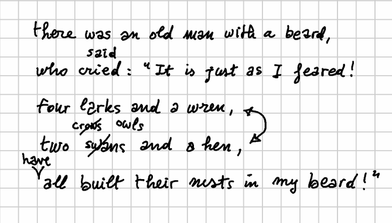
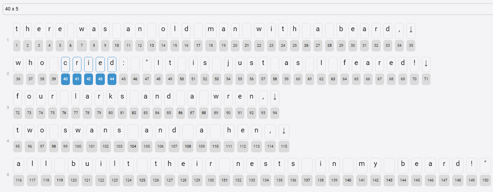

# Limerick Example

💡 If you prefer to look at a short video, here you can find a shorter version of this page:

<iframe width="560" height="315" src="https://www.youtube.com/embed/qAHa_O-Aqhw?si=sDsVXnNvRu7RCBBF" title="YouTube video player" frameborder="0" allow="accelerometer; autoplay; clipboard-write; encrypted-media; gyroscope; picture-in-picture; web-share" referrerpolicy="strict-origin-when-cross-origin" allowfullscreen></iframe>

Let us make an example with a true text. Consider the first limerick in [The Book of Nonsense](http://purl.flvc.org/fsu/fd/FSULearBook_012) by Edward Lear (p.7 of the 1875 edition you can find at <http://purl.flvc.org/fsu/fd/FSULearBook_012>):


```txt
1  There was an Old Man with a beard,
2  who said, "It is just as I feared!
3  Two Owls and a Hen,
4  four Larks and a Wren,
5  Have all built their nests in my beard!"
```

Let's pretend that we had an autograph like this:



This is our **snapshot**. We now use the snapshot editor to enter its data in the GVE [text model](textual).

## Setting Base Text

👉 Let us start by defining the **base text** (`v0`). Our mock snapshot is very simple: by looking at it, we can clearly see that this corresponds to the text which was first laid out following the printed sheet lines. So, we can define the base text as:

```txt
there was an old man with a beard,
who cried: "It is just as I feared!
four larks and a wren,
two swans and a hen,
all built their nests in my beard!"
```

In the GVE UI, we can just paste this text to get the identifiers assigned to each node in the base text. In the screenshot below, I have selected the nodes corresponding to the word "cried", ranging from 40 to 44 (a `40x5` span coordinate, as displayed at the top of the screenshot):



>💡 To select a range, click on the first node, and then Ctrl+click on the last one. Note that the base text essentially is just a string, so that newlines are represented in it just like any character node, corresponding to a single newline character (LF). In the UI this is visualized as an arrow-down character.

👉 Further, to give an approximate reproduction of the text layout, we set these base text **parameters**:

- text style: `font-size: 32px`
- X offset = 70
- Y offset = 40
- ln h-offset = 26

👉 Finally, we add a **background image** from some URL (e.g. <http://www.fusisoft.it/xfer/limerick.png>), so that we can see the facsimile behind our snapshot. Its parameters are:

- width = 670
- height = 381
- opacity = 0.5

>If the image's width and height are not set, they will be automatically set on load. So, just ensure that you clear any existing image metadata before entering the image's URL.

## Adding Operations

We can now start interpreting the snapshot by inferring editing **operations** from it.

Of course, operations are the product of our subjective interpretation, while compatible with the objective data provided by the snapshot. Our interpretation reconstructs the following story:

1. the author replaced "cried" with "said", and "swans" with "crows";
2. he then inserted "have" for metrical reasons, and this produced what we regard as a staged version, named "alpha".
3. later, he read this text again, and decided to swap verses 3-4 to get a better progression (both numeric and in syllabic mass).
4. finally, he replaced "crows" with "owls".

The final outcome is what we regard as staged version "beta".

So, more formally, we have these editing operations on top of a base text:

1. replace "cried" with "said";
2. replace "swans" with "crows";
3. insert "have" before "all" (for metrical reasons);
4. swap verses 3-4;
5. replace "crows" with "owls".

Let us formalize this interpretation, representing it with the [DSL syntax](textual.md#operations-dsl) used for essential GVE operations:

1. `40x5="said"`: replace "cried" with "said" (`v1`). Note that this introduces new nodes in the graph, one for each character of the word "said". We can predict the identifiers assigned to these new letters because the algorithm is designed to make it possible: we just get the maximum ID number, and add 1 to it to get the next ID. So here we can predict that `s`=151, `a`=152, `i`=153, `d`=154. Alternatively, we can just use the UI to execute operations up to the desired point, and then look at the resulting output, which allows you to get the IDs of each node while also inspecting all their metadata.
2. `99x5="crows"`: replace "swans" with "crows" (`v2`). Again, we can predict the new IDs (155-159).
3. `116+["have " [*version^="alpha" reason="metrical"]`: insert "have" before "all" (`v3`): staged version alpha. As we are inserting a separate word, we also add a space after it. Also, note that here we add a couple of operation metadata:
    - `version`: this assigns a staged version metadatum to the output of this operation, i.e. we mean that after this operation we got a version of the text we consider as a real "Fassung" in the history of our text. Of course, we might have thousands reasons for doing this, one of the most obvious being a previous printed edition of this book among our witnesses. Note that by definition whenever we promote an output to a staged version this implies that this refers to the resulting text as a whole, and that it will be made void as soon as we change again that text. This is why in our syntax we add the `*` prefix (=global metadatum) and the `^` suffix (=short-lived).
    - `reason`: the reason we supposed for this operation. The set policy here (as specified by `=`) is multiple, which is the default. We might have several reasons for an operation; and in this case, each would be a different metadatum with same name (`reason`) and different values.
4. `72x23<>95x21`: swap verses 3-4 (`v4`). Note that the swap just takes as reference node the first one of each verse, because due to the nature of range coordinates we just specify a start point (the AT) and a span count (the RUN). So, whatever the identifiers of the nodes in each verse, all verse nodes will be selected. For instance, here "four larks and a wren," (23 characters including LF) include the original sequence of nodes with IDs ranging from 72 to 94; while "two crows and a hen," (21 characters including LF) contains IDs 95-98 (for "two "), 155-159 ("crows"), 104-115 (" and a hen,").
5. `155x5="owls" [*version^="beta"]`: replace "crows" with "owls" (`v5`): staged version beta.

>For diagnostic purposes, all the operations also get a global `log` feature which gets accumulated for the text as each operation is executed.

So, here we are describing all changes step after step. Each operation output produces a new version, but only two of them are marked as staged, with names `alpha` and `beta` respectively.

👉 To enter all these operations at once, in the operations tab click the `batch` button, paste the following text, and click `batch add`. This allows entering all the five operations, in the desired order. We can later edit each operation to add more content to it, like visuals.

```txt
40x5="said" [*log="said for cried" x="150" y="80" style="font-size:28px;fill:red"]
99x5="crows" [*log="crows for swans" x="120" y="200" style="font-size:28px;fill:red"]
116+["have " [*log="insert have" *version^="alpha" reason="metrical" x="35" y="260" style="font-size:28px;fill:red"]
72x23<>95x21  [*log="swap verses"]
155x5="owls" [*log="owls for crows" *version^="beta" x="195" y="195" style="font-size:28px;fill:red"]
```

>💡 See the [operations DSL](../model/textual.md#operations-dsl) to learn more about this syntax.

## Inspecting Results

To view the operations result, look at the **snapshot view**. This shows our result for the output of the last operation in the set (which generates version `v5`):


Note that we have only defined the text here. By simply pasting the base text and its editing operations, we have a visual representation of the snapshot providing a surrogate facsimile. We still lack operation visuals here, like the bars on some words, and the arrows indicating the swap of two verses; we will add them later.

Meanwhile, as for text the **output versions** generated by these operations are:

- `v1` ("said" replaced "cried"):

```txt
there was an old man with a beard,
who said: "It is just as I feared!
four larks and a wren,
two swans and a hen,
all built their nests in my beard!"
```

- `v2` ("crows" replaced "swans"):

```txt
there was an old man with a beard,
who said: "It is just as I feared!
four larks and a wren,
two crows and a hen,
all built their nests in my beard!"
```

- `v3` ("have" added before "all"; staged as `alpha`):

```txt
there was an old man with a beard,
who said: "It is just as I feared!
four larks and a wren,
two crows and a hen,
have all built their nests in my beard!"
```

- `v4` (swapped verses 3-4):

```txt
there was an old man with a beard,
who said: "It is just as I feared!
two crows and a hen,
four larks and a wren,
have all built their nests in my beard!"
```

- `v5` ("owls" replaced "crows"; staged as `beta`):

```txt
there was an old man with a beard,
who said: "It is just as I feared!
two owls and a hen,
four larks and a wren,
have all built their nests in my beard!"
```

Of course, this sequence of versions descends from our interpretation of the snapshot, as formalized by the edit operations we defined.

This is the minimal data we need to represent our text versions. We can then go on, and add visuals and even timelines; anyway, until now all the snapshot data could be entered via text: a base text and 5 lines representing a batch of edits is all what is required to feed the chain engine and let it generate all the versions, each with its own metadata attached to either specific text nodes, or to the version as a whole.

If we now look at the UI, focusing on the output of the last operation (`v5`), we can see the resulting text below the list of operations, character by character. Clicking on each character shows its features, if any, next to the snapshot features. Here for instance I have clicked on the character node with ID 165 (`o` of `owls`), getting:

- the ID of the operation which introduced the node (`opid`: the value is the same you can see at the top of the snapshot, corresponding to the bottom of the operations list).
- the `x` and `y` coordinates on the snapshot surface. This is assigned to the first character added by that operation (i.e. `o`); the next ones (i.e. `wls`) just follow it on the same line.
- the `style` assigned to the new nodes: here I want `owls` with a smaller size, and red color (this is standard CSS targeting the SVG text elements).

Also notice that on the left we get all the snapshot-wide features, which were accumulated while executing all the operations up to the last one:

- a `log` entry for each operation executed. This is just to trace the effect of each operation.
- a `version` entry with value `beta`, assigned to the `v5` version output by the last operation. This means that we want to flag this version as a staged version (a _Fassung_) with that name.


Also, if we look at the snapshot view, we can see that all the new characters appear in a smaller font, with red color, as specified by their operations features. So, this is our minimalist representation of the snapshot: we still lack additional signs on top of it, like the bars or the arrows from our original image; but we already have a full representation of the text with all its metadata. By clicking on each of the generated versions listed to the right of the characters we can go back and forth along our reconstructive hypothesis of the progressive transformation of this text. In this snapshot we are looking at the last generated version (`v5`), whose background is highlighted; but we can just click on any other version to get its text, and browse all the metadata in it, while displaying the result in the snapshot view.

Thus, we can get to this rich, interactive view of our autograph with just a few lines of text, representing the base text and the editing operations on it.

>⚙️ It should also be added that the [snapshot view component](../dev//index.md#gve-frontend) used in this editor is all what is required for even a static HTML page to display the snapshot: you can just place the corresponding element in the web page, and feed it with the JSON code representing the snapshot data, as generated by the editor. This is because the snapshot view is a pure [web component](https://developer.mozilla.org/en-US/docs/Web/API/Web_components), so essentially all what you need to use it is placing its tag in your HTML.

## Adding Diplomatic Data

We can then add some diplomatic data to our operations. To do this, the easiest way is to draw on top of our snapshot image, using your preferred SVG editor. In this example we will be using [Inkscape](https://inkscape.org). So, what follows is not strictly related to the GVE tool, but is just a way of using popular tools to create operations visuals starting from an image.

1. first _open your image_ in any editor like the online [Photopea](https://www.photopea.com/), or the downloadable [Krita](https://krita.org/en), [GIMP](https://www.gimp.org/), etc. Any image editor, even the smaller ones like [Paint.NET](https://www.getpaint.net/index.html), will be enough. Look at the image properties to get its exact pixel size and resolution. It is suggested that you change the resolution to a typical screen based value, like 96. You can just set the desired resolution, and save a copy of the image. You will now have image width (670 in our example) and height (381) for a 96 pixels/inch resolution.

2. open Inkscape and _create a new image_. Under `File/Document Properties` set the document format to `Custom`, specifying the width and height of your image, and using pixels as the unit. Also ensure that scale is equal to 1, as we do not want any scaling. The default export resolution for Inkscape is 96, so you don't need to change this (otherwise, you can change it from `Preferences` under `Default export resolution`).

3. _import your image_ in Inkscape with `File/Import` and align its top-left corner to the document by just setting its X and Y coordinates to 0.

4. _draw_ whatever shapes you want on top of the image to represent all the visuals you are interested in. You are not required to draw an exact copy of the underlying visuals; you can make any surrogate useful for your purposes. So, for instance in our image the word "have" is inserted with a curved `V`-line, but here just two straight lines forming a `V` are enough. So, for such cases even a mouse can be used; if you have a pen to draw on your screen of course it will be easier, especially if you want to create a very similar visual. If you haven't the luxury of a pen, it is probably best to use Inkscape tools like the pen tool, which draws straight lines or Bezier curves, rather than the freehand tool. This has also the advantage of creating simpler SVG shapes or paths.

    

    >I also suggest to use the `Object/Properties` window to assign an ID to each drawing. This will make it easier to identify drawings in the generated SVG code. To do this, just click on the object and select the menu command. Enter your data, and click the `Set` button to apply them.

5. once you are done, _save_ the SVG image. In our example, here is the relevant SVG code generated by the editor:

```xml
<path style="fill:none;stroke:#ff0000;stroke-width:2" d="m 436.87311,229.20191 8.32819,11.30254 -15.46663,2.37946 z" id="arrow-cap-2" />
<path style="fill:none;stroke:#ff0000;stroke-width:2" d="m 55.32291,284.34786 11.8974,23.19993 7.13844,-23.19993" id="v-bar" />
<path style="fill:none;stroke:#ff0000;stroke-width:2" d="M 424.73718,198.09171 416.409,186.78918 431.87562,184.4097 Z" id="arrow-cap-1" />
<path style="fill:none;stroke:#ff0000;stroke-width:2" d="m 429.46998,189.91743 c 13.67069,3.57541 43.11525,8.62305 11.98814,44.16684" id="arrow-line" />
<path style="fill:none;stroke:#ff0000;stroke-width:2" d="m 136.8201,228.43008 34.50246,-25.57941" id="crows-bar" />
<path style="fill:none;stroke:#ff0000;stroke-width:2" d="m 151.09698,265.90689 36.28707,-36.28707" id="swans-bar" />
```

If you want a shorter SVG, in most cases you can drop the decimal digits and just use integers; but of course, to the machine this makes no difference. For instance (here I have sorted the shapes to make them more readable):

```xml
<!-- operation 2 (replace swans with crows) -->
<path style="fill:none;stroke:#ff0000;stroke-width:2" d="m 151,265 36,-36" id="swans-bar" />
<!-- operation 3 (insert have) -->
<path style="fill:none;stroke:#ff0000;stroke-width:2" d="m 55,284 11,23 7,-23" id="v-bar" />
<!-- operation 4 (swap verses) -->
<path style="fill:none;stroke:#ff0000;stroke-width:2" d="M 424,198 416,186 431,184 Z" id="arrow-cap-1" />
<path style="fill:none;stroke:#ff0000;stroke-width:2" d="m 429,189 c 13,3 43,8 11,44" id="arrow-line" />
<path style="fill:none;stroke:#ff0000;stroke-width:2" d="m 436,229 8,11 -15,2 z" id="arrow-cap-2" />
<!-- operation 5 (replace crows with owls) -->
<path style="fill:none;stroke:#ff0000;stroke-width:2" d="m 136,228 34,-25" id="crows-bar" />
```

>💡 The operation editor has a _remove decimals_ button used right for this purpose.

As you can see, the IDs make it easy to understand which path belongs to which operation. We can now simply copy-paste the path(s) belonging to each operation into their visuals, wrapping them into an SVG group (`g`). Here are again our operations:

1. _said for cried_: this has no visuals, as we just have "said" written above "cried" with no additional sign.
2. _crows for swans_: this has a bar on "swans", corresponding to our element with ID `swans-bar`. So, 👉 edit operation 2 and under its `diplomatic` tab add its SVG code to the operation's visuals, wrapping it in a single root `g` element.
3. _insert have_: this has a V-like sign above "all", corresponding to our element with ID `v-bar`. 👉 Edit operation 3 and do as above.
4. _swap verses_: this has a curved double-edged arrow next to the two verses. Its visuals correspond to elements with IDs `arrow-cap-1`, `arrow-line`, and `arrow-cap-2`. 👉 Edit operation 4 and do as above: this time the `g` element will wrap all the three children `path` elements, instead that just one.
5. _owls for crows_: this has a bar on "crows", corresponding to our element with ID `crows-bar`. 👉 Edit operation 5 and do as above.

>💡 The operation editor has a _wrap in group_ button used to wrap the existing code into a root `g` element. This makes it quicker to paste and adjust the code. If the existing code is already wrapped in a `g` element, this does nothing.

If we now look at the snapshot view corresponding to the last operation, we get the picture below:


As you can see, each operation is now also represented by its visuals: most replacements (except that for "said") have a bar on top of the replaced text; the insertion of "have" has its V-shaped sign linking it to its intended position in the text; and the arrow signals the verses swap. If we click on any of the versions shown above, we can see the resulting text at that stage, with all the visuals accumulated on the snapshot.

## Conclusion

We have thus managed to fully represent our autograph in a highly compact way, which:

- clearly separates our interpretation from the surrogate reproduction of the text;
- formally defines our interpretation via editing operations starting from a base text;
- generates all the versions of the text after each single operation, with all its metadata, attached to the version as a whole or to any of its characters;
- adds a separate, diplomatic layer for the visual representation of each operation having one, using a standard technology like SVG, which has also the advantage of being animatable, interactive, and compatible with output formats like TEI.

In a more traditional workflow, you might focus on a set of (mostly TEI) documents, each representing a selected stage in the transformation of the text, as reconstructed by our hypothesis. In each document you repeat the whole text, while annotating it as the effect of editing operations like insertions, deletions, replacements, and the like.

So, you are focusing on the end products of a transformation process starting from a hypothetical first stage, which represents the base for comparing each document with a previous state of the text.

Here instead we have reversed the flow: we focus on the transformation process, rather than on its effects, and describe it formally via operations. This allows to automatically generate 25 verses with all their annotations from just 5 base text verses and 5 operations. Additionally, we can fully integrate the representation of text with a visual, diplomatic layer, while preserving it in a separate, optional area.

On this path, we can also add the dimension of time with animations, and provide a fully interactive UI where the reconstructed process can be represented in its maximum granularity, even beyond the selected stages traditionally represented by various documents.

Also, this model allows to build a full-fledged web-based editor in a multi-user environment, backed by a database in a standard web application environment with backup, authentication and authorization levels, auditing, rate limiting, and highly-structured modular data, like in [Cadmus](https://vedph.github.io/cadmus-doc). Of course, this does not mean that we're not going to generate outputs like TEI; it simply means that these will be built by exporting these compact snapshot data into TEI documents, which also offers the additional benefit of being able to adopt different markup schemas according to our desire.
