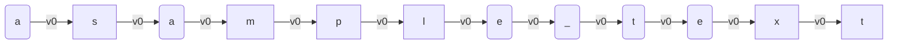
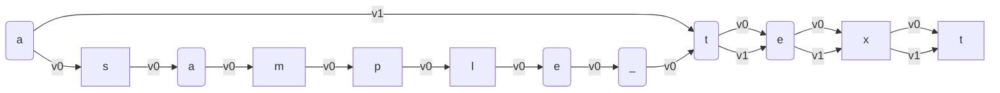
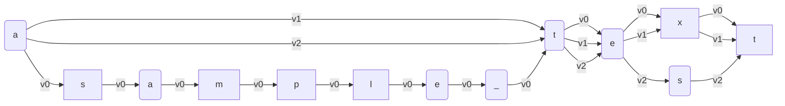
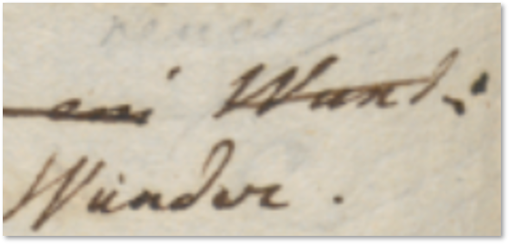

- [Snapshot](#snapshot)
  - [Operations and Alterations](#operations-and-alterations)
  - [Alteration Stages](#alteration-stages)
  - [Interpreting Signs](#interpreting-signs)
  - [Single vs. Multiple: Chain](#single-vs-multiple-chain)
    - [Operations](#operations)
    - [Operation Types](#operation-types)
    - [Operations DSL](#operations-dsl)
  - [Objective vs. Subjective](#objective-vs-subjective)
  - [Visual vs. Textual](#visual-vs-textual)
  - [Diplomatic Model](#diplomatic-model)
    - [Signs Classification](#signs-classification)
    - [Visual Grammar](#visual-grammar)

# Snapshot

"Snapshot" is the IT term we use for the epigram's version entity as a digital model capable of representing multiple alterations of a single text with all its metadata, at both textual and visual levels.

A snapshot essentially consists of two parts:

- the base text, which is the starting point of the transformation.
- the editing operations which act on text to produce alterations.

🌐 Quick links:

- 🚀 [chain demo](https://gve-demo.fusi-soft.com/snapshot): a very raw UI used to develop and test the chain data structure.

## Operations and Alterations

As outlined about our edition's [architecture](architecture.md), in our approach we need a dramatic focus shift, from the annotated manuscript (the effect, virtually representing multiple alterations of an epigram's version) to the cause (the **process** which generated it).

The text-making process generates all the different alterations we can infer from the manuscript, and it's reflected by the annotations found on it.

In practice, we can describe a process as a sequence of actions in time. With reference to text making, these actions are **editing operations**, like deleting, adding, replacing, moving, or swapping portions of a text (Figure 1).

- _Figure 1: A process as a sequence of text editing actions_

In our process model we start with 🔖 **base text**, which is just the first input, and then apply one editing operation after another, accumulating their results.

Each operation has an input and an output, which defines another **alteration** of the text. These alterations accumulate, as the output of an operation is the input of the next one.

So, after the base text (conventionally tagged as `v0`), the first operation outputs a first alteration (`v1`); this is the input of the next opera­tion, which outputs the second alteration (`v2`); and so forth.

## Alteration Stages

We thus follow a time thread, whose effect is the production of progressive alterations of the base text. The process (via its operations) is the focus: text is just the effect of it.

Of course, as we aim to maximum granularity a single operation encodes a very small change, like the addition of a comma or diacritic, a change in a single word, a comment on top of it, etc.

When you write a text with multiple revisions, there are various stages in its redaction; but in most cases, they are the product of a _set_ of operations. You may grab the previous stage, add some words, delete others, replace others, move some text around... and after all these operations, you get the result of all the changes you accumulated, and consider it as another stage of your text. In the same way, we do not regard every single operation's output as a self-contained and complete text stage. Most versions are just _steps along a path_, which leads from one **alteration stage** to the next one.

So, we can say that each operation generates an alteration as its output; but only some of these alterations define the end point of an alteration stage. This is a sort of waypoint along our transformation path.

Thus, alteration stages correspond to the multiple texts we traditionally extract from the manuscript by interpreting the annotations on top of a base text.

So in practice this means that each epigram's version as witnessed by a manuscript contains many alterations, and among them some are regarded as alteration stages.

In other terms, we are segmenting our linear sequence of alterations. In each segment, changes accumulate operation after operation, until the last one. The alteration resulting from the last operation is an alteration stage. From the point of view of the process, all alterations are equal; we just mark some of them as the end of a sequence of edits, usually corresponding to a single hand in the manuscript.

In this context, the snapshot can represent multiple texts even when there is no final stage at all; from an abstract point of view, all stages coexist, and are equally valid alternatives.

The snapshot just freezes a process of text alterations at a given point in time, when the last change was added to all the others which accumulated.

## Interpreting Signs

A snapshot is thus a single data structure which contains multiple texts and their annotations. Just like we can regard _Venetian Epigrams_ as a whole as a sort of a constellation of epigram versions, rather than a unitary work in a more traditional sense, at a higher zoom level we can regard a single snapshot as a constellation of alterations within an epigram's version.

Alteration stages are like stars derived from the same nebula, which is the creative process we focus on. The weaker light from these stars and from the nebula itself is the effect of this generation process. The bright stars are our text alteration stages; and the back­ground light of the nebula is the annota­tions, scattered all over the sheet, and hinting at the operations, which generated text versions.

This light is what got captured by our material text carrier; we might see it as our telescope, which allows us to look at that light coming from the past.

Of course, telescope power is limited; **observation** provides facts and some clues, and scholarly **interpretation** does the rest. So, the astronomer here is the scholar who interprets the carrier to re­construct the creative process behind it, just like the genesis of a constellation could be reconstructed from the nebula including it.

From a general point of view, data on our carriers are signs: some of them represent text (letters and punctuation); others are any sort of graphical signs (lines, arrows, shapes, callouts...) hinting at a specific change in the text. For instance, a line stroke on a word hints at its deletion.

These signs represent the more "objective" layer of data. Of course, even at this level there are cases where reading a sign is an act of interpretation, because of its material state; but in general, these signs represent our objective data. Then, it's up to scholarly interpretation to infer the changes on text implied by these signs, and if not their order, at least their grouping so to define various alteration stages. The process is a necessarily subjective reconstruction, based on the hints provided by our visual evidence.

While a carrier is just the material support of signs, these signs and all the abstractions derived from them (operations and versions) constitute the snapshot.

Modeling such a snapshot is challenging as we need to compose multiple **tensions**:

- _single/multiple_: the single, uniform nature of the creative process applied on what we consider one text with many alterations (rather than totally different texts), and the multiple alterations which are its effect.
- _objective/subjective_: the objective layer of the carrier vs. the subjective interpretation of it;
- _visual/textual_: the gra­phical dimension of the signs vs. the tex­tual nature of the signified data;

## Single vs. Multiple: Chain

As for single vs. multiple texts, the snapshot requires a _single_ data structure to represent _multiple_ texts.

If we look at the text as a string of characters, to build a new alteration we just have to combine these characters in a different way, possibly adding new characters (when we insert or replace something).

For instance, consider a text like "a sample text" (Figure 2). We can represent it as a set of graph nodes, each repre­sen­ting a single character, chained into a se­quence. Nodes are connected by links, which carry the identifier of the alteration they represent (here `v0`, the base text).

- _Figure 2: Text as a directed graph_

As this is our base text, all the links have version 0. These links connect the cha­racters to form our text. Whenever an operation is executed, it generates a new version with a progressive number, adding _new links_ tagged for that version.

Now say that in our manuscript there is a line stroke on "sample" and this hints to a deletion of that word. This delete operation produces another alteration, `v1`. As we're using a single data structure to represent multiple strings of text, an efficient way to represent a change in it is recombining the same nodes in a different way.

A new combination implies the addition of a new set of links, for the next version, v1. Most of them will be equal, except that to delete the word "sample" we add a bypass, from the character at its left to the cha­racter at its right. The new set of links connects the space before "sample" to the initial letter "t" of "text". This way, we do not touch existing nodes; we just add a new set of links, to connect them in a different way (Figure 3).

- _Figure 3 - Deleting a word_

This results in a new version of our text: "a text", corresponding to alteration `v1`. We cre­ated it by just adding links and reusing nodes, guided by a delete operation.

If you start from the first character to the left, and follow links with a specific tag (either `v0` or `v1`), concatenating the characters of nodes connected by them, you get two versions of the same text:

- `v0`: "a sample text"
- `v1`: "a text"

Again, say that in our manuscript the "x" letter of "text" is circled, and at the top of the text there is an isolated circled "s" letter. Our interpretation of these signs (two circles around two letters) is that they hint at a replace operation, which changes "text" into "test" (Figure 4).

- _Figure 4: a mock manuscript with annotations hinting at changes_

We are thus going to use a replace operation to add a new set of links for alteration `v2`, which also implies the addition of a new "s" node to the set of character nodes (Figure 5).

- _Figure 5: Replacing a character ("x" → "s") in "text"_

Now we have 3 texts:

- `v0`: "a sample text"
- `v1`: "a text"
- `v2`: "a test"

So, with this single data structure, named 🔖 **chain**, we can efficiently represented an unlimited number of strings by linking character nodes in different ways.

In the end, the chain is just a container of two sets:

- the **set of nodes**, where each node is a single character;
- the **set of links**, each tagged with its alteration label (`v0`, `v1`, `v2`, etc.).

>⚙️ In technical terms, we could describe this structure as a _tagged multigraph linked list_: it's a _linked list_ because each node has at most one child in each version of the list; it's a _multigraph_ because it allows multiple edges (links) between nodes; it's _tagged_ because each version of the list (each set of links) has a unique tag.

The chain is designed to mimick what happens in real world with an autograph manuscript: in most cases, when we write with a pen on a sheet of paper, every sign written on it stays there forever. We cannot undo our drawing. Sure, we can write new signs on top of it, like the stroke on "sample" to say we want it deleted; or add new signs, like the circled "s", to say we want to replace "text" with "test". Yet, the original word "sample" is still there; and so is "text".

In the same way, every node added to the chain set is unique, just like the unique act of writing which happened at a given time on that sheet of paper; it stays there forever, even when it is no longer included in later alterations. For instance, the 6 nodes for "sample" are not removed from the chain's set after the delete operation. They are still there; but they are no longer linked by the set of `v1` links, which bypass this word completely.

This persistence is true also for links: whenever a new alteration is made by an operation, a totally new set of links gets added to the links set. These new links are tagged for the new alteration, and live in the chain set together with all the other links.

With reference to these sets, operations are the interface between scholars and the chain data structure. It is the operations which change the chain; and change goes in a unique direction, consisting of additions to its sets: new links, and possibly new nodes.

So, the text represented by a chain evolves from low to high complexity: it starts with the base text, and then new links and nodes get accumulated over time, as nothing gets removed.

When speaking of time, we are not implying a historical interpretation which orders one operation exactly after another, as it were going to reflect the real sequence of events occurred in the text making process. There is a tendency towards a historically plausible reconstruction, and usually we can group operations into sets which define alteration stages; but the order within each alteration stage is just conventional.

Rather, time here is the focus of the model (a process being a sequence of operations over time) in the sense of being an additional feature of it, where information accumulates both on both the visual and textual layers. Every editing operation adds information for the next state of the text; so earlier states are those with fewer information, and later states are those with more. This has some resemblance with information theory applied to time in physics viewed as the 'cumulative record' of what happened.

So, rather than having a distinct document to represent each alteration stage and comparing all such documents within a given epigram's version to elicit its transformation process from this comparison, the snapshot model focuses on the process which is their ultimate cause. This approach not only fits our scenario, but it also provides a highly compact way of representing multiple texts within a single data structure.

### Operations

In this model, operations are the core of the snapshot's representation: they represent the formal language used by scholars to describe their reconstruction about the transformations of a given text; the **recipe** to build all alterations starting from a base text. Then, these alterations are just computed by the system.

The manuscript provides all the ingredients for building text, all displayed at the same time on the same table. It's up to scholarly interpretation to reconstruct a recipe (=a sequence of operations) for handling them in the best way to represent the text making process behind all its alternative alterations.

This model always includes all the ingredients, as we want to fully represent our data at the snapshot level. We do not want any of our interpretations to have destructive effects on our data: just like the snapshot presents all the ingredients mixed together, we want to collect and preserve all of them as distinct entities. This will not only ensure that our model fully represents our data; but also that we can add as many interpretations as we want on top of them, or even allow others use the same data to come out with their own interpretations. So, the chain here represents a model which allows scholars to define a recipe for combining ingredients to get any number of distinct text versions, while still containing all the ingredients in the same box. In a sense, if you think of a text as a string (a linear sequence of) characters, it is like getting a _time-enabled string_, i.e. a single data structure with the ability of representing not just a single sequence, but many different ones, all within the same box.

This role of operations as a core interpretative device has important consequences for their design:

- we need **higher-order edit operations**. In raw text processing, we can represent any change with only two operations: insert and delete. These are the two core operations in diffing, when comparing two versions of a text. Yet, as operations are the interface between scholars and the underlying data model, we want the most human-friendly interface. For instance, when we replace a word with another, we describe this process as a unit, even if in editing a digital text this implies two lower-order operations: deleting the old word, and inserting the new one in its place. The same is true for other higher-order operations: we thus provide not only delete and insert, but also replace, move, and even swap. This way, we can provide a full set of tools for a description which can mimick what we would say when talking about the changes applied to a text: e.g. "this word was deleted"; "this word was replaced by a new one"; "this word was moved before this other word"; etc.
- we want to be able to **encode a virtually unlimited set of metadata** (e.g. the reason of a change, a comment on it, the type of ink used, the source for the change, etc.) to be later transferred into their output. In other terms, we need the recipe to build not only texts, but also their annotations. Of course, in this scenario there is not even a text to annotate, until we generate it; and even more important, the representational device is the operation, because our model focuses on the process. So, it's the operation we want to describe, rather than its effect.

To describe operations, the model uses so-called **features**. Formally, a feature is just a name=value pair, similar to an attribute of an XML tag; just like for attributes, this provides unlimited flexibility in defining new aspects of operations, whether they are freely inserted, or belong to a controlled vocabulary (which is the most frequent case).

These features are designed to be injected in the operation's output text, either at a global level (=referred to the whole text resulting after that operation), or at a node-level (=referred to a specific portion of the resulting text). In both cases, injected features get tagged by their alteration label, as they change over time, even when applied to the same node. This way, the chain can build not only the text of each alteration, but also all the annotations on it or on any portions of it.

### Operation Types

there are 8 **types** of operations (listed with their corresponding operator in their DSL-based representation):

- replace (`=`): e.g. `1x2=X`.
- delete (`-`): e.g. `1x2-`.
- add before (`+[`): e.g. `1x1+[X`.
- add after (`+]`): e.g. `1x1+]X`.
- move before (`>[`): e.g. `1x2>[5`.
- move after (`>]`): e.g. `1x2>]5`.
- swap (`<>`): e.g. `1x2<>3x3`.
- annotate (`:`): this is a do-nothing operation which affects only metadata by updating features; e.g. `3x2: [note=sample]`.

All operations thus share a common set of metadata, represented by:

- generic **features**: an open-ended set of any type of features, modeled as generic name=value pairs.
- **sources** metadata: these metadata are specialized to represent the source for the variant implied by a specific operation. The model of a source item is similar to that of a generic apparatus, and contains:
  - _ID_: an identifier for the source. For instance, it might be the identifier used for Schiller, or for some other witness.
  - _type_: the type of source (a person, a witness, etc.).
  - _rank_: the probability rank attributed to the identification of this source.
  - _note_: an optional free text note.

Features carried by an operation (and other objects in the snapshot model) are more complex than just a name=value pair. Among its properties, a feature has a specific **set policy**, which drives the behavior of the operation when updating features in their sets.

The set policy can have any of these values:

- **single**: when a feature is added to a set, and a feature with the same name already exists in it, the existing feature gets replaced with the new one. For instance, the certainty rank is a single-policy feature, because logically you can just have a single level of certainty; if you set a new level, you are overwriting the value of the previous one. Also, the version feature is used to mark a specific output as a staged version; so, whenever a new version is defined, the old version value is replaced by it.
- **multiple**: when added to a set, the feature is just added to the set, whether another one exists with the same name or not. For instance, a `log` feature is used in our examples when we want to trace the operations effects on the generated texts. In this case, each operations logs a new entry and we want to preserve all the entries as they accumulate. So, this is a multiple feature, and whenever a new log entry is added all the existing entries are preserved.
- **single first**: when added to a set in a batch, and a feature with the same name already exists, the first one being added replaces all the existing ones, while the following ones to be added just get added as multiple. This has meaning only when adding several features at once. Otherwise, it just behaves as single.

>Some features get automatically projected onto their targets when applying an operation. This is the case of probability rank and source features. Source features also provide an example of the single-first policy: as every operation can have multiple sources, we want to replace the sources from previous operations the first time we add a source from the current operation, but then add all the other sources included by that operation. Should we use a single set policy, we would end up preserving only the last-added source, which is not what we want.
>A special class of automatically injected features, the [trace features](../export/trace-features.md), are used to ease the export process.

### Operations DSL

Even if GVE provides a UI to edit operations, it also allows a text-based representation for them using a minimalist domain-specific language (DSL). This text format is used to represent their basic metadata, including features, but excluding specialized metadata (source and diplomatic). It is mostly used to speed up editing, or for testing or diagnostic purposes in code.

>This implies that in the end one might easily represent the full data of a snapshot -- the base text with all its alterations and annotations, both on textual and visual layers -- in the simplest and most compact way as a plain text: the base text itself, and operations DSL. Everything else is computed by software.

The general text-based syntax for these operations includes these components, from left to right:

(1) `(ITAG:OTAG)`: these are the optional input and/or output **tags**. They represent the input and the output alterations tags in the chain before and after applying the operation. You can specify none, just one, or both. Usually there is no need to specify tags, as the system can generate tags, and automatically increase their number (`v0`, `v1`, `v2`...) after each operation is applied. You might want to specify an input tag to start from an input which does not correspond to the latest generated output, when you have branching.

(2) `ATxRUN` or `@ATxRUN` (where `AT` is required): the **range** of characters to select as the input of the operation. `AT` is either a _node ID_ or index (when prefixed by `@`), and is optionally followed by the run of nodes. If not specified (and when it makes sense according to the operation's type), `RUN` defaults to 1.

>**Node ID**s are numbers starting from 1, automatically assigned to each node from first to last, in the order they get added to the chain. So, if you start with nodes `ARZDC`, you can predict that `A`'s ID will be 1, `R`'s will be 2, etc. Once a node gets an ID, it never changes; so, node IDs are immutable, just like nodes themselves. **Node indexes** instead refer to the 0-based index of a node in the context of a specific version; so, in `v0`=`ARZDC` character `D` has index=3 (and ID=4); but in `v1`=`ARDC` (deletion of `Z`) the same character has index=2 (while still retaining its ID=4). You are free to choose which system to use, but in most cases you will stick to IDs. Indexes can be useful for nodes which get added in complex nestings of operations, when ID prediction could be less handy.

(3) `OPERATOR` (required): the **operator** defines the operation's type. According to the operator, the other relevant parameters are listed in this table:

| type        | operator | at | run | to | to-run | value |
|-------------|----------|----|-----|----|--------|-------|
| replace     | `=`      | Y  | Y   | -  | -      | Y     |
| delete      | `-`      | Y  | Y   | -  | -      | -     |
| add before  | `+[`     | Y  | -   | -  | -      | Y     |
| add after   | `+]`     | Y  | -   | -  | -      | Y     |
| move before | `>[`     | Y  | Y   | Y  | -      | -     |
| move after  | `>]`     | Y  | Y   | Y  | -      | -     |
| swap        | `<>`     | Y  | Y   | Y  | Y      | -     |
| annotate    | `:`      | Y  | Y   | -  | -      | -     |

>Run by default is always 1 except in add where it is 0.

(4) `"VALUE"`: a **text value** for those operations requiring it. For instance, a replacement operation must provide a text to insert for the replaced range defined by `AT` and `RUN`. Alternatively, move operations (move before, move after, swap) have a second pair of coordinates, `TO` and `TORUN`, which work like `AT` and `RUN`. For instance, `1>]3` is a move-after (`>]`) operation, which moves character 1 after character 3.

(5) `^RANK`: a metadatum representing the **probability rank** for the interpretation connected to this operation. A value=0 means unspecified, values above 0 are e.g. 1=highly probable, 2=probable, 3=less probable, etc., using as many levels as you require.

>When not zero, the rank also generates a feature with the same name and a value equal to the rank's value. This allows this metadatum to bubble up into the operation's output, and thus be part of the data attached to each generated version. The rank is thus a _projected feature_, using a single policy. Source features too get projected in a similar way, when present, using a first-single policy.

(6) `[NAME="VALUE"...]`: name=value pairs representing metadata **features**, separated by space. When the feature is flag-like (boolean), you can just use `NAME` without operators and value. Further syntax details:

- the operator separating the name from the value varies according to the set policy of the feature:
  - `=` represents a **multiple** feature, which can occur 0-N times in its set.
  - `:=` represents a **single** feature, which can occur 0-1 times in its set.
  - `==` represents a **first-single** feature, which is treated as single the first time it is added to the set, and then as multiple. This can be used to replace a set of features with another one. For instance, when adding source-related features, the next operation first removes all the features named "source" from the targeted set, and then adds all the new ones.
- **global feature** names must start with an asterisk (e.g. `*version` for alteration stage names). A global feature is a feature attached to the chain data context as a whole, rather than to specific nodes in it. Specific nodes are determined by the operation type: for instance, a deletion targets the node being deleted, while an insertion targets the nodes being inserted.
- a feature name prefixed by `!` means that all the features with that name must be **removed**. In this case you just specify the feature name after this prefix.
- a feature name ending with `^` means that that feature will be short-lived, i.e. once added, it will be removed the next time features get updated (i.e. at the next operation). This is useful for instance when adding the `*version^` feature, which should tag a single output as representative of an alteration stage.
- a value containing **spaces** must be included in double quotes.

>Features get accumulated as each operation is executed on the chain. So at any stage in the evolution of the text you get all the features accumulated up to it, unless you remove any of them in an operation, according to the set policy used.

💡 **Quick DSL Reference**:

- replace: `AxR=VALUE @GROUP [FEATURES]`
- delete: `AxR- @GROUP [FEATURES]`
- add before: `A+[VALUE @GROUP [FEATURES]`
- add after: `A+]VALUE @GROUP [FEATURES]`
- move before: `A>[VALUE @GROUP [FEATURES]`
- move after: `A>[VALUE @GROUP [FEATURES]`
- swap: `AxN<>AxN @GROUP [FEATURES]`
- annotate: `A: @GROUP [FEATURES]`

>Wrap values in `""` when they include whitespace.

- features:
  - `*`global
  - short-lived`^`
  - `!`negated
  - operators:
    - `=` multiple
    - `:=` single
    - `==` first-single

## Objective vs. Subjective

The second challenge of the snapshot model is to preserve the essential distinction between 'objective' data and subjective interpretation.

Apart from reading issues, signs on the text carrier represent the objective layer, the data we start from: that's our document, a text with an even chaotic set of annotations, and we want to fully describe it.

Then, the interpretation of these signs is up to scholars, even when it's trivial. Understanding zero, one or more signs as hints to specific operations, grouping operations into alteration stages, defining their relative order, and adding all the supplementary metadata about each single alteration is an interpretative act.

At the base of a snapshot we have a base text, and a set of annotated operations which carry our interpretation, but still distinguish the signs appearance from their interpreted meaning. And this leads us to the third challenge, visual vs. textual layers.

## Visual vs. Textual

Our description of the visual part of each snapshot is not just an indiscriminate graphical depiction of it. This is already provided by a photographic facsimile. In our description we rather attempt an ordered, logical grouping of signs while interpreting their meaning. Yet, each single operation has a clear separation of concerns: the representation of its visual part, and that of its meaning for the text.

If you look again at Figure 4, besides the base text (in black) you can see signs added with another ink (red). Whether it's the same hand adding them with a different ink, or a different hand, it's another matter. Rather, in most cases we can be confident that the red annotations represent a unitary set of changes, like a single editing session.

So, at first we can use this visual evidence to distinguish the "red" alteration stage from the "black" base text.

Then, focusing on the red signs, we see:

- the line on "sample";
- the circle around "x" of "text";
- the circled "s" above it.

We then interpret these signs as follows:

- the line hints at the deletion of "sample".
- the circle around "x" with the added circled "s" taken together hint at replacing "x" with "s", which is a compact way of representing the replacement of the word "text" with "test".

While we can be reasonably confident that both these operations belong to the same stage (primarily because of their ink), there is no way of knowing whether the deletion of "sample" historically preceded the replacement of "text", or vice-versa. So, here we simply adopt the convention to describe operations in reading order: from top to bottom, and from left to right. This convention is only functional to the high granularity of editing operations, which, whatever their real order, require them to be placed one after another in the reconstructed process.

We thus interpret these signs with 2 operations:

- _delete "sample"_: the operation itself is just making this deletion, whatever the signs which hint at it. These signs are kept separated in a distinct feature, whose only purpose is to represent their visual appearance. In this example, these signs happen to be a single horizontal line on top of the word.
- _replace "text" with "test"_: in this specific case, to get this result all what is required is replacing a single character. That's why the operation encodes exactly this: replace "x" with "s". Again, that's all what is required to be able to generate the new text. Then, on the visual layer, we happen to have 2 hints: a circle around "x" and a circled "s" above.

So, in both cases, besides adding these two operations, which affect the textual layer, we will add distinct features to them to represent the visual layer:

- for _deletion_, a "line hint" feature, with a "red" foreground color feature, with a "position" feature (on top of the deleted word).
- for _replacement_, a "circle hint" feature with its "position" feature (on top of the replaced "x") and a "circled s" feature with its "position" feature (above and right of "x"); both with a "red" foreground color feature.

Thus, this model defines a clear boundary between the textual layer and its visual counterparts; both are expressed within the operation, and with maximum granularity, while preserving the distinction between their appearance and their interpretation for the text.

This defines a fully _symbolic_ diplomatic model, where visuals are encoded for their essential components, using a sort of **visual grammar** of signs, while still leveraging the same model for them. Just like you encode a "reason" feature, e.g. a replacement for metrical reasons, you encode all the visuals representing that replacement. Not only this allows to encode the appearance of the manuscript, but it also uses a set of conventional descriptors for their signs, which can be equally leveraged for further analysis. Providing a more computable, and thus more abstract, representation of visuals paves the way for new types of analysis; for instance, one could also analyze the distribution of their features among carriers and their relationship with their meaning. A specific visual representation might be typical of a period, a set of documents, a hand, etc; and from a paleographic point of view, one might be even interested in collecting, classifying, and quantifying the distribution of signs with their meanings.

This is similar to what happens when you adopt a set of descriptors in an iconographic description of an image: you pick from a closed vocabulary a set of items which in your theorical framework are capable of defining the main features of that image.

## Diplomatic Model

The diplomatic model not only encodes essential data for a very faithful diplomatic representation; it also provides an operational model. Just like the textual part of the snapshot model allows the chain to generate all the alterations, its visual part allows rendering components to display them in a highly interactive presentation.

### Signs Classification

In this symbolic diplomatic model, signs get a pragmatic classification which is also functional to their graphical rendition. This can be sampled with Figure 6:

- _Figure 6: a couple of words on an autograph sheet_

This image shows the end of a line ("... Wund:"); below and slightly to the left of the final word "Wund:", a replacement word "Wunder." has been written.

Let's consider the types of these signs. The most obvious type is the **base text** itself: here "Wund:" is part of it.

After the base text was written, many other signs were added later. One of them is a diagonal line crossing this word; this line hints at the deletion of it. So, the meaning of this sign is an editing operation; it literally "hints" at it. We call these signs 🔖 **hints** right because of this. Hints are the visual counterpart (when there is any) of editing operations.

Another type of sign is the word which was meant to replace "Wund:": "Wunder.", written below and to the left of it. With reference to the base text, which is our starting point, this is 🔖 **added text**. Among operations, only insert and replace add new text. So, whenever they are used, new text nodes will be added to the chain.

So here we are removing Wund, and adding Wunder. In higher-level terms, we are replacing "Wund:" with "Wunder.". That's our editing operation, with two visual components:

- the line hints at the deletion of the old word;
- the new text added by the replacement is written below the original word.

Added text and hints taken together are also known as 🔖 **added elements**, because with reference to base text they were added later.

>"Element" in the context of visualization is a specific term belonging to its XML-based encoding, as the visualization relies on SVG (which is an XML dialect).

It should be noticed that the distinction between _hints_ and _added text_ is not a visual one; as for all the signs in this classification, it is a logical and functional one. For instance, it may well happen that a hint is represented by text, like the number of an epigram written on its corner, or a textual annotation. Even then, the hint is different because it's only the optional visual counterpart of an operation, and does not represent text which becomes part of the epigram's text. So, it may have the appearance of text, or more often be just some freehand drawing; but in both cases, it never represents a part of the text being transformed.

So, in our example the replacement operation's _hint_ is only the line above the old word, while the new word replacing it is _added text_, and becomes part of the epigram's text in the next alteration.

Among text elements, _base text_ is the entry point for the transformation, typically written with a regular and predictable layout (e.g. along the lines of a notebook); while _added text_ was introduced later, in an unpredictable way and at any position (usually wherever there is space near to the text being transformed), following the text making process.

This implies that:

- **base text** can be rendered with a simpler logic, essentially equal to that which dictates the arrangement of characters in lines on a sheet of paper. Characters follow each other on the same line, until the next line starts. Anyway, this layout can occasionally be modified; for instance, whatever the reasons, a portion of the text might be written with a different size, or along an offset or rotated baseline. At any rate, these are occasional departures which can be implemented by overriding the default text features.
- **added text** instead is placed and sized freely, reflecting its appearance on the carrier.

### Visual Grammar

Besides added text, the visual grammar of this model allows any type of signs for its hints, from a simple dot or line to a more complex drawing. Hints appearance is totally unpredictable, as everything could be drawn on a sheet.

So, we could never predict all the shapes of all the hints found on a sheet, especially when crossing project borders (which is implied by the generic vocation of this system). This implies that our model must be **open** and capable of representing any drawings.

Nonetheless, it is also true that, especially within a single project's borders, hints can be easily grouped into repeatedly used **types**. Many of them also have a nearly universal use, like the line on top of a word, meaning its deletion.

So, even if each line drawn on the sheet is unique, and corresponds to a unique act happened in time, it can easily be traced back to a single pattern: the symbol for a line. This is an abstraction; but the real-world departures from its ideal appearance can be easily discarded as irrelevant, just like when listening to a speech we discard allophonic variants and identify the immaterial phonemes behind these surface expressions.

Of course, to provide more details we can multiply these symbols: for instance, we can have one type for the horizontal line (`—`); another for the diagonal line raising from left to right (`/`); and yet another one for the diagonal line lowering from to left to right (`\`). The level of detail depends only on the project's nature and purposes.

Anyway, whatever our choice, in the end we define a sort of **catalog** of signs representing hint types, like "horizontal line", "diagonal line up", "diagonal line down", "cross", etc. These are abstract types, discarding the single details of each specific stroke drawn on the paper; but they capture their essential nature, dropping accidental features, while preserving all the different types required by our model.

Thus, the first ingredient for our visualization is a catalog of hints, each with its own appearance and a set of metadata. Most of these metadata concur to define the behavior of each hint with reference to its rendition, like sizing, positioning, rotation, scale, etc.

Among them, hints are also connected to their entrance **animation** in the visualization stage. Given the focus on dynamic transformation, animation here is not just a fancy feature, but it is crucial for the semantics of a visualization which fully embraces the flux of time.

In fact, whatever the approach, graphical or symbolic, a crucial aspect of this model is time: we focus on the transformation process happening during time, step after step, replaying what writers did, at least according to our reconstruction and its conventions. In visualization, time means animations, for each state transition.

In a traditional approach, we deal with a statically defined previous stage, and a next one. We then represent this transformation in terms of its effects, by diffing two stages and emphasizing their differences. For instance, comparison shows us that in stage two something has been deleted; and something has been added. The process remain hidden behind its surface effects; and when faced with tens of stages, figuring it out becomes hard.

In VEdition instead, we replay all the steps between two alteration stages, operation after operation. For instance, we first transform a text by deleting some portion of it: visually, a hint like a diagonal line enters the stage via an animation to represent this. Then, we add some other text, which visually corresponds to this new text entering the stage, again via an animation. So we can literally see the text transforming under our eyes, until it gets to the next alteration stage.

This is why not only each operation is linked to any number of visual hints; but also why each hint in turn is linked to an enter animation.

So, each hint progressively unveils itself, rather than abruptly appearing: this fits the continuous flow of changes occurring along time, and usually mimicks the act of drawing that hint. For instance, a diagonal line can enter via a "wipe-right" animation, which mimicks the effect of drawing it from left to right with a pen on paper.

Here too, we leverage the same approach for an even more efficient representation: rather than providing a specific animation for each hint instance, we typically reuse animations, just like we reuse hints. So, the hints catalog stays side by side with an **animations catalog**, and each hint just reuses an animation from it, except when the hint's structure is so peculiar that it requires its own animation.

So, the first ingredient for our visualization is a catalog of visual assets, including SVG code fragments for hints drawings, and JavaScript code fragments for their animations.

The second ingredient is a set of metadata providing a declarative approach to the visualization logic of elements. This metadata is nothing new in the backend model: it is just a set of operation's features, specifically designed for visual rendition, and thus named **rendition features**.

>As a general rule, all feature names starting with a prefix ending with underscore (e.g. `r_`) are conventionally considered to be _functional_ features, which are not usually displayed to end users among text metadata.

The purpose of these features is _overriding_ some of the default properties of the elements being drawn. All elements follow a general logic for their size, position, and transformation, which allows the software to display them on behalf of the user; rendition features just provide specific behavior for them, so that they can reflect the actual sigs on paper.

For instance, when rendering text the software uses a preset font family, size, and style; but you can change any of them using rendition features which specify new values. Rendition features are specified by users, just like any other features belonging to operations. So the operation continues to be the core representational device handed to users.

So, declarative metadata for visualization essentially has two sources:

- _default metadata_, specified by the settings of the software component used for visualization. These settings are thus specified by the page hosting that component. If not specified, they fallback to default values defined by the component itself.
- _custom metadata_ specified by users via rendition features.
