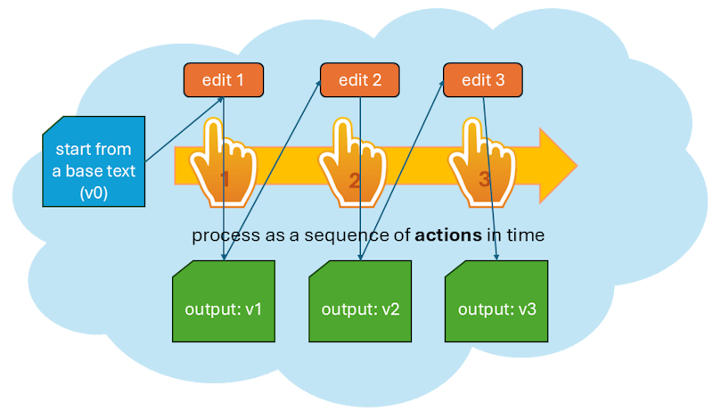
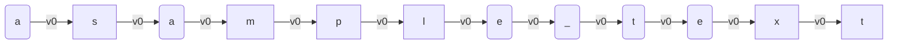
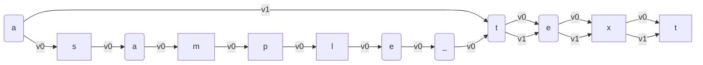
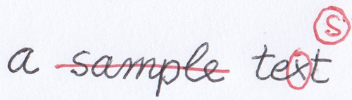
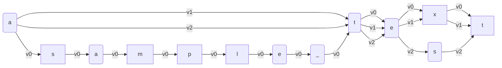

- [Snapshot](#snapshot)
  - [Operations and Alterations](#operations-and-alterations)
  - [Alteration Stages](#alteration-stages)
  - [Interpreting Signs](#interpreting-signs)
  - [Single vs. Multiple: Chain](#single-vs-multiple-chain)
    - [Chain Operations](#chain-operations)
  - [Objective vs. Subjective](#objective-vs-subjective)
  - [Visual vs. Textual](#visual-vs-textual)

# Snapshot

"Snapshot" is the IT term we use for the epigram's version entity as a digital model capable of representing multiple alterations of a single text with all its metadata, at both textual and visual levels.

A snapshot essentially consists of two parts:

- the base text, which is the starting point of the transformation.
- the editing operations which act on text to produce alterations.

## Operations and Alterations

As outlined about our edition's [architecture](architecture.md), in our approach we need a dramatic focus shift, from the annotated manuscript (the effect, virtually representing multiple alterations of an epigram's version) to the cause (the **process** which generated it).

The text-making process generates all the different alterations we can infer from the manuscript, and it's reflected by the annotations found on it.

In practice, we can describe a process as a sequence of actions in time. With reference to text making, these actions are **editing operations**, like deleting, adding, replacing, moving, or swapping portions of a text (Figure 1).

- _Figure 1: A process as a sequence of text editing actions_

In our process model we start with a **base text**, and then apply one editing operation after another, accumulating their results.

Each operation has an input and an output, which defines another **alteration** of the text. These alterations accumulate, as the output of an operation is the input of the next one.

So, after the base text (conventionally tagged as `v0`), the first operation outputs a first alteration (`v1`); this is the input of the next opera­tion, which outputs the second alteration (`v2`); and so forth.

## Alteration Stages

We thus follow a time thread, whose effect is the production of progressive alterations of the base text. The process (via its operations) is the focus: text is just the effect of it.

Of course, as we aim to maximum granularity a single operation encodes a very small change, like the addition of a comma or diacritic, a change in a single word, a comment on top of it, etc.

When you write a text with multiple revisions, there are various stages in its redaction; but in most cases, they are the product of a _set_ of operations. You may grab the previous stage, add some words, delete others, replace others, move some text around... and after all these operations, you get the result of all the changes you accumulated, and consider it as another stage of your text. In the same way, we do not regard every single operation's output as a self-contained and complete text stage. Most versions are just _steps along a path_, which leads from one **alteration stage** to the next one.

So, we can say that each operation generates an alteration as its output; but only some of these alterations define the end point of an alteration stage. This is a sort of waypoint along our transformation path.

Thus, alteration stages correspond to the multiple texts we traditionally extract from the manuscript by interpreting the annotations on top of a base text.

So in practice this means that each epigram's version as witnessed by a manuscript contains many alterations, and among them some are regarded as alteration stages.

In other terms, we are segmenting our linear sequence of alterations. In each segment, changes accumulate operation after operation, until the last one. The alteration resulting from the last operation is an alteration stage. From the point of view of the process, all alterations are equal; we just mark some of them as the end of a sequence of edits, usually corresponding to a single hand in the manuscript.

In this context, the snapshot can represent multiple texts even when there is no final stage at all; from an abstract point of view, all stages coexist, and are equally valid alternatives.

The snapshot just freezes a process of text alterations at a given point in time, when the last change was added to all the others which accumulated.

## Interpreting Signs

A snapshot is thus a single data structure which contains multiple texts and their annotations. Just like we can regard _Venetian Epigrams_ as a whole as a sort of a constellation of epigram versions, rather than a unitary work in a more traditional sense, at a higher zoom level we can regard a single snapshot as a constellation of alterations within an epigram's version.

Alteration stages are like stars derived from the same nebula, which is the creative process we focus on. The weaker light from these stars and from the nebula itself is the effect of this generation process. The bright stars are our text alteration stages; and the back­ground light of the nebula is the annota­tions, scattered all over the sheet, and hinting at the operations, which generated text versions.

This light is what got captured by our material text carrier; we might see it as our telescope, which allows us to look at that light coming from the past.

Of course, telescope power is limited; **observation** provides facts and some clues, and scholarly **interpretation** does the rest. So, the astronomer here is the scholar who interprets the carrier to re­construct the creative process behind it, just like the genesis of a constellation could be reconstructed from the nebula including it.

From a general point of view, data on our carriers are signs: some of them represent text (letters and punctuation); others are any sort of graphical signs (lines, arrows, shapes, callouts...) hinting at a specific change in the text. For instance, a line stroke on a word hints at its deletion.

These signs represent the more "objective" layer of data. Of course, even at this level there are cases where reading a sign is an act of interpretation, because of its material state; but in general, these signs represent our objective data. Then, it's up to scholarly interpretation to infer the changes on text implied by these signs, and if not their order, at least their grouping so to define various alteration stages. The process is a necessarily subjective reconstruction, based on the hints provided by our visual evidence.

While a carrier is just the material support of signs, these signs and all the abstractions derived from them (operations and versions) constitute the snapshot.

Modeling such a snapshot is challenging as we need to compose multiple **tensions**:

- _single/multiple_: the single, uniform nature of the creative process applied on what we consider one text with many alterations (rather than totally different texts), and the multiple alterations which are its effect.
- _objective/subjective_: the objective layer of the carrier vs. the subjective interpretation of it;
- _visual/textual_: the gra­phical dimension of the signs vs. the tex­tual nature of the signified data;

## Single vs. Multiple: Chain

As for single vs. multiple texts, the snapshot requires a _single_ data structure to represent _multiple_ texts.

If we look at the text as a string of characters, to build a new alteration we just have to combine these characters in a different way, possibly adding new characters (when we insert or replace something).

For instance, consider a text like "a sample text" (Figure 2). We can represent it as a set of graph nodes, each repre­sen­ting a single character, chained into a se­quence. Nodes are connected by links, which carry the identifier of the alteration they represent (here `v0`, the base text).

- _Figure 2: Text as a directed graph_

As this is our base text, all the links have version 0. These links connect the cha­racters to form our text. Whenever an operation is executed, it generates a new version with a progressive number, adding _new links_ tagged for that version.

Now say that in our manuscript there is a line stroke on "sample" and this hints to a deletion of that word. This delete operation produces another alteration, `v1`. As we're using a single data structure to represent multiple strings of text, an efficient way to represent a change in it is recombining the same nodes in a different way.

A new combination implies the addition of a new set of links, for the next version, v1. Most of them will be equal, except that to delete the word "sample" we add a bypass, from the character at its left to the cha­racter at its right. The new set of links connects the space before "sample" to the initial letter "t" of "text". This way, we do not touch existing nodes; we just add a new set of links, to connect them in a different way (Figure 3).

- _Figure 3 - Deleting a word_

This results in a new version of our text: "a text", corresponding to alteration `v1`. We cre­ated it by just adding links and reusing nodes, guided by a delete operation.

If you start from the first character to the left, and follow links with a specific tag (either `v0` or `v1`), concatenating the characters of nodes connected by them, you get two versions of the same text:

- `v0`: "a sample text"
- `v1`: "a text"

Again, say that in our manuscript the "x" letter of "text" is circled, and at the top of the text there is an isolated circled "s" letter. Our interpretation of these signs (two circles around two letters) is that they hint at a replace operation, which changes "text" into "test" (Figure 4).

- _Figure 4: a mock manuscript with annotations hinting at changes_

We are thus going to use a replace operation to add a new set of links for alteration `v2`, which also implies the addition of a new "s" node to the set of character nodes (Figure 5).

- Figure 5: Replacing a character ("x" → "s") in "text"

Now we have 3 texts:

- `v0`: "a sample text"
- `v1`: "a text"
- `v2`: "a test"

So, with this single data structure, named **chain**, we can efficiently represented an unlimited number of strings by linking character nodes in different ways.

In the end, the chain is just a container of two sets:

- the **set of nodes**, where each node is a single character;
- the **set of links**, each tagged with its alteration label (`v0`, `v1`, `v2`, etc.).

The chain is designed to mimick what happens in real world with an autograph manuscript: in most cases, when we write with a pen on a sheet of paper, every sign written on it stays there forever. We cannot undo our drawing. Sure, we can write new signs on top of it, like the stroke on "sample" to say we want it deleted; or add new signs, like the circled "s", to say we want to replace "text" with "test". Yet, the original word "sample" is still there; and so is "text".

In the same way, every node added to the chain set is unique, just like the unique act of writing which happened at a given time on that sheet of paper; it stays there forever, even when it is no longer included in later alterations. For instance, the 6 nodes for "sample" are not removed from the chain's set after the delete operation. They are still there; but they are no longer linked by the set of `v1` links, which bypass this word completely.

This persistence is true also for links: whenever a new alteration is made by an operation, a totally new set of links gets added to the links set. These new links are tagged for the new alteration, and live in the chain set together with all the other links.

With reference to these sets, operations are the interface between scholars and the chain data structure. It is the operations which change the chain; and change goes in a unique direction, consisting of additions to its sets: new links, and possibly new nodes.

So, the text represented by a chain evolves from low to high complexity: it starts with the base text, and then new links and nodes get accumulated over time, as nothing gets removed.

When speaking of time, we are not implying a historical interpretation which orders one operation exactly after another, as it were going to reflect the real sequence of events occurred in the text making process. There is a tendency towards a historically plausible reconstruction, and usually we can group operations into sets which define alteration stages; but the order within each alteration stage is just conventional.

Rather, time here is the focus of the model (a process being a sequence of operations over time) in the sense of being an additional feature of it, where information accumulates both on both the visual and textual layers. Every editing operation adds information for the next state of the text; so earlier states are those with fewer information, and later states are those with more. This has some resemblance with information theory applied to time in physics viewed as the 'cumulative record' of what happened.

So, rather than having a distinct document to represent each alteration stage and comparing all such documents within a given epigram's version to elicit its transformation process from this comparison, the snapshot model focuses on the process which is their ultimate cause. This approach not only fits our scenario, but it also provides a highly compact way of representing multiple texts within a single data structure.

### Chain Operations

In this model, operations are the core of the snapshot's representation: they represent the formal language used by scholars to describe their reconstruction about the transformations of a given text; the "recipe" to build all alterations starting from a base text. Then, these alterations are just computed by the system.

This role of operations as a core interpretative device has important consequences for their design:

- we need **higher-order edit operations**. In raw text processing, we can represent any change with only two operations: insert and delete. These are the two core operations in diffing, when comparing two versions of a text. Yet, as operations are the interface between scholars and the underlying data model, we want the most human-friendly interface. For instance, when we replace a word with another, we describe this process as a unit, even if in editing a digital text this implies two lower-order operations: deleting the old word, and inserting the new one in its place. The same is true for other higher-order operations: we thus provide not only delete and insert, but also replace, move, and even swap. This way, we can provide a full set of tools for a description which can mimick what we would say when talking about the changes applied to a text: e.g. "this word was deleted"; "this word was replaced by a new one"; "this word was moved before this other word"; etc.
- we want to be able to **encode a virtually unlimited set of metadata** (e.g. the reason of a change, a comment on it, its source, etc.) to be later transferred into their output. In other terms, we need the recipe to build not only texts, but also their annotations. Of course, in this scenario there is not even a text to annotate, until we generate it; and even more important, the representational device is the operation, because our model focuses on the process. So, it's the operation we want to describe, rather than its effect.

## Objective vs. Subjective

TODO

## Visual vs. Textual

TODO
