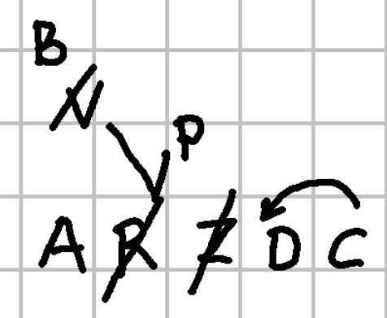
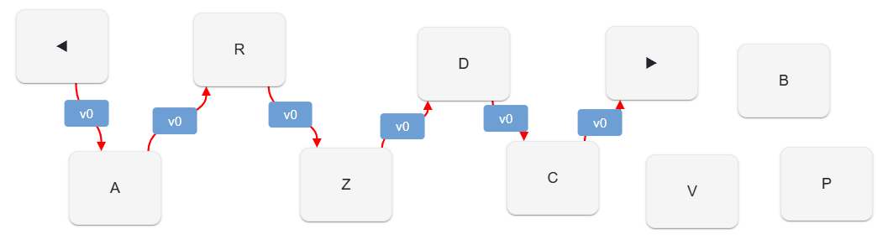
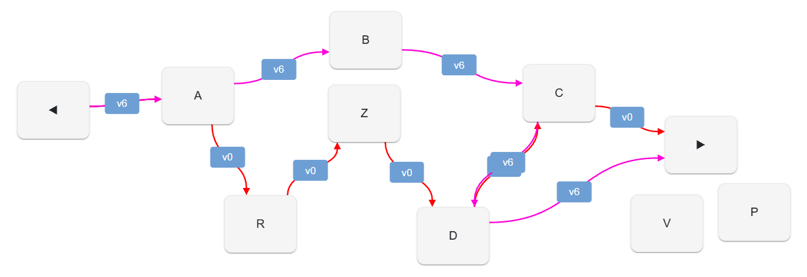
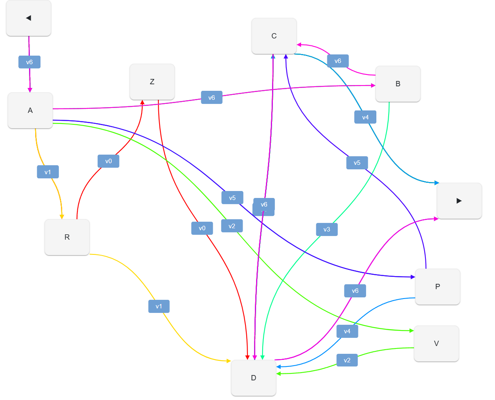
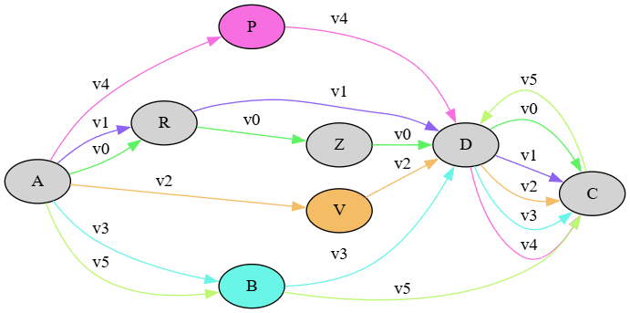

# Textual Model

## Model Requirements

Ideally, the main requirements of this model are:

1. we want to **represent the snapshot** itself in a _computable_, generative way, defining the process which builds the reconstructed output.
2. in this process, we want to **preserve** as distinct, structured data our _ingredients_ (text and annotations), _recipes_ (annotation selection and ordering) and _outcomes_ (text versions).
3. we want to represent the snapshot annotations both in their **textual and visual form**. This is because the graphical representation of each annotation is semantic information, which should be encoded next to the textual variant it represents. By preserving both these layers of data we provide a richer model, which can be inspected by scholars using our digital edition as a tool, or just leveraged by more casual users as another way of looking at the text and its creation process.

A good model should meet all these requirements using the simplest possible structure, which implies _raising the abstraction level_ so that even the finest details can find a generalized and consistent representation.

This also allows our model to lay the foundation of a paradigmatic approach, leading from a single case study to a reusable tool.

## Core Chain Model

Our model core is represented by a general purpose data structure we call 🔖 **chain**. The task of this data structure is _representing multiple linear combinations of a set of entities_. We represent these entities as **nodes** of a **graph**, connecting them into linear sequences.

In our specific case, our entities are characters, and their linear combinations build a sequence representing a text. So, a chain has the power of representing multiple texts (i.e. multiple versions of what we regard as the "same" text in the course of its composition) at the same time; and this is right what a snapshot on a carrier does.

In technical terms, we could describe this structure as a _tagged multigraph linked list_:

- it's a _linked list_ because each node has at most one child in each version of the list.
- it's a _multigraph_ because it allows multiple edges (links) between nodes.
- it's _tagged_ because each version of the list (each set of links) has a unique tag.

### Operations

Let us see how this works by using a simplified diagram. Consider the image below, which I created by first writing characters `ARZDC`, and then making some annotations on it, representing variations of the text.

>A text being a linear sequence of characters, we don't care creating a true text in a specific language here; we just deal with such sequences, so that our examples are shorter and more to the point.



This snapshot provides annotations which can be interpreted as operations changing the **base text**, which is just what happens to be the starting point of our digital representation. So, "base text" here has no genetic or philological implication; it is just a practical device in our model.

As our model represents multiple versions of what we consider the "same" text, this means that it represents a set of changes in it, from the first to the last version in the author's mind. Again, "first" and "last" here don't imply that these are the two edges of the line representing the whole creation process; rather, they are the two edges of the segment in this line which is covered by our snapshot. When representing multiple versions of a linear sequence in terms of changes of a starting sequence, of course we need right that: _a sequence to start with_. This is our "base text".

Often, this base text will correspond to what in a relatively tidy snapshot looks like a line in the main flow of text, used as the anchor for annotations. In our diagram, this is the line where I wrote `ARZDC`. This does not necessarily imply that I _first_ wrote `ARZDC`, and _then_ all the rest; I might well have written `AR`, then some of the annotations above it, and then the rest of the letters in the same line (`ZDC`); or I might have followed any of the other order of actions I could ever imagine for writing the text photographed by our snapshot. This is not relevant here; all what we want is a sequence to start with, and on the ground of both visual and textual representations (and optionally their meaning, when dealing with a real text) I happen to pick `ARZDC`.

Having defined our base text, let us now focus on the **annotations**. The annotations on the sample snapshot clearly represent _operations_ on the text, which in a visual way lead to generate different versions of it:

- the slash on `Z` represents a _deletion operation_.
- the slash on `R` is part of a _replacement operation_. Of course, in simpler terms a replacement is just a composite operation, made of a deletion followed by an insertion. Yet, from our more synthetic point of view we prefer to look at it as a replacement. In fact, that's what our snapshot visuals aim to represent; we have a slash on `R`, and two segments originating from it and leading to two alternative letters: `V` on the left, and `P` on the right.
- in turn, the slash on `V` is another _replacement operation_: here it gets replaced by `B`. Note that in this case we are nesting an operation on top of another operation; which, in turn, happens to be on a branch representing two alternative operations. One branch stems from `R` and goes across `V` up to `E`; the other one stems from `R` and goes up to `P`. It is our conventional interpretation of these visuals which defines these operations, and in some cases even hints at their relative order.
- finally, the arrow on top of `DC` represents a _movement operation_: `C` is moved before `D`. Again, this is a higher-order, complex operation that we could just represent as a deletion (delete `C`) and an insertion (insert `C` before D); but we prefer a complex operation here, as it best fits what we clearly understand about the writer's intention when seeing the arrow "moving" `C` before `D`.

So, all our _annotations can be modeled in terms of operations_, which affect our chain.

Also, we do not just limit ourselves to basic operations like insertion or deletion. Even if these would be all what is strictly required to represent any change on a linear sequence, we want a model as near as possible to a human-friendly representation and interpretation of our snapshot.

This is because operations here essentially belong to the layer of interpretation, and interpretation here is a human fact. Here, we are looking at our _snapshot_, and inferring operations from its visuals.

The _snapshot is objective, empirical evidence_: we effectively take a photographical image of it, and we could even geometrically represent all its visuals.

Conversely, _operations are our interpretation of these visuals_, which define the ingredients of our lost recipe: the letters of our text, and the operations which change their combinations into sequences.

We thus want such operations to be as close as possible to a human-friendly way of thinking; and for this reason we allow for many complex, higher-order operations, as far as they best fit our needs.

### Chain

So far, we have modeled our snapshot and its _ingredients_: we have letters, and operations on them. Some of these operations just move letters around; others can delete them, or add new ones.

Our next challenge is representing a _recipe_. In our sample snapshot, our ingredients are:

- the base text `ARZDC`;
- the deletion of `Z`;
- the replacement `R=V`;
- the replacement `V=B`;
- the replacement `R=P`;
- the movement of `C` before `D`.

As we have seen, these operations already imply a degree of interpretation; but in most cases this is a trivial interpretation, which poses no issues.

The main issue for interpretation is instead _selecting and ordering our ingredients_, that is, building a **recipe** for handling them in a way leading to a final outcome, which in our case is a version of our base text.

In other terms, we have six ingredients listed. Among them, five are operations. Now, should I select all of them to build a specific version, or just a subset? And what would be their order of application? We need at least one recipe, or even more than one; each of them will represent an interpretation of our snapshot leading to a specific staged **version** of our text.

So, recipes are completely up to our interpretation: of course, they are constrained by the number and type of available ingredients; but within these limits, any combination is possible. It is up to the scholar's judgement to consider all the complex factors behind a recipe, and define it, thus generating one or more versions of a text.

Notice that our model will always include all the ingredients, as we want to fully represent our data at the snapshot level. We do not want any of our interpretations to have destructive effects on our data: just like the snapshot presents all the ingredients mixed together, we want to collect and preserve all of them as distinct entities. This will not only ensure that our model fully represents our data; but also that we can add as many interpretations as we want on top of them, or even allow others use the same data to come out with their own interpretations.

So, the challenge here is having a model which allows scholars to define a recipe for combining ingredients to get any number of distinct text versions, while still containing all the ingredients in the same box. In a sense, if you think of a text as a string (a linear sequence of) characters, it is like getting a _time-enabled string_, i.e. a single data structure with the ability of representing not just a single sequence, but many different ones, all within the same box. Now, this is right what the _chain_ data structure is for.

This data structure consists of a _linear sequence_ of **nodes**, each connected to the previous and the next node by a **link**. In our case, nodes are characters.

So, a chain has a set of nodes, and a set of links connecting them. Notice that none of these sets is ordered; it is the link which defines the order of a node in a sequence.

To allow for multiple sequences in the same set, each link has a _version tag_, which adds the dimension of time to this structure. So, essentially any change on the texts represented by the chain is made by adding new layers of links, where each layer is just defined by the link's tag.

For instance, let us start from our base text, `ARZDC`: if we represent nodes inside square brackets, and links with the two characters they connect separated by a colon, the base text (let's call it `v0`) is:

```txt
-:A [A] A:R [R] R:Z [Z] Z:D [D] D:C [C] C:-
```

This means that our chain contains 5 nodes (`A`, `R`, `Z`, `D`, `C`) and 6 links:

- `-:A`, i.e. the link connecting the start edge of the chain to the first node;
- `A:R`, link between `A` and `R`;
- `R:Z`, link between `R` and `Z`;
- `Z:D`, link between `Z` and `D`;
- `D:C`, link between `D` and `C`;
- `C:-`, i.e. the link connecting the end edge of the chain to the last node.

All these links are tagged with version `v0`. Once we have filled the chain's sets, we can generate any of the text versions by just following all the links tagged for that version, starting from the first link and moving from node to node.

For instance, to get the text for version `v0` we start from link `-:A`, which leads us to node `A`; then, we get to link `A:R`, which leads us to node `R`; and so forth, until the end link (`C:-`). As we move from node to node, we collect characters; in the end, the collected characters represent our sequence, `ARZDC`.

If now we want to represent another version of the text, as resulting from the deletion of `Z`, all what we have to do is adding a new set of links for the next version (let's call it `v1`):

- `-:A`, i.e. the link connecting the start edge of the chain to the first node;
- `A:R`, link between `A` and `R`;
- `R:D`, link between `R` and `D`. This bypasses `Z`, with the effect of "deleting" it from the text;
- `D:C`, link between `D` and `C`;
- `C:-`, i.e. the link connecting the end edge of the chain to the last node.

The nodes set is unchanged; `Z` itself is still there. Yet, we have bypassed `Z` in the sequence by short-circuiting the link between `R` and `D`. The result is that when building our version text, we no more traverse the `Z` node, so that we get `ARDC`.

Other operation types, like additions or replacements, also imply the addition of nodes; but for the rest they work the same, by adding new links in the set. For instance, if we are going to replace `R` with `V`, we will:

- add a new node, `V`.
- add a new set of links for a new version (tagged `v2`):
  - `-:A`
  - `A:V`
  - `V:D`
  - `D:C`
  - `C:-`

Again, we just added items to our chain's sets, but the result is that we have defined another sequence for it, corresponding to yet another text version: `AVDC`.

A [demo UI](https://gve-demo.fusi-soft.com) for this data structure can let you play with operations on it, showing among other data also a diagram representing nodes and links in the chain. So, let us consider the full set of operations in our sample snapshot, and build the corresponding diagrams. Our base text is `ARZDC`, representing our version 0 (`v0`); operations are:

- the deletion of `Z`;
- the replacement `R=V`;
- the replacement `V=B`;
- the replacement `R=P`;
- the movement of `C` before `D`.

The diagram below shows the representation of version `v0` via nodes and links once all the operations have been executed, in the order specified above:



For clarity purposes, the diagram also shows start and end edges as nodes (with left and right triangles); yet, in the set there are no such nodes, but only nodes for letters `A`, `R`, `Z`, `D`, `C`, `V`, `B`, `P`. Note that some of the nodes are left out from the sequence; they still belong to the nodes set, but they happen not to be used for building the text of `v0`. This is because they were effectively added later, by replacements. So, following links you get `v0` text `ARZDC`.

Let us now consider the last version produced after all the operations have been executed; this is version 6 (`v6`). To avoid overcrowding the diagram, here we have filtered out links not belonging to `v0` or `v6`:



>Note that when showing more than one versions some links can be overlapped in the diagram, according to how you move the shapes around. The UI diagram is interactive, so you are free to drag shapes wherever you want, maybe revealing or hiding some of them. In this case I have moved nodes to make easier to read the different versions; yet, some links are overlapped: this is the case of `-:A` for both `v0` and `v6`: `v6` overlaps it completely, but it's still there (just compare the previous diagram showing just `v0`).

Now you should start to see the chain's ability to represent multiple versions at the same time. Here we have two sub-sets of links: those tagged with `v0` (red), and those tagged with `v6` (magenta).

If we follow `v1` links, we traverse these nodes:

1. `A`
2. `R`
3. `Z`
4. `D`
5. `C`

If instead we follow `v6` links, we traverse these nodes:

1. `A`
2. `B`
3. `C`
4. `D`

While the nodes set stays the same, our _links define the recipe: they tell which nodes to pick from the set, and in which order_.

Thus, we have gained the ability of representing multiple strings with this sort of time-enabled strings: in a sense, the chain is a multi-versioned string.

If we remove filters from the diagram, and look at all the versions from `v0` to `v6` at once, here is the result:



The links now define 7 different versions of our text:

0. v0: `ARZDC`
1. v1: `ARDC`
2. v2: `AVDC`
3. v3: `ABDC`
4. v4: `APDC`
5. v5: `APCD`
6. v6: `ABCD`

So, a single chain structure represents 7 variants of the same text; these are 7 recipes, all using the same ingredients, which are always preserved in the box, whatever recipe we decide to follow.

Whenever we apply an operation to our chain, we get a new version out; so we have the fully detailed text generation process, step by step, as defined by our interpretation. Of course, _not all the versions output by this detailed process are eligible for representing what we really want to define as a text "version"_; maybe in our interpretation we have isolated 3 versions, corresponding to `v2` (`AVDC`), `v5` (`APCD`), and `v6` (`ABCD`), while discarding the other as just generative steps between them. The chain has a mechanism for this selection, but we must first introduce another feature of them before delving into its details.

Another visualization, which can be automatically generated by the [snapshot editor UI](../ux/editing-snapshots), is a static graphviz which can thus afford to display all the nodes with their links without cramming them into some unreadable result:



Here you can follow the paths of each version while reconstructing its text; for instance, for base text (`v0`) you start from `A`, and follow the green edges labelled with `v0` to `R`, `Z`, `D`, and finally `C`.

To sum up, we have thus met the [first two requirements](#model-requirements) of our model:

(1) represent the _snapshot_ itself in a _computable_ model.

(2) preserve as distinct, structured data our _ingredients_ (text and annotations), _recipes_ (annotation selection and ordering) and _outcomes_ (text versions).

Yet, we still have to address the last one:

(3) represent the snapshot annotations both in their _textual_ and _visual_ form.

This implies delving into more details about our chain's operations, which will also show more about the data they carry and inject in their output.

### Metadata

As we have seen, the chain structure is a container of any number of versions of a text, and operations target it by adding new links and optionally new nodes to its set. So, chain operations are abstractions on top of the chain structure, used to represent higher level editing operations on the chain's text.

As already noticed, the operations being the first act of interpretation of our snapshot we do not limit ourselves to the basic ones only (insertion and deletion); rather, we prefer a full set of higher order operations, which best fit the nuances of our descriptive model.

So, there are 8 **types** of operations (listed with their corresponding operator in their text-based representation):

- replace (`=`): e.g. `1x2=X`.
- delete (`-`): e.g. `1x2-`.
- add before (`+[`): e.g. `1x1+[X`.
- add after (`+]`): e.g. `1x1+]X`.
- move before (`>[`): e.g. `1x2>[5`.
- move after (`>]`): e.g. `1x2>]5`.
- swap (`<>`): e.g. `1x2<>3x3`.
- annotate (`:`): this is a do-nothing operation which affects only metadata by updating features; e.g. `3x2: [note=sample]`.

Given that each operation affects the chain producing a different version of the text, we might also need to attach specific **metadata** to either that version as a whole, or to the nodes affected by it.

So, operations can also carry metadata to be attached to their output; these might refer to any kind of data useful to be carried on the affected nodes, and/or on the chain context as a whole. For instance, a single operation might be attributed to another person (e.g. a suggestion from Schiller about some change in an epigram), or it might be written using a different ink, or receive some additional editorial note about its interpretation, etc.

All the operations thus share a common set of metadata, represented by:

- generic **features**. This is an open-ended set of any type of features, modeled as generic name/value pairs. So, for instance the ink color of an annotation represented by an operation might be represented as a name of `color`, and a value of `red`.

- **source** metadata: these metadata are specialized to represent the source for the variant implied by a specific operation. The model of a source item is similar to that of a generic apparatus, and contains:
  - _ID_: an identifier for the source. For instance, it might be the identifier used for Schiller, or for some other witness.
  - _type_: the type of source (a person, a witness, etc.).
  - _rank_: the probability rank attributed to the identification of this source.
  - _note_: an optional free text note.

- **diplomatic** metadata: these metadata are specialized to represent the _visual_ aspects of an operation on the snapshot's carrier (see the [diplomatic portion of the model](diplomatic)).

#### Features

The feature carried by an operation (and other objects in the snapshot model) is a bit more complex than just a name/value pair. Among its properties, a feature has a specific **set policy**, which drives the behavior of the operation when updating features in their sets (=the context set, when they are global; or the nodes set, when they target the affected nodes).

The set policy can have any of these values:

- **single**: when a feature is added to a set, and a feature with the same name already exists in it, the existing feature gets replaced with the new one. For instance, the certainty rank is a single-policy feature, because logically you can just have a single level of certainty; if you set a new level, you are overwriting the value of the previous one. Also, the version feature is used to mark a specific output as a staged version; so, whenever a new version is defined, the old version value is replaced by it.
- **multiple**: when added to a set, the feature is just added to the set, whether another one exists with the same name or not. For instance, a `log` feature is used in our examples when we want to trace the operations effects on the generated texts. In this case, each operations logs a new entry and we want to preserve all the entries as they accumulate. So, this is a multiple feature, and whenever a new log entry is added all the existing entries are preserved.
- **single first**: when added to a set in a batch, and a feature with the same name already exists, the first one being added replaces all the existing ones, while the following ones to be added just get added as multiple. This has meaning only when adding several features at once. Otherwise, it just behaves as single.

>Some features get automatically projected onto their targets when applying an operation. This is the case of probability rank and source features. Source features also provide an example of the single-first policy: as every operation can have multiple sources, we want to replace the sources from previous operations the first time we add a source from the current operation, but then add all the other sources included by that operation. Should we use a single set policy, we would end up preserving only the last-added source, which is not what we want.

#### Trace Features

⚠️ WARNING - THIS SECTION IS A DRAFT!

Trace features are features which can be automatically injected by operations. They are used to trace some data related to their execution which may later prove useful in various ways, especially for rendering.

For instance, when rendering the snapshot UI we might want to highlight the nodes affected by each operation. These vary according to the operation type and its arguments. For example, a replacement operation which replaces "AB" with "X" can inject a special trace feature to nodes "A" and "B" on one side, and "X" on the other side.

The same features will also be useful when rendering the nodes during data export into other formats, like TEI.

All the trace features have these properties:

- their has form `$OPID/NAME` where after the constant `$` prefix (which marks trace features) include the operation ID (`OPID`) followed by `/` and the specific feature name. So their name is stamped with the ID of the operation which generated it, which guarantees they are unique in the context of each version.
- they are single features, meaning that there can be only one per node. This is a consequence of their stamping.

Currently these are the trace features:

- `seg-in`: input _segment_ (=sequence of _contiguous_ nodes) selected by the operation. Value is `TAG@NR` where `TAG` is the version tag the nodes belong to, and `NR` the ordinal number of the node in the segment captured by the operation.
- `seg-out`: output segment affected by the operation.
- `seg2-in`: same as `seg-in`, for the second segment in a swap operation.
- `seg2-out`: same as `seg-out`, for the second segment in a swap operation.
- `anchor`: the anchor node used as a reference for add or move operations. Value is `TAG` where `TAG` is the version tag the node belongs to (the input version tag for the add or move operation).

>Of course, segments are contiguous in a specific version only. Operations (except for the annotate operation) alter the order of the nodes, and versions are just their output.

For instance, in a replacement operation targeting a `v0` segment "AB" these nodes will get (using `OPID` as an ID placeholder for brevity):

- for v0 nodes:
  - `A`: `$OPID/seg-in` equal to `v0@1`.
  - `B`: `$OPID/seg-in` equal to `v0@2`.
- for v1 nodes:
  - `X`: `$OPID/seg-out` equal to `v1@1`.

>Again, notice that the number after `@` is NOT the node ID but rather its _ordinal number_ in the segment affected by the rule.

👉 Operations inject trace features as follows:

- **replace**:
  - input: the segment to be replaced.
  - output: the new segment nodes which replaced the old one.
- **delete**:
  - input: the segment to be deleted.
  - output: nothing. The delete has no output segment by definition. So, the deleted node, once detached from the version text, will just retain its input segment feature.
- **add before**, **add after**, **move before**, **move after**:
  - input: the anchor node gets an anchor feature.
  - output: the added segment nodes.
- **swap**:
  - input: the segments to be swapped: one in `seg-in` and another in `seg2-in`.
  - output: the swapped segments: one in `seg-out` and another in `seg2-out`.
- **annotate**:
  - input: the segment to annotate.
  - output: the segment annotated. This is equal to the input segment.

💡 Trace features ease the work of later processing (like rendering) when starting from each generated text version. For instance, consider our usual [mock example](sample-arzdc), starting with base text `ARZDC` (v0) and continuing with these operations (each identified in this list with a Greek letter for short):

1. delete `Z` (α) => v1 `ARDC`
2. replace `R`=`V` (β) => v2 `AVDC`
3. replace `V`=`B` (γ) => v3 `ABDC`
4. from v1, replace `R`=`P` (δ) => v4 `ARDC`
5. from v3, swap `D` and `C` (ε) => v5 `ABCD`

We can represent the trace features added under each version in the following table, and each feature in a version column has the assigned node ID followed by its value. As remarked above, the Greek letter represents the ID of the operation in a compact form:

**v0**: we start with this base text (each node ID is above its character):

```txt
12345
ARZDC
```

**v1**: (α) delete Z (#3):

- input (v0): Z (#3).
- output (v1): nothing.

| v0       | v1 | v2 | v3 | v4 | v5 |
|----------|----|----|----|----|----|
| 3=in@1 α |    |    |    |    |    |

**v2**: (β) replace R (#2)=V (#6): `A[V]DC`:

- input (v1): R (#2).
- output (v2): V (#6).

| v0       | v1       | v2        | v3 | v4 | v5 |
|----------|----------|-----------|----|----|----|
| 3=in@1 α | 2=in@1 β | 6=out@1 β |    |    |    |

**v3**: (γ) replace V (#6)=B (#7): `A[B]DC`:

- input (v2): V (#6).
- output (v3): B (#7).

| v0       | v1       | v2        | v3        | v4 | v5 |
|----------|----------|-----------|-----------|----|----|
| 3=in@1 α | 2=in@1 β | 6=out@1 β | 7=out@1 γ |    |    |
|          |          | 6=in@1 γ  |           |    |    |

**v4** from v1: (δ) replace R (#2)=P (#8): `A[P]DC`:

- input (v1): R (#2).
- output (v4): P (#8).

| v0       | v1       | v2        | v3        | v4        | v5 |
|----------|----------|-----------|-----------|-----------|----|
| 3=in@1 α | 2=in@1 β | 6=out@1 β | 7=out@1 γ | 8=out@1 δ |    |
|          | 2=in@1 δ | 6=in@1 γ  |           |           |    |

**v5** from v3: (ε) swap D (#4) with C (#5): `AB[CD]`:

- input (v3): D (#4), C (#5).
- output (v5): C (#5), D (#4).

| v0       | v1       | v2        | v3        | v4        | v5         |
|----------|----------|-----------|-----------|-----------|------------|
| 3=in@1 α | 2=in@1 β | 6=out@1 β | 7=out@1 γ | 8=out@1 δ | 5=out2@1 ε |
|          | 2=in@1 δ | 6=in@1 γ  | 4=in@1 ε  |           | 4=out2@1 ε |
|          |          |           | 5=in2@1 ε |           |            |

Thanks to these features, at each version we can see all the nodes affected by the operation which generated it, and connect them to the previous or next versions. For instance, say we are looking at `B` from v5 and we go backwards to see how this evolved:

1. v5 #7=`B` (γ rep V=B) => v3 (v3 being the input of v5): in v3, the nodes having a γ segment are: γ-out #7=`B`, and γ-in #6=`V`.

TODO

### Operations DSL

Even though GVE provides a UI to edit such operations, it also allows a text-based representation for them using a minimalist domain specific language (DSL). This text format is used to represent their basic metadata, including features, but excluding specialized metadata (source and diplomatic). It is mostly used to speed up editing, or for testing or diagnostic purposes in code.

The general text-based syntax for these operations includes these components, from left to right:

(1) `(ITAG:OTAG)`: these are the optional input and/or output **version tags**. They represent the input and the output versions in the chain before and after applying the operation. You can specify none, just one, or both. Usually there is no need to specify version tags, as the system can generate tags, and automatically increase their number (`v0`, `v1`, `v2`...) after each operation is applied. You might want to specify a version when you want to use a special name for it (which anyway is discouraged, as it would introduce variants in the expected naming scheme for tags), or when you want to start from a version which does not correspond to the latest generated version.

(2) `ATxRUN` or `@ATxRUN` (where `AT` is required): the **range** of characters to select as the input of the operation. `AT` is either a _node ID_ or index (when prefixed by `@`), and is optionally followed by the run of nodes. If not specified (and when it makes sense according to the operation's type), `RUN` defaults to 1.

>**Node ID**s are numbers starting from 1, automatically assigned to each node from first to last, in the order they get added to the chain. So, if you start with nodes `ARZDC`, you can predict that `A`'s ID will be 1, `R`'s will be 2, etc. Once a node gets an ID, it never changes; so, node IDs are immutable, just like nodes themselves. **Node indexes** instead refer to the 0-based index of a node in the context of a specific version; so, in `v0`=`ARZDC` character `D` has index=3 (and ID=4); but in `v1`=`ARDC` (deletion of `Z`) the same character has index=2 (while still retaining its ID=4). You are free to choose which system to use, but in most cases you will stick to IDs. Indexes can be useful for nodes which get added in complex nestings of operations, when ID prediction could be less handy.

(3) `OPERATOR` (required): the **operator** defines the operation's type. According to the operator, the other relevant parameters are listed in this table:

type        | operator | at | run | to | to-run | value
------------|----------|----|-----|----|--------|------
replace     | `=`      | Y  | Y   | -  | -      | Y
delete      | `-`      | Y  | Y   | -  | -      | -
add before  | `+[`     | Y  | -   | -  | -      | Y
add after   | `+]`     | Y  | -   | -  | -      | Y
move before | `>[`     | Y  | Y   | Y  | -      | -
move after  | `>]`     | Y  | Y   | Y  | -      | -
swap        | `<>`     | Y  | Y   | Y  | Y      | -
annotate    | `:`      | Y  | Y   | -  | -      | -

>Run by default is always 1 except in add where it is 0.

(4) `"VALUE"`: a **text value** for those operations requiring it. For instance, a replacement operation must provide a text to insert for the replaced range defined by `AT` and `RUN`. Alternatively, move operations (move before, move after, swap) have a second pair of coordinates, `TO` and `TORUN`, which work like `AT` and `RUN`. For instance, `1>]3` is a move-after (`>]`) operation, which moves character 1 after character 3.

(5) `^RANK`: a metadatum representing the **probability rank** for the interpretation connected to this operation. A value=0 means unspecified, values above 0 are e.g. 1=highly probable, 2=probable, 3=less probable, etc., using as many levels as you require.

>When not zero, the rank also generates a feature with the same name and a value equal to the rank's value. This allows this metadatum to bubble up into the operation's output, and thus be part of the data attached to each generated version. The rank is thus a _projected feature_, using a single policy. Source features too get projected in a similar way, when present, using a first-single policy.

(6) `[NAME="VALUE"...]`: name=value pairs representing metadata **features**, separated by space. When the feature is flag-like (boolean), you can just use `NAME` without operators and value. Further syntax details:

- the operator separating the name from the value varies according to the set policy of the feature:
  - `=` represents a **multiple** feature, which can occur 0-N times in its set.
  - `:=` represents a **single** feature, which can occur 0-1 times in its set.
  - `==` represents a **first-single** feature, which is treated as single the first time it is added to the set, and then as multiple. This can be used to replace a set of features with another one. For instance, when adding source-related features, the next operation first removes all the features named "source" from the targeted set, and then adds all the new ones.
- **global feature** names must start with an asterisk (e.g. `*version`). A global feature is a feature attached to the chain data context as a whole, rather than to specific nodes in it. Specific nodes are determined by the operation type: for instance, a deletion targets the node being deleted, while an insertion targets the nodes being inserted.
- a feature name prefixed by `!` means that all the features with that name must be **removed**. In this case you just specify the feature name after this prefix.
- a feature name ending with `^` means that that feature will be short-lived, i.e. once added, it will be removed the next time features get updated (i.e. at the next operation). This is useful for instance when adding the `*version^` feature, which should tag a single output as representative of a named text version.
- a value containing **spaces** must be included in double quotes.

Note that features get accumulated as each operation is executed on the chain. So at any stage in the evolution of the text you get all the features accumulated up to it, unless you remove any of them in an operation, according to the set policy used.

### Example

Let us see an example. If you recall our sample `ARZDC` snapshot, we could provide the following operations to interpret it (the line prefixed by 👉 represents the version generated by each operation, and the base text):

- 👉 `v0`: `ARZDC`

(1) `3- [*log=\"delete Z\" reason="don't like Z"]`: this is a delete operation targeting node with ID 3, i.e. the third character of our base text (`Z`). Notice that for this demo we have added a couple of mock features: a `log` single feature which has a diagnostic purpose, representing the operation being executed in a human-friendly form; and a `reason` feature, which might represent the reason for that operation. The input of this operation is the base text (`v0`), and the output is a new version, which will automatically be tagged as `v1` (=the numeric suffix is just increased).

- 👉 `v1`: `ARDC`
- 📚 features:
  - context: log=delete Z
  - node #3: reason=don't like Z

(2) `2=V [*log=\"replace R with V\" *version^:=alpha]`: this is a replace operation targeting node with ID 2, i.e. the second character of the base text (`V`), being replaced by `V`. Besides the `log` feature, here we add a `version` single feature, which means that we want to pick the outcome of the operation as a text version proper, named `alpha`. This feature can thus be used to define which of the versions generated by each operation should be promoted to what we envisage as a version of the text, rather than just a reconstructed stage in the process of its evolution. Also note that here we are going to use the version output by the previous operation as the input of this one, which is the default; that's why we do not require to explicitly define neither the input nor the output version tags for it.

- 👉 `v2`: `AVDC`
- 📚 features:
  - context:
    - log=delete Z
    - log=replace R with V
    - version=alpha
  - node #3: reason=don't like Z

(3) `6=B [*log=\"replace V with B\"]`: this is a replace operation targeting node with ID=6, which is the ID of the newly added node `V` in the previous operation (as remarked above, node identifiers are predictable, as they get assigned automatically by incrementing a shared ordinal number).

- 👉 `v3`: `ABDC`
- 📚 features:
  - context:
    - log=delete Z
    - log=replace R with V
    - log=replace V with B
  - node #3: reason=don't like Z

(4) `(v1:) 2=P [*log=\"replace R with P\" *version^:=beta]`: this is yet another replace operation, but this time it does not use the last generated output as its input. Rather, it is based on version `v1` (`ARDC`); so, it's the second branch of replacements stemming from the same base text character `R`.

- 👉 `v4`: `APDC`
- 📚 features:
  - context:
    - log=delete Z
    - log=replace R with V
    - log=replace V with B
    - log=replace R with P
    - version=beta
  - node #3: reason=don't like Z

>Note that when you start from a previous version, the chain is smart enough to generate a unique version number, without colliding with existing ones. The output version number is equal to the input version number + 1, or to the next available number when this already exists.

(5) `4<>5`: this is a swap operation, swapping the position of two characters with ID 4 (`D`) and 5 (`C`). As you can see, swap here best captures the meaning of this operation, and is a higher order operation. A swap is just a special case of movement, which in turn could be represented with a deletion and an insertion; yet, should we go that down, we would lose the immediate meaning represented by a more synthetic and human-friendlier "swap".

- 👉 `v5`: `APCD`
- 📚 features:
  - context:
    - log=delete Z
    - log=replace R with V
    - log=replace V with B
    - log=replace R with P
  - node #3: reason=don't like Z

(6) `(v3:) 4<>5 [*version^:=gamma]`: this is the same swap operation which now affects another branch in the evolution of the text; the operation has as its input `v3` (`ABDC`), so in the end the output will be `ABCD`.

- 👉 `v6`: `ABCD`
- 📚 features:
  - context:
    - log=delete Z
    - log=replace R with V
    - log=replace V with B
    - log=replace R with P
    - version=gamma
  - node #3: reason=don't like Z

So in the end, these operations represent 7 variants of our text:

- `v0`: `ARZDC`
- `v1`: `ARDC`
- `v2`: `AVDC`
- `v3`: `ABDC`
- `v4`: `APDC`
- `v5`: `APCD`
- `v6`: `ABCD`

Additionally, each version has its set of features, as derived by accumulating them from the various operations which generated it.

>🛠️ Technical note: each chain operation derives from `ChainOperation<T>`, which in turn is derived from `VarOperationMetadata`. All operations get translated into calls to lower-level chain editing methods. The chain operations take care of finding the nodes corresponding to their location arguments. All the operations work on a chain operations **context** (`ChainOperationContext<T>`), which includes the chain itself and a set of related data, like last version tag, context features (for global features), node features, and all the details about each step in processing the text.
