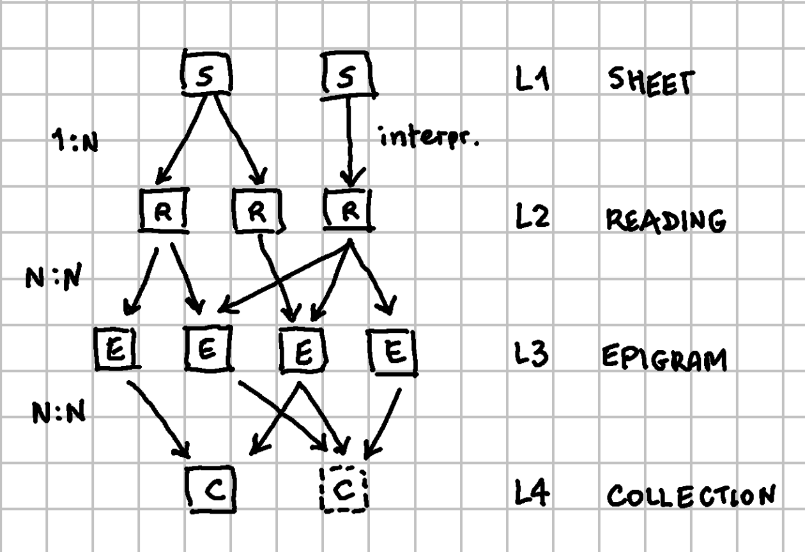
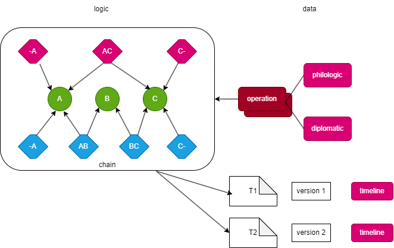

# Entities Overview

⚠️ This is part of an ongoing discussion, so that's just a draft.

## L1 - Sheets

At the bottom level we have sheets. Sheets provide what I call "snapshots" of a text together with all the variants on top of it, in the form of written annotations. Here I'm already designing a comprehensive model, which I partially showed at the DiSCePT meeting, and once I've completed it I will show you in detail. Meanwhile, I know enough of it to be able to provide a first model draft and I'm currently working on its implementation and refinement. The model includes:

- on the philological side, the text and its variants in the form of operations which change it. So it's a generative process, you have 1-N recipes to build a text starting from the ingredients in the snapshot, i.e. the "base" text and its annotations.

- on the diplomatic side, each operation has its diplomatic metadata, including their visual representation. This allows us animating them, though in a different way with respect to your presentation because here we're below the level you dealt with there.

The **identity** of each sheet is granted by its materiality. So one sheet is one sheet, and has some standard identifier(s).

### L1 Model

The model of level 1 is quite complex, as it must represent in separate layers:

- the base text;
- all the annotations on top of it, giving rise to different variants according to our interpretations. The annotations are represented as operations which change the text they refer to;
- our interpretations of the annotations, producing many readings. Interpretations select and order operations;
- metadata about each operation;
- diplomatic rendition of each operation;
- animation timeline for each version of the text resulting from interpretations.

At the core of this model is the chain data structure. This data structure consists of a linear sequence of nodes, each connected to the previous and the next node by a link, and in our scenario representing a single character. Additionally, each link has a version tag, which adds the dimension of time to this structure.

Internally, this structure collects nodes and links, and once they are added, they cannot be removed (unless we are using a single version). Any modification is done by adding new nodes and links, which connect or disconnect or reorder the existing nodes.

So, a chain is a sort of time-enabled string, capable of representing multiple versions of the same text as defined by multiple subsets of the links connecting text nodes. You just follow the links with the desired version to build the corresponding text.

A set of operations target this chain structure and add new links and nodes to represent each successive change, even in different branches, as each operation starts from a specific chain state and produce another chain state. Operations are selected and ordered by interpretations, and include philologic and diplomatic metadata.

The chain contains all the states for our text, which are the basis for producing many text versions. For each produced version we can provide a timeline, which is in charge of orchestrating animations of the visual renditions of each visible operation.

### L1 Metadata

Q: Apart from all the metadata defined by model for representing the various philological and diplomatic aspects of each sheet, which are other metadata for each sheet? We will e.g. have standard ID(s) in the literature, maybe date(s) and place(s), physical description (e.g. size, ink...), etc.

A: as a first overview, see the [inventory of Goethe's poems by Klassik Stiftung Weimar](https://www.klassik-stiftung.de/). There are entries having properties like (this is by no means a complete list):

- location: this is like a geolocation CSV address, from the widest to the narrowest area. It usually ends with an institution.
- sheets count
- title
- title on MS
- dating on MS
- incipit
- transmission form
- context
- many identifiers, like:
  - signature(s)
  - WA sigle
  - WA column
  - WA paralipomena
  - WA printing location
  - Goethe letter repertory
- persons (names with comma separating last from first)

TODO: here we need to decide which metadata to include, and what's their exact meaning and form.

## L2 - Readings

Above level 1, everything is immaterial except for some collections at level 4.

Each sheet provides 1 or more readings, according to the interpretation(s) of its writing and annotations. Readings are automatically generated by the underlying sheet model.

The **identity** of each reading is given by the source sheet plus a reading identifier, unique in the scope of each sheet.

The **relationship** between sheets and readings is 1-to-many: each single sheet generates 1 or more readings.

### L2 Metadata

Metadata are among the output of the operations defined by each interpretation. Dealing with the details of such metadata at the sheet level will automatically define the metadata inherited by L2.

## L3 - Epigram

The epigram is a reconstructive hypothesis of the text, based on any number and combination of readings. From this point of view, think of readings as the witnesses in a traditional apparatus.

In a traditional apparatus, you summarize the differences between your witnesses, usually manuscripts. In our case, each sheet provides 1-N witnesses (the readings), so the apparatus here will summarize the differences among them. Formally that's not so different from a traditional apparatus descending from collation; the main difference is that our witnesses come from a single sheet and its interpretations rather than from different manuscripts.

The **identity** of each epigram should be probably defined against an official registry.

The **relationship** between readings and epigrams is many-to-many, because:

- many readings can be the witnesses of a single epigram.
- a single reading can be the witness of many epigrams.

### L3 Metadata

Q: Which are the metadata at this level? Apart from the ID, title, date(s), etc.

## L4 - Collection

A collection is an ordered set of epigrams, and can be either material or immaterial. An immaterial collection can be based on material collections, but also on other evidence; or it may even rest on other evidence only. For this reason, material and immaterial collections are siblings and rest at the same level; they represent the same hierarchical level, even though by historical accidentes some of them were materialized and others did not.

The **identity** of each collection should be probably defined against an official registry.

The **relationship** between epigrams and collections is many-to-many, because:

- many epigrams are included in a collection;
- a single epigram may be included in many collections.

### L4 Metadata

Q: Which are the metadata at this level? Apart from the ID, title, date(s), etc.
