# Hints

👉 [Hints Designer Demo](https://gve-hint-designer.surge.sh)

Hints represent the visual grammar of the diplomatic layer representation. Any signs which do not belong to the script are hints. Of course, one can draw anything, so the catalog is open and you can freely design your hints. These hints are not meant to be a photographic representation of the sign, like in a facsimile; they rather are more abstract **symbols**, representing the essential traits of a class of single instances of drawings traced on your document.

Just like phonemes are an abstraction and we describe them only with their relevant traits, dropping those which have no distinctive value and only belong to accidental utterance or non-canonical variants, hints are an abstraction too, and their stylized appearance is used as a class of signs. So, phonemes are related to allophones like hints to the actual drawings in your facsimile.

This way, with a few symbols we can economically represent the signs of a whole corpus, and also implicitly provide their symbolic classification over all texts.

## Designing Hints

To design a hint, you typically use a combination of tools:

- any SVG editor like [InkScape](https://inkscape.org) to literally draw it.
- the [hints designer](https://gve-hint-designer.surge.sh). This links points to a demo page you can directly use. Otherwise, just add the designer component (which is a standard W3C custom web component) into your HTML page and run it locally or elsewhere.

For consistency, all the hints belonging to a project are designed in a **fixed-size drawing area**, which defaults to 300x100 pixels. This ratio is consistent with the main purpose of hints, which are typically placed on top of the text they annotate; and in most cases, text is longer than taller. As hints are typically resized when drawn, this is just a ratio and the real size does not matter.

> 💡 Unless you have reasons to do so, it is strongly suggested to keep using this fixed size, so that you can reuse hints from our projects without having to rescale them.

To **draw a hint** using [InkScape](https://inkscape.org):

1. create a new document and size it accordingly (`File/Document Properties`): by default 300x100, units px everywhere, scale 1.

    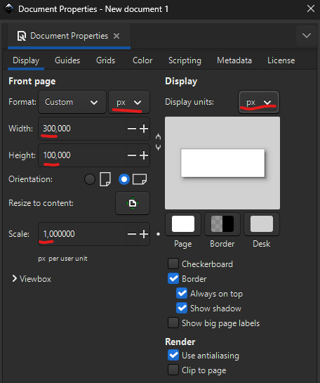

2. freely draw your hint. Consider that your area represents the bounding box around the text selected by an operation. So for instance if you are going to draw a horizontal stroke all over it, draw a horizontal line from edge to edge, vertically centered. If you want this line to be slightly longer than the text, you will apply an X-scale to it later in the hints designer.
3. save the document and open it in a code or text editor. Copy the SVG elements found in the document, and ensure they are all wrapped in a single `g` element which will become the root element of the SVG snippet used by hints.
4. in the hints designer, create a new hint and paste the SVG code you copied in its SVG box. Then adjust all the other properties as you desire and pick an entrance animation for it.
5. if required, replace literal values from your SVG with placeholders. For instance, typically the color is designed to be a placeholder depending from the `r_fore-color` feature. Remember that for every placeholder you use you must define a value for it in the designer (`Hint Variables` pane), so that the hint can be drawn.
6. when done, save all hints into a JSON file by clicking the "Save data to file" button in the top toolbar. Then, copy it and paste it in your API `seed-profile.json` under `settings/it.vedph.gve.snapshot/hints` property. Remember to update the `snapshot-feat-values` thesaurus accordingly, as this contains the list of all hints users can pick from in the editor.

> 💡 If you want to edit an existing hint in InkScape, select it and click the "Export hint to InkScape SVG" button. This will embed the hint's SVG into a standard InkScape code frame ready to be loaded in that editor, also replacing all placeholders with values to avoid load errors.

## Catalog

This is the catalog of hints for our project. Wherever hint properties are not specified, it is assumed their default value, as follows:

- position=`o` (origin)
- X-offset: 0
- Y-offset: 0
- X-scale: 1
- Y-scale: 1
- rotation: 0

In the following list the following icons are used:

- 🎯 hint's main purpose
- ⏯️ entrance animation for hint
- 🔴 placeholder variable in hint, must be specified by adding the corresponding feature
- ☑️ hint's property predefined in its design (only when different from default)

### Lines

---

#### diagonal-stroke-down

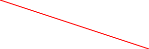

- 🎯 deletion hint
- ⏯️ wipe-right
- 🔴 `r_fore-color`: line color

Designed to be drawn above text.

---

#### diagonal-stroke-up

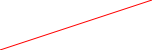

- 🎯 deletion hint
- ⏯️ wipe-right
- 🔴 `r_fore-color`: line color

Designed to be drawn above text.

---

#### cross-stroke

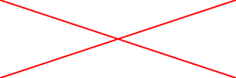

- 🎯 deletion hint
- ⏯️ wipe-right
- 🔴 `r_fore-color`: line color

Designed to be drawn above text.

---

#### horizontal-stroke

- 🎯 deletion hint
- ⏯️ wipe-right
- 🔴 `r_fore-color`: line color

Designed to be drawn above text.

---

#### vertical-stroke

- 🎯 deletion hint
- ⏯️ wipe-down
- 🔴 `r_fore-color`: line color

Designed to be drawn above text.

---

#### hamburger

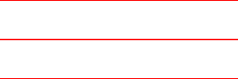

- 🎯 finer-grained deletion hint
- ⏯️ wipe-right
- 🔴 `r_fore-color`: line color

Designed to be drawn above small portions of text, usually a single character, as a lighter deletion hint, often meant to delete just some traits of a letter.

---

#### hotdog

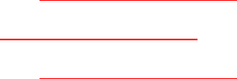

- 🎯 finer-grained deletion hint
- ⏯️ wipe-right
- 🔴 `r_fore-color`: line color

Designed to be drawn above small portions of text, usually a single character, as a lighter deletion hint, often meant to delete just some traits of a letter.

### Borders

---

#### box

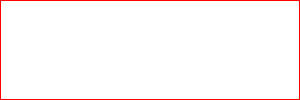

- 🎯 text selection hint
- ⏯️ wipe-right
- 🔴 `r_fore-color`: line color
- ☑️ X-scale: 1.1
- ☑️ Y-scale: 1.1

Designed to hint at a selection of text to be logically connected to some operation or other part of the text, or to isolate the text from its context and make it stand out (e.g. an epigram number). The 110% scale is used to avoid having the box "stitched" too tight around the text.

---

#### line-bottom

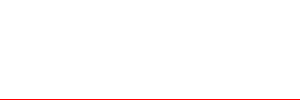

- 🎯 text underline hint
- ⏯️ wipe-right
- 🔴 `r_fore-color`: line color

Designed to underline some text (not at the same time of writing).

---

#### line-bottom-dotted

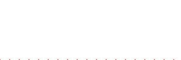

- 🎯 text restoration hint
- ⏯️ wipe-right
- 🔴 `r_fore-color`: line color

This variation of [line-bottom](#line-bottom) is mostly used to restore a text which was previously deleted.

---

#### line-top

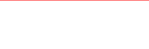

- 🎯 text overline hint
- ⏯️ wipe-right
- 🔴 `r_fore-color`: line color

Overline some text (not at the same time of writing).

---

#### line-top-dotted

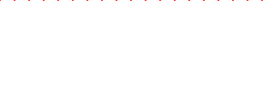

- 🎯 text overline hint
- ⏯️ wipe-right
- 🔴 `r_fore-color`: line color

This is a variation of [line-top](#line-top), provided for consistency, yet not seemingly used in our corpus.

---

#### line-left

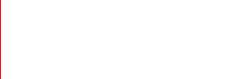

- 🎯 text segmentation hint
- ⏯️ wipe-down
- 🔴 `r_fore-color`: line color

This is mostly used to segment text according to some criterion, typically metrical. Note that as per hints convention, the name refers to the position of the hint in the design grid. In fact, it is mostly used to draw a _right_ edge of some text. This is why it's positioned at the left edge of the hint, so that a hint placed east can "stitch" to the preceding text.

---

#### line-right

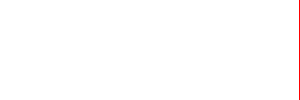

- 🎯 text segmentation hint
- ⏯️ wipe-down
- 🔴 `r_fore-color`: line color

This is mostly used to segment text according to some criterion, typically metrical. Note that as per hints convention, the name refers to the position of the hint in the design grid. In fact, it is mostly used to draw a _left_ edge of some text. This is why it's positioned at the right edge of the hint, so that a hint placed west can "stitch" to the following text.

### Letters

---

#### dotless-exclamation

- 🎯 compendiary correction
- ⏯️ wipe-down
- 🔴 `r_fore-color`: line color

Change a dot into an exclamation mark by adding the vertical trait above it.

---

#### i-dot

- 🎯 compendiary correction
- ⏯️ fade-in
- 🔴 `r_fore-color`: line color

Add a dot on a dotless `i`.

---

#### umlaut

- 🎯 compendiary correction
- ⏯️ fade-in
- 🔴 `r_fore-color`: line color

Add a missing umlaut on a letter.

### Connectors

---

#### half-psi

- 🎯 insertion anchor
- ⏯️ wipe-down
- 🔴 `r_fore-color`: line color
- ☑️ Y-scale: 1.5

Typically used to show the insertion point inside the text, adding inserted text somewhere above it. The 150% vertical scale is used to make it extend above and below the text. The hint's name derives from its resemblance to the right half of a Greek `ψ` (psi) letter.

---

#### snake

- 🎯 insertion anchor
- ⏯️ wipe-right
- 🔴 `r_fore-color`: line color
- ☑️ X-scale: 120%
- ☑️ Y-scale: 200%

Typically used to show the insertion (or replacement) point inside the text, adding inserted text somewhere above it.

---

#### snake-left

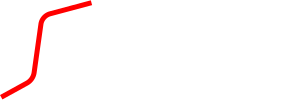

- 🎯 insertion anchor
- ⏯️ wipe-right
- 🔴 `r_fore-color`: line color
- ☑️ Y-scale: 200%

Typically used to show the insertion (or replacement) point inside the text, adding inserted text somewhere above it. Note that as per hints convention, the name refers to the position of the hint in the design grid. In fact, it is mostly used to draw a _right_ edge of some text. This is why it's positioned at the left edge of the hint, so that a hint placed east can "stitch" to the preceding text.

---

#### snake-right

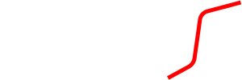

- 🎯 insertion anchor
- ⏯️ wipe-right
- 🔴 `r_fore-color`: line color
- ☑️ Y-scale: 200%

This is the left counterpart of snake-left provided for consistency, yet not seemingly used in our corpus. Note that as per hints convention, the name refers to the position of the hint in the design grid. In fact, it is mostly used to draw a _left_ edge of some text. This is why it's positioned at the right edge of the hint, so that a hint placed west can "stitch" to the following text.

### Callouts

Callouts are used to link an annotation text to its annotated text. They are _not_ used to represent text, but only annotations. Added text (by add or replace operations) is just the value of the corresponding operation and being part of the text has a relative placement, though it might be flanked by additional hints, like lines.

---

#### snake-callout

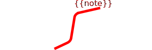

- 🎯 textual annotation
- ⏯️ wipe-right
- 🔴 `r_fore-color`: line color
- 🔴 `note`: text in callout

A textual annotation not belonging to the text, placed above a snake-like callout.

### Text

---

#### note-above

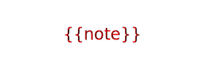

- 🎯 textual annotation
- ⏯️ wipe-right
- 🔴 `r_fore-color`: line color
- 🔴 `note`: text in callout
- ☑️ position: `n`
- ☑️ Y-offset: -10 (=above)

A textual annotation not belonging to the text, placed above it (as an interlinear note) without any further sign.
