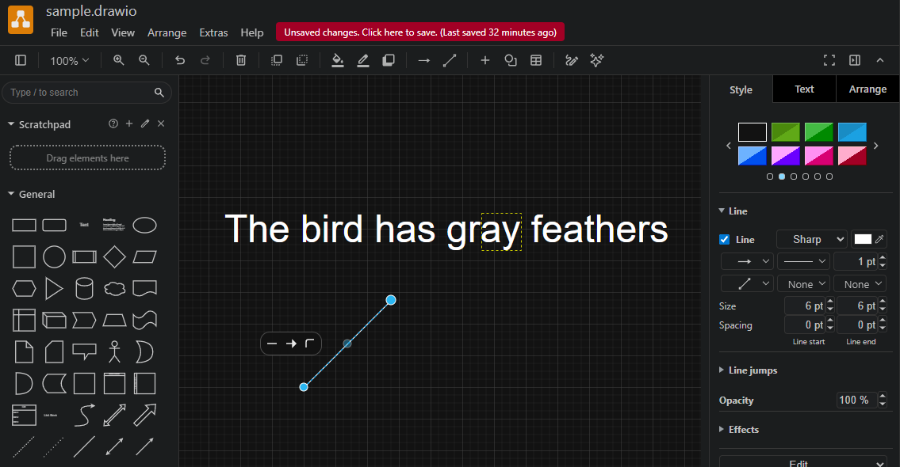
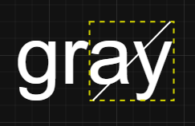
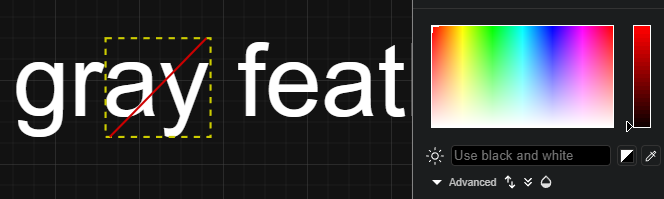
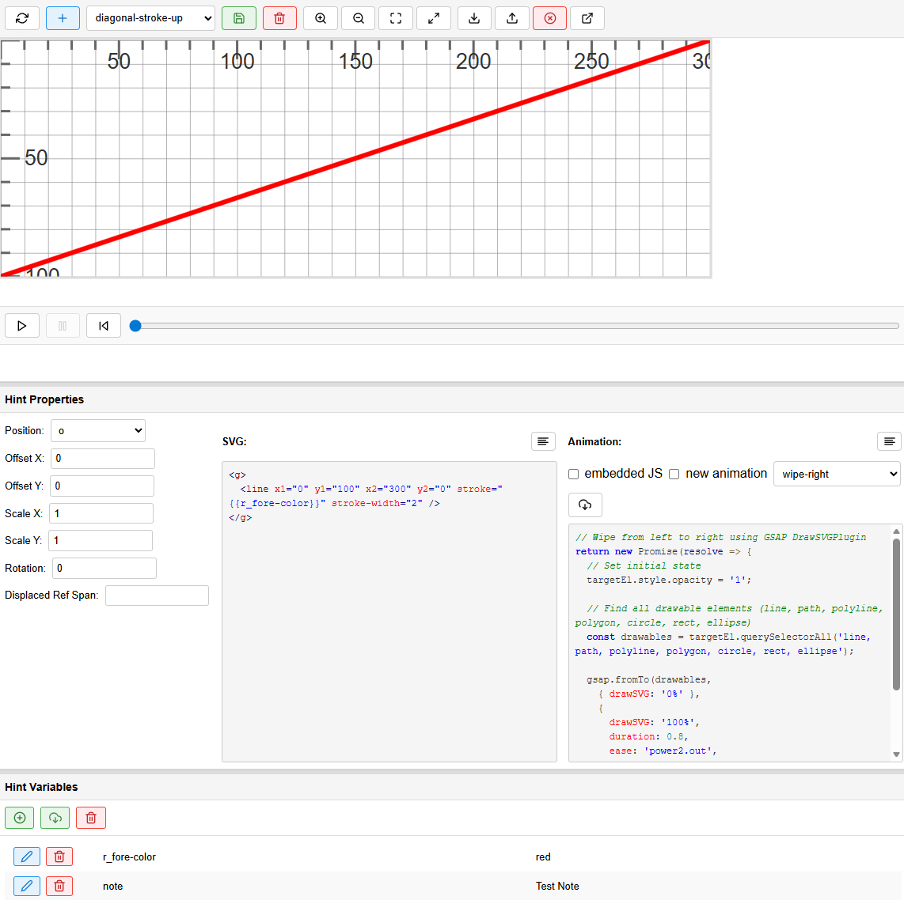
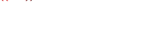

# Hints

👉 [Hints Designer Demo](https://gve-hint-designer.surge.sh)

Hints represent the visual grammar of the diplomatic layer representation. Any signs which do not belong to the script are hints. Of course, one can draw anything, so the catalog is open and you can freely design your hints. These hints are not meant to be a photographic representation of the sign, like in a facsimile; they rather are more abstract **symbols**, representing the essential traits of a class of single instances of drawings traced on your document.

Just like phonemes are an abstraction and we describe them only with their relevant traits, dropping those which have no distinctive value and only belong to accidental utterance or non-canonical variants, hints are an abstraction too, and their stylized appearance is used as a class of signs. So, phonemes are related to allophones like hints to the actual drawings in your facsimile.

This way, with a few symbols we can economically represent the signs of a whole corpus, and also implicitly provide their symbolic classification over all texts.

## Understanding Hints

Hints are all non-textual signs on the document which hint at a specific operation. For instance, typically when I draw a line on a word, this line sign means that I want to delete that word. So, the line here hints at a deletion operation.

While you can look at the [conceptual documentation](../model/rendition.md) for more, we can use an analogy from a drawing application for diagrams (Figure 1). In it, you have a catalog of geometrical shapes on the left: to add one, you just pick it and it appears on the drawing surface.



- _Figure 1: a drawing application (drawio)_

In the figure I have picked a line, which appears in its default size, highlighted in blue with circular handles, used to transform it. You can make the line longer or shorter by dragging its ends, rotate and scale it at will.

Once you have done with transformations, you move it in place. In the drawing example I have put a text: let's pretend it's our epigram's text, where we want to visually represent a replacement. Assume that in our original document we have "gray" with a diagonal line on its last two letters and the letters "een" written above it. This clearly hints to a replacement: "gray" becomes "green".

As for the text layer, we just care about text: so there we encode the replacement as is: replace "ay" with "een" in "gray", and the result will be a new alteration of the original text: "The bird has green feathers".

As for the visuals, we want to encode the line on "ay". This is the hint to the deletion of the letters which will be replaced by those added above it. To this end, we pick the line from the catalog on the left.

We then resize it to fit the ideal rectangle around the letters being replaced: I have literally drawn it in this figure (dotted yellow rectangle) to make it visible. This is the "reference text bounding rectangle" (RBR) used for sizing and positioning hints in GVE rendition. As we want the line to fully cover these two letters, we start it from the bottom-left corner of this RBR (letter "a") and end it at its top-right corner (letter "y": Figure 2).



- _Figure 2: placing and sizing the line hint in the RBR_

So we have 1. picked a hint from the catalog, 2. resized it to fit the RBR and 3. placed it inside the RBR so that the center of the rectangle including the line corresponds to the center of the RBR (this is the meaning of the default position `o`=origin in GVE). The result is the line right above the two letters, as we wanted.

Of course, we might place the line everywhere else: it could be above the RBR, to its right or left, below it, etc. You just change the position feature for the hint to move it relative to the RBR.

You might also need to slightly adjust the position by shifting the line either horizontally or vertically. To do this, in the drawing application you can just drag it, or select it and repeatedly tap an arrow key. In GVE, you just set the X or Y offset values (including negative numbers: -Y moves to the top, -X moves to the left).

This general mechanism is very efficient because it works automatically whatever the extent of text you select. The hint is just like the line I pick from the catalog in this drawing application: it's a shape I can transform at will, and then place where I want.

In the renderer, letters "een" which are part of the new text get added automatically, because they are defined within the replacement itself. You just have to specify a position for them, here `n`=north, i.e. above the RBR.

Finally, let's change an attribute of that form. Say that in our original document the hand which made this change used a red ink. So we want the line to be red.

In the drawing application, we ensure that our line is still selected, and pick the red color from the right pane, which lists all the attributes of the selected shape (Figure 3).



- _Figure 3: setting the line's color to red_

The result is a red line instead of the default color. This corresponds to adding features to an operation to further specify hint's properties. Most hints use placeholders in the SVG code which defines their appearance, which get replaced by values got from other features in the operation. In this case, we can set the foreground text color for the text added ("een"), and this will automatically set also the hint's color, making the line red.

So, when you add hints you can think in similar terms: once you have encoded the textual operation, add its visual signs using hints:

1. pick the hint from the catalog.
2. optionally set its relative position.
3. optionally resize, rotate or offset it.
4. add features for that hint, if required, like color.

This is like using a drawing application, but instead of manually doing every step, you just give the renderer text-based directions, like "pick the diagonal-stroke-up hint", "set its color to red": all the rest is taken care by the rendering software.

Additionally, most hints already have their properties (including position) preset in the best way for their intended use. In most cases you will at most need to slightly shift their position using offsets, but you are always free to change all its properties at will. In our analogy, we can compare this with the different preset types of lines you find in the drawing application, e.g. dotted vs. solid line. You can directly pick the dotted line as a shortcut, but you can also pick the line and later change it to dotted.

## Designing Hints

To design a hint, you typically use a combination of tools:

- any SVG editor like [InkScape](https://inkscape.org) to literally draw it.
- the [hints designer](https://gve-hint-designer.surge.sh). This links points to a demo page you can directly use. Otherwise, just add the designer component (which is a standard W3C custom web component) into your HTML page and run it locally or elsewhere.

For consistency, all the hints belonging to a project are designed in a **fixed-size drawing area**, which defaults to 300x100 pixels. This ratio is consistent with the main purpose of hints, which are typically placed on top of the text they annotate; and in most cases, text is longer than taller. As hints are typically resized when drawn, this is just a ratio and the real size does not matter.

> 💡 Unless you have reasons to do so, it is strongly suggested to keep using this fixed size, so that you can reuse hints from our projects without having to rescale them.

To **draw a hint** using [InkScape](https://inkscape.org):

1. create a new document and size it accordingly (`File/Document Properties`): by default 300x100, units px everywhere, scale 1 (Figure 4).

    

   - _Figure 4: setting InkScape document properties_

2. freely draw your hint. Consider that your area represents the bounding box around the text selected by an operation. So for instance if you are going to draw a horizontal stroke all over it, draw a horizontal line from edge to edge, vertically centered. If you want this line to be slightly longer than the text, you will apply an X-scale to it later in the hints designer.
3. save the document and open it in a code or text editor. Copy the SVG elements found in the document, and ensure they are all wrapped in a single `g` element which will become the root element of the SVG snippet used by hints.
4. in the hints designer, create a new hint and paste the SVG code you copied in its SVG box. Then adjust all the other properties as you desire and pick an entrance animation for it.
5. if required, replace literal values from your SVG with placeholders. For instance, typically the color is designed to be a placeholder depending from the `r_fore-color` feature. Remember that for every placeholder you use you must define a value for it in the designer (`Hint Variables` pane), so that the hint can be drawn.
6. when done, save all hints into a JSON file by clicking the "Save data to file" button in the top toolbar. Then, copy it and paste it in your API `seed-profile.json` under `settings/it.vedph.gve.snapshot/hints` property. Remember to update the `snapshot-feat-values` thesaurus accordingly, as this contains the list of all hints users can pick from in the editor.

> 💡 If you want to edit an existing hint in InkScape, select it and click the "Export hint to InkScape SVG" button. This will embed the hint's SVG into a standard InkScape code frame ready to be loaded in that editor, also replacing all placeholders with values to avoid load errors.

## Design Canvas

Note that every hint is drawn on a virtual **design canvas** whose size is fixed (set in settings, default=300×100). The renderer scales the hint's `<g>` root element so that this canvas maps exactly onto the reference text bounds (the RBR), then centers it according to the `position` property and shifts it by any `offset`. The scale factors are computed by dividing the RBR dimensions by the `<g>` element's own bounding box (`getBBox()`).

Note that `getBBox()` reports the tight geometric box around the _actual drawn content_, not the 300×100 canvas. If the visible elements do not touch both edges of the canvas in a given axis, the bounding box in that axis is smaller than the intended 300×100, and the computed may be not what you expect. The worst case is a single horizontal line, which has `height=0`: the renderer cannot compute `scaleY`, falls back to 1, and the line ends up at the vertical center of the text regardless of where it sits in the design canvas. For example a line drawn at `y=100` (bottom of the canvas) renders as a strikethrough instead of an underline.

So when you want the SVG canvas coordinates to be meaningful, always add a **sentinel rectangle** as the first child of the root `<g>`:

```xml
<g>
  <rect x="0" y="0" width="300" height="100" fill="none" stroke="none"/>
  <!-- your actual design content here -->
</g>
```

This guarantees `getBBox()` always returns `{x:0, y:0, width:300, height:100}`, so both scale factors are computed correctly and the hint appears exactly where the canvas positions it.

Instead, omit the sentinel when the content is meant to self-fit the RBR; in this case you will use position and offset as the sole controls for placement.

Hints whose visible content already spans the full canvas — two diagonal lines from corner to corner, a border rectangle, three horizontal lines top/middle/bottom — do not need the sentinel.

> Note: the sentinel rect has `fill="none" stroke="none"`, so it is completely invisible and does not interact with pointer events. Its sole purpose is to anchor the bounding box. Wipe animations that select `rect` elements via `querySelectorAll` will include it, but since it has no stroke, DrawSVGPlugin has nothing to animate on it and simply skips it.

## Hints Designer

The hints designer is a W3C custom web component you can use as a tool to help you design hints. In the end, hints are defined in JSON code, so it's easy to get JSON from the component and paste it in place (typically, in the backend settings of your editing environment).

The designer UI (Figure 5) has a top toolbar where you can find the list of all the hints in your catalog. By default, in the demo you will find hints from VEdition's catalog.

Each hint has a name and can be selected from the dropdown. Its visual appearance is displayed below the toolbar. In Figure 5 you see the diagonal stroke up hint, which is simply a diagonal line raising from the bottom-left corner to the top-right corner of the design grid.

>The size of the design grid is a parameter of the designer. By default it is 300x100.



- _Figure 5: the hints designer_

Below the drawing you find:

- buttons to preview the entrance animation for that hint.
- hint properties: you can change any of these to transform the hint when placing it and set its relative position.
- SVG: the SVG code fragment representing the hint's appearance. You can have any SVG code, but the root element must always be a single `g` (=group) element.
- animation: the hint's entrance animation. Usually you pick it from a catalog, which can be enriched with new animations. If you want to add new animations, you must define their JavaScript code fragment and give the animation a name.
- variables: the values defined for all variables used in hints. If you look at the sample hints in the designer demo, you will find that most of them have placeholders within "whiskers" (i.e. double braces like `{{ ... }}`). These placeholders contain a name, which is the name of the operation's feature to get the placholder's value from. For instance, `{{r_fore-color}}` is a placeholder which will be replaced by the renderer with the value of the feature defining the foreground text color (`r_fore-color`). This way, the hint will get the same color of added text, when there is any. As in most cases the hint is drawn by the same hand which writes new text, drawing the color from the text foreground makes sense. So, placeholders are a way of changing the appearance of hints according to their context. If in the designer you change `r_fore-color` from `red` to `green`, you will see that all the hints change their color, because all of them draw it from that variable.

## Catalog

This is the catalog of hints for our project. Wherever hint properties are not specified, it is assumed their default value, as follows:

- position=`o` (origin)
- X-offset: 0
- Y-offset: 0
- X-scale: 1
- Y-scale: 1
- rotation: 0

In the following list the following icons are used:

- 🎯 hint's main purpose
- ⏯️ entrance animation for hint
- 🔴 placeholder variable in hint, must be specified by adding the corresponding feature
- ☑️ hint's property predefined in its design (only when different from default)

### Lines

---

#### diagonal-stroke-down


- 🎯 deletion hint
- ⏯️ wipe-right
- 🔴 `r_fore-color`: line color

Designed to be drawn above text.

---

#### diagonal-stroke-up


- 🎯 deletion hint
- ⏯️ wipe-right
- 🔴 `r_fore-color`: line color

Designed to be drawn above text.

---

#### cross-stroke


- 🎯 deletion hint
- ⏯️ wipe-right
- 🔴 `r_fore-color`: line color

Designed to be drawn above text.

---

#### horizontal-stroke


- 🎯 deletion hint
- ⏯️ wipe-right
- 🔴 `r_fore-color`: line color

Designed to be drawn above text.

---

#### vertical-stroke


- 🎯 deletion hint
- ⏯️ wipe-down
- 🔴 `r_fore-color`: line color

Designed to be drawn above text.

---

#### hamburger


- 🎯 finer-grained deletion hint
- ⏯️ wipe-right
- 🔴 `r_fore-color`: line color

Designed to be drawn above small portions of text, usually a single character, as a lighter deletion hint, often meant to delete just some traits of a letter.

---

#### hotdog


- 🎯 finer-grained deletion hint
- ⏯️ wipe-right
- 🔴 `r_fore-color`: line color

Designed to be drawn above small portions of text, usually a single character, as a lighter deletion hint, often meant to delete just some traits of a letter.

### Borders

---

#### box


- 🎯 text selection hint
- ⏯️ wipe-right
- 🔴 `r_fore-color`: line color
- ☑️ X-scale: 1.1
- ☑️ Y-scale: 1.1

Designed to hint at a selection of text to be logically connected to some operation or other part of the text, or to isolate the text from its context and make it stand out (e.g. an epigram number). The 110% scale is used to avoid having the box "stitched" too tight around the text.

---

#### line-bottom


- 🎯 text underline hint
- ⏯️ wipe-right
- 🔴 `r_fore-color`: line color

Designed to underline some text (not at the same time of writing).

---

#### line-bottom-dotted


- 🎯 text restoration hint
- ⏯️ wipe-right
- 🔴 `r_fore-color`: line color

This variation of [line-bottom](#line-bottom) is mostly used to restore a text which was previously deleted.

---

#### line-top


- 🎯 text overline hint
- ⏯️ wipe-right
- 🔴 `r_fore-color`: line color

Overline some text (not at the same time of writing).

---

#### line-top-dotted


- 🎯 text overline hint
- ⏯️ wipe-right
- 🔴 `r_fore-color`: line color

This is a variation of [line-top](#line-top), provided for consistency, yet not seemingly used in our corpus.

---

#### line-left


- 🎯 text segmentation hint
- ⏯️ wipe-down
- 🔴 `r_fore-color`: line color

This is mostly used to segment text according to some criterion, typically metrical.

---

#### line-right


- 🎯 text segmentation hint
- ⏯️ wipe-down
- 🔴 `r_fore-color`: line color

This is mostly used to segment text according to some criterion, typically metrical.

### Letters

---

#### dotless-exclamation


- 🎯 compendiary correction
- ⏯️ wipe-down
- 🔴 `r_fore-color`: line color

Change a dot into an exclamation mark by adding the vertical trait above it.

---

#### i-dot


- 🎯 compendiary correction
- ⏯️ fade-in
- 🔴 `r_fore-color`: line color
- ☑️ Y-offset: -16
- ☑️ Y-scale: 0.3

Add a dot on a dotless `i`.

---

#### umlaut


- 🎯 compendiary correction
- ⏯️ fade-in
- 🔴 `r_fore-color`: line color
- ☑️ Y-offset: -16
- ☑️ Y-scale: 0.3

Add a missing umlaut on a letter.

### Connectors

---

#### half-psi


- 🎯 insertion anchor
- ⏯️ wipe-down
- 🔴 `r_fore-color`: line color
- ☑️ Y-scale: 1.5

Typically used to show the insertion point inside the text, adding inserted text somewhere above it. The 150% vertical scale is used to make it extend above and below the text. The hint's name derives from its resemblance to the right half of a Greek `ψ` (psi) letter.

---

#### snake


- 🎯 insertion anchor
- ⏯️ wipe-right
- 🔴 `r_fore-color`: line color
- ☑️ X-scale: 120%
- ☑️ Y-scale: 200%

Typically used to show the insertion (or replacement) point inside the text, adding inserted text somewhere above it.

---

#### snake-left


- 🎯 insertion anchor
- ⏯️ wipe-right
- 🔴 `r_fore-color`: line color
- ☑️ Y-scale: 200%

Typically used to show the insertion (or replacement) point inside the text, adding inserted text somewhere above it.

---

#### snake-right


- 🎯 insertion anchor
- ⏯️ wipe-right
- 🔴 `r_fore-color`: line color
- ☑️ Y-scale: 200%

This is the left counterpart of snake-left provided for consistency, yet not seemingly used in our corpus.

### Callouts

Callouts are used to link an annotation text to its annotated text. They are _not_ used to represent text, but only annotations. Added text (by add or replace operations) is just the value of the corresponding operation and being part of the text has a relative placement, though it might be flanked by additional hints, like lines.

---

#### snake-callout


- 🎯 textual annotation
- ⏯️ wipe-right
- 🔴 `r_fore-color`: line color
- 🔴 `note`: text in callout

A textual annotation not belonging to the text, placed above a snake-like callout.

### Text

---

#### note-above


- 🎯 textual annotation
- ⏯️ wipe-right
- 🔴 `r_fore-color`: line color
- 🔴 `note`: text in callout
- ☑️ position: `n`
- ☑️ Y-offset: -10

A textual annotation not belonging to the text, placed above it without any further sign.

---

#### note-interlinear-above



- 🎯 textual annotation
- ⏯️ wipe-right
- 🔴 `r_fore-color`: line color
- 🔴 `note`: text in callout
- ☑️ position: `n`
- ☑️ Y-offset: 4

A smaller (font size=14) textual annotation not belonging to the text, placed above it (as an interlinear note) without any further sign.
