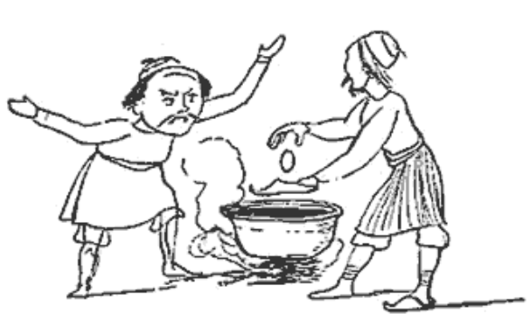
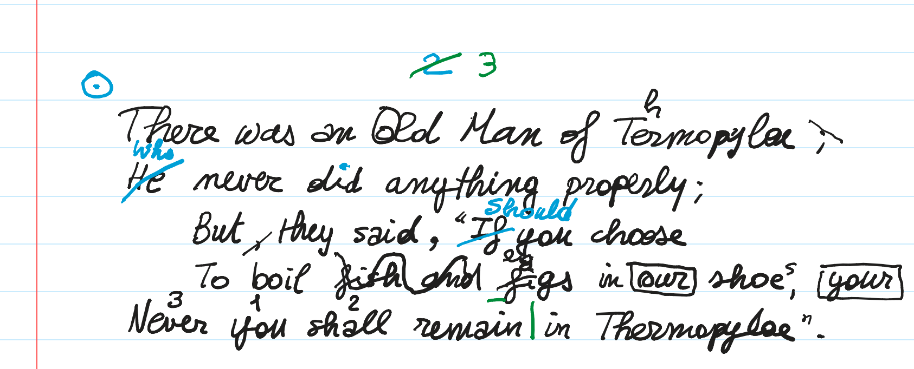
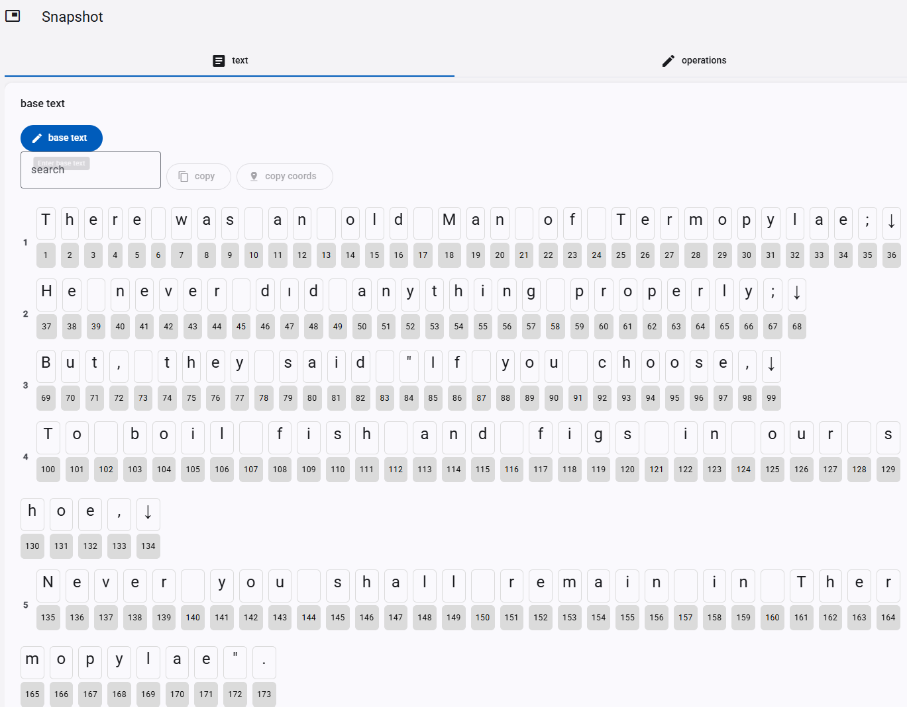
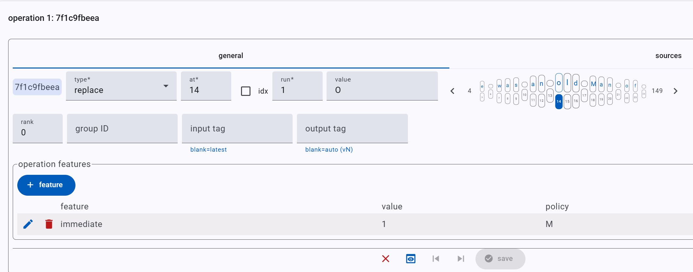
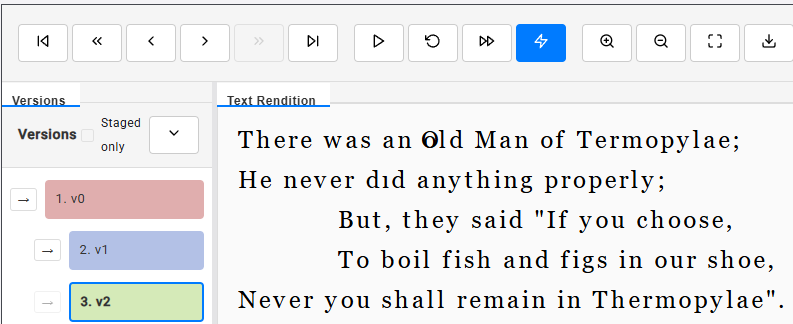
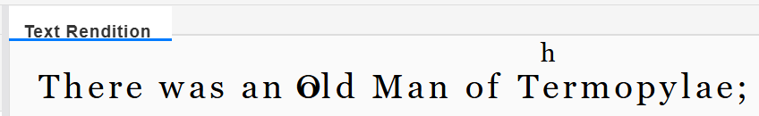
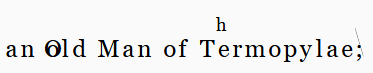
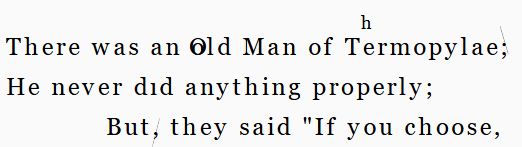

# Snapshot Sample 1



```txt
There was an Old Man of Thermopylae,
Who never did anything properly;
  But they said, "If you choose,
  To boil eggs in your shoes,
You shall never remain in Thermopylae".
```

- adapted from Edward Lear. _A Book of Nonsense._ London: Routledge, Warne & Routledge, 1861. Plate 72.

In this example, we use this mock manuscript text:



## Description

Let us pretend this is an autograph manuscript shwowing 3 hands with 3 different colors, in this order:

1. black, which is the base text, following the printed lines in the notebook page.
2. blue.
3. green.

Adopting the convention to describe the various operations on this text from top to bottom and from left to right within each hand, we can provide the following reconstruction.

> Note that the convention does not apply to numberings and other signs added outside the epigram's text to make it an item of some collection. These are usually encoded at the end of each hand.

- **black hand**:

(1) `old` → `Old`. We reconstruct this as an "immediate" correction, i.e. the same hand immediately recognized the lowercase as an error and corrected it into uppercase while writing.

(2) `Termopylae` → `Thermopylae`. The same hand introduces the missing `h`.

(3) `;` → `,` after `Termopylae`. The semicolon here gets changed into a comma by simply crossing out the dot above the comma in the semicolon. This is a compendiary way of representing this replacement, much more effective in handwriting.

(4) delete the comma after `But`.

(5) add a comma after `said`. This is logically connected to the previous operation (we are moving the comma).

(6) delete `fish and`. The hand scribbled on top of these words to mean their deletion.

(7) figs → eggs. The hand here just wrote a smaller `eg` on top of `fi` in `figs`.

(8) `our` → `your`. Here the hand boxed out `our` and added `your` at the right edge of the verse, with the same box, meaning that this new text should replace the original one.

(9) `shoe` → `shoes`. Here the hand just added a smaller `s` at the top right of `shoe`.

(10) reorder `Never you shall` into `You shall never`. This is very compressed in the manuscript, which just added smaller numbers on top of these words to mean their reordering.

- **blue hand**:

(11) add the missing dot above `i` in `did`.

(12) `If` → `Should`. The new word was written above the old one, which was crossed out.

(13) add a circled dot drawing at the beginning of the epigram, to mark it as an item of some collection.

(14) add the number `2` on top of the epigram.

- **green hand**:

(15) annotate `ai` in `remain` as long (a metrical annotation).

(16) add a vertical stroke after `remain` to mark colometry.

(17) `2` → `3` as the epigram number. `3` was written to the right of the original number which was crossed out.

## Base Text

Let us start encoding this snapshot. The first step is defining the base text, representing the starting point for all the transformations:

```txt
There was an old Man of Termopylae;
He never dıd anything properly;
But, they said "If you choose,
To boil fish and figs in our shoe,
Never you shall remain in Thermopylae".
```

👉 Hands-on:

1. create a new item with title `Thermopylae` and the description you like. Ensure its facet is `snapshot`, and save it.
2. edit the newly created item, and add a new snapshot part to it.
3. edit the newly added snapshot part.
4. in the text tab, expand `base text` and click the `base text` button to enter the new text. In the popup window, paste the above text and click `Set`.
5. it's a good idea to save the snapshot part by clicking the bottom `save` button.



## Operations

Let us now define the operations following our description.

### Indentation

Indentation is encoded just like any other aspect of the visual layer, i.e. via features.

To this end, add an annotate operation with a `char offsets` feature which contains an expression defining all the horizontal and/or vertical offsets for all characters which start an indented or otherwise offset text.

👉 Hands-on:

1. in the `operations` tab, click the `add operation` button.
2. pick as type `annotate`, set `at`=1 and `run`=1 (conventionally we just target the first character of the text).
3. click the `+feature` button and under name pick the `char offsets` feature; you can also type any characters of this name in the top search box (which opens when you click the name dropdown) to quickly locate it. Then in `value` type `69:x=100 100:x=100`. Let us dissect this value (look at the [rendition documentation](../model/rendition.md) for more):

   - `69:` means that you are targeting character ID 69.
   - `x=100` means that you are setting a horizontal offset equal to 100 pixels (this is just a convenient value, you can change it as you want).
   - again, the next expression after space says to add a horizontal offset equal to 100 to character with ID=100.

4. save the feature (round check button) and the operation (`save` button). The operation appears in the list. Before looking at the rendition, let us add an alteration to the base text with the next operation.

> The separation of indentation from base text here is just a matter of convenience to ensure a uniform model. We set the input text as plain text, and then separate its visual aspect (like indents) on the visual layer via a rendition feature.

### Black Hand

(1) `old` → `Old`. Here we literally replace `o` with `O`, adding an `immediate` feature with value `1` (which here represents the true value of a boolean feature).

👉 Hands-on:

1. in the base text display, check the `o` character you want to replace. This has ID=14. If you click it, the new operation you are going to add will pick the current selection as its coordinates; or you can just go ahead, add a new operation, and then set the coordinates.
2. in the `operations` tab, click the `add operation` button.
3. pick as type `replace`, set `at`=14 and `run`=1, and enter the new text `O` in `value`.
4. let us now add a couple of features:
   - _immediate_: click the `+feature` button and under name pick the `immediate` feature. Then in `value` select `1`, which is the only possible value for this feature, which is a boolean feature. Then, click the round checkmark button to add this feature.
   - _log_: conventionally we always add a log feature to each operation to quickly describe it. So repeat the above procedure, pick `log` as the feature name, and in `value` type something like `uppercase 'old'`.
   - finally, click `save` to save the operation, and the bottom `save` button to save the whole part if you want to save it; or just the run button of the newly added operation. This will update the rendition section.

5. in the rendition section, click the play button and look at the `o`: you will see it replaced by an overwritten `O` after a few instants, just like it happened in our manuscript.



As for the rendition, there is no need for rendition-oriented features here, because the defaults are just fine. The `O` appears overwritten and has the same black color of the base text, because the default position for added text is origin and the default text color is black.



Note the indents, and on the left the 3 colored rectangles representing `v0` (=base text), `v1` (indentations), `v2` (replacement).

(2) `Termopylae` → `Thermopylae`: here we add `h` after `T`. So, we can encode this as an add-after operation. Note that we might as well encode it as a replacement considering the whole word (`Termopylae` → `Thermopylae`), but usually at least in GVE we aim to a representation very close to the visual (diplomatic) layer.

We thus repeat the above procedure: add a new operation, set type=add-after and `at`=25 (the `T` of `Termopylae`). As for features, add:

- `position`=`north-east` because the `h` is positioned at the top-right of `T`.
- `font size`=`18` to make it smaller. The default font size in this project is 24.
- `log`=`add 'h' after 'T' in 'Termopylae'`.

If you play the rendition again, it ends with this image:



(3) `;` → `,` after `Termopylae`. Visually, in our manuscript we just have a descending diagonal stroke on the dot above the comma of the semicolon. We now want to encode exactly this on the visual side, while still preserving the effective text alteration, which is a replacement (comma instead of semicolon). So, first we start with the text layer, adding a replace operation at 35 with run 1 (=`;`) with value `,`. Then, we add these features:

- `hints`=`diagonal stroke down`: this is the sign used to mean the deletion of the dot. As for all signs, it comes from our catalog of hints.
- `log`=`cross out dot of ';' after Termopylae`
- `foreground color`=`black`: this is the color for the hint. You must always explicitly define a color for it (unless you encode it in the hints catalog).
- `hint Y offset`=`-0.25th`: this moves the hint up for about one quarter the average character height; otherwise, given its default origin position, the line would extend up to the comma below the dot.
- `overridden text value`=(empty): this tells the renderer to not display the added text, here comma. This would be pointless, because the comma is already there. So, textually we replace `;` with `,`, but visually we just draw a line on the dot of `;`, without rewriting the comma. This is exactly what we encode with these features.



(4) delete the comma after `But`. We could also represent this with a move operation, but in this example we aim at maximum granularity. At any rate, we consider this delete logically connected to the next addition, so we add a group ID to this operation (with value `move-comma`): we will add the same group ID to the next operation too, thus virtually grouping them.

So here the operation is of type delete, at 72 with run 1. Its features are:

- `hints`=`diagonal stroke up`
- `foreground color`=`black`
- `hint Y offset`=`0.25th`: this moves the stroke one-quarter the average character height down.
- `log`=`delete comma after 'But'`


