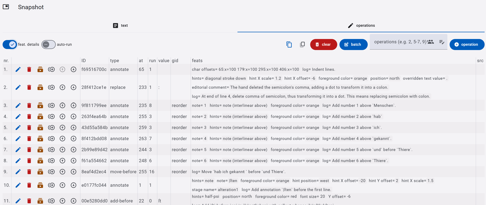
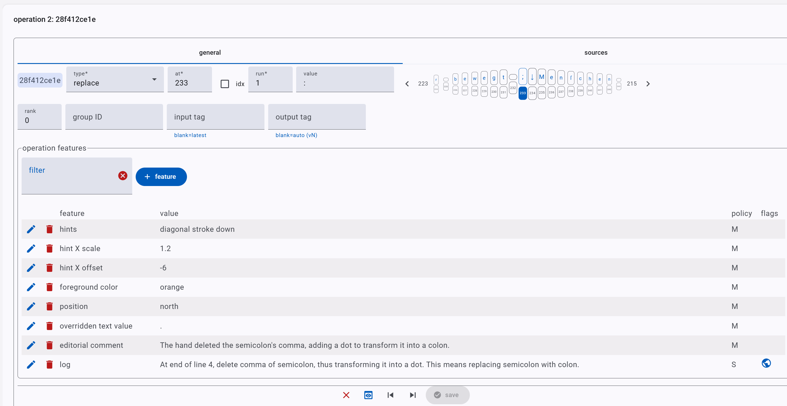

# Editor - Snapshot Part

The snapshot part is the core of the GVE edition and implements the [snapshot model](../model/snapshot.md).

Although the model is simple, the UI provides a lot of editing functions on top of it, grouped in 3 main sections:

- text tab: base text.
- operations tab: operations applied to the base text.
- snapshot rendition: visual rendition of the snapshot.

Typically, you fill this part as follows:

1. enter a base text. This is the text you start from. This usually is done only once as the very first task.
2. enter as many operations as required to describe all the alterations of this text, one after another. Usually, you want also to encode the corresponding visual layer, by adding more features to each operation.
3. whenever you add operations, you can check their output by running them and looking at the resulting texts and at the snapshot rendition.

## Text Tab

### Text Tab - Base Text

The text tab contains the collapsible **base text section**, where you enter the base text, usually just once. So, this is usually collapsed to give more room to the UI.

When you create a new snapshot, the first thing you must do is setting the base text by clicking the _base text_ button in this section and then typing or pasting it in the popup.

>⚠️ WARNING: setting the base text has the effect of clearing all the operations! This is required, because all operations depend on it, and become meaningless once you change the base text. If you happen to find out that your base text needs some changes after you have entered operations, you can anyway copy them (with the Copy DSL operations button) and paste them back later (with the Add operations batch button); you will then have to adjust their coordinates according to your changes.

Once you set the base text, this gets displayed here character by character:

- each character gets a **numeric ID** (starting from 1) which uniquely identifies it within this snapshot. Numeric IDs are never reused: once an ID is assigned, is stays assigned to that specific character forever (in the context of this snapshot), even if an operation deletes them. The ID is displayed below each character.
- the end of each line is explicitly marked by a **line-feed** character (LF, represented with a down arrow). After this, the next line is displayed below the previous one. Each line is numbered for your convenience, starting from 1.
- you can type text in the **search box** to highlight all the matches in the displayed text.
- you can click a character to **select** it. Once this is done, you can Ctrl+click another character to select the whole span of characters from the first to the last clicked. In both cases, the current selection is displayed next to the search box, like `7x3`, where `7` is the ID of the first selected character and `3` is the length of the selected text span.
- the **copy button** allows you to copy the selected text.
- the **copy coords** button allows you to copy the coordinates of the selected text.

### Text Tab - Result

The result section contains all text alterations resulting from operations. Every operation gets an input text, and transforms or annotates it in some way, producing an output text.

The result shows a "map" of all the alterations to the right:

- each alteration is **labelled** with the ID of its input and output texts. For instance, `v0 ▶ v1` means that the input is `v0` (=the base text) and the output is `v1`.
- click the small **copy button** next to this label to copy the corresponding output text.
- click the text to see its **detail** in the result pane. The detail works much like the base text view: it displays the text character by character, with all the features already described above. Additionally, you can inspect features attached to each alteration text and each character in it. When you click a character, at the bottom you will see (if present):
  - at the left, all the global features attached to the text as a whole.
  - at the right, all the features attached to the character you clicked.

In addition to the map, two dropdown controls at the top left of the results section can be used to:

- pick any given **staged alteration** from the list of all staged alterations. While each operation has its tagged output, only some of them are explicitly tagged by users as "staged", i.e. representing a specific state of the text ideally reconstructed as a waypoint along the full transformation path.
- pick any **tagged output** from the list of all outputs. Each operation has its tagged output, progressively numbered after `v0` (which is the base text): `v1`, `v2`, etc.

## Operations Tab

This tab contains the list of the operations which transform the base text, in their execution order. In most cases this is a linear sequence, so that the output of each operation is the input of the next one.

The **top toolbar** contains these controls (from left to right):

- **feature details toggle**: toggles the display of features details in the list of operations. This is useful to look at all operations with their features at a glance.
- **autorun toggle**: toggles autorun, which runs operations whenever you save a new one. This is rarely used though, as it might slow down your data entry flow.
- **copy operations DSL**: copies the DSL text representing all the operations entered in this snapshot, one per line. This uses a [domain specific language](../model/snapshot.md#operations-dsl) (DSL) to represent operations and their metadata in a compact, plain-text form. You can also use this feature to clone all the operations at once into another snapshot (via the batch add button).
- **copy snapshot raw data**: copies the base text and its operation in a machine-ready JSON format. This is mostly used for advanced scenarios or diagnostic purposes.
- **clear operations**: clear all the operations (you will be prompted for confirmation).
- **add a batch of operations**: add multiple operations at once, from their DSL-based text representation.
- **add features or sources** to a subset of operations: often, you want to add a feature (like text color) or source (like hand) to a set of operations at once. To this end, you can use this box: just enter the range(s) of operations you target, separated by commas, like `2, 5-7, 9` (=operations 2, 5, 6, 7, 9), and click either the pen-like button to add a feature, or the people-like button to add a source. A corresponding editor will open targeting all the selected operations (these will be highlighted in the list).
- **add a new operation**: adds a single operation at the bottom of the list. You can then move it if needed.

>Note that when adding features/sources to a set of operations, the edited features/sources are blindly added to the target operations, whether they already included them or not. This is because it is perfectly legal to have multiple sources or features, so it is often the user's responsibility to determine this behavior. Thus, be sure you get the intended results when using this command. In most cases this does not pose issues, because this command is typically used when you want to populate a newly entered set of operations all at once with a given feature or source.

The **list of operations** includes one row per operation, with these columns:

- the operation's position (1, 2, etc.). Note that this is not an identifier: if you reorder or delete operations, this number will change.
- actions buttons for the operation:
  - edit
  - delete
  - run operations up to this operation
  - clone operation
  - move operation up
  - move operation down
- the operation's ID. This is a unique alphanumeric ID assigned by software to each operation.
- the operation's type.
- the operation's coordinates relative to the text it affects:
  - `at`: the coordinate to the first selected character.
  - `run`: the number of characters to select starting from `at`.
- the text value of the operation when it adds new text (i.e. it is a replace or add operation).
- the group ID (`gid`) of the operation. This is an arbitrary human-friendly ID manually assigned by users to group logically connected operations together.
- the operation's features.
- the operation's sources count. Hovering the mouse on the count will show the sources identifiers.

## Editing Operation

When you click the pen button next to an operation or you add a new operation, the operation editor becomes visible.

- **ID**: the operation's ID is automatically generated and is not editable. It is displayed next to the type selector for your reference, even though it has almost no use while editing. A unique ID for each operation is anyway required to be able to deep link it or export the snapshot into other formats while preserving entities identity.
- **type**: select the operation's type. This should be your first task, because the UI can change according to the type selected.
- **at**, **run**: these coordinates define the input of the operation. Move operations also add **to**, and swap operations add a **to run** too. In most cases the coordinates refer to character identifiers. So, `7x2` means that we select the character with ID 7 and that with the subsequent ID 8. Note that nothing ensures that identifiers will be consecutive. This is very often the case, because the base text adds most of the characters once, and IDs are generated as a progressive number. So, in the base text (`v0`) effectively the first character has ID=1, the second has ID=2, and so forth. Yet, operations can disrupt this order, by deleting, inserting or moving characters. So, _you must not assume that IDs are progressive_; just pick them by inspecting the base text or the result of the operation before the one you are editing. If you need to select a span of characters having non-progressive IDs, check the `idx` (=**index**) option to use a 0-based index instead of an ID. In this case, a coordinate like `7x2` no longer means IDs 7 and 8, but characters at index 7 and 8, whatever their IDs. Note that the index is 0-based, meaning that the first character is 0, the second is 1, and so forth.
