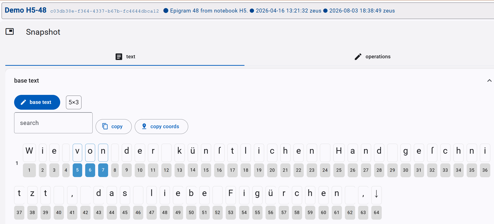
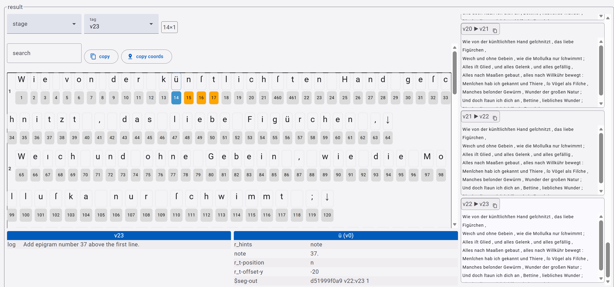

# Editor - Snapshot Part

The snapshot part is the core of the GVE edition and implements the [snapshot model](../model/snapshot.md).

Although the model is simple, the UI provides a lot of editing functions on top of it, grouped in 3 main sections:

- text tab: base text.
- operations tab: operations applied to the base text.
- snapshot rendition: visual rendition of the snapshot.

## Text Tab

### Text Tab - Base Text

The text tab contains the collapsible **base text section**, where you enter the base text, usually just once. So, this is usually collapsed to give more room to the UI.

When you create a new snapshot, the first thing you must do is setting the base text by clicking the _base text_ button in this section and then typing or pasting it in the popup.

>⚠️ WARNING: setting the base text has the effect of clearing all the operations! This is required, because all operations depend on it, and become meaningless once you change the base text. If you happen to find out that your base text needs some changes after you have entered operations, you can anyway copy them (with the Copy DSL operations button) and paste them back later (with the Add operations batch button); you will then have to adjust their coordinates according to your changes.

Once you set the base text, this gets displayed here character by character:

- each character gets a **numeric ID** (starting from 1) which uniquely identifies it within this snapshot. Numeric IDs are never reused: once an ID is assigned, is stays assigned to that specific character forever (in the context of this snapshot), even if an operation deletes them. The ID is displayed below each character.
- the end of each line is explicitly marked by a **line-feed** character (LF, represented with a down arrow). After this, the next line is displayed below the previous one. Each line is numbered for your convenience, starting from 1.
- you can type text in the **search box** to highlight all the matches in the displayed text.
- you can click a character to **select** it. Once this is done, you can Ctrl+click another character to select the whole span of characters from the first to the last clicked. In both cases, the current selection is displayed next to the search box, like `7x3`, where `7` is the ID of the first selected character and `3` is the length of the selected text span.
- the **copy button** allows you to copy the selected text.
- the **copy coords** button allows you to copy the coordinates of the selected text.

### Text Tab - Result

The result section contains all text alterations resulting from operations. Every operation gets an input text, and transforms or annotates it in some way, producing an output text.

The result shows a "map" of all the alterations to the right:

- each alteration is **labelled** with the ID of its input and output texts. For instance, `v0 ▶ v1` means that the input is `v0` (=the base text) and the output is `v1`.
- click the small **copy button** next to this label to copy the corresponding output text.
- click the text to see its **detail** in the result pane. The detail works much like the base text view: it displays the text character by character, with all the features already described above. Additionally, you can inspect features attached to each alteration text and each character in it. When you click a character, at the bottom you will see (if present):
  - at the left, all the global features attached to the text as a whole.
  - at the right, all the features attached to the character you clicked.
