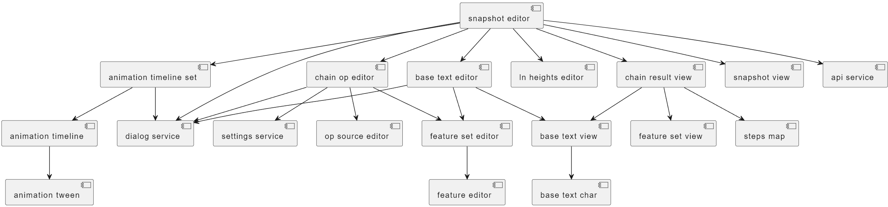

# Core Library

The `gve-core` Angular library contains core frontend components to be used by GVE client apps. As already remarked, the frontend UI for editing and visualizing snapshots is highly modular, and is built by aggregating many components together. These components are organized into software libraries.

The GVE core frontend software library contains all the components used for editing a snapshot in the context of an Angular-based web application, which in the case of GVE is represented by a [Cadmus](https://myrmex.github.io/overview/cadmus)-based application.

The diagram below represents the main components in this library and their relationships:

The top-level component here is the snapshot editor. This provides a complete UI for editing all the data contained by a snapshot, and usually is all what you need to integrate a full snapshot editor in an Angular application.

In turn, the snapshot editor is composed by a lot of other components, covering all the snapshot features.

- [VEdition guidelines](./guidelines.md)
- [editing snapshots](./editing-snapshots)
- [editing operations](./editing-operations)
- [editing features](./editing-features)
