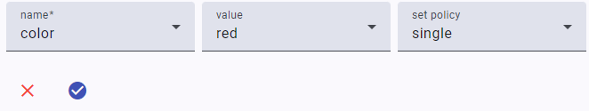
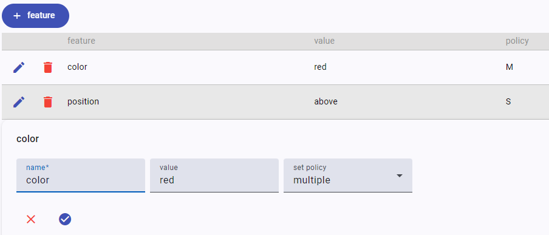

# Editing Features

Features are generic metadata essentially modeled as name=value pairs. Sets of these features are edited via a features set editor, which in turn uses a single feature editor to edit each feature in the set.

## Single Feature Editor

The single feature editor is used in the [features set editor](#features-set-editor). This UI allows editing a single feature in the following ways:

- by freely typing name and value.
- by selecting name from a list, while still freely typing value, if you want to limit the features to a predefined set.
- by selecting name from a list, and then value from a corresponding list, for those predefined features having a predefined set of values.

The feature editor contains 3 controls:

- `name`: the feature name.
- `value`: the feature value.
- `set policy`: the features set policy for this feature. This can be `single`, `multiple`, or `single first` (see the [features model](../model/textual.md#features) for more).

By default, you can just type whatever you want as a feature name and value. Anyway, if you rather prefer a closed taxonomy, the client code can customize the editor by passing preset names and values:

- when passing preset names, the name control will turn into a selection control. You will just have to pick an item from the list.
- preset values can be set for all the preset names, or for just a subset of them. This allows having some of the preset names with a free value, and others with a preset value you can pick from a list. In this example, the `color` feature has preset values, while the `size` feature has not.

To **test** the behavior of the component, you have a couple of checkboxes at the top of its test page:

- feature names: when checked, it reconfigures the component to use preset names.
- feature values: when checked, it reconfigures the component to use preset values (for `color` only).

Once you have finished editing, you can click the check button to save your changes. The test page will then show the received JSON code representing the edited feature.

## Features Set Editor

The features set editor is used to edit a set of features; in turn, it uses the [single feature editor](#single-feature-editor) to edit each feature in its set.

The editor shows the full list of its features in a table where each row is a feature. You can click the edit button to edit the feature, or the trash button to delete it. To add a new feature, just click the add feature button.

>Remember that if you add to the set a feature with single/single first policy and another feature with the same name is in the set, that feature will be replaced by the new one.

Optionally, you can use the filter at the top of the table (when present) to quickly filter the rows to match only those whose name includes what you type in it. The filter visibility is controlled by the filter treshold parameter: when it is 0, the filter is always visible; when -1, it is always invisible; otherwise, it gets visible when the number of features is greater than the specified threshold (the default being 5).

To **test** the behavior of the component, you have a couple of checkboxes at the top of its test page:

- feature names: when checked, it reconfigures the component to use preset names.
- feature values: when checked, it reconfigures the component to use preset values (for `color` only).
- filter treshold: the value for the filer treshold.

Whenever you change the set, the test page will show the received JSON code representing it.
