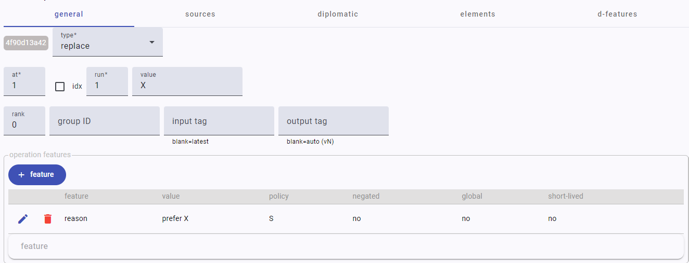
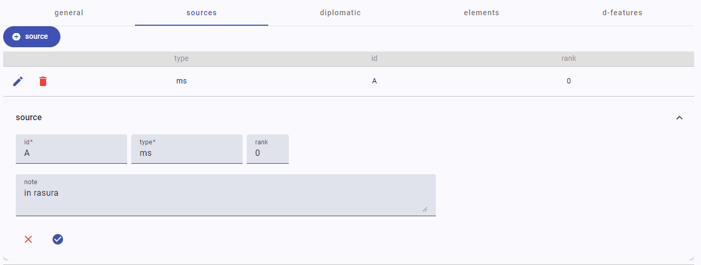
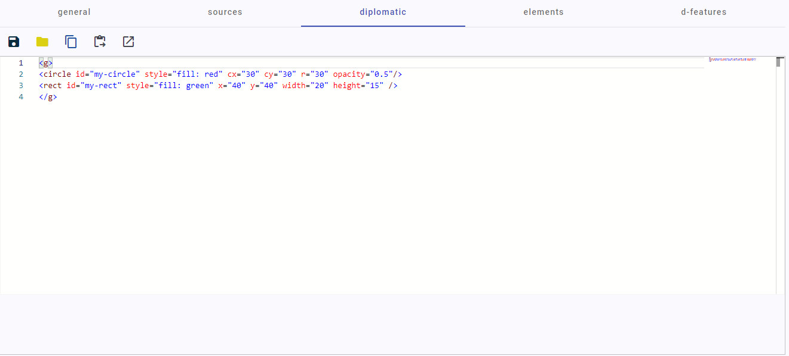
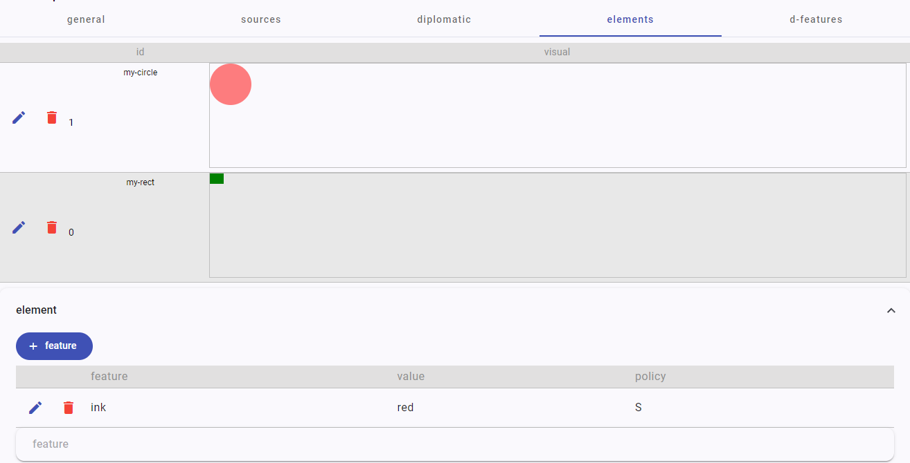
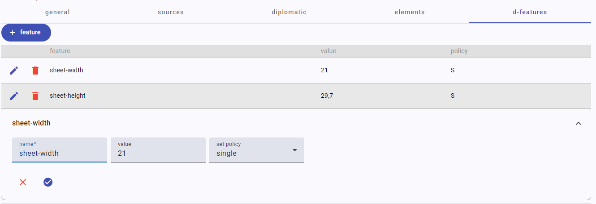

# Editing Operations

The operation editor is used to edit a single snapshot operation. Its UI is divided in 5 tabs:

- [Editing Operations](#editing-operations)
  - [General](#general)
  - [Sources](#sources)
  - [Diplomatic](#diplomatic)
  - [Elements](#elements)
  - [D-Features](#d-features)

## General

The general tab contains general metadata about the operation. An operation changes the received text, or only affects its metadata in the case of an annotate type.

- a 10-characters ID, automatically generated. This is not editable.
- the operation `type`: replace, delete, add-before, add-after, move-before, move-after, swap, or annotate. According to the type you select here the UI might slightly change (for instance, move and swap require an additional parameter).
- `at`: the coordinate of the first character targeted by the operation. In the base text, each character receives an ordinal number used as its ID (1=first, 2=second, 3=third...). Any character node added later will get the next available ordinal. You can refer to the base text view to get the coordinate. In some cases you might prefer to express this as a (zero-based) index, rather than using an ID. In this case, check the `idx` option next to it.

>The ordinal nature of the character IDs ensure that they represent the original ordering of the base text characters, which get a continuous sequence of numbers from 1 to N; and that any character node added later (by insertion or replacement) gets an ID which is granted to be greater than N. This also allows a predictable numbering scheme. Anyway, the order of the characters in the sequence is defined only by their links, and each version (in the technical sense of output) has its own links set.

- `run`: the count of characters targeted by the operation (1-N) starting from `at`. So, the minimum run value is 1. Usually, it refers to the extent of a word, but it can address sequences of any length.
- `rank`: a numeric value representing the certainty rank for this operation: 0=not specified, 1=most probable, 2=less probable, etc. Usually this stays at 0, unless you have to express a level of uncertainty in the interpretation represented by the operation.
- `group ID`: the ID of a group this operation belongs to. This is just a tag used to group operations into a higher conceptual unit, should this be required. In this case, just use an arbitrarily defined value for the group ID.

>Even though this is not a requirement, whenever dealing with arbitrary IDs it is recommended that you follow strict naming conventions. For instance, limit the characters to `a`-`z`, digits, underscore, and dashes, and avoid very long identifiers.

- `input tag`: the version tag for the input of this operation. Usually this is left blank, meaning that the last generated version in the operations sequence will be used as the input. If you need to branch the versions starting from a previous operation in the sequence, specify its tag here.
- `output tag`: the version tag for the output of this operation. In most cases this is left blank, which generates an automatic tag for the operation output with form `vN`, where `N` is an ordinal number. In practice, just leave this always blank.
- `features`: the features of this operation. Here you can add as many [features](usr-features) as you want. Operation features have a richer model, including not only name, value, and set policy, but also the following properties:
  - `negated`: a negated feature means that any existing feature with the same name should be removed. In other terms, this is used to delete an existing feature from the target set if present.
  - `global`: a boolean value indicating whether this feature globally refers to the operation context as a whole, rather than to its affected nodes. When a feature isn't global, it will be assigned to the nodes targeted by its operation, rather than to the whole text features set. As operations are executed, they accumulate on nodes and/or the whole text, unless their set policy dictates a different behavior. In the end, this will produce a rich set of highly granular metadata, mapped either to specific portions of the text or to the text as a whole.
  - `short-lived`: a boolean value indicating whether this instance is short-lived. When true, this means that the feature will be removed on the next update, i.e. when the next operation in the sequence is executed.

## Sources

The sources tab contains data about the sources of this operation.

A source might be a document, a person, or any other entity regarded as its source. For instance, if Schiller makes an annotation represented by an operation, the source of this operation will be Schiller. An operation can have zero or more sources.

Each source has:

- `id`: an arbitrary string used to identify the source.
- `type`: a string defining the source type (e.g. document, person, etc.).
- `rank`: a numeric value representing the certainty rank for the identification of this source, used like the operation's rank (0=not specified, 1=most probable, 2=less probable, etc).
- `note`: a free text note.

## Diplomatic

The diplomatic tab refers to the visuals connected to the operation. For instance, a stroke on a letter might be the visual representation corresponding to a delete operation.

Operation visuals can be defined by any geometrical shape and/or text on top of the carrier surface. Technically, they are represented by a single [SVG](https://developer.mozilla.org/en-US/docs/Web/SVG) `g` (=group) element, which can include any number and type of SVG descendant elements. So here you can enter any valid SVG code, provided that it has a single `g` element as its unique root element.

You can add an `id` attribute to any of these SVG elements, if you want to target them for animations or for linking features to them.

Also, by convention you can add a `_t` suffix to any `id` whenever you want to add animations targeting the visual. When you add this suffix, the corresponding visual opacity is programmatically set to 0 (=transparent) when the software builds the SVG code for the snapshot viewer. This is because the visual is meant to be made visible by some animation, which implies the requirement to start as transparent.

>Using this approach avoids the risk of an unwanted effect due to timing issues in animating objects: should you start with a visible visual, and then make it invisible to animate its entrance, this might produce a so-called [FOUC effect](https://en.wikipedia.org/wiki/Flash_of_unstyled_content), where the object appears for an instant before being made invisible. So, whenever you want to animate the entrance of a visual, just ensure you append the "transparent" `_t` suffix to it and in your animation assume that it will start with its `opacity`=0.

A toolbar at the top of the SVG code editor contains these commands:

- `save`: save the SVG code into a file.
- `load`: load SVG code from a file.
- `copy`: copy the SVG code into the clipboard.
- `set`: set the SVG code from the clipboard.
- `open editor`: open a designated external graphical editor for SVG. The default editor is <https://editor.method.ac/>, but this can be changed and is a configuration parameter. In the case of this editor, you can copy the existing SVG code if any, paste it into the external editor, draw as desired, and copy back the resulting code. Then, use the set button to set the SVG code from the clipboard.

## Elements

The elements tab is dependent from the [diplomatic tab](#diplomatic), and lists all the SVG elements having an `id` attribute, so that you can attach to them any number of [features](usr-features). This way, you can get maximum metadata granularity also on the visuals side.

- to add or edit features to an element, click its pen button.
- to remove all the features from an element, click the delete button.

You are free to decide for the level of abstraction attached to your visual representation. Visuals can be a highly surrogate and schematic representation, or try to be as faithful as possible to the source image. In the latter case, you might even want to show that image as the background of the geometric representation of visuals.

Note that in most cases visuals should be representing non-textual entities, like strokes, shapes, and drawings of any sort. When the operation visuals include text, because this is being inserted or replaced, you do not need to add text elements to represent it.

Visuals representing texts, i.e. characters, are handled at the text layer, and become part of the output text. So, they will be part of the text passed to the snapshot viewer, just like any other character from the base text. Anyway, you can displace the newly added characters so that they appear in the desired location. For instance, say your autograph text shows a letter X above a letter Y, meant to replace it. In this case, this newly introduced character node, X, will take the place of Y unless you displace it above.

To displace the character(s) introduced by an operation, you can add features to the operation named `x` and `y` with its desired coordinates. These coordinates will be used by the snapshot viewer to anchor the newly introduced text at the starting point they define.

>Similarly, reserved feature names besides `x` and `y` are also `class` and `style`, which add the corresponding attributes to the target element in the snapshot viewer.

## D-Features

The diplomatic features tab contains a set of [features](usr-features) assigned to the diplomatic description of the snapshot as a whole. So, any diplomatic feature not linked to any specific visual element (e.g. a sheet width or height) should go here.
