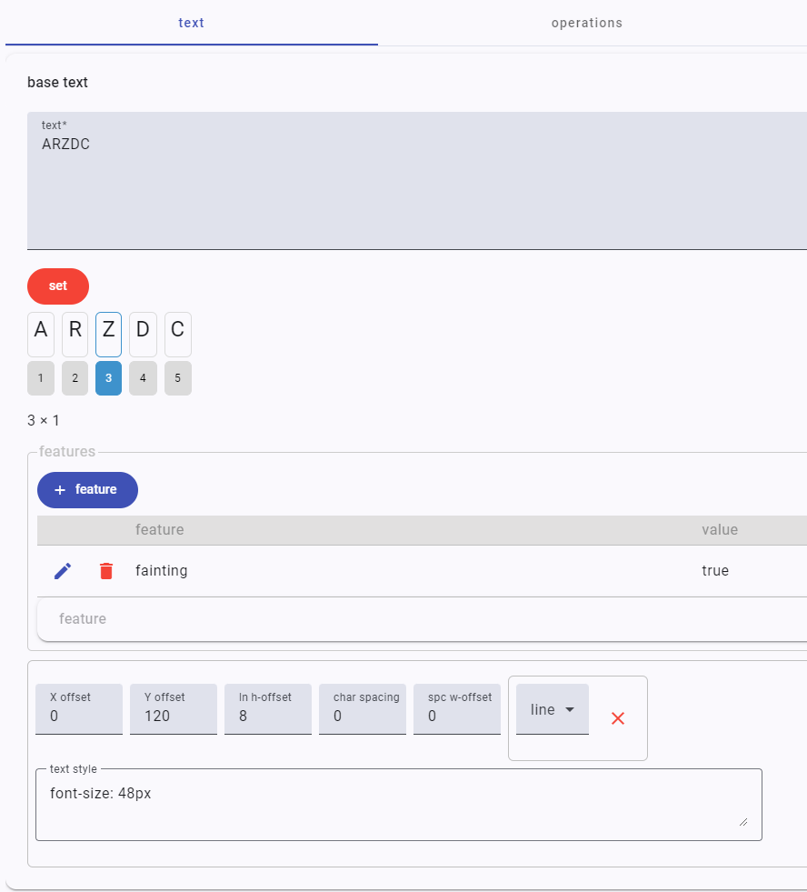
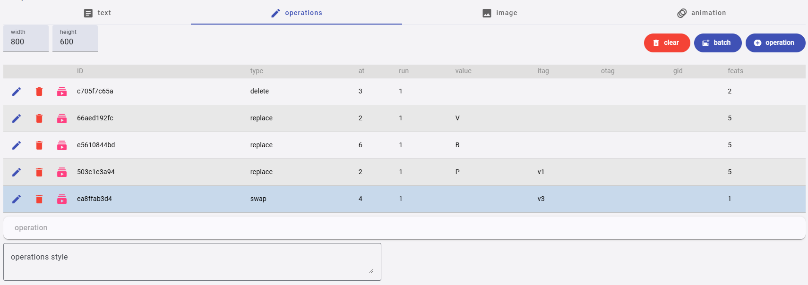
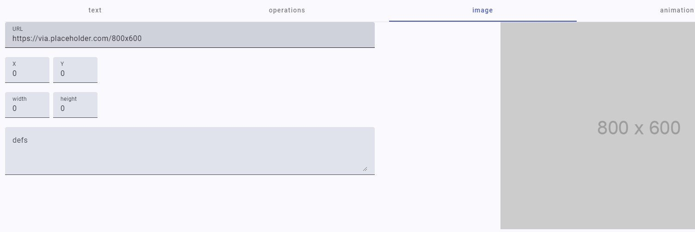
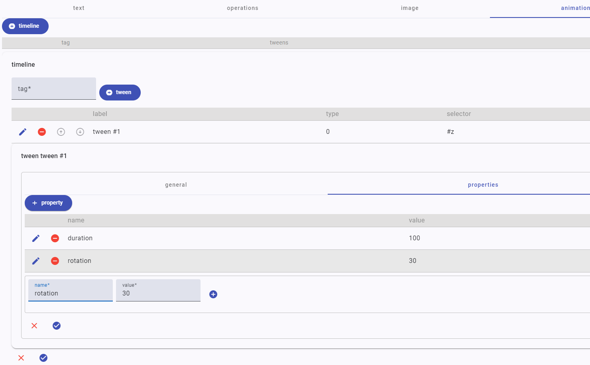

# Editing Snapshots

The snapshot editor is used to fully edit a snapshot, and as such it's the topmost UI component in its library. All the other components in the library are either directly or indirectly used by it. Essentially, it allows you to edit all the parts of a `Snapshot` object.

In general, to create a snapshot you follow these steps:

1. examine and interpret your source, so you can come up with a text to start with (the base text), and any number of operations changing it into all the versions you define in your interpretation of their annotations.
2. type or paste the multiline text to be used as the base text.
3. optionally, provide an image to use as the snapshot background. In this case, you would typically add visuals which overlap it.
4. optionally, if needed add features to one or more characters of the base text.
5. describe each single operation on the base text leading to a change in the text.
6. optionally, describe the visuals of each operation in its corresponding diplomatic sections in the editor. You might do this from scratch, or import an SVG drawing from some third party SVG editor.
7. optionally, define the animations for some or all of the versions.

In defining operations, often changes on text as deduced from the carrier can be interpreted in a **linear** way, so that you apply operation 1 to the base text, leading to version 1; then, apply another operation 2 to the output (version 1), leading to version 2; and so forth, like here:

```txt
v0 -> v1 -> v2 -> v3 ...
```

Anyway, it might also happen that your interpretation ends with **branching**, so that at a certain point the text output by an operation might be the input of two different branches, which change it in alternative ways. In this case, you will just have to change the default input version tag for your branching operation: rather than just continuing from the previous operation in a linear way, you will start from any of the versions generated previously:

```txt
v0 -> v1 -> v2 -> v3 ...
            v2 -> v4 ...
```

In this example, the operation generating v4 does not get its input from `v3` (which would be the default), but rather from `v2`, thus creating a new branch. So, there is no limit to the complexity of branching, as far as it's just represented by a different input tag for the corresponding operation starting a new branch.

Also notice that, while technically each change in (what we regard as a unique) text produces a new version of it (i.e. simply a different output), not all the versions are eligible to represent what we define as a **staged version** of the text in a more philological meaning. Rather, the various changes produced by each operation get accumulated like steps towards one of these staged versions.

For purely practical reasons, in the editor we just use the term "version" for the output of each operation, which will be automatically tagged as `v1`, `v2`, etc. Yet, you can add the specific `version` feature (with your own tag) to the operation whose output is to be regarded as a specific staged version of the text. So for instance the version "v3" (which is just the output of its operation) might be regarded as the staged version "alpha". So, in your interpretation you are just setting the path towards staged versions by defining sequences of one or more operations changing the text.

The UI is articulated in 4 tabs:

- [Editing Snapshots](#editing-snapshots)
  - [Text](#text)
  - [Operations](#operations)
  - [Image](#image)
  - [Animation](#animation)
    - [Special Properties](#special-properties)
    - [Easing](#easing)

## Text

The text tab contains the **base text**. You typically set this once, and then add the other data of the snapshot. Remember that the snapshot provides annotations which can be interpreted as operations changing the base text, which is just what happens to be the starting point of our digital representation. So, "base text" here has no genetic or philological implication; it is just a practical device in our model, i.e. our starting point, even though often it corresponds to some evidence in the carrier (e.g. a text laid on top of the same line, with interlinear annotations).

>⚠️ It is not advisable to change the base text once you have started adding metadata on top of it, even if a patch function can be later added to the editor to help you in such cases. If you change the base text, all the annotations will be removed, as they make sense only when referred to a specific base text. Anyway, changing a base text later is a rare event if occurring at all, as setting the base text is the first, foundational act for defining a snapshot, and all what comes later is just based on this first state of the text.



To set the text, just type or paste it, and click the set button. Once you have done it, the text will be displayed character by character in an interactive diagram, where you can click each single character to get its ordinal-based coordinate, or add [features](usr-features) to it.

>As the text is split into its characters, please ensure you remove any unwanted artifacts from it, like sequences of more than a single space, etc. Also, do not add empty lines or use spaces to represent visual aspects, as these belong to another level of our representation and we should not misuse characters for the sake of encoding some specific appearance.

In the characters list, you can also click to **select** one character, and then control+click to select the last character of a range; in this case, the coordinates of the selected range will be shown. This is useful when you want to quickly get the coordinates of the text targeted by operations.

The text tab also allows to change some **general metadata** for the text:

- an open set of [features](usr-features).
- a set of visualization metadata for its preview:
  - `X-offset`: the optional offset to add to the X coordinate of the text origin.
  - `Y-offset`: the optional offset to add to the Y coordinate of the text origin.
  - `ln H-offset`: the optional offset to add to each calculated line height. You can set this if you want to get more default vertical space between the base text lines.
  - `char spacing`: the optional offset to add to each calculated character width. You can set this if you want to get more default horizontal space between each character of the base text.
  - `spc W-offset`: the optional offset to add to each calculated space width. The width of a space character is automatically calculated according to the default size of the base text; should you want to customize it, you can set this offset accordingly.
  - `min. line heights`: the optional minimum line height of any specific line in the base text. When you just want a constant line height, leave this option out. When instead you want to set the minimum height of one or more specific lines, pick the line number to change, and enter its height. You can use the red `X` button to remove all the custom heights at once, or set to 0 a line height to remove its customization from the set.
  - `text style`: the CSS code representing the _inline_ style to be applied to the text root `g` element. The content of this field will be output in the `style` attribute of that `g` element.

## Operations

The operations tab contains the most relevant data of a snapshot, i.e. the operations which change its text, starting from the base text and then following one or more paths to generate all the versions for it.



The tab contains a list of operations, in their execution order. For each operation, it shows:

- the operation ID. This is a unique code generated automatically.
- the operation type.
- the coordinates of the target nodes: `at`=first node, `run`=count of nodes starting from `at`.
- the text value associated to the operation, if any. For instance, an insert operation will have here the value to be inserted.
- the tags of the versions to be used as the operation input (`itag`) and output (`otag`). In real world scenarios, you will occasionally have to change the input tag when you are branching variants, but you will never change the output tag.
- the group ID (`gid`) of the operation. This is for logically grouping operations into a semantically unique set, but has no practical effect on the chain.
- the count of features (`feats`) associated to the operation.

Using the **buttons** next to each operation, you can:

- [edit the operation](usr-operation).
- delete the operation.
- run the operations on the base text up to the current operation to see the result in the preview panel at the bottom of the snapshot editor.

Below the operations list a **style** text box allows you to enter the CSS code for the inline style to assign to the operations root `g` element. This is rarely used, but can be handy when you want to set some style shared by all the operations at once.

In some cases, when starting with a new snapshot you might want to add operations in **batch**. This can be much quicker than editing each operation at hand, even if it does not allow to fully define all the possible metadata of an operation (like its visuals). Anyway, this is a handy way to quickly fill the operations list starting from a simple text, either you type or paste it.

To do this, just type or paste a text having one line per operation, following the specific syntax designed for them, which is summarized on the right, and hit the `batch add` button. A `clear` button also allows you to remove _all_ the operations in the snapshot, should you want to quickly re-add them in a batch. This way, you can enter your text representing the batch, generate the operations from it, and quickly fix any errors and repeat until you are satisfied with the result.

Once you have added the operations in a batch, you can [edit](usr-operation) each of them to add or refine its data.

## Image

The image tab allows you to optionally define an image to be displayed behind your snapshot visuals. Typically this might be a properly sized image of the snapshot's carrier, like a handwritten sheet of paper, so you can see it as a watermark reference behind the operations visuals.



Available data are:

- `URL`: the image URL. A preview of the image will be shown on the right (unless of course the URL is not accessible).
- the optional canvas to fit the image into, defined by `X`, `Y`, `width` and `height`. If not specified (=everything is 0), the image will have the same size of the SVG container, and placed at its top-left corner (0,0).
- the optional SVG `defs` code to be used in the view. This usually is an advanced SVG feature you might use to define reusable SVG geometries for your operation visuals, like e.g. an arrow which is drawn many times in the same way. In most cases you can leave this blank.

## Animation

The animation tab contains the optional animation timeline(s) you might want to add to your snapshot versions. You can define a timeline for each generated text version, using the version ID as its tag. Each timeline includes one or more tweens. The model here follows [GSAP documentation](https://gsap.com/docs/v3/GSAP).



**Timelines** are used to create easily adjustable, resilient sequences of animations. When you add tweens to a timeline, by default they'll play _one after another_, in the _order they were added_. Timelines share most of the same special properties that tweens have like `repeat` and `delay` which allow you to control the entire sequence of animations as a whole.

A **tween** has:

- `label`: a human-friendly label.
- `type`: one of `to`, `from`, `fromTo`. In most cases you will be using `to`, which starts at the element's current state, and animates to the values defined in the tween; `from` is like a backwards `to`, animating from the tween values back to the element's current state; `fromTo` instead defines both the start and end values.
- `position`: an optional position. The [position parameter](https://gsap.com/resources/position-parameter/) is the secret to building sequences with precise timing. There are a variety of position parameters that we can use to position tweens pretty much anywhere. The most commonly used position parameters are:
  - absolute time (seconds) from the start of the timeline: `tl.to(".class", {x: 100}, 3);`.
  - gap: `tl.to(".class", {x: 100}, "+=1");` (seconds); `tl.to(".class", {x: 100}, "+=50%");` (percent of total duration).
  - overlap: `tl.to(".class", {x: 100}, "-=1");` (seconds); `tl.to(".class", {x: 100}, "-=25%");` (percent of total duration).
- `selector`: the selector for the tween's target. Typically, this is an element ID, but any valid CSS selector can be used.
- `note`: an optional note about this tween. You might want to use this to describe your tween effect using words.
- `properties`: the properties changed by the tween, or special GSAP properties controlling the animation.  Almost any property can be animated: transforms, colors, padding, border radius, etc. Just remember to camel-case the properties - e.g. `background-color` becomes `backgroundColor`.

>💡 Even if you can animate virtually everything, choose your target properties wisely. When possible use transforms and opacity for animation rather than layout properties like "top", "left" or "margin". Transforms  can be used to move your elements around, scale them up and spin them around; transforms and opacity are also very performant, because they don't affect layout.

In GSAP there are shortcuts for transforms:

- `transform: translateX(N)` = `x:N` or `xPercent`
- `transform: translateY(N)` = `y:N` or `yPercent`
- `transform: scale(N)` = `scale:N`; same for `scaleX`, `scaleY`.
- `transform: rotate(N)` = `rotation:N`
- `transform: skew(N)` = `skew:N`
- `transform-origin: POS N` = `transformOrigin: "POS N"`

Further, some commonly used properties are:

- `opacity`
- `autoAlpha` (shortcut for opacity and visibility)
- `duration`
- `repeat` (-1 for infinite)
- `delay`
- `yoyo` (boolean)

### Special Properties

The most common [special properties](https://gsap.com/docs/v3/GSAP/Tween) are:

- `duration`: duration of animation (seconds; default 0.5).
- `delay`: amount of delay before the animation should begin (seconds). You can also use `repeatDelay` to add a delay to the start of any repeat iterations.
- `repeat`: how many times the animation should repeat (-1=infinite repeat). Repeat is often paired with `yoyo` in order to reverse the direction each cycle.
- `yoyo`: if `true`, every other repeat the tween will run in the opposite direction (like a yoyo).
- `stagger`: time (in seconds) between the start of each target's animation (if multiple targets are provided). To get [more control](https://gsap.com/resources/getting-started/Staggers), wrap things in a configuration object which can have more properties in addition to most of the special properties that tweens have.
- `ease`: controls the rate of change during the animation, like the motion's "personality" or feel. Default: `power1.out`.
- `onComplete`: a function that runs when the animation completes.

### Easing

Under the hood, the "ease" (special property `ease`) is a mathematical calculation that controls the rate of change during a tween. Use the [ease visualizer](https://gsap.com/resources/getting-started/Easing) to pick your own.

For most eases you'll be able to specify a type. There are three types of ease: `in`, `out` and `inOut`. These control the momentum over the course of the ease. In practice, they mark the slower part, e.g.:

- `power1.in`: start slow and end faster, like a heavy object falling.
- `power1.out`: start fast and end slower, like a rolling ball slowly coming to a stop.
- `power1.inOut`: start slow and end slow, like a car accelerating and decelerating.
