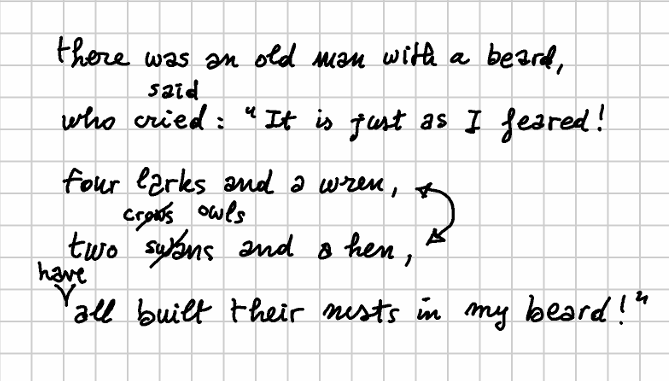
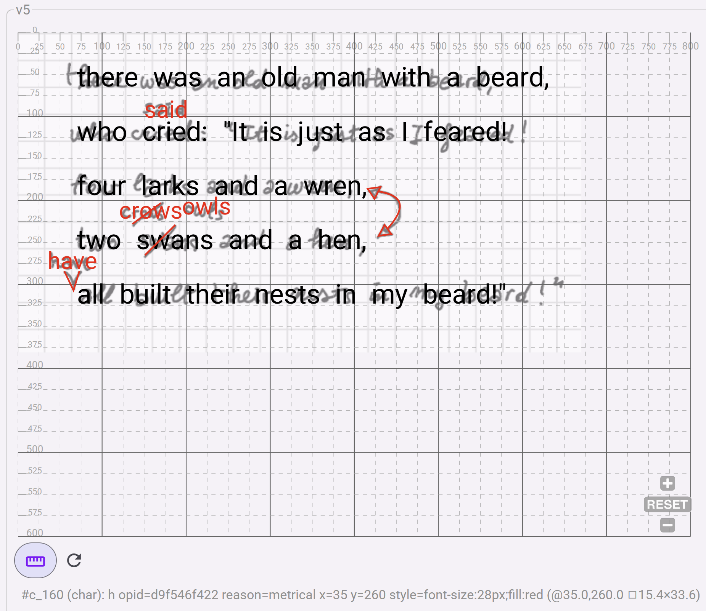

# Exercise - Editing Snapshot

- [Exercise - Editing Snapshot](#exercise---editing-snapshot)
  - [Prerequisites](#prerequisites)
  - [First Run](#first-run)
  - [Exploring UI](#exploring-ui)
    - [Animations](#animations)
    - [Features](#features)
    - [Base Text](#base-text)
    - [Snapshot](#snapshot)
  - [Create a Snapshot](#create-a-snapshot)
    - [Textual Data](#textual-data)
    - [Visual Data](#visual-data)

This short exercise will guide you through the creation of a simple mock snapshot. This is drawn from the [snapshot example](../model/sample-limerick) illustrated about modeling.



## Prerequisites

You should have a modern computer with Windows, MacOS or Linux. Given that in this exercise it will work both as a client and as a server, you will need a decent amount of RAM (8 GB or more) for a better experience.

You need to install this software on your computer:

- [Docker](https://vedph.github.io/cadmus-doc/deploy/docker.html): the containerization infrastructure used to safely and quickly run the software in isolation without any installation required.
- [Inkscape](https://inkscape.org/): an SVG editor used to draw on top of a facsimile when providing visuals. This is required only if you want to add visuals to the snapshot. Of course, you are free to use any other SVG editor of your choice.

## First Run

- 📖 [Reference Documentation](https://vedph.github.io/gve-doc)

1. **download script**: download in some folder the [Docker compose script](https://github.com/vedph/gve-shell/blob/master/docker-compose.yml) for GVE shell. This is not the editor proper, but the shell UI used to build and test it; it will provide us with a full editing UI though, and many pages for testing individual components, without additional infrastructures.
2. **open a terminal** window in the folder where you downloaded the script.
3. **start the containers**: run one of these commands according to your OS and wait until the running log entries stop (the first time you do this it will also download the required Docker images, so be sure you have a working connection):

    ```sh
    # Windows:
    docker compose up

    # Linux/MacOS:
    sudo docker compose up
    ```

4. **open your browser** at <http://localhost:4200>. You should see the homepage (no login is required here).

- **stopping containers**: When you are done, hit CTRL+C to break out of the running container in the terminal window, or stop the containers using the Docker Desktop UI. You will then be able to restart the containers either from Docker Dektop or by entering the above command again.
- **removing containers**: if you want to remove the GVE containers rather than just stop them, use this command from the same directory:

```sh
# Windows:
docker compose down

# Linux/MacOS:
sudo docker compose down
```

## Exploring UI

This UI provides pages to test each component in isolation.

For a quick start you can just open the `Demo/Snapshot editor` page, but you are free to explore. You will quickly realize the modular nature of the UI, where each single piece of UI is reused in a bigger one, up to the snapshot editor.

The snapshot editor in turn is integrated in a Cadmus editor web app, which provides all the infrastructure (data storage, user authentication, etc.) and more editor pages for other entities (those above the snapshot in the [models hierarchy](https://vedph.github.io/gve-doc/model/hierarchy.html)).

### Animations

- **animation/tween**: a tween editor. The tween is used to change some values of HTML elements representing the snapshot visuals. For instance, you might want to make an element fade in, change color, move, etc. Usually an animation implies changing many properties, each using a tween. This editor is thus used in the animation editor for each included tween.
- **animation/timeline**: a timeline editor. The timeline in an animation orchestrates all the changes, and thus contains any number of tweens.
- **animation/timelines set**: an editor for a set of timelines. A snapshot can include many timelines, one per text version you want to animate.

Thus, for animations the top-level component is the timelines set editor; this uses a timeline editor for each timeline in the set, which in turn uses a tween editor for each tween in the timeline.

### Features

- **feature editor**: a feature editor. Features are essentially metadata in a simple name=value form, with some additional properties. Many entities in the snapshot model can contain features, and wherever we need to edit each feature we use this component.
- **features set editor**: editor for a set of features. This uses the feature editor to edit each feature in the set.

### Base Text

- **base text viewer**: this component shows a base text character by character, in an interactive UI. Clicking on any character is a quick way to get its coordinates.
- **operation editor**: editor for a single operation. This can be used to get a quick overview of an operation's model. You will find that most of its data are pre-populated for this purpose, similarly to other demo pages.

### Snapshot

- **snapshot view**: component used to view a snapshot. This helps you build the snapshot code and then uses the snapshot viewer component to show it. The snapshot viewer component is integrated into this shell but lives in an independent software library, as it is designed to be reused even outside the editor. For this reason it does not use Angular, like all the other shell components, but a framework-independent technology (it's just a standard HTML web component).
- **snapshot editor**: the full-fledged snapshot editor. This uses all the components present in the other pages of the shell, and it is the topmost editor which gets directly integrated into Cadmus. This is the editor you will be playing with in this exercise.

## Create a Snapshot

We will be using this source text: <http://purl.flvc.org/fsu/fd/FSULearBook_012> and a mock autograph.

⚠️ WARNING: this being a demo UI, no data will be saved, so be sure to stay on the snapshot editor page once entered it. If instead you want to restart from scratch, just reload the current page. This app is used for demonstration and testing purposes only. If you want to save the data you enter, use the [Docker compose script for the Cadmus editor](https://github.com/vedph/cadmus-gve-app/blob/master/docker-compose.yml) instead.

### Textual Data

▶️ 1. open the **snapshot editor** test page from menu `Demo/Snapshot editor`.

▶️ 2. click on the `Image` tab and **add the facsimile image** [limerick.png](https://raw.githubusercontent.com/vedph/gve-doc/main/model/img/limerick.png) from URL <https://raw.githubusercontent.com/vedph/gve-doc/main/model/img/limerick.png> as the background image (facsimile) for the snapshot, with these parameters (reset image metadata before picking it and size will be automatically filled: there is a red `X` button for this purpose):

- width = 670
- height = 381
- opacity = 0.5 (you can use arrow keys for finer control). Making the facsimile image semitransparent like this allows you to focus on the edited parts of the snapshot, while still seeing the facsimile like a watermark.

▶️ 3. click on the `Text` tab, and expand `base text` on the top. Enter these **base text metadata**:

- text style: `font-size: 32px`. This is the CSS style to use for the base text.
- X offset = `70`. This is the X coordinate to start displaying the base text from.
- Y offset = `40`. This is the Y coordinate to start displaying the base text from.
- ln h-offset = `26`. This is the offset added to each text line's height; in practice, this defines the interlinear distance.

💡 Adjusting these parameters allow you to have a base text approximately overlaid on top of the snapshot, when this has some regularity like in this example.

▶️ 4. click the `base text` button, delete the existing text, and paste this **base text** instead, then clicking the `set` button:

```txt
there was an old man with a beard,
who cried: "It is just as I feared!
four larks and a wren,
two swans and a hen,
all built their nests in my beard!"
```

💡 The text will now appear below. Also, the **snapshot text view** will appear on top of the facsimile image. You can click on any facsimile character to select it and see its coordinates above, next to the `base text` button. To select a range, click the first character and CTRL+click the last one.

💡 The **snapshot view** will show the base text on top of the facsimile image. If you hover on the text in the view, you will see metadata about each character just below the view. This shows you how the view can be used in highly interactive UIs. Typically you will see here the type of the hovered element (currently you just have character types), its text value, the coordinates of its top-left corner, and the size of its bounding box. You can toggle rulers, and zoom and pan the view.

▶️ 5. click on the `operations` tab and on the `batch` button to **add operations**. Just copy-paste this text, where each line represents an operation, and click the `batch add` button:

```txt
40x5="said" [*log="said for cried" x="150" y="80" style="font-size:28px;fill:red"]
99x5="crows" [*log="crows for swans" x="120" y="200" style="font-size:28px;fill:red"]
116+["have " [*log="insert have" *version^="alpha" reason="metrical" x="35" y="260" style="font-size:28px;fill:red"]
72x23<>95x21  [*log="swap verses"]
155x5="owls" [*log="owls for crows" *version^="beta" x="195" y="195" style="font-size:28px;fill:red"]
```

>Of course you could also add one operation at a time using the UI, and filling its fields accordingly. This is just a quicker way to enter essential data about operations. It also allows you to use just plain text, entering it in any device and software, to jot down your notes about an autograph, and later quickly insert them into this structured model. All what you need is the base text, and a text representing operations. Anyway, not all the parts of the operation models are covered by their textual representation, and for them you will need to edit operations in the UI. For instance this is true for the visuals attached to each operation, or for other more specialized metadata, which would not make sense to include in a compact and manageable textual representation.

💡 This will fill the list of snapshot operations, each with its own auto-generated ID. Also, all the operations are executed starting from the base text, and the output of each operation (a "version") is shown below the list in an interactive view. Here you can click on each version to see its text and its metadata.

For instance, if you click on `v0>v1` at the right edge you will look at the output of the first operation, replacing "cried" with "said". Mind the "said" characters: their numeric ID is much bigger than that of the surrounding characters, as it was serially generated from the whole set of characters in the text.

Also, if you click on "s" you will look at the metadata for the version as a whole (left), and for that specific character (right). In this case, the "s" character has `opid` (ID of the operation which added it to the set of character nodes), `x` and `y` (coordinates), and `style`. The version just has a `log` metadatum used to trace the operations execution. These metadata are injected into the output text by the operation itself. Thus, an operation not only generates text, but also its metadata, at any level of granularity.

You can click on each generated version to follow our hypothetical reconstruction of the author's creative process step by step, as defined by our operations. You will see each version in its full details, with all its metadata, walking across the path which leads from the base text to its final version. If you keep an eye on the snapshot view, you will see the text added by each operation appear in red, at the position specified by the operation itself.

>To keep things simple, in this exercise we have reconstructed a linear evolution: the input of each operation is directly the output of the previous one (the first operation input always being of course the base text, which by definition is the first input). That's the default, so we say nothing about this in the DSL text. Anyway, you are free to construct complex branching trees of transformations by just specifying a different input for any operation (except of course the first one, always fed by the base text). See the [mock example](../model/sample-arzdc) for a simple illustration of branching.

### Visual Data

Let's show how we can draw visuals on top of a facsimile image. If you want to directly skip to data entry using an already-made image, goto step 6. The first steps show you how to draw on top of your facsimile; for them, you will need to download the [mock facsimile image](https://github.com/vedph/gve-doc/blob/main/model/img/limerick.png).

▶️ 1. **adjust image size**: open [limerick.png](limerick.png) in any editor like the online [Photopea](https://www.photopea.com/), or the downloadable [Krita](https://krita.org/en), [GIMP](https://www.gimp.org/), etc. Any image editor, even the smaller ones like [Paint.NET](https://www.getpaint.net/index.html), will be enough. Look at the image properties to get its exact pixel size and resolution. It is suggested that you change the resolution to a typical screen based value, like 96. Ensure that this is the image resolution, and save a copy of it. You should now have a 670x381 image with a 96 pixels/inch resolution.

▶️ 2. **open Inkscape** and create a new image. Under `File/Document Properties` set the document format to `Custom`, specifying the width (670) and height (381) of your image, and using pixels as the unit. Also ensure that scale is equal to 1, as we do not want any scaling. The default export resolution for Inkscape is 96, so you don't need to change this (otherwise, you can change it from `Preferences` under `Default export resolution`).

▶️ 3. **import the facsimile image** in Inkscape with `File/Import` and align its top-left corner to the document by just setting its X and Y coordinates to 0.

▶️ 4. **draw** whatever shapes you want on top of the image to represent all the visuals you are interested in. You are not required to draw an exact copy of the underlying visuals; you can make any surrogate useful for your purposes. Even a mouse can be used; if you have a pen to draw on your screen of course it will be easier, especially if you want to create a very similar visual. If you haven't the luxury of a pen, it is probably best to use Inkscape tools like the pen tool, which draws straight lines or Bezier curves, rather than the freehand tool. This has also the advantage of creating simpler SVG shapes or paths.

>💡 I also suggest to use the `Object/Properties` window to assign an ID to each drawing. This will make it easier to identify drawings in the generated SVG code. To do this, just click on the object and select the menu command. Enter your data, and click the `Set` button to apply them.

▶️ 5. **save** the SVG image. If you open it with a text editor, you will see something like this:

```xml
<path style="fill:none;stroke:#ff0000;stroke-width:2" d="m 436.87311,229.20191 8.32819,11.30254 -15.46663,2.37946 z" id="arrow-cap-2" />
<path style="fill:none;stroke:#ff0000;stroke-width:2" d="m 55.32291,284.34786 11.8974,23.19993 7.13844,-23.19993" id="v-bar" />
<path style="fill:none;stroke:#ff0000;stroke-width:2" d="M 424.73718,198.09171 416.409,186.78918 431.87562,184.4097 Z" id="arrow-cap-1" />
<path style="fill:none;stroke:#ff0000;stroke-width:2" d="m 429.46998,189.91743 c 13.67069,3.57541 43.11525,8.62305 11.98814,44.16684" id="arrow-line" />
<path style="fill:none;stroke:#ff0000;stroke-width:2" d="m 136.8201,228.43008 34.50246,-25.57941" id="crows-bar" />
<path style="fill:none;stroke:#ff0000;stroke-width:2" d="m 151.09698,265.90689 36.28707,-36.28707" id="swans-bar" />
```

If you want a shorter SVG, in most cases you can drop the decimal digits and just use integers; but of course, to the machine this makes no difference. The operation editor has a _remove decimals_ button used right for this purpose.

▶️ 6. **add operation visuals**: edit each operation from 2 to 5, adding to each its visuals by copy-pasting them from the saved SVG image (here I reduced the decimals to make this more compact and readable). For each operation:

1. click its pen button to edit it.
2. open its `diplomatic` tab.
3. copy-paste the corresponding SVG code into it.
4. click the `wrap code in group` button (the rightmost button in the toolbar above the code) to wrap the SVG code into a group (`g`) element. This is a requirement, i.e. the SVG code in the operation must be rooted at a single `g` element.
5. click the `Save` button to save the operation. You will see its visuals appear on the snapshot view.

```xml
<!-- operation 2 (replace swans with crows) -->
<path style="fill:none;stroke:#ff0000;stroke-width:2" d="m 151,265 36,-36" id="swans-bar" />
<!-- operation 3 (insert have) -->
<path style="fill:none;stroke:#ff0000;stroke-width:2" d="m 55,284 11,23 7,-23" id="v-bar" />
<!-- operation 4 (swap verses) -->
<path style="fill:none;stroke:#ff0000;stroke-width:2" d="M 424,198 416,186 431,184 Z" id="arrow-cap-1" />
<path style="fill:none;stroke:#ff0000;stroke-width:2" d="m 429,189 c 13,3 43,8 11,44" id="arrow-line" />
<path style="fill:none;stroke:#ff0000;stroke-width:2" d="m 436,229 8,11 -15,2 z" id="arrow-cap-2" />
<!-- operation 5 (replace crows with owls) -->
<path style="fill:none;stroke:#ff0000;stroke-width:2" d="m 136,228 34,-25" id="crows-bar" />
```

💡 Note that here we are just pasting the geometries representing the visuals for each operation having one; that's why we start from operation 2: operation 1 has no additional visual hints, but just a new text on top of the original one, suggesting maybe a more doubtful replacement by the author. We might add more diplomatic metadata as additional _features_ at various levels of granularity.

For instance, we might add a _diplomatic feature_ referred to the carrier as a whole, like a sheet size; or we might add a diplomatic feature referred to each arbitrarily selected portion of geometries building up our visuals. Say that the swap hint, visually represented by a curve with two arrow caps, was drawn with a different ink; or with a different tool, like a pencil instead of a pen. In this case, we are free to attach to it a feature like `ink=blue`, or `tool=pencil`. There is no limit to the features we can attach, except when you explicitly define some taxonomy for them.

There is no limit to the _granularity_ of such features, too, because we could attach them even to a sub-portion of the visuals of a single operation. For instance, should one of the arrow caps be drawn with a pencil while the rest was drawn with a pen, we are free to attach features to just that arrow cap, and no other portion of the curved double edged arrow. This is accomplished by just adding an `id` attribute to the geometry element you want to attach features to; once this is done, the editor UI will show you a visual list of all the geometries identified in this way, and let you attach to them any number and type of features.

So, just right operations can inject metadata to any portion of a text, up to the atomic level of a single character, they can do the same also on the visual side; here the atom is the single geometry element, like a curve, a segment, a geometric shape or complex path, or even some added text. We just start with a base text, and our hypotheses about the reconstruction of the creative process progressively changing it, as suggested by the various visual hints on the carrier. We are not even marking up a text, which properly does not exist, because it's generated by operations. Operations are the connection between the core chain data structure (a graph-based representation of multiple versions of the text) and scholars interpreting the authograph.

The higher abstraction level of this model allows us to reduce everything to a base text, and a set of operations, which are the means of changing the underlying chain structure capable of generating all the versions on demand, in their order, even with complex branching; with annotations at any level, both textual and visual; while preserving the distinction between the "objective" descriptive layer and the subjective interpretation layer. We can then automatically get the fully annotated text of each version, both on its textual and visual sides. Once we get a model like this, where you have a version with annotations freely overlapping and crossing granularity boundaries, generating a TEI output of some sort from such data is just a matter of deciding for the desired mapping between each annotated text portion and the desired tags.

💡 Should you want to look at _how the model physically looks_ when seralized in the database, just expand the bottom expander in the test page: you will see the full JSON code representing the base text, the operations, and all the metadata, visuals included. Everything is in there, and everything in the end is text; just, more compact than XML, and integrated in a real world, standard database infrastructure.

The final result should look like this:


