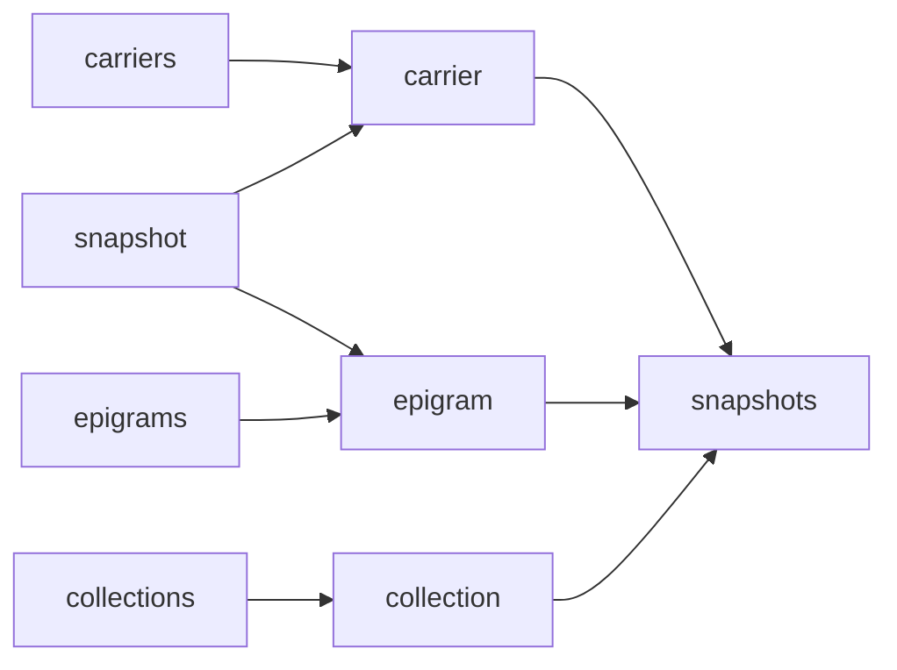

# VEdition Site

This is a conceptual overview of the site plan. It is not a mockup, as this will come at a later stage. This is mainly a representation of the mapping between our backend data and the types of its presentations to end users. For this reason, you must not think visually, but rather **functionally**: we want to show which data can be presented in each page and how this visualization is functionally linked to the others.

This documentation represents these functional aspects with simple and flat lists. Each list represents a "page" as a visualization unit. Inside it, the list contains data features and links.

So, this must not be seen as a site map. It is rather a set of building blocks (higher-order components) which represent the functional foundation of the site logic and pages. For instance, "carriers" just means that this visualization unit is designed to contain data from a list of carriers; and "carrier" means that this visualization unit is designed to contain data from a single carrier. Then, it is easy to imagine a UX where users can browse carriers, and when they click one they navigate to the page with details about the picked carrier. So, this UX will imply the usage of these two units, connecting them in a master-detail relationship.

- _Figure 1: main relationships among units_

## 📦 Backend Entities

- snapshot
  - categories:content
  - categories:support
  - categories:lang
  - comment
  - hands
  - links
  - metadata
  - note
  - references
  - snapshot
  - states
- carrier
  - categories:content
  - categories:support
  - categories:text
  - chronotopes
  - comment
  - links
  - measurements
  - metadata
  - note
  - note:hist??
  - references
  - shelfmark
- epigram
  - comment
  - links
  - metadata
  - note
  - references
- collection
  - categories:seq
  - comment
  - links
  - links:seq
  - metadata
  - note
  - references

## Frontend Components

### 🌐 Carriers

- carriers list
- 🔗 → carrier

### 🌐 Carrier

- carrier metadata
- pages (IIIF?) + snapshots
- 🔗 → snapshot

### 🌐 Snapshots

- snapshots list
- 🔗 → snapshot

### 🌐 Snapshot

- snapshot metadata
- snapshot rendition
- snapshot image (IIIF?)
- 🔗 → epigram
- 🔗 → carrier

### 🌐 Epigrams

- epigrams list
- 🔗 → epigram

### 🌐 Epigram

- epigram metadata
- list of versions linked to snapshots

### 🌐 Collections

- collections list
- 🔗 → collection

### 🌐 Collection

- collection metadata
- 🔗 → snapshots
