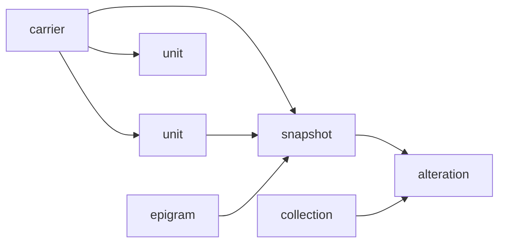

# VEdition Site

## Entities Graph

This is a conceptual overview of the site plan. It is not a mockup, as this will come at a later stage. This is mainly a representation of the mapping between our backend data and the types of its presentations to end users. For this reason, you must not think visually, but rather **functionally**: we want to show which data can be presented in each page and how this visualization is functionally linked to the others, by thinking of "user stories".

This documentation represents these functional aspects with simple and flat lists. Each list item represents a "page" as a visualization unit, and contains data features and links.

So, this must not be seen as a site map. It is rather a set of **building blocks** (higher-order components) which represent the functional foundation of the site logic and pages. For instance, "carriers" just means that this visualization unit is designed to contain data from a list of carriers; and "carrier" means that this visualization unit is designed to contain data from a single carrier. Then, we can think of a UX where users can browse carriers, and when they click one they navigate to the page with details about the picked carrier. So, this UX will imply the usage of these two units, connecting them in a master-detail relationship.

These building blocks thus logically come before the UI design because they dictate what we can do with data, encapsulating logic in various components.

```mermaid
graph LR
    carrier --> snapshot
    carrier --> unit
    carrier --> unit2[unit]
    unit --> snapshot
    snapshot --> alteration
    epigram --> snapshot
    collection --> alteration
```

- _Figure 1: main relationships among units_

Figure 1 represents our entities graph:

- the **snapshot** is our core. It is the abstraction representing a set of alterations of an epigram in a given material support. For instance at sheet 3 of notebook X we have the text of an epigram with annotations defining 3 different alteration stages of that text.
- each snapshot thus defines 1 or more **alterations**. It is the alteration which has text: everything else is an abstraction. While snapshots represent all the steps which end up with a specific alteration stage, we extract only alteration stages as the objects in this graph. The other alterations are just transitional artifacts towards a specific stage, required in the context of the snapshot to show each single operation made by various hands.
- the **carrier** is the material support of our texts (notebook, printed book, sheet, etc.). The carrier can be described in two ways:
  - in a stricter way as a sequence of snapshots.
  - in a more detailed way as a sequence of units, similar to the codicological units of a manuscript. A **unit** is just a part of the carrier (1 or more pages) including a specific content: it might be a snapshot, but also a page with miscellaneous annotations, or a drawing, or even blank. So units are used when we focus on the material description of a carrier; when instead we are interested in which texts are included in it, we just skip this intermediate node to get to snapshots via it.
- the **collection** is an ordered list of alterations, intentionally collected for a specific presentation. It can be material, e.g. a printed book with a selected sequence of texts, or immaterial, like the one inferred from the same hand assigning numbers to some alterations.
- the **epigram** is a pure abstraction, which collects all the snapshots we refer to what we consider variations on the "same" epigram. So formally is similar to a collection, but it is unordered.

## Presentations

Note that the above graph (Figure 1) shows only the _direct_ links among these entities. For instance, a carrier only directly links to units. Then, a unit in turn may link to a snapshot; which in turn always links to 1 or more alterations. So we are free to walk this graph in the direction we prefer, e.g. given a specific alteration we can know the carrier including it.

So, we could e.g. consider multiple views each focused on a specific entity:

- **epigram**: each has a list of alterations with their snapshot, carrier and collections.
- **carrier**: each has a list of units, each with its snapshot in turn having its alterations; or in a more abstract way, a list snapshots, each with its alterations.
- **snapshot**: each has its single carrier and epigram; it can have a dynamic view or a static list of alterations with their collections.
- **collection**: each has a list of alterations with their snapshot, carrier and epigram.
